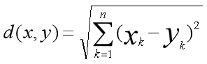

# 卷积神经网络（CNN）

CNN(Convolutional Neural Networks)即卷积神经网络。它是一类深度神经网络模型，最长用于分析视觉图像。它的出现成功的解决了全连接神经网络处理大尺寸图像的三个明显的缺点：

1. 将图像展开为向量丢失空间信息。
2. 因参数过多而导致的效率低下，让训练变得极为空难。
3. 同时大量的参数很快的就导致神经网络过拟合。

卷积神经网络主要由这几类层构成：输入层、卷积层、ReLU层、池化层、和全连接层。通过将这些层有规律的叠加起来，就可以构建一个完整的卷积神经网络。例如著名的LeNet模型。其结构如下图：卷积层—池化层—卷积层—池化层—卷积层—全连接层

 

 

**1.1卷积层**

卷积层是卷积神经网络中最核心的组成部分。它的最终目的是提取图像中的特征信息。卷积的过程如下图2-1所示，通过卷积核在原图上滑动，进行卷积运算，最后得到特征图。其中左侧为输入的原图，中间为卷积核，右侧为特征图。而卷积核的作用是将符合卷积核特征的特征提取出来。例如：如果原图表示的是X，卷积核代表的特征也是X,那么卷积核在原图上卷积运算之后的feature map也是X。同理，若是原图表示的是O，卷积的特征也是O，那么卷积核在原图上进行运算后的feature map 也是O。

 

为了降低模型的计算量同时避免过拟合。在基于“如果一个特征在计算某个空间位置 (x1,y1)(x1,y1) 的时候有用，那么它在计算另一个不同位置 (x2,y2)(x2,y2) 的时候也有用。”的假设下，卷积层通过权值共享和稀疏连接两个方法，让其参数远远小于相同输入输出大小的全连接层。

**1.2池化层**

池化（Pooling）也称之为下采样（subsampling）。在卷积层初步提取原始图片的特征后，通过池化，获取图像最主要的特征。更简单地说：用一个像素代替原特征图上临近的若干个像素。在保留特征图主要特征的同时压缩其图片的大小。

在实际应用中，通常在卷积层之间会周期性的插入池化层。其中“最大池化（Max pooling）”如图2-1。 与“平均池化（mean-pooling）”如图2.2是最为常见的

**平均池化：**

将每个小区域的平均值作为特征放到结果矩阵。

优缺点：能很好的保留背景，但容易使图片变得模糊

 

**最大池化：**

将每个小区域的最大值作为特征放到结果矩阵。

优缺点：能够很好的保留纹理特征。

 

 

 

 

 

研究者们普遍认为：池化技术在计算机视觉当中有三层功效

1. 特征不变形：池化操作使模型更加关注是否存在某些特征而不是特征具体的位置
2. 特征降维：池化操作相当于在空间范围内做了维度约减，从而模型可以抽取更加广范围的特征。同时减小了下一层的输入大小。进而减少计算量和参数个数。
3. 在一定程度上防止过拟合，更方便优化。

 

**1.3全连接层**

全连接层指的是当前层的每一个结点都与上一层的所有结点相连，用来把前面提取到的特征能够全部综合起来。而神经网络的其他层，每个结点只是与前面层的部分结点连接起来，来提取部分的特征。为了获取最后的输出结果，我们就需要将这些输出部分特征的结点全部连接起来，这时就需要用到全连接层。

对于卷积神经网络而言，全连接层在整个卷积神经网络中起到了“分类器”的作用。原始数据在经过卷积层，池化层，激活函数层等操作之后，映射到隐层特征空间。而后全连接层将学到的“分布式特征表示”，把隐层特征空间，映射到样本标记空间。从而获得输出结果。

**1.4ReLU激活函数**

ReLU是一个激活函数，如图2-10。在卷积神经网络中，使用该函数能够去除卷积结果中的负值，正值保持不变。

ReLU激活函数只在输入大于0时才激活一个结点，当输入小于0时，输出为0，当如数大于0时，输出等于输入。ReLU函数如下图所示：

​		

 

**ReLU激活函数的优势：**

1. 在反向传播是，可以避免梯度消失。
2. ReLU会使一部分神经元的输出为0，这样会造成网络的稀疏性，就爱你少了参数的相互依存关系，缓解了过拟合问题的发生。
3. 相对于Sigmoid函数，RelLU激活函数，求导简单，可以有效的减少计算量。

 

在实际应用过程中，通常将卷积层和ReLU统称为卷积层。

 

**1.4损失函数**

损失函数（Loss Function）的值，是神经网络模型的预测值与正式值之间的差值。在模型的训练阶段，每个批次的训练数据送入模型后，通过向前传播获得输出的预测值，然后损失函数计算出预测值和真实值之间的差值。在得到损失值之后，模型通过反向传播去更新各个参数，来降低真实值与预测值之间的损失，让模型生成的预测值逐渐向真实值的方向靠拢，从而达到学习的目的。

常用的损失函数有0-1损失函数，绝对值损失函数，log对数损失函数，平方损失函数等。

在卷积神经网络中，也是利用损失函数来更新卷积神经网络中的每一个参数。

# K领近算法（KNN）

KNN（K Nearest Neighbors）即K领近算法，是一种基本分类和回归方法。通过给定的训练数据集，对新的输入实例，在训练数据集中找到与该实例最接近的K个实例，然后寻找这K个实例中多数属于的类，再把新的输入实例归为这个多数的类别中。换言之就是在新实例的某个范围内，遵照少数服从多数原则，进行类别的划分。原理如下图所示：

 

如果K=3，那么绿色圆点最领近的三个点就是一个蓝色的正方形，与两个红色的三角形。以少数服从多数的原则，该绿色的圆点就划分为红色三角形这一类别中。

如果K=5，那么绿色圆点最领近的5个点就是3个蓝色正方形，与两个红色的三角形，所以该绿色的圆点就划分为蓝色正方形这一类。

由此可以看出KNN算法的结果很大程度取决于K的选择。

在KNN中，通过计算对象间的距离来作为各个对象之间的非相似性指标，即最临近的指标。这避免了对象之间的匹配问题，在这里距离一般使用欧式距离或者曼哈顿距离

**欧氏距离**

**曼哈顿距离**

KNN算法是一种有监督学习，是机器学习中一个经典的算法，比较简单容易理解。从1968年被Cover和Hart提出至今，其内容理论也有了许多的发展和优化。直到今天，该算法在机器学习分类算法中占有相当大的地位。

 

# 支持向量机（SVM）

参考文章视频

[【五分钟机器学习】向量支持机SVM: 学霸中的战斗机](https://www.bilibili.com/video/BV1N54y1q7bQ?share_source=copy_web)

[猫都能看懂的SVM【从概念理解、优化方法到代码实现】](https://www.bilibili.com/video/BV1oJ411U7Y8?share_source=copy_web)

------

支持向量机（support vector machines ,SVM）是一种二分类模型，它的基本模型是定义在特征空间上的间隔最大的线性分类器。

**核心思想**

1. 尽可能保证分类的正确性
2. 尽可能加大两个类别间的距离，是他们更容易区分

**数学原理**

监督学习，线性分类器，找到合适的β来描述决策分界面和边界分界面（也叫超平面）

**优点：**

强分类器，能保证最大化区分两个类别，所以模型的性能优异。

**缺点：**

1. Hard-margin SVM是线性分类器，不能处理不同类别相互交融的情况（加入容错率缓解—>Soft-margin SVM（软间隔SVM））
2. 线性分类器，不可用于求解线性完全不可分的情况（引入Kernel—>Kernel SVM求解线性不可分）

## Hard-margin SVM

**Support Vector Machines**

**Quantifying the Margin**

这是硬间隔向量机Hard-margin SVM

1. 带标签的样本集（$x_i$来自实数向量域，长度为d的实数向量）（-1，+1）表示2分类，-1反例，+1正例
2. $y_i$乘以权重向量乘以样本特征加上一个b，必须大于等于1。等于0表示落在决策线上）,该条件对所有样本都满足（强制决策边界和数据点之间必须存在一定隔空间）（不管权重w多大，他们始终有间隔，不管间隔多小）
3. 

$$
D={\{(x_1,y_1),...,(x_n,y_n)}\} \qquad x_i\in\mathbb{R}^b \qquad y_i\in\{-1,+1\}
\\ y_i(w^Tx_i+b)\geqslant1 \qquad \forall i \in\{1,...,n\}
$$

间隔是什么：

两个正反例之间的距离，理论上这两个点应该取得是位于两侧距离最近的点,不失一般性的，这意味我们在两个间隔边界上选了两个点，所以$x_-$的score等于-1（该反例正好落在边界上），同理正例

x+与x-的连线与决策边界垂直

为了使得x+和x-连线垂直与决策线，x-x+连线应该要与w有着同样方向的W。是w乘上一个缩放因子$\gamma$（初中向量）（**w是超平面法向量**）
$$
margin = \sqrt{(x_+-x_-)^T(x_+-x_-)}
\\w^Tx_- +b = -1
\\w^Tx_+ +b = 1
\\x_+ = x_- +\gamma w
\\x_+-x_- = \gamma w
\\\\
\\w^T(x_-+\gamma w)+b = 1
\\\Longrightarrow w^Tx_-+b+\gamma w^Tw=1
\\\Longrightarrow -1+\gamma w^Tw=1
\\\gamma = \frac{2}{w^Tw}
\\x_=-x_- = \frac{2w}{w^Tw}
\\margin = \sqrt{\frac{4w^Tw}{w^Tw\times w^Tw}}=\frac{2}{\sqrt{w^Tw}}
$$

由上式推导，我们就有了求最大间隔的公式，我们就可以写下这个目标函数的表达式，来求解w，使之得到最大间隔

"s.t.“是约束的意思

要最大化这个间隔，同时还要约束这个最大化问题，以便它能约束w使得所有的点都被正确分类，（根据这个w的约束）

（为了方便求导，最小问题的式子除以一个2，不会有任何影响）

由此得到了一个SVM线性最大化间隔的标准形式
$$
max \qquad \frac{2}{\sqrt{w^Tw}}\qquad w\in \mathbb{R}^b
\\s.t. \qquad y_i(w^Tx_i+b)\geqslant1 \qquad \forall i \in\{1,...,n\}
\\最大化问题转化为最小化问题（取倒数）
\\min \qquad \frac{w^Tw}{2} \qquad w\in \mathbb{R}^b
\\s.t. \qquad y_i(w^Tx_i+b)\geqslant1 \qquad \forall i \in\{1,...,n\}
$$
至于为什么会把它转化成最小化问题，是因为这种形式很符合一类已经很成熟的优化问题

这类问题叫做**二次规划**

1. 在二次规划问题里，是在寻找一个x，使得一个二次目标函数最小化,下图就是二次目标函数的形式（矩阵H和f决定了二次曲面的形状
2. 同时需要满足线性的约束条件（写成一个线性稀疏乘以x，小于等于一个常数）（可能有多个线性约束条件，所以A是多个线性系数组成的矩阵）
3. 同时还可能存在线性等式约束

所以二次规划问题中有二次目标函数、不等式约束以及等式约束，但在大多数问题中，人们只讨论那些只有等式约束或只有不等式约束的二次规划问题。

同时
$$
min\rightarrow x \qquad \frac{1}{2}x^THx+f^Tx
\\s.t.\qquad A_{ineq}x\leqslant b_{ineq}
\\\qquad\qquad A_{eq}x= b_{eq}
$$
所以最大间隔分类器就是去拟合这个用H和F表达的式子 在这个问题中，f为0，同时还有一个非常简洁明了的线性不等式约束矩阵和一个常量向量。所以这就是可分的SVM，或叫做支持向量机或最大间隔分类器。
$$
\\min \qquad \frac{w^Tw}{2} \qquad w\in \mathbb{R}^b
\\s.t. \qquad y_i(w^Tx_i+b)\geqslant1 \qquad \forall i \in\{1,...,n\}
$$
## Soft-margin SVM

观察上面约束条件，我们可以发现，所有的样本都被要求分类正确，但这可能是不行的，假设有一个数据集要么因为收集数据时产生的噪声，要么应为我们的度量方式丢失了一些能够有助于将样本互相区分开的特征。或者其他原因，产生一些我们人眼可见处于错误位置的点。 如下图：

我们能做的就是调整目标函数使得目标函数仍然致力于尽可能地把不同类别的点分开，去惩罚分类错误的点，而不是导致无法得到有效解。

所以重新考虑上式：如果给一个无法区分开的样本就会给优化带来问题，任何数学算法都无法给出答案。这将会无解，找不到满足条件的w。所我们将进行“slackning”（松弛），引入一个向量$\xi_i$（这是一个松弛变量），向量中的每个元素对应一个样本。
$$
\\min \qquad \frac{w^Tw}{2} \qquad w\in \mathbb{R}^b \qquad \xi\geqslant 0
\\s.t. \qquad y_i(w^Tx_i+b)\geqslant 1-\xi_i \qquad \forall i \in\{1,...,n\}
$$
这个$\xi$变量能够允许分类器放点水，分类器的目标是要得到正确的符号，使得分类间隔为1，但如果达不到这个目标，可以通过加上一个松弛变量使问题变得更简单。如果你确定正确的优化方向，$\xi$可以是从0到无穷的任何值。如果$\xi_i$等于0，那么这个约束就和原始形式一样，要求每个样本都以最小为1的分类间隔被正确分类。如果$\xi$变得非常大甚至接近无穷大，那么任意样本都能满足这个条件。

显然我们不想要它的优化结果变得任意大，所以我们加上一个**惩罚**。如下式：
$$
\\min \qquad \frac{w^Tw}{2}+C\sum^n_{i=0}\xi_i \qquad w\in \mathbb{R}^b \qquad \xi\geqslant 0
\\s.t. \qquad y_i(w^Tx_i+b)\geqslant 1-\xi_i \qquad \forall i \in\{1,...,n\}
$$
其中C值起到了平衡的作用，平衡当松弛变量增大时，优化应该倾向于哪边。

1. 如果C等于无穷大，任一大于0的$\xi$值都会使得目标函数变得无穷大，所以这就约等于原始的目标函数形式。
2. 如果C小于无穷大，是一个有限的值，你可以把这个目标函数看成是在做某种决策。是让减小w的模长来增大分类间隔，还是想让样本被分类的更好。

这是SVM最著名的形式：Soft-margin SVM

 这里需要理解：

1. 把label的符号乘以决策函数为什么能约束样本正确分类（上式的学法无须把正样本约束和负样本约束分开来写）
2. 理解正则项w的转置乘以w与间隔大小有关，我们的目标是最大化间隔，与此同时尽可能少分错或少产生严重的分类错误。

**Optimization**

介绍当我们有了二次规划的形式之后该做什么？

1. 我们能做的其中一件事就是“Off-the-shelf”二次规划求解器。
2. 另一种常用的方法是梯度下降法，它用hinge-less来代替约束，当分类错误就会产生惩罚，分类正确惩罚就是0。
3. 还有一种是用对偶的形式来优化，把约束从目标函数中拿出，把约束替换成一个惩罚项来产生优化中的鞍点。就比如拉格朗日方法。

在进行一些转化和操作之后，会得到一个看起来不一样的优化方程，这个新优化方程能得到与原方程等价的解，却又不同的特性。

进一步，这个优化问题会引出这个方法的历史上非常重要的一个发现：它能够使得我们之前所推导的线性分类器，优雅地扩展应用到非线性分类问题上。

**Dual SVM and Kernels**

从对偶问题和技巧的角度来看待SVM

**Duality**

对偶性在优化里面指的是大多数优化问题都可以从两个角度来看，一个是原问题（primal problem），一个是对偶问题。一个原问题可能有很多种对偶问题，这里只考虑一种类型的对偶关系。只要解出了对偶问题，就得到了原问题的解。这种情况下就叫强对偶。原问题的解等价于对偶问题的解。

**Lagrangian(KKT)Dual for SVM**

为SVM推导拉格朗日或叫KKT对偶

先附上公式
$$
Primal \quad SVM
\\min \qquad \frac{w^Tw}{2}+C\sum^n_{i=0}\xi_i \qquad w\in \mathbb{R}^b \qquad \xi \in[0,\infty]^n
\\s.t. \qquad y_i(w^Tx_i+b) -1+\xi_i \geqslant 0 \qquad \forall i \in\{1,...,n\}
$$

$$
Dual \quad SVM
\\ min \quad\quad \frac{1}{2}\sum_i\sum_j \alpha_i \alpha_j y_iy_jx_i^Tx_j- \sum_i\alpha_i
\\s.t.\sum_i \alpha_iy_i=0,\qquad \alpha_i \in [0,C]
\\w = \sum_i \alpha_iy_jx_i \qquad b=y_i-\sum_j \alpha_jy_jx_j^Tx_i
\\0<\alpha_i<C
$$

对偶问题的优化变量变成了一个新的变量$\alpha$，由于这里的$\alpha$是用来施加不等式约束的，严格来说它不是拉格朗日乘子，它是KKT乘子。只是细节上略有不同。大家仍把它叫做拉格朗日乘子，我在此也这么叫。

 从原问题到对偶问题的第一步，先来看看原问题的约束，我们要做的是试着去移除这个约束，我们将用对抗的思想来取代这个约束，即在一个最小化函数内部进行最大化。它看起来如下式所示：
$$
\\min \qquad \frac{w^Tw}{2}+C\sum^n_{i=0}\xi_i
\qquad \textcolor{red}{s.t. \quad y_i(w^Tx_i+b) -1+\xi_i \geqslant 0} \qquad \forall i \in\{1,...,n\}\quad w\in \mathbb{R}^b
\quad \textcolor{green}{\xi \in[0,\infty]^n}
\\
上面是老式子，下面是新式子
\\
\\min \qquad \qquad max \qquad L(w,b,\xi,\alpha,\beta)
\\\textcolor{purple}{w\in\mathbb{R}^d} \qquad\quad \alpha\in[0,\infty]^n\qquad\qquad
\\\textcolor{purple}{xi\in\mathbb{R}^n}\qquad\quad \beta\in[0,\infty]^n\qquad\qquad
\\L(w,b,\xi,\alpha,\beta)=\frac{w^Tw}{2}+C\sum^n_{i}\xi_i
\\-\sum_i\textcolor{red}{\alpha_i(y_i(w^Tx_i+b)-1+\xi_i)}-\sum\textcolor{green}{\beta_i\xi_i}
$$
建立一个新方程，不仅包含W,b,$\xi$，还包含$\alpha,\beta$，$\alpha,\beta$是用来控制两个约束的，第一个约束可以看做是这个优化问题里的主要约束，它用来约束算法正确分类的（第一行标红）。它意味着数据以一定间隔被分类，并且被加以一定的松弛。我们通过把这项约束添加到低下的这个拉格朗日函数里（最后一行标红） 。

关于这一项的对抗思想就体现在，如果破坏了这项约束，$\alpha$可以设为使得内部最大函数无限大的一个值,但却给最小化函数带来了代价。（两个式子相互制约）

另一项约束为绿色标出来的，它要求$\xi$是大于等于0的非负数。

一旦我们建立了这个包含惩罚项的拉格朗日函数，它包含了KKT乘子，也叫拉格朗日乘子，就可以移除原函数中W和$\xi$的约束，在新函数里，w,$\xi$是完全没有约束的（紫色高亮）。只有内部最大化max函数需要满足约束。如果对抗过程中发现括号里的约束被破坏了（最后一行红色标注），通过改变$\alpha$乘子的值，函数值会变得非常大，使得最小化过程失败。

**我们来假设一下**

如果约束被破坏，也就是$y_i(w^Tx_i+b)-1+\xi_i$的值是负的，也就是在约束松弛的范围内，没能将数据正确分类，为了简便，假设它等于-1，所以这一项就相当于$-\alpha*(-1)$。$\alpha$在原问题里是个非负数，所以对抗过程中会使得$\alpha$变成一个非常大的值，从而目标函数变得非常大，所以在最小化博弈中就失败了。

反过来，如果将数据正确分类了，那么上述项就是一个正值，无论对抗过程中$\alpha$被优化成什么值，除非$\alpha$能取小于0的值（实际上只能取非负值），否则都无法比令$\alpha=0$时的函数值更大。$\beta$这个拉格朗日乘子也可以用同样的过程来解释，$\beta$是用来施加$\xi\geqslant 0$这个约束的，如果$\xi$小于0，就会使得最小化失败。

**概括一下：**我们目前所做的，就是把带约束的目标函数冲写成一个min-max问题，其中建立了一个对抗过程，如果约束被破坏，就会产生惩罚。这仍属于原问题范畴。

为了把原问题转化为对偶问题，需要进行一些简单地变换，就是把min-max问题转化成max-min问题

还未写完。。。。。。。。。。。。。。

# SIFT（尺度不变特征转换）

**参考文章视频**

http://t.csdn.cn/FlQU2

------

**1.综述**

**SIFT（尺度不变特征转换）**是一种电脑视觉的算法用来侦测与描述影像中的局部性特征，它在空间尺度中寻找极值点，并提取出其位置、尺度、旋转不变量。

该算法由David Lowe 在1999年所发表，2004年完善总结。

**SIFT算法特点：**

1. SIFT特征是图像的局部特征，其对旋转、尺度缩放、亮度变化保持不变性，对视角变化、仿射变换、噪声也保持一定程度的稳定性
2. 独特性（Distinctiveness）好，信息量丰富，适用于在海量特征数据库中进行快速，准确的匹配。
3. 多量性，即使少数的几个物体也可以产生大量的SIFT特征向量。
4. 高速性，经优化的SIFT匹配算法甚至可以达到实时的要求。
5. 可扩展性：可以很方便的与其他形式的特征向量进行联合。

**SIFT算法可以解决的问题：**

1. 目标的旋转、缩放、平移（RST）
2. 图像仿射/投影变换（视点viewpoint）
3. 光照影响（illumination）
4. 目标遮挡（occlusion）
5. 杂物场景（clutter）
6. 噪声

SIFT算法的实质就是在不同的尺度空间上找关键点（特征点），并计算出关键点的方向。SIFT所查找到的关键点是一些十分突出，不会因光照，仿射变换和噪音等因素而变化的点，如角点、边缘点、暗区的亮点与亮区的暗点等。

**Lowe将SIFT算法分解为如下4步：**

1. 尺度空间极致检测：搜索所有尺度上的图像位置。通过高斯微分函数来识别潜在的对于尺度和旋转不变的兴趣点。
2. 关键点定位：在每个候选的位置上，通过一个拟合精细的模型来确定位置和尺度。关键点的选择依据它们的稳定程度。
3. 方向确定：基于图像局部的梯度方向，分配给每个关键点位置一个或多个方向。所有后面的对图像数据的操作都相对于关键点的方向、尺度和位置进行变换，从而提供对于这些变化的不变性。
4. 关键点描述：在每个关键点周围的邻域内，在选定的尺度上测量图像局部的梯度。这些梯度被变换成一种表示，这种表示允许比较大的局部形状的变形和光照变换。

**2.高斯模糊**

SIFT算法是在不同尺度空间上查找关键点，而尺度空间的获取需要使用搞死模糊来实现，Lindeberg等人已证明高斯卷积核是实现尺度变换的唯一变换核，并且是唯一的线性核。

**2.1 二维高斯函数**

高斯模糊是一种图像滤波器，它使用正态分布（高斯函数）计算模糊模板，并使用该模板与原图像做卷积运算，达到模糊图像的目的。

N维空间正态分布方程为：
$$
G(r)=\frac{1}{\sqrt{2\pi\sigma^2}^N}e^{-r^2/(2\sigma^2)}
$$
其中$\sigma$是正太分布的标准差，$\sigma$值越大，图像越模糊（平滑）。r为模糊半径，模糊半径是指模板元素到模板中心的距离。

如：二维模板大小为m*n，则模板上的元素（x,y）对应的高斯计算公式为：
$$
G(x,y)=\frac{1}{2\pi\sigma^2}e^{-{\frac{(x-m/2)^2+(y-n/2)^2}{2\sigma^2}}}
$$
在二维空间中，这个公式生成的曲面的等高线是从中心开始呈正态分布的同心圆。如下图所示。分布不为0的像素组成的卷积矩阵与原始图像做变换。每像素的值都是周围相邻像素值的加权平均。原始像素的值有最大的高斯分布值，所以有最大的权重，相邻像素随着距离原始像素越来越远，其权重也越来越小。这样进行模糊处理比其他的均衡模糊滤波器更高地保留边缘效果。

理论上来讲，图像中每点的分布都不为0，这也就是说每个像素的计算都需要包含整幅图像。在实际应用中，在计算高斯函数的离散近似时，大概在3$\sigma$距离之外的像素都可以看作不起作用，这些像素的计算也就可以忽略，通常，图像处理程序只需要计算(6$\sigma$+1)x(6$\sigma$+1)的矩阵就可以保证相关像素影响。

**2.2 图像的二维高斯模糊**

根据$\sigma$的值，计算出高斯模板矩阵的大小(6$\sigma$+1)x(6$\sigma$+1)，使用上面的公式计算高斯模板矩阵的值，与原图像做卷积，即可获得原图像的平滑（高斯模糊）图像。为了确保模板矩阵中的元素在[0,1]之间，需将模板矩阵归一化。5*5的高斯模板如下图所示

下图是5*5高斯模板卷积计算示意图，高斯模板是中心对称的。

**2.3 分离高斯模糊**

如上图所示，使用二维的高斯模板达到了模糊图像的目的，但是会因模板矩阵的关系而造成边缘图像缺失（2.3b,d），$\sigma$越大，缺失像素越多，丢弃模板会造成黑边（2.3d）。更重要的是当变大时，高斯模板（高斯核）的卷积运算量将大幅度提升。根据高斯函数的可分离性，对二维高斯模糊函数进行改进。

高斯函数的可分离性是指用二维矩阵变换得到的效果也可以通过在水平方向进行以为高斯矩阵变换加上竖直方向的一维高斯矩阵变换得到。从计算的角度来看，这是一项有用的特性，因为这样只需要$O(n\times M\times N)+O(n\times M\times N)$次计算，而二维不可分的矩阵则需要$O(m\times n\times M\times N)$次计算，其中，m，b为高斯矩阵的维数，M,N为二维图像的维数。

另外，两次一维的高斯卷积将消除二维高斯矩阵所产生的边缘。（关于消除边缘的论述如下图2.4所示，对用模板矩阵超出边界的部分——虚线框，将不做卷积计算。如图2.4中x方向的第一个模板1 *5，将退化成1 *3模板，只在图像之内的部分做卷积）

附录1是使用opencv2.2实现的二维高斯模糊和分离高斯模糊。表2.2位上述两种方法和opencv2.3开源库实现的高斯模糊程序的比较。（看不懂里面的数值代表什么）

**3.尺度空间极值检测**

尺度空间使用高斯金字塔表示。Tony Lindeberg指出尺度规范化的LoG（Laplacion of Gaussian）算子据欧真正的尺度不变性，Lowe使用高斯差分金字塔近似LoG算子，在尺度空间检测稳定的关键点。

**3.1 尺度空间理论**

尺度空间（scale space）思想最早是由Iijima于2962年提出，后经witkin和Koenderink等人的推广逐渐得到关注，在计算机视觉领域使用广泛。

**尺度空间理论的基本思想**是：在图像信息处理模型中引入一个被视为尺度的参数，通过连续变化尺度参数获得多尺度下的尺度空间表示序列

​	

先暂时写到这里，后面的理解起来有点困难了
