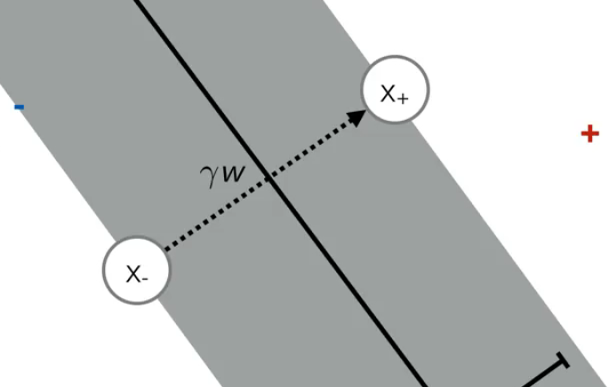

# 卷积神经网络（CNN）

CNN(Convolutional Neural Networks)即卷积神经网络。它是一类深度神经网络模型，最长用于分析视觉图像。它的出现成功的解决了全连接神经网络处理大尺寸图像的三个明显的缺点：

1. 将图像展开为向量丢失空间信息。
2. 因参数过多而导致的效率低下，让训练变得极为空难。
3. 同时大量的参数很快的就导致神经网络过拟合。

卷积神经网络主要由这几类层构成：输入层、卷积层、ReLU层、池化层、和全连接层。通过将这些层有规律的叠加起来，就可以构建一个完整的卷积神经网络。例如著名的LeNet模型。其结构如下图：卷积层—池化层—卷积层—池化层—卷积层—全连接层

 

 

**1.1卷积层**

卷积层是卷积神经网络中最核心的组成部分。它的最终目的是提取图像中的特征信息。卷积的过程如下图2-1所示，通过卷积核在原图上滑动，进行卷积运算，最后得到特征图。其中左侧为输入的原图，中间为卷积核，右侧为特征图。而卷积核的作用是将符合卷积核特征的特征提取出来。例如：如果原图表示的是X，卷积核代表的特征也是X,那么卷积核在原图上卷积运算之后的feature map也是X。同理，若是原图表示的是O，卷积的特征也是O，那么卷积核在原图上进行运算后的feature map 也是O。

 

为了降低模型的计算量同时避免过拟合。在基于“如果一个特征在计算某个空间位置 (x1,y1)(x1,y1) 的时候有用，那么它在计算另一个不同位置 (x2,y2)(x2,y2) 的时候也有用。”的假设下，卷积层通过权值共享和稀疏连接两个方法，让其参数远远小于相同输入输出大小的全连接层。

**1.2池化层**

池化（Pooling）也称之为下采样（subsampling）。在卷积层初步提取原始图片的特征后，通过池化，获取图像最主要的特征。更简单地说：用一个像素代替原特征图上临近的若干个像素。在保留特征图主要特征的同时压缩其图片的大小。

在实际应用中，通常在卷积层之间会周期性的插入池化层。其中“最大池化（Max pooling）”如图2-1。 与“平均池化（mean-pooling）”如图2.2是最为常见的

**平均池化：**

将每个小区域的平均值作为特征放到结果矩阵。

优缺点：能很好的保留背景，但容易使图片变得模糊

 

**最大池化：**

将每个小区域的最大值作为特征放到结果矩阵。

优缺点：能够很好的保留纹理特征。

 

 

 

 

 

研究者们普遍认为：池化技术在计算机视觉当中有三层功效

1. 特征不变形：池化操作使模型更加关注是否存在某些特征而不是特征具体的位置
2. 特征降维：池化操作相当于在空间范围内做了维度约减，从而模型可以抽取更加广范围的特征。同时减小了下一层的输入大小。进而减少计算量和参数个数。
3. 在一定程度上防止过拟合，更方便优化。

 

**1.3全连接层**

全连接层指的是当前层的每一个结点都与上一层的所有结点相连，用来把前面提取到的特征能够全部综合起来。而神经网络的其他层，每个结点只是与前面层的部分结点连接起来，来提取部分的特征。为了获取最后的输出结果，我们就需要将这些输出部分特征的结点全部连接起来，这时就需要用到全连接层。

对于卷积神经网络而言，全连接层在整个卷积神经网络中起到了“分类器”的作用。原始数据在经过卷积层，池化层，激活函数层等操作之后，映射到隐层特征空间。而后全连接层将学到的“分布式特征表示”，把隐层特征空间，映射到样本标记空间。从而获得输出结果。

**1.4ReLU激活函数**

ReLU是一个激活函数，如图2-10。在卷积神经网络中，使用该函数能够去除卷积结果中的负值，正值保持不变。

ReLU激活函数只在输入大于0时才激活一个结点，当输入小于0时，输出为0，当如数大于0时，输出等于输入。ReLU函数如下图所示：

​		

 

**ReLU激活函数的优势：**

1. 在反向传播是，可以避免梯度消失。
2. ReLU会使一部分神经元的输出为0，这样会造成网络的稀疏性，就爱你少了参数的相互依存关系，缓解了过拟合问题的发生。
3. 相对于Sigmoid函数，RelLU激活函数，求导简单，可以有效的减少计算量。

 

在实际应用过程中，通常将卷积层和ReLU统称为卷积层。

 

**1.4损失函数**

损失函数（Loss Function）的值，是神经网络模型的预测值与正式值之间的差值。在模型的训练阶段，每个批次的训练数据送入模型后，通过向前传播获得输出的预测值，然后损失函数计算出预测值和真实值之间的差值。在得到损失值之后，模型通过反向传播去更新各个参数，来降低真实值与预测值之间的损失，让模型生成的预测值逐渐向真实值的方向靠拢，从而达到学习的目的。

常用的损失函数有0-1损失函数，绝对值损失函数，log对数损失函数，平方损失函数等。

在卷积神经网络中，也是利用损失函数来更新卷积神经网络中的每一个参数。

# K领近算法（KNN）

KNN（K Nearest Neighbors）即K领近算法，是一种基本分类和回归方法。通过给定的训练数据集，对新的输入实例，在训练数据集中找到与该实例最接近的K个实例，然后寻找这K个实例中多数属于的类，再把新的输入实例归为这个多数的类别中。换言之就是在新实例的某个范围内，遵照少数服从多数原则，进行类别的划分。原理如下图所示：

 

如果K=3，那么绿色圆点最领近的三个点就是一个蓝色的正方形，与两个红色的三角形。以少数服从多数的原则，该绿色的圆点就划分为红色三角形这一类别中。

如果K=5，那么绿色圆点最领近的5个点就是3个蓝色正方形，与两个红色的三角形，所以该绿色的圆点就划分为蓝色正方形这一类。

由此可以看出KNN算法的结果很大程度取决于K的选择。

在KNN中，通过计算对象间的距离来作为各个对象之间的非相似性指标，即最临近的指标。这避免了对象之间的匹配问题，在这里距离一般使用欧式距离或者曼哈顿距离

**欧氏距离**

**曼哈顿距离**

KNN算法是一种有监督学习，是机器学习中一个经典的算法，比较简单容易理解。从1968年被Cover和Hart提出至今，其内容理论也有了许多的发展和优化。直到今天，该算法在机器学习分类算法中占有相当大的地位。

 

# 支持向量机（SVM）

参考文章视频

[【五分钟机器学习】向量支持机SVM: 学霸中的战斗机](https://www.bilibili.com/video/BV1N54y1q7bQ?share_source=copy_web)

[猫都能看懂的SVM【从概念理解、优化方法到代码实现】](https://www.bilibili.com/video/BV1oJ411U7Y8?share_source=copy_web)

------

支持向量机（support vector machines ,SVM）是一种二分类模型，它的基本模型是定义在特征空间上的间隔最大的线性分类器。

**核心思想**

1. 尽可能保证分类的正确性
2. 尽可能加大两个类别间的距离，是他们更容易区分

**数学原理**

监督学习，线性分类器，找到合适的β来描述决策分界面和边界分界面（也叫超平面）

**优点：**

强分类器，能保证最大化区分两个类别，所以模型的性能优异。

**缺点：**

1. Hard-margin SVM是线性分类器，不能处理不同类别相互交融的情况（加入容错率缓解—>Soft-margin SVM）
2. 线性分类器，不可用于求解线性完全不可分的情况（引入Kernel—>Kernel SVM求解线性不可分）

**Support Vector Machines**

**Quantifying the Margin**

这是硬间隔向量机Hard-margin SVM

1. 带标签的样本集（$x_i$来自实数向量域，长度为d的实数向量）（-1，+1）表示2分类，-1反例，+1正例
2. $y_i$乘以权重向量乘以样本特征加上一个b，必须大于等于1。等于0表示落在决策线上）,该条件对所有样本都满足（强制决策边界和数据点之间必须存在一定隔空间）（不管权重w多大，他们始终有间隔，不管间隔多小）
3. 

$$
D={\{(x_1,y_1),...,(x_n,y_n)}\} \qquad x_i\in\mathbb{R}^b \qquad y_i\in\{-1,+1\}
\\ y_i(w^Tx_i+b)\geqslant1 \qquad \forall i \in\{1,...,n\}
$$

间隔是什么：

两个正反例之间的距离，理论上这两个点应该取得是位于两侧距离最近的点,不失一般性的，这意味我们在两个间隔边界上选了两个点，所以$x_-$的score等于-1（该反例正好落在边界上），同理正例

x+与x-的连线与决策边界垂直

为了使得x+和x-连线垂直与决策线，x-x+连线应该要与w有着同样方向的W。是w乘上一个缩放因子$\gamma$（初中向量）（**w是超平面法向量**）
$$
margin = \sqrt{(x_+-x_-)^T(x_+-x_-)}
\\w^Tx_- +b = -1
\\w^Tx_+ +b = 1
\\x_+ = x_- +\gamma w
\\x_+-x_- = \gamma w
\\\\
\\w^T(x_-+\gamma w)+b = 1
\\\Longrightarrow w^Tx_-+b+\gamma w^Tw=1
\\\Longrightarrow -1+\gamma w^Tw=1
\\\gamma = \frac{2}{w^Tw}
\\x_=-x_- = \frac{2w}{w^Tw}
\\margin = \sqrt{\frac{4w^Tw}{w^Tw\times w^Tw}}=\frac{2}{\sqrt{w^Tw}}
$$

由上式推导，我们就有了求最大间隔的公式，我们就可以写下这个目标函数的表达式，来求解w，使之得到最大间隔

"s.t.“是约束的意思

要最大化这个间隔，同时还要约束这个最大化问题，以便它能约束w使得所有的点都被正确分类，（根据这个w的约束）

（为了方便求导，最小问题的式子除以一个2，不会有任何影响）

由此得到了一个SVM线性最大化间隔的标准形式
$$
max \qquad \frac{2}{\sqrt{w^Tw}}\qquad w\in \mathbb{R}^b
\\s.t. \qquad y_i(w^Tx_i+b)\geqslant1 \qquad \forall i \in\{1,...,n\}
\\最大化问题转化为最小化问题（取倒数）
\\min \qquad \frac{w^Tw}{2} \qquad w\in \mathbb{R}^b
\\s.t. \qquad y_i(w^Tx_i+b)\geqslant1 \qquad \forall i \in\{1,...,n\}
$$
至于为什么会把它转化成最小化问题，是因为这种形式很符合一类已经很成熟的优化问题

这类问题叫做**二次规划**

1. 在二次规划问题里，是在寻找一个x，使得一个二次目标函数最小化,下图就是二次目标函数的形式（矩阵H和f决定了二次曲面的形状
2. 同时需要满足线性的约束条件（写成一个线性稀疏乘以x，小于等于一个常数）（可能有多个线性约束条件，所以A是多个线性系数组成的矩阵）
3. 同时还可能存在线性等式约束

所以二次规划问题中有二次目标函数、不等式约束以及等式约束，但在大多数问题中，人们只讨论那些只有等式约束或只有不等式约束的二次规划问题。

同时
$$
min\rightarrow x \qquad \frac{1}{2}x^THx+f^Tx
\\s.t.\qquad A_{ineq}x\leqslant b_{ineq}
\\\qquad\qquad A_{eq}x= b_{eq}
$$
所以最大间隔分类器就是去拟合这个用H和F表达的式子 在这个问题中，f为0，同时还有一个非常简洁明了的线性不等式约束矩阵和一个常量向量。所以这就是可分的SVM，或叫做支持向量机或最大间隔分类器。
$$
\\min \qquad \frac{w^Tw}{2} \qquad w\in \mathbb{R}^b
\\s.t. \qquad y_i(w^Tx_i+b)\geqslant1 \qquad \forall i \in\{1,...,n\}
$$
观察这个约束条件，我们可以发现，所有的样本都被要求分类正确，但这可能是不行的，假设有一个数据集要么因为收集数据时产生的噪声，要么应为我们的度量方式丢失了一些能够有助于将样本互相区分开的特征。或者其他原因，产生一些我们人眼可见处于错误位置的点。 如下图：

我们能做的就是调整目标函数使得目标函数仍然致力于尽可能地把不同类别的点分开，去惩罚分类错误的点，而不是导致无法得到有效解。

所以重新考虑上式：如果给一个无法区分开的样本就会给优化带来问题，任何数学算法都无法给出答案。这将会无解，找不到满足条件的w。所我们将进行“slackning”（松弛），引入一个向量$\xi_i$（这是一个松弛变量），向量中的每个元素对应一个样本。
$$
\\min \qquad \frac{w^Tw}{2} \qquad w\in \mathbb{R}^b \qquad \xi\geqslant 0
\\s.t. \qquad y_i(w^Tx_i+b)\geqslant 1-\xi_i \qquad \forall i \in\{1,...,n\}
$$
这个$\xi$变量能够允许分类器放点水，分类器的目标是要得到正确的符号，使得分类间隔为1，但如果达不到这个目标，可以通过加上一个松弛变量使问题变得更简单。如果你确定正确的优化方向，$\xi$可以是从0到无穷的任何值。如果$\xi_i$等于0，那么这个约束就和原始形式一样，要求每个样本都以最小为1的分类间隔被正确分类。如果$\xi$变得非常大甚至接近无穷大，那么任意样本都能满足这个条件。

显然我们不想要它的优化结果变得任意大，所以我们加上一个**惩罚**。如下式：
$$
\\min \qquad \frac{w^Tw}{2}+C\sum^n_{i=0}\xi_i \qquad w\in \mathbb{R}^b \qquad \xi\geqslant 0
\\s.t. \qquad y_i(w^Tx_i+b)\geqslant 1-\xi_i \qquad \forall i \in\{1,...,n\}
$$
其中C值起到了平衡的作用，平衡当松弛变量增大时，优化应该倾向于哪边。

1. 如果C等于无穷大，任一大于0的$\xi$值都会使得目标函数变得无穷大，所以这就约等于原始的目标函数形式。
2. 如果C小于无穷大，是一个有限的值，你可以把这个目标函数看成是在做某种决策。是让减小w的模长来增大分类间隔，还是想让样本被分类的更好。

这是SVM最著名的形式：Soft-margin SVM

 这里需要理解：

1. 把label的符号乘以决策函数为什么能约束样本正确分类（上式的学法无须把正样本约束和负样本约束分开来写）
2. 理解正则项w的转置乘以w与间隔大小有关，我们的目标是最大化间隔，与此同时尽可能少分错或少产生严重的分类错误。

**Optimization**

介绍当我们有了二次规划的形式之后该做什么？

1. 我们能做的其中一件事就是“Off-the-shelf”二次规划求解器。
2. 另一种常用的方法是梯度下降法，它用hinge-less来代替约束，当分类错误就会产生惩罚，分类正确惩罚就是0。
3. 还有一种是用对偶的形式来优化，把约束从目标函数中拿出，把约束替换成一个惩罚项来产生优化中的鞍点。就比如拉格朗日方法。

在进行一些转化和操作之后，会得到一个看起来不一样的优化方程，这个新优化方程能得到与原方程等价的解，却又不同的特性。

进一步，这个优化问题会引出这个方法的历史上非常重要的一个发现：它能够使得我们之前所推导的线性分类器，优雅地扩展应用到非线性分类问题上。

**Dual SVM and Kernels**

从对偶问题和技巧的角度来看待SVM

