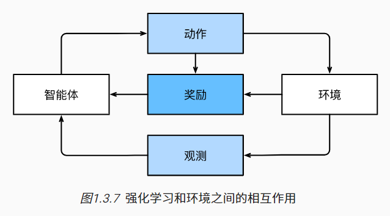

# 1 前言

## 1.1 日常生活中的机器学习

## 1.2 关键组件

### 1.2.1 数据

### 1.2.2 模型

### 1.2.3 目标函数

目标函数：定义模型优劣程度的度量。

当任务在试图**预测数值**时，最常见的损失函数是**平方误差**（squared error）

解决**分类问题**时，最常见的目标函数是**最小化错误率**。


### 1.2.4 优化算法

基本方法：梯度下降（gradient descent）


## 1.3 各种机器学习问题

### 1.3.1 监督学习

监督学习（supervised learning）擅长在“给定输入特征”的情况下预测标签。

#### 回归

回归（regression）是最简单的监督学习任务之一。（预测房价，预测电影评分等等）

#### 分类

分类（classification）问题：我们希望模型能够预测样本属于那个类别（category，正式成为类（class））

在回归中，我们训练一个回归函数来输出一个数值；而在分类中，我们训练一个分类器，它的输出即为预测的类别。

不是所有的错误都是均等的，宁愿错误地分入一个相关的类别，也不愿错误地分入一个遥远的类别，这通常被称为层次分类（hierarchical classification）

#### 标记问题

学习预测不相互排斥的类别问题被称为多标签分类（multi-label classification）

#### 搜索

在信息检索领域，我们希望对一组项目进行排序，在海量搜索结果中找到用户最需要的那部分。

#### 推荐系统

另一类与搜索和排名相关的问题是推荐系统（recommender system），它的目标是向特定用户进行“个性化”推荐。

问题：关于如何处理审查、激励和反馈循环的许多问题，都是重要的开放性研究问题。

#### 序列学习

不同于图像分类，房价预测等这种问题，模型只会将输入作为生成输出的“原料”。

对于输入是连续的，模型可能就需要拥有“记忆”功能。（视频片段，机器翻译等）

序列学习需要摄取输入序列或预测输出序列，或两者兼而有之。

**标记和解析**：这涉及到用属性注释文本序列。（换句话说：输入和输出的数量基本上是相同的）

**自动语音识别**：与文本相比，音频帧多得多，也就是说，音频和文本之间没有1:1的对应关系。

**文本到语音**：与自动语音识别相反，输入是文本，输出是音频文件。

**机器翻译**：在语音识别中，输入和输出的出现顺序基本相同。


### 1.3.2 无监督学习

不含有“目标”的机器学习问题为**无监督学习**（unsupervised learning）

- **聚类(clustering)问题**:没有标签的情况下，对数据进行分类。
- **主成分分析(principal component analysis)问题**：找到少量的参数来准确地捕获数据的线性相关属性。
- **因果关系(causality)和概率图模型(probabilistic graphical models)问题**：我们能否描述观察到的许多数据的根本原因。
- **生成对抗性网络(generative adversarial networks)**:为我们提供一种合成数据的方法，甚至图像和音频这样复杂的非结构化数据。


### 1.3.3 与环境互动

不管是监督学习还是无监督学习，都是预先获取大量数据，然后启动模型，不再与环境交互。这里所有学习都是在算法环境断开后进行的，被称为**离线学习**（offline learning）。

我们期望人工智能不仅能做出预测，而且能够与真实环境互动。与预测不同，“与真实环境互动”实际上会影响环境。这里的人工智能是“智能代理”，而不仅是“预测模型”。

当训练和测试数据不同时，最后一个问题提出了**分布偏移(distribution shift)的问题**。


### 1.3.4 强化学习

强化学习（reinforcement learning）

深度强化学习（deep reinforcement learning）

强化学习问题中，agent在一系列的时间步骤上与环境交互：agent从环境接收一些观察（observation），并且必须选择一个动作（action），然后通过某种机制（有时称为执行器）将其传输会环境，最后agent从环境中获得奖励（reward）。此后新的一轮循环开始。

强化学习的目标是产生一个好的策略（policy）。强化学习agent选择的“动作”受策略控制，即一个从环境观察映射到行动的功能。



我们可以将任何监督学习问题转化为强化学习问题。

强化学习还可以解决许多监督学习无法解决的问题。

强化学习者必须处理学分分配（credit assignment）问题。

强化学习可能还必须处理部分可观测性问题。

在任何时间点上，强化学习agent可能知道一个好的策略，但可能有许多更好的策略从未尝试过。强化学习agent不许不断地做出选择：是应该利用当前最好的策略，还是她说新的策略空间。（放弃一些短期回报来换取知识）

当环境可被完全观察到时，我们将强化学习问题称为**马尔可夫决策过程（markov decision process）**。当状态不依赖于之前的操作时，我们称为该问题为**上下文赌博机（contextual bandit problem）**。当没有状态，只有一组最初未知回报可用动作时，这个问题就是**经典的多臂赌博机（multi-armed bandit problem）**


## 1.4 起源


## 1.5 深度学习之路


## 1.6 成功案例

## 1.7 特点

深度学习的一个**关键优势**：它不仅取代了传统学习管道末端的浅层模型，而且还取代了劳动密集型的特征工程过程。此外，通过取代大部分特定领域的预处理，深度学习消除了以前分隔计算机视觉、语音识别、自然语言处理、医学信息学和其他应用领域的许多界限。为解决各种问题提供了一套统一的工具。

深度学习社区**引以为豪**的是：他们跨越学术界和企业界共享工具，发布了许多优秀的算法库、统计模型和经过训练的开源神经网络。

## 1.8 小结

- 机器学习研究计算机系统如何利用经验（通常是数据）来提高特定任务的性能。它结合了统计学、数据挖掘和优化的思想。通常，它是被用作实现人工智能解决方案的一种手段。
- 表示学习作为机器学习的一类，其研究的重点是如何自动找到合适的数据表示方式。深度学习是通过学习多层次的转换来进行的多层次的表示学习。
- 深度学习不仅取代了传统机器学习的浅层模型，而且取代了劳动密集型的特征工程。
- 最近在深度学习方面取得的许多进展，大都是由廉价传感器和互联网规模应用所产生的大量数据，以及（通过GPU）算力的突破来触发的。
- 整个系统优化是获得高性能的关键环节。有效的深度学习框架的开源使得这一点的设计和实现变得非常容易。

## 1.9 练习

1. 你当前正在编写的代码的哪些部分可以“学习”，即通过学习和自动确定代码中所做的设计选择来改进？你的代码是否包含启发式设计选择？
2. 你遇到的哪些问题有许多解决它们的样本，但没有具体的自动化方法？这些可能是使用深度学习的主要候选者。
3. 如果把人工智能的发展看作一场新的工业革命，那么算法和数据之间的关系是什么？它类似于蒸汽机和煤吗？根本区别是什么？
4. 你还可以在哪里应用端到端的训练方法，比如 [图1.1.2](https://zh-v2.d2l.ai/chapter_introduction/index.html#fig-ml-loop) 、物理、工程和计量经济学？

**回答**

1. 绝大多数规则与启发式的都可以用来学习，例如：图片分类、垃圾分类，
2. 水下去噪，学术界会有一些数据集可以直接处理这些问题，自动化的方法我想可能是爬虫类似这样的，或者说是自动流水线上的设备指标实时上传。
3. 在2021年吴恩达提出基于数据的深度学习无疑回答了这个问题，煤是数据，模型是蒸汽机，根本的区别是就是煤和蒸汽机的关系
4. 工程我想测距可能会有end2end的操作吧


# 2 预备知识

## 2.1 数据操作

### 2.1.1 入门

### 2.1.2 运算符

### 2.1.3 广播机制

### 2.1.4 索引和切片

### 2.1.5 节省内存

使用下面两种方法，进行张量的运算，可以节省内存（内存执行原地操作）

```
X[:] =X + Y 
X += Y
```

### 2.1.6 转换为其他python对象

### 2.1.7 小结

 深度学习存储和操作数据主要接口是张量（n维数组）。它提供了各种功能，包括基本数学运算、广播、索引、切片、内存节省和转换其他Python对象。

### 2.1.8 练习

1. 运行本节中的代码。将本节中的条件语句`X == Y`更改为`X < Y`或`X > Y`，然后看看你可以得到什么样的张量。
2. 用其他形状（例如三维张量）替换广播机制中按元素操作的两个张量。结果是否与预期相同？


## 2.2 数据预处理

pandas可以与张量兼容，本章节将简要介绍使用pandas预处理原始数据，并将原始数据转换为张量格式的步骤。

### 2.2.1 读取数据集

### 2.2.2 处理缺失值

删除法：直接忽略缺失值

**插值法**：用一个代替值弥补缺失值

通过位置索引`iloc`，我们将`data`分成`inputs`和`outputs`，其中前者为`data`的前两列，而后者为`data`的最后一列。对于`inputs`中缺少的数值，我们用同一列的均值替换“NaN”项。

```python
inputs, outputs = data.iloc[:, 0:2], data.iloc[:, 2]
inputs = inputs.fillna(inputs.mean())
```

[**对于`inputs`中的类别值或离散值，我们将“NaN”视为一个类别。**]由于“巷子类型”（“Alley”）列只接受两种类型的类别值“Pave”和“NaN”，`pandas`可以自动将此列转换为两列“Alley_Pave”和“Alley_nan”。巷子类型为“Pave”的行会将“Alley_Pave”的值设置为1，“Alley_nan”的值设置为0。缺少巷子类型的行会将 “Alley_Pave” 和 “Alley_nan”分别设置为0和1。

```python
inputs = pd.get_dummies(inputs, dummy_na=True)
```

### 2.2.3 转换为张量格式

### 2.2.4 小结

-  `pandas`软件包是Python中常用的数据分析工具中，`pandas`可以与张量兼容。
- 用`pandas`处理缺失的数据时，我们可根据情况选择用插值法和删除法。

### 2.2.5 练习

1. 删除缺失值最多的列。

2. 将预处理后的数据集转换为张量格式。

```
inputs = inputs.drop(columns=inputs.isna().sum(axis=0).idxmax())
x = torch.tensor(inputs.values)
```


## 2.3 线性代数

### 2.3.1 标量

### 2.3.2 向量

大量文献认为，**列向量**向量的**默认方向**。

#### 长度、维度和形状

向量的长度通常称为向量的维度（dimension）

### 2.3.3 矩阵

矩阵是有用的数据结构：它允许我们组织具有不同模式的数据。

### 2.3.4 张量

### 2.3.5 张量算法的基本性质

### 2.3.6 降维

#### 非降维求和

如果我们想沿[**某个轴计算`A`元素的累积总和**]，比如`axis=0`（按行计算），我们可以调用`cumsum`函数。此函数不会沿任何轴降低输入张量的维度。

```python
A.cumsum(axis=0)
```

### 2.3.7 点积（Dot Product）

### 2.3.8 矩阵-向量积

### 2.3.9 矩阵-矩阵乘法

### 2.3.10 范数

线性代数中最有用的一些运算符是**范数**（norm）。非正式地说，一个向量的**范数**告诉我们一个向量有多大。这里考虑的**大小**（size）概念不涉及维度，而是分量的大小。

在线性代数中，向量的范数是将向量映射到标量的函数$f$。


你可能会注意到，范数听起来很像距离的度量。如果你还记得欧几里得距离和毕达哥拉斯定理，那么非负性的概念和三角不等式可能会给你一些启发。事实上，欧几里得距离是一个$L_2$范数：假设$n$维向量$\mathbf{x}$中的元素是$x_1,\ldots,x_n$，其[**$L_2$*范数*是向量元素平方和的平方根：**]
$$
\|\mathbf{x}\|_2 = \sqrt{\sum_{i=1}^n x_i^2}
$$
其中，在$L_2$范数中常常省略下标$2$，也就是说$\|\mathbf{x}\|$等同于$\|\mathbf{x}\|_2$。


在深度学习中，我们更经常地使用$L_2$范数的平方。你还会经常遇到[**$L_1$范数，它表示为向量元素的绝对值之和：**]
$$
\|\mathbf{x}\|_1 = \sum_{i=1}^n \left|x_i \right|
$$
与$L_2$范数相比，$L_1$范数受异常值的影响较小。为了计算$L_1$范数，我们将绝对值函数和按元素求和组合起来。


$L_2$范数和$L_1$范数都是更一般的$L_p$范数的特例：
$$
\|\mathbf{x}\|_p = \left(\sum_{i=1}^n \left|x_i \right|^p \right)^{1/p}
$$
类似于向量的$L_2$范数，[**矩阵**]$\mathbf{X} \in \mathbb{R}^{m \times n}$(**的*Frobenius范数*（Frobenius norm）是矩阵元素平方和的平方根：**)

$$
\|\mathbf{X}\|_F = \sqrt{\sum_{i=1}^m \sum_{j=1}^n x_{ij}^2}
$$


Frobenius范数满足向量范数的所有性质，它就像是矩阵形向量的$L_2$范数。
调用以下函数将计算矩阵的Frobenius范数。


#### 范数和目标

在深度学习中，我们经常试图解决优化问题：**最大化**分配给观测数据的概率;**最小化**预测和真实观测之间的距离。用向量表示物品（如单词、产品或新闻文章），以便最小化相似项目之间的距离，最大化不同项目之间的距离。**目标**，或许是深度学习算法最重要的组成部分（除了数据），通常被表达为**范数**。

### 2.3.11 关于线性代数的更多信息

### 2.3.12 小结

- 标量、向量、矩阵和张量是线性代数中的基本数学对象。
- 向量泛化自标量，矩阵泛化自向量。
- 标量、向量、矩阵和张量分别具有零、一、二和任意数量的轴。
- 一个张量可以通过`sum`和`mean`沿指定的轴降低维度。
- 两个矩阵的按元素乘法被称为他们的Hadamard积。它与矩阵乘法不同。
- 在深度学习中，我们经常使用范数，如$L_1$范数、$L_2$范数和Frobenius范数。
- 我们可以对标量、向量、矩阵和张量执行各种操作。


### 2.3.14 练习

1. 证明一个矩阵$\mathbf{A}$的转置的转置是$\mathbf{A}$，即$(\mathbf{A}^\top)^\top = \mathbf{A}$。
2. 给出两个矩阵$\mathbf{A}$和$\mathbf{B}$，证明“它们转置的和”等于“它们和的转置”，即$\mathbf{A}^\top + \mathbf{B}^\top = (\mathbf{A} + \mathbf{B})^\top$。
3. 给定任意方阵$\mathbf{A}$，$\mathbf{A} + \mathbf{A}^\top$总是对称的吗?为什么?
4. 我们在本节中定义了形状$(2,3,4)$的张量`X`。`len(X)`的输出结果是什么？
5. 对于任意形状的张量`X`,`len(X)`是否总是对应于`X`特定轴的长度?这个轴是什么?
6. 运行`A/A.sum(axis=1)`，看看会发生什么。你能分析原因吗？
7. 考虑一个具有形状$(2,3,4)$的张量，在轴0、1、2上的求和输出是什么形状?
8. 为`linalg.norm`函数提供3个或更多轴的张量，并观察其输出。对于任意形状的张量这个函数计算得到什么?


## 2.4 微积分

将拟合模型的任务分解为**两个关键问题**：

- **优化**（optimization）：用模型拟合观测数据的过程
- **泛化**（generalization）：数学原理和实践者的智慧，能够指导我们生成出有效性超出用于训练的数据集本身的模型。


### 2.4.1 导数和微分

%matplotlib inline就是模仿命令行来访问magic函数的在Python中独有的形式。


```python
if legend is None:
    legend = []

# set_figsize(figsize)
display.set_matplotlib_formats('svg')
d2l.plt.rcParams['figure.figsize'] = figsize # matplotlibrc动态配置

# 如果未传入axes的值则获取画布当前的axes（本例会默认创建）
axes = axes if axes else d2l.plt.gca()

# 如果 `X` 有一个轴，输出True
def has_one_axis(X):
    return (hasattr(X, "ndim") and X.ndim == 1 or # X有ndim属性且其值为1
            isinstance(X, list) and not hasattr(X[0], "__len__")) # X为列表且其首个元素没有"__len__"属性

if has_one_axis(X):
    # 如果是一个轴，将其列表化
    X = [X]

if Y is None:
    # 如果没有传入Y参数，X为包含X长度个空列表的大列表，Y为X
    X, Y = [[]] * len(X), X

elif has_one_axis(Y):
    # 如果 Y 只有一个轴，将其列表化
    Y = [Y]

if len(X) != len(Y):
    # 如果X的长度和Y的长度不一样，X改为Y长度数个X
    X = X * len(Y)

axes.cla() # 清除axes

for x, y, fmt in zip(X, Y, fmts):
    if len(x): # 如果X的元素x不为空
        axes.plot(x, y, fmt)
    else:
        axes.plot(y, fmt)
```

### 2.4.2 偏导数

### 2.4.3 梯度

### 2.4.4 链式法则

### 2.4.5 小结

- 微分和积分是微积分的两个分支，前者可以应用于深度学习中的优化问题。
- 导数可以被解释为函数相对于其变量的瞬时变化率，它也是函数曲线的切线的斜率。
- 梯度是一个向量，其分量是多变量函数相对于其所有变量的偏导数。
- 链式法则使我们能够微分复合函数。


### 2.4.6 练习

1. 绘制函数$y = f(x) = x^3 - \frac{1}{x}$和其在$x = 1$处切线的图像。
2. 求函数$f(\mathbf{x}) = 3x_1^2 + 5e^{x_2}$的梯度。
3. 函数$f(\mathbf{x}) = \|\mathbf{x}\|_2$的梯度是什么？
4. 你可以写出函数$u = f(x, y, z)$，其中$x = x(a, b)$，$y = y(a, b)$，$z = z(a, b)$的链式法则吗?

```python
#第一题
plot(x, [x**3-1/x, 4*x-4], ‘x’, ‘f(x)’, legend=[‘f(x)’, ‘Tangent line (x=1)’]
```


## 2.5 自动微分

深度学习框架通过自动计算导数，即**自动微分**（automatic differentiation）来加快求导。实际中，根据我们设计的模型，系统会构建一个**计算图**（computational graph），来跟踪计算是哪些数据通过哪些操作组合起来产生输出。自动微分使系统能够随后反向传播梯度。这里，**反向传播**（backpropagate）意味着跟踪整个计算图，填充关于每个参数的偏导数。


### 2.5.1 一个简单的例子

### 2.5.2 非标量变量的反向传播

### 2.5.3 分离计算

### 2.5.4 Python控制流的梯度计算

使用自动微分的一个好处是：

[**即使构建函数的计算图需要通过Python控制流（例如，条件、循环或任意函数调用），我们仍然可以计算得到的变量的梯度**]。

### 2.5.5 小结

深度学习框架可以自动计算导数：我们首先将梯度附加到想要对其计算偏导数的变量上。然后我们记录目标值的计算，执行它的反向传播函数，并访问得到的梯度。

### 2.5.6 练习

1. 为什么计算二阶导数比一阶导数的开销要更大？
2. 在运行反向传播函数之后，立即再次运行它，看看会发生什么。
3. 在控制流的例子中，我们计算`d`关于`a`的导数，如果我们将变量`a`更改为随机向量或矩阵，会发生什么？
4. 重新设计一个求控制流梯度的例子，运行并分析结果。
5. 使$f(x)=\sin(x)$，绘制$f(x)$和$\frac{df(x)}{dx}$的图像，其中后者不使用$f'(x)=\cos(x)$。


## 2.6 概率！

**(概率计算不够熟练，需要好好去了解一下)**

概率是一种灵活的语言，用于说明我们的确定程度，并且它可以有效地应用于广泛的领域中。

### 2.6.1 基本概率论


#### 概率论公理

**概率**（probability）可以被认为是将集合映射到真实值的函数。在给定的样本空间$\mathcal{S}$中，事件$\mathcal{A}$的概率，表示为$P(\mathcal{A})$，满足以下属性：

- 对于任意事件$\mathcal{A}$，其概率从不会是负数，即$P(\mathcal{A}) \geq 0$；
- 整个样本空间的概率为$1$，即$P(\mathcal{S}) = 1$；
- 对于**互斥**（mutually exclusive）事件（对于所有$i \neq j$都有$\mathcal{A}_i \cap \mathcal{A}_j = \emptyset$）的任意一个可数序列$\mathcal{A}_1, \mathcal{A}_2, \ldots$，序列中任意一个事件发生的概率等于它们各自发生的概率之和，即$P(\bigcup_{i=1}^{\infty} \mathcal{A}_i) = \sum_{i=1}^{\infty} P(\mathcal{A}_i)$。


#### 随机变量

### 2.6.2 处理多个随机变量

#### 联合概率

第一个被称为**联合概率**（joint probability）$P(A=a,B=b)$。给定任意值$a$和$b$，联合概率可以回答：$A=a$和$B=b$同时满足的概率是多少？ 

#### 条件概率

联合概率的不等式带给我们一个有趣的比率：$0 \leq \frac{P(A=a, B=b)}{P(A=a)} \leq 1$。我们称这个比率为**条件概率**（conditional probability），并用$P(B=b \mid A=a)$表示它：它是$B=b$的概率，前提是$A=a$已发生。

#### 贝叶斯定理

使用条件概率的定义，我们可以得出统计学中最有用的方程之一：**Bayes定理**（Bayes' theorem）。根据**乘法法则**（multiplication rule ）可得到$P(A, B) = P(B \mid A) P(A)$。根据对称性，可得到$P(A, B) = P(A \mid B) P(B)$。假设$P(B)>0$，求解其中一个条件变量，我们得到：
$$
P(A \mid B) = \frac{P(B \mid A) P(A)}{P(B)}
$$
请注意，这里我们使用紧凑的表示法：其中$P(A, B)$是一个**联合分布**（joint distribution），$P(A \mid B)$是一个**条件分布**（conditional distribution）。这种分布可以在给定值$A = a, B=b$上进行求值。

#### 边际化

为了能进行事件概率求和，我们需要**求和法则**（sum rule），即$B$的概率相当于计算$A$的所有可能选择，并将所有选择的联合概率聚合在一起：
$$
P(B) = \sum_{A} P(A, B)
$$
这也称为**边际化**（marginalization）。边际化结果的概率或分布称为**边际概率**（marginal probability）或**边际分布**（marginal distribution）。

#### 独立性

#### 应用


### 2.6.3 期望和方差


### 2.6.4 小结

- 我们可以从概率分布中采样。
- 我们可以使用联合分布、条件分布、Bayes定理、边缘化和独立性假设来分析多个随机变量。
- 期望和方差为概率分布的关键特征的概括提供了实用的度量形式。


### 2.6.5 练习

1. 进行$m=500$组实验，每组抽取$n=10$个样本。改变$m$和$n$，观察和分析实验结果。
2. 给定两个概率为$P(\mathcal{A})$和$P(\mathcal{B})$的事件，计算$P(\mathcal{A} \cup \mathcal{B})$和$P(\mathcal{A} \cap \mathcal{B})$的上限和下限。（提示：使用[友元图](https://en.wikipedia.org/wiki/Venn_diagram)来展示这些情况。)
3. 假设我们有一系列随机变量，例如$A$、$B$和$C$，其中$B$只依赖于$A$，而$C$只依赖于$B$，你能简化联合概率$P(A, B, C)$吗？（提示：这是一个[马尔可夫链](https://en.wikipedia.org/wiki/Markov_chain)。)
4. 在 :numref:`subsec_probability_hiv_app`中，第一个测试更准确。为什么不运行第一个测试两次，而是同时运行第一个和第二个测试?

**第一题**
设定 m = 5000, n = 10，得到结果如下：


设定 m = 500, n = 100，得到结果如下：


对比以上结果可知，第一张图效果更好，更加趋近于 0.167。原因可能是第一张图实验组数为 5000 组，而第二张图只有 500 组，虽然两者总实验次数相同，但是第一张图的实验组数要更多一些。考虑到每一组都可能存在偏差，实验组数越多，实验偏差就会分布的更加平均，效果就会更好。

**第二题**
对于$ P ( A ∪ B ) P(A \cup B)P(A∪B)$，上限是 $P(A) + P(B)$，下限是 $max\{P(A), P(B)\}$。

对于$P ( A ∩ B P(A \cap BP(A∩B)$，上限是$min\{P(A), P(B)\}$，下限是 0。

**第三题**
$P(A, B, C) = P(A) P(B|A) P(C|B)$

**第四题**
原因是如果进行两次第一种测试，两次测试没有条件独立性，不能使用上面的公式进行计算，而且两次测试结果大概率相同，效果并不好。

## 2.7 查阅资料

### 2.7.1  查找模块中的所有函数和类

### 2.7.2 查找特定函数和类的用法

### 2.7.3 小结

### 2.7.4 练习


# 3 线性神经网络

## 3.1 线性回归

**回归**（regression）是能为一个或多个自变量与因变量之间关系建模的一类方法。


### 3.1.1 线性回归的基本元素

#### 线性模型

**仿射变换（affine transformation）**的特点是通过加权和对特征进行**线性变换**（linear transformation），并通过偏置项来进行**平移**（translation）。

仿射变换由所选权重和偏置决定


在开始寻找最好的**模型参数**（model parameters）$\mathbf{w}$和$b$之前，我们还需要两个东西：

（1）一种模型质量的度量方式；

（2）一种能够更新模型以提高模型预测质量的方法。

#### 损失函数

回归问题中最常用的损失函数是平方误差函数。当样本$i$的预测值为$\hat{y}^{(i)}$，其相应的真实标签为$y^{(i)}$时，平方误差可以定义为以下公式：
$$
l^{(i)}(\mathbf{w}, b) = \frac{1}{2} \left(\hat{y}^{(i)} - y^{(i)}\right)^2
$$
为了度量模型在整个数据集上的质量，我们需计算在训练集$n$个样本上的损失均值（也等价于求和）
$$
L(\mathbf{w}, b) =\frac{1}{n}\sum_{i=1}^n l^{(i)}(\mathbf{w}, b) =\frac{1}{n} \sum_{i=1}^n \frac{1}{2}\left(\mathbf{w}^\top \mathbf{x}^{(i)} + b - y^{(i)}\right)^2
$$
在训练模型时，我们希望寻找一组参数（$\mathbf{w}^*, b^*$），这组参数能最小化在所有训练样本上的总损失。如下式：
$$
\mathbf{w}^*, b^* = \operatorname*{argmin}_{\mathbf{w}, b}\  L(\mathbf{w}, b)
$$

#### 解析解

#### 随机梯度下降

我们通常会在每次需要计算更新的时候随机抽取一小批样本，这种变体叫做**小批量随机梯度下降**（minibatch stochastic gradient descent）。


在每次迭代中，我们首先随机抽样一个小批量$\mathcal{B}$，它是由固定数量的训练样本组成的。然后，我们计算小批量的平均损失关于模型参数的导数（也可以称为梯度）。最后，我们将梯度乘以一个预先确定的正数$\eta$，并从当前参数的值中减掉。

我们用下面的数学公式来表示这一更新过程（$\partial$表示偏导数）：
$$
(\mathbf{w},b) \leftarrow (\mathbf{w},b) - \frac{\eta}{|\mathcal{B}|} \sum_{i \in \mathcal{B}} \partial_{(\mathbf{w},b)} l^{(i)}(\mathbf{w},b)
$$
总结一下，算法的步骤如下：

（1）初始化模型参数的值，如随机初始化；

（2）从数据集中随机抽取小批量样本且在负梯度的方向上更新参数，并不断迭代这一步骤。

对于平方损失和仿射变换，我们可以明确地写成如下形式:


$$
\begin{aligned} \mathbf{w} &\leftarrow \mathbf{w} -  \frac{\eta}{|\mathcal{B}|} \sum_{i \in \mathcal{B}} \partial_{\mathbf{w}} l^{(i)}(\mathbf{w}, b) = \mathbf{w} - \frac{\eta}{|\mathcal{B}|} \sum_{i \in \mathcal{B}} \mathbf{x}^{(i)} \left(\mathbf{w}^\top \mathbf{x}^{(i)} + b - y^{(i)}\right),\\ b &\leftarrow b -  \frac{\eta}{|\mathcal{B}|} \sum_{i \in \mathcal{B}} \partial_b l^{(i)}(\mathbf{w}, b)  = b - \frac{\eta}{|\mathcal{B}|} \sum_{i \in \mathcal{B}} \left(\mathbf{w}^\top \mathbf{x}^{(i)} + b - y^{(i)}\right). \end{aligned}
$$
公式中的$\mathbf{w}$和$\mathbf{x}$都是向量。在这里，更优雅的向量表示法比系数表示法（如$w_1, w_2, \ldots, w_d$）更具可读性。$|\mathcal{B}|$表示每个小批量中的样本数，这也称为**批量大小**（batch size）。$\eta$表示**学习率**（learning rate）。批量大小和学习率的值通常是手动预先指定，而不是通过模型训练得到的。这些可以调整但不在训练过程中更新的参数称为**超参数**（hyperparameter）。**调参**（hyperparameter tuning）是选择超参数的过程。超参数通常是我们根据训练迭代结果来调整的，而训练迭代结果是在独立的**验证数据集**（validation dataset）上评估得到的。


#### 用模型进行预测

给定特征估计目标的过程通常称为**预测**（prediction）或**推断**（inference）。


### 3.1.2 矢量化加速

矢量化代码通常会带来数量级的加速。另外，我们将更多的数学运算放到库中，而无须自己编写那么多的计算，从而减少了出错的可能性。


### 3.1.3 正态分布与平方损失！（最大似然是什么）

正态分布和线性回归之间的关系很密切。正态分布（normal distribution），也称为**高斯分布**（Gaussian distribution），最早由德国数学家高斯（Gauss）应用于天文学研究。简单的说，若随机变量$x$具有均值$\mu$和方差$\sigma^2$（标准差$\sigma$），其正态分布概率密度函数如下：
$$
p(x) = \frac{1}{\sqrt{2 \pi \sigma^2}} \exp\left(-\frac{1}{2 \sigma^2} (x - \mu)^2\right)
$$
改变均值会产生沿$x$轴的偏移，增加方差将会分散分布、降低其峰值。


均方误差损失函数（简称均方损失）可以用于线性回归的一个原因是：我们假设了观测中包含噪声，其中噪声服从正态分布。


### 3.1.4 从线性回归到深度网络

#### 神经网络图

#### 生物学


### 3.1.5 小结

- 机器学习模型中的关键要素是训练数据、损失函数、优化算法，还有模型本身。
- 矢量化使数学表达上更简洁，同时运行的更快。
- 最小化目标函数和执行极大似然估计等价。
- 线性回归模型也是一个简单的神经网络。

### 3.1.6 练习

1. 假设我们有一些数据$x_1, \ldots, x_n \in \mathbb{R}$。我们的目标是找到一个常数$b$，使得最小化$\sum_i (x_i - b)^2$。
    1. 找到最优值$b$的解析解。
    1. 这个问题及其解与正态分布有什么关系?
1. 推导出使用平方误差的线性回归优化问题的解析解。为了简化问题，可以忽略偏置$b$（我们可以通过向$\mathbf X$添加所有值为1的一列来做到这一点）。
    1. 用矩阵和向量表示法写出优化问题（将所有数据视为单个矩阵，将所有目标值视为单个向量）。
    1. 计算损失对$w$的梯度。
    1. 通过将梯度设为0、求解矩阵方程来找到解析解。
    1. 什么时候可能比使用随机梯度下降更好？这种方法何时会失效？
1. 假定控制附加噪声$\epsilon$的噪声模型是指数分布。也就是说，$p(\epsilon) = \frac{1}{2} \exp(-|\epsilon|)$
    1. 写出模型$-\log P(\mathbf y \mid \mathbf X)$下数据的负对数似然。
    1. 你能写出解析解吗？
    1. 提出一种随机梯度下降算法来解决这个问题。哪里可能出错？（提示：当我们不断更新参数时，在驻点附近会发生什么情况）你能解决这个问题吗？

答案地址：

[《动手学深度学习》参考答案(第二版)-第三章 - 简书 (jianshu.com)](https://www.jianshu.com/p/8b8206988655)


## 3.2 线性回归从零开始实现

### 3.2.1 生成数据集

```python
def synthetic_data(w, b, num_examples):  #@save
    """生成y=Xw+b+噪声"""
    X = torch.normal(0, 1, (num_examples, len(w)))
    y = torch.matmul(X, w) + b
    y += torch.normal(0, 0.01, y.shape)
    return X, y.reshape((-1, 1))
    
true_w = torch.tensor([2, -3.4])
true_b = 4.2
features, labels = synthetic_data(true_w, true_b, 1000)

print('features:', features[0],'\nlabel:', labels[0])

d2l.set_figsize()
d2l.plt.scatter(features[:, (1)].detach().numpy(), labels.detach().numpy(), 1)
```

### 3.2.2 读取数据集

```python
def data_iter(batch_size, features, labels):
    num_examples = len(features)
    indices = list(range(num_examples))
    # 这些样本是随机读取的，没有特定的顺序
    random.shuffle(indices)
    for i in range(0, num_examples, batch_size):
        batch_indices = torch.tensor(
            indices[i: min(i + batch_size, num_examples)])
        yield features[batch_indices], labels[batch_indices]
        

batch_size = 10
for X, y in data_iter(batch_size, features, labels):
    print(X, '\n', y)
    break
```

### 3.2.3 初始化模型参数

```python
w = torch.normal(0, 0.01, size=(2,1), requires_grad=True)
b = torch.zeros(1, requires_grad=True)
```

### 3.2.4 定义模型

```python
def linreg(X, w, b):  #@save
    """线性回归模型"""
    return torch.matmul(X, w) + b
```

### 3.2.5 定义损失函数

```python
def squared_loss(y_hat, y):  #@save
    """均方损失"""
    return (y_hat - y.reshape(y_hat.shape)) ** 2 / 2
```

### 3.2.6 定义优化算法

```python
def sgd(params, lr, batch_size):  #@save
    """小批量随机梯度下降"""
    with torch.no_grad():
        for param in params:
            param -= lr * param.grad / batch_size
            param.grad.zero_()
```

### 3.2.7 训练

概括一下，我们将执行以下循环：

* 初始化参数
* 重复以下训练，直到完成
    * 计算梯度$\mathbf{g} \leftarrow \partial_{(\mathbf{w},b)} \frac{1}{|\mathcal{B}|} \sum_{i \in \mathcal{B}} l(\mathbf{x}^{(i)}, y^{(i)}, \mathbf{w}, b)$
    * 更新参数$(\mathbf{w}, b) \leftarrow (\mathbf{w}, b) - \eta \mathbf{g}$


设置超参数

```python
lr = 0.03
num_epochs = 3
net = linreg
loss = squared_loss
```

```python
for epoch in range(num_epochs):
    for X, y in data_iter(batch_size, features, labels):
        l = loss(net(X, w, b), y)  # X和y的小批量损失
        # 因为l形状是(batch_size,1)，而不是一个标量。l中的所有元素被加到一起，
        # 并以此计算关于[w,b]的梯度
        l.sum().backward()
        sgd([w, b], lr, batch_size)  # 使用参数的梯度更新参数
    with torch.no_grad():
        train_l = loss(net(features, w, b), labels)
        print(f'epoch {epoch + 1}, loss {float(train_l.mean()):f}')
```

```python
print(f'w的估计误差: {true_w - w.reshape(true_w.shape)}')
print(f'b的估计误差: {true_b - b}')
```


### 3.2.8 小结

* 我们学习了深度网络是如何实现和优化的。在这一过程中只使用张量和自动微分，不需要定义层或复杂的优化器。
* 这一节只触及到了表面知识。在下面的部分中，我们将基于刚刚介绍的概念描述其他模型，并学习如何更简洁地实现其他模型。

### 3.2.9 练习
1. 如果我们将权重初始化为零，会发生什么。算法仍然有效吗？
1. 假设你是[乔治·西蒙·欧姆](https://en.wikipedia.org/wiki/Georg_Ohm)，试图为电压和电流的关系建立一个模型。你能使用自动微分来学习模型的参数吗?
1. 您能基于[普朗克定律](https://en.wikipedia.org/wiki/Planck%27s_law)使用光谱能量密度来确定物体的温度吗？
1. 如果你想计算二阶导数可能会遇到什么问题？你会如何解决这些问题？
1. 为什么在`squared_loss`函数中需要使用`reshape`函数？
1. 尝试使用不同的学习率，观察损失函数值下降的快慢。
1. 如果样本个数不能被批量大小整除，`data_iter`函数的行为会有什么变化？

答案地址：[《动手学深度学习》参考答案(第二版)-第三章 - 简书 (jianshu.com)](https://www.jianshu.com/p/8b8206988655)


## 3.3 线性回归简洁实现

### 3.3.1 生成数据集

```python
import numpy as np
import torch
from torch.utils import data
from d2l import torch as d2l
```

```python
true_w = torch.tensor([2, -3.4])
true_b = 4.2
features, labels = d2l.synthetic_data(true_w, true_b, 1000)
```

### 3.3.2 读取数据集

```python
def load_array(data_arrays, batch_size, is_train=True):  #@save
    """构造一个PyTorch数据迭代器"""
    dataset = data.TensorDataset(*data_arrays)
    return data.DataLoader(dataset, batch_size, shuffle=is_train)
```

```python
batch_size = 10
data_iter = load_array((features, labels), batch_size)
next(iter(data_iter))
```

### 3.3.3 定义模型

```python
# nn是神经网络的缩写
from torch import nn

net = nn.Sequential(nn.Linear(2, 1))
```

### 3.3.4 初始化模型参数

```python
net[0].weight.data.normal_(0, 0.01)
net[0].bias.data.fill_(0)
```

### 3.3.5 定义损失函数

```python
loss = nn.MSELoss()
```

### 3.3.6 定义优化算法

```python
trainer = torch.optim.SGD(net.parameters(), lr=0.03)
```

### 3.3.7 训练

回顾一下：在每个迭代周期里，我们将完整遍历一次数据集（`train_data`），不停地从中获取一个小批量的输入和相应的标签。对于每一个小批量，我们会进行以下步骤:

* 通过调用`net(X)`生成预测并计算损失`l`（前向传播）。
* 通过进行反向传播来计算梯度。
* 通过调用优化器来更新模型参数。

```python
num_epochs = 3
for epoch in range(num_epochs):
    for X, y in data_iter:
        l = loss(net(X) ,y)
        trainer.zero_grad()
        l.backward()
        trainer.step()
    l = loss(net(features), labels)
    print(f'epoch {epoch + 1}, loss {l:f}')
```

```python
w = net[0].weight.data
print('w的估计误差：', true_w - w.reshape(true_w.shape))
b = net[0].bias.data
print('b的估计误差：', true_b - b)
```

### 3.3.8 小结

* 我们可以使用PyTorch的高级API更简洁地实现模型。
* 在PyTorch中，`data`模块提供了数据处理工具，`nn`模块定义了大量的神经网络层和常见损失函数。
* 我们可以通过`_`结尾的方法将参数替换，从而初始化参数。

### 3.3.9 练习

1. 如果将小批量的总损失替换为小批量损失的平均值，你需要如何更改学习率？

1. 查看深度学习框架文档，它们提供了哪些损失函数和初始化方法？用Huber损失代替原损失，即

$$
l(y,y') = \begin{cases}|y-y'| -\frac{\sigma}{2} & \text{ if } |y-y'| > \sigma \\ \frac{1}{2 \sigma} (y-y')^2 & \text{ 其它情况}\end{cases}
$$
3. 你如何访问线性回归的梯度？

答案地址：[《动手学深度学习》参考答案(第二版)-第三章 - 简书 (jianshu.com)](https://www.jianshu.com/p/8b8206988655)


## 3.4 softmax回归

通常，机器学习实践者用*分类*这个词来描述两个有微妙差别的问题： 1. 我们只对样本的“硬性”类别感兴趣，即属于哪个类别； 2. 我们希望得到“软性”类别，即得到属于每个类别的概率。 这两者的界限往往很模糊。其中的一个原因是：即使我们只关心硬类别，我们仍然使用软类别的模型。

### 3.4.1 分类问题

统计学家很早以前就发明了一种表示分类数据的简单方法：*独热编码*（one-hot encoding）。 独热编码是一个向量，它的分量和类别一样多。 类别对应的分量设置为1，其他所有分量设置为0。

### 3.4.2 网络架构

 与线性回归一样，softmax回归也是一个单层神经网络。


### 3.4.3 全连接层的参数开销

具体来说，对于任何具有$d$个输入和$q$个输出的全连接层，参数开销为$\mathcal{O}(dq)$，这个数字在实践中可能高得令人望而却步。幸运的是，将$d$个输入转换为$q$个输出的成本可以减少到$\mathcal{O}(\frac{dq}{n})$，其中超参数$n$可以由我们灵活指定，以在实际应用中平衡参数节约和模型有效性。


### 3.4.4 softmax运算

$$
\hat{\mathbf{y}} = \mathrm{softmax}(\mathbf{o})\quad \text{其中}\quad \hat{y}_j = \frac{\exp(o_j)}{\sum_k \exp(o_k)}
$$

$$
\operatorname*{argmax}_j \hat y_j = \operatorname*{argmax}_j o_j
$$

### 3.4.5 小批量样本的矢量化

### 3.4.6 损失函数

#### 对数似然

#### softmax及其导数！

#### 交叉熵损失

### 3.4.7 信息论基础
*信息论*（information theory）涉及编码、解码、发送以及尽可能简洁地处理信息或数据。

#### 熵！
信息论的核心思想是量化数据中的信息内容。在信息论中，该数值被称为分布$P$的*熵*（entropy）。可以通过以下方程得到：

$$
H[P] = \sum_j - P(j) \log P(j)
$$
信息论的基本定理之一指出，为了对从分布$p$中随机抽取的数据进行编码，我们至少需要$H[P]$“纳特（nat）”对其进行编码。“纳特”相当于*比特*（bit），但是对数底为$e$而不是2。因此，一个纳特是$\frac{1}{\log(2)} \approx 1.44$比特。

#### 信息量

#### 重新审视交叉熵

如果把熵$H(P)$想象为“知道真实概率的人所经历的惊异程度”，那么什么是交叉熵？交叉熵*从*$P$*到*$Q$，记为$H(P, Q)$。你可以把交叉熵想象为“主观概率为$Q$的观察者在看到根据概率$P$生成的数据时的预期惊异”。当$P=Q$时，交叉熵达到最低。在这种情况下，从$P$到$Q$的交叉熵是$H(P, P)= H(P)$。

简而言之，我们可以从两方面来考虑交叉熵分类目标：（i）最大化观测数据的似然；（ii）最小化传达标签所需的惊异。


### 3.4.8 模型预测和评估

在接下来的实验中，我们将使用**精度**（accuracy）来评估模型的性能。精度等于正确预测数与预测总数之间的比率。

### 3.4.9 小结

* softmax运算获取一个向量并将其映射为概率。
* softmax回归适用于分类问题，它使用了softmax运算中输出类别的概率分布。
* 交叉熵是一个衡量两个概率分布之间差异的很好的度量，它测量给定模型编码数据所需的比特数。


### 3.4.10 练习
1. 我们可以更深入地探讨指数族与softmax之间的联系。
    1. 计算softmax交叉熵损失$l(\mathbf{y},\hat{\mathbf{y}})$的二阶导数。
    1. 计算$\mathrm{softmax}(\mathbf{o})$给出的分布方差，并与上面计算的二阶导数匹配。
1. 假设我们有三个类发生的概率相等，即概率向量是$(\frac{1}{3}, \frac{1}{3}, \frac{1}{3})$。
    1. 如果我们尝试为它设计二进制代码，有什么问题？
    1. 你能设计一个更好的代码吗？提示：如果我们尝试编码两个独立的观察结果会发生什么？如果我们联合编码$n$个观测值怎么办？
1. softmax是对上面介绍的映射的误称（虽然深度学习领域中很多人都使用这个名字）。真正的softmax被定义为$\mathrm{RealSoftMax}(a, b) = \log (\exp(a) + \exp(b))$。
    1. 证明$\mathrm{RealSoftMax}(a, b) > \mathrm{max}(a, b)$。
    1. 证明$\lambda^{-1} \mathrm{RealSoftMax}(\lambda a, \lambda b) > \mathrm{max}(a, b)$成立，前提是$\lambda > 0$。
    1. 证明对于$\lambda \to \infty$，有$\lambda^{-1} \mathrm{RealSoftMax}(\lambda a, \lambda b) \to \mathrm{max}(a, b)$。
    1. soft-min会是什么样子？
    1. 将其扩展到两个以上的数字。

答案地址：[《动手学深度学习》参考答案(第二版)-第三章 - 简书 (jianshu.com)](https://www.jianshu.com/p/8b8206988655)


## 3.5 图像分类数据集

```python
%matplotlib inline
import torch
import torchvision
from torch.utils import data
from torchvision import transforms
from d2l import torch as d2l

d2l.use_svg_display()
```


### 3.5.1 读取数据集

```python
# 通过ToTensor实例将图像数据从PIL类型变换成32位浮点数格式，
# 并除以255使得所有像素的数值均在0到1之间
trans = transforms.ToTensor()
mnist_train = torchvision.datasets.FashionMNIST(
    root="../data", train=True, transform=trans, download=True)
mnist_test = torchvision.datasets.FashionMNIST(
    root="../data", train=False, transform=trans, download=True)
```

```python
len(mnist_train), len(mnist_test)
mnist_train[0][0].shape
```

```python
def get_fashion_mnist_labels(labels):  #@save
    """返回Fashion-MNIST数据集的文本标签"""
    text_labels = ['t-shirt', 'trouser', 'pullover', 'dress', 'coat',
                   'sandal', 'shirt', 'sneaker', 'bag', 'ankle boot']
    return [text_labels[int(i)] for i in labels]
```

可视化这些样本

```python
def show_images(imgs, num_rows, num_cols, titles=None, scale=1.5):  #@save
    """绘制图像列表"""
    figsize = (num_cols * scale, num_rows * scale)
    _, axes = d2l.plt.subplots(num_rows, num_cols, figsize=figsize)
    axes = axes.flatten()
    for i, (ax, img) in enumerate(zip(axes, imgs)):
        if torch.is_tensor(img):
            # 图片张量
            ax.imshow(img.numpy())
        else:
            # PIL图片
            ax.imshow(img)
        ax.axes.get_xaxis().set_visible(False)
        ax.axes.get_yaxis().set_visible(False)
        if titles:
            ax.set_title(titles[i])
    return axes
```

```python
X, y = next(iter(data.DataLoader(mnist_train, batch_size=18)))
show_images(X.reshape(18, 28, 28), 2, 9, titles=get_fashion_mnist_labels(y));
```

### 3.5.2 读取小批量

```python
batch_size = 256

def get_dataloader_workers():  #@save
    """使用4个进程来读取数据"""
    return 4

train_iter = data.DataLoader(mnist_train, batch_size, shuffle=True,
                             num_workers=get_dataloader_workers())
```

查看读取训练数据所需要的时间

```pyhton
timer = d2l.Timer()
for X, y in train_iter:
    continue
f'{timer.stop():.2f} sec'
```

### 3.5.3 整合所有组件

```python
def load_data_fashion_mnist(batch_size, resize=None):  #@save
    """下载Fashion-MNIST数据集，然后将其加载到内存中"""
    trans = [transforms.ToTensor()]
    if resize:
        trans.insert(0, transforms.Resize(resize))
    trans = transforms.Compose(trans)
    mnist_train = torchvision.datasets.FashionMNIST(
        root="../data", train=True, transform=trans, download=True)
    mnist_test = torchvision.datasets.FashionMNIST(
        root="../data", train=False, transform=trans, download=True)
    return (data.DataLoader(mnist_train, batch_size, shuffle=True,
                            num_workers=get_dataloader_workers()),
            data.DataLoader(mnist_test, batch_size, shuffle=False,
                            num_workers=get_dataloader_workers()))
```

通过指定`resize`参数来测试`load_data_fashion_mnist`函数的图像大小调整功能。

```python
train_iter, test_iter = load_data_fashion_mnist(32, resize=64)
for X, y in train_iter:
    print(X.shape, X.dtype, y.shape, y.dtype)
    break
```

### 3.5.4 小结

* Fashion-MNIST是一个服装分类数据集，由10个类别的图像组成。我们将在后续章节中使用此数据集来评估各种分类算法。
* 我们将高度$h$像素，宽度$w$像素图像的形状记为$h \times w$或（$h$,$w$）。
* 数据迭代器是获得更高性能的关键组件。依靠实现良好的数据迭代器，利用高性能计算来避免减慢训练过程。

### 3.5.5 练习


1. 减少`batch_size`（如减少到1）是否会影响读取性能？
1. 数据迭代器的性能非常重要。你认为当前的实现足够快吗？探索各种选择来改进它。
1. 查阅框架的在线API文档。还有哪些其他数据集可用？

答案地址：[《动手学深度学习》参考答案(第二版)-第三章 - 简书 (jianshu.com)](https://www.jianshu.com/p/8b8206988655)


## 3.6 softmax回归的从零开始实现

```python
import torch
from torch import nn
from d2l import torch as d2l

batch_size = 256
train_iter, test_iter = d2l.load_data_fashion_mnist(batch_size)
```

### 3.6.1 初始化模型参数

```python
num_inputs = 784
num_outputs = 10

W = torch.normal(0, 0.01, size=(num_inputs, num_outputs), requires_grad=True)
b = torch.zeros(num_outputs, requires_grad=True)
```

### 3.6.2 定义softmax函数

回想一下，[**实现softmax**]由三个步骤组成：

1. 对每个项求幂（使用`exp`）；
1. 对每一行求和（小批量中每个样本是一行），得到每个样本的规范化常数；
1. 将每一行除以其规范化常数，确保结果的和为1。

### 3.6.3 定义模型

### 3.6.4 定义损失函数

### 3.6.5 分类精度

### 3.6.6 训练

### 3.6.7 预测

### 3.6.8 小结
* 借助softmax回归，我们可以训练多分类的模型。
* 训练softmax回归循环模型与训练线性回归模型非常相似：先读取数据，再定义模型和损失函数，然后使用优化算法训练模型。大多数常见的深度学习模型都有类似的训练过程。
### 3.6.9 练习

1. 在本节中，我们直接实现了基于数学定义softmax运算的`softmax`函数。这可能会导致什么问题？提示：尝试计算$\exp(50)$的大小。
1. 本节中的函数`cross_entropy`是根据交叉熵损失函数的定义实现的。它可能有什么问题？提示：考虑对数的定义域。
1. 你可以想到什么解决方案来解决上述两个问题？
1. 返回概率最大的分类标签总是最优解吗？例如，医疗诊断场景下你会这样做吗？
1. 假设我们使用softmax回归来预测下一个单词，可选取的单词数目过多可能会带来哪些问题?

答案地址：[《动手学深度学习》参考答案(第二版)-第三章 - 简书 (jianshu.com)](https://www.jianshu.com/p/8b8206988655)


## 3.7 softmax回归的简洁实现

### 3.7.1 初始化模型参数

```python
# PyTorch不会隐式地调整输入的形状。因此，
# 我们在线性层前定义了展平层（flatten），来调整网络输入的形状
net = nn.Sequential(nn.Flatten(), nn.Linear(784, 10))

def init_weights(m):
    if type(m) == nn.Linear:
        nn.init.normal_(m.weight, std=0.01)

net.apply(init_weights)
```

### 3.7.2 重新审视Softmax实现

```pyhton
loss = nn.CrossEntropyLoss(reduction='none')
```

### 3.7.3 优化算法

```python
trainer = torch.optim.SGD(net.parameters(), lr=0.1)
```

### 3.7.4 训练

```python
num_epochs = 10
d2l.train_ch3(net, train_iter, test_iter, loss, num_epochs, trainer)
```


### 3.7.5 小结

* 使用深度学习框架的高级API，我们可以更简洁地实现softmax回归。
* 从计算的角度来看，实现softmax回归比较复杂。在许多情况下，深度学习框架在这些著名的技巧之外采取了额外的预防措施，来确保数值的稳定性。这使我们避免了在实践中从零开始编写模型时可能遇到的陷阱。


### 3.7.6 练习

1. 尝试调整超参数，例如批量大小、迭代周期数和学习率，并查看结果。
1. 增加迭代周期的数量。为什么测试精度会在一段时间后降低？我们怎么解决这个问题？

答案地址：[《动手学深度学习》参考答案(第二版)-第三章 - 简书 (jianshu.com)](https://www.jianshu.com/p/8b8206988655)


# 4 多层感知机

## 4.1 多层感知机

### 4.1.1 隐藏层

如果我们的标签通过仿射变换后确实与我们的输入数据相关，那么这种方法确实足够了。但是，仿射变换中的*线性*是一个很强的假设。

#### 线性模型可能会出错

例如，线性意味着**单调**假设：任何特征的增大都会导致模型输出的增大（如果对应的权重为正），或者导致模型输出的减小（如果对应的权重为负）。

对于深度神经网络，我们使用观测数据来联合学习隐藏层表示和应用于该表示的线性预测器。

#### 在网络中加入隐藏层

我们可以通过在网络中加入一个或多个隐藏层来克服线性模型的限制，使其能处理更普遍的函数关系类型。

#### 从线性到非线性

#### 通用近似定理

虽然一个单隐层网络能学习任何函数，但并不意味着我们应该尝试使用单隐藏层网络来解决所有问题。事实上，通过使用更深（而不是更广）的网络，我们可以更容易地逼近许多函数。

### 4.1.2 激活函数

#### ReLU函数

$$
\operatorname{ReLU}(x) = \max(x, 0)
$$

当输入为负时，ReLU函数的导数为0，而当输入为正时，ReLU函数的导数为1。注意，当输入值精确等于0时，ReLU函数不可导。在此时，我们默认使用左侧的导数，即当输入为0时导数为0。我们可以忽略这种情况，因为输入可能永远都不会是0。

使用ReLU的原因是，它求导表现得特别好：要么让参数消失，要么让参数通过。这使得优化表现得更好，并且ReLU减轻了困扰以往神经网络的梯度消失问题（稍后将详细介绍）。

#### sigmoid函数

$$
\operatorname{sigmoid}(x) = \frac{1}{1 + \exp(-x)}
$$

sigmoid在隐藏层中已经较少使用了。

sigmoid函数的导数为下面的公式：
$$
\frac{d}{dx} \operatorname{sigmoid}(x) = \frac{\exp(-x)}{(1 + \exp(-x))^2} = \operatorname{sigmoid}(x)\left(1-\operatorname{sigmoid}(x)\right)
$$

#### tanh函数

与sigmoid函数类似，[**tanh(双曲正切)函数也能将其输入压缩转换到区间(-1, 1)上**]。tanh函数的公式如下：
$$
\operatorname{tanh}(x) = \frac{1 - \exp(-2x)}{1 + \exp(-2x)}
$$
tanh函数的导数是：
$$
\frac{d}{dx} \operatorname{tanh}(x) = 1 - \operatorname{tanh}^2(x)
$$
### 4.1.3 小结

* 多层感知机在输出层和输入层之间增加一个或多个全连接隐藏层，并通过激活函数转换隐藏层的输出。
* 常用的激活函数包括ReLU函数、sigmoid函数和tanh函数。

### 4.1.4 练习

1. 计算pReLU激活函数的导数。
2. 证明一个仅使用ReLU（或pReLU）的多层感知机构造了一个连续的分段线性函数。
3. 证明$\operatorname{tanh}(x) + 1 = 2 \operatorname{sigmoid}(2x)$。
4. 假设我们有一个非线性单元，将它一次应用于一个小批量的数据。你认为这会导致什么样的问题？

答案地址：http://t.csdn.cn/8EbgN


## 4.2 多层感知机的从零开始实现

### 4.2.1 初始化模型参数

```python
num_inputs, num_outputs, num_hiddens = 784, 10, 256

W1 = nn.Parameter(torch.randn(
    num_inputs, num_hiddens, requires_grad=True) * 0.01)
b1 = nn.Parameter(torch.zeros(num_hiddens, requires_grad=True))
W2 = nn.Parameter(torch.randn(
    num_hiddens, num_outputs, requires_grad=True) * 0.01)
b2 = nn.Parameter(torch.zeros(num_outputs, requires_grad=True))

params = [W1, b1, W2, b2]
```

### 4.2.2 激活函数

```python
def relu(X):
    a = torch.zeros_like(X)
    return torch.max(X, a)
```

### 4.2.3 模型

因为我们忽略了空间结构，所以我们使用`reshape`将每个二维图像转换为一个长度为`num_inputs`的向量。

```python
def net(X):
    X = X.reshape((-1, num_inputs))
    H = relu(X@W1 + b1)  # 这里“@”代表矩阵乘法
    return (H@W2 + b2)
```

### 4.2.4 损失函数

```python
loss = nn.CrossEntropyLoss(reduction='none')
```

### 4.2.5 训练

```python
num_epochs, lr = 10, 0.1
updater = torch.optim.SGD(params, lr=lr)
d2l.train_ch3(net, train_iter, test_iter, loss, num_epochs, updater)
```

### 4.2.6 小结

- 手动实现一个简单的多层感知机是很容易的。然而如果有大量的层，从零开始实现多层感知机会变得很麻烦（例如，要命名和记录模型的参数）。

### 4.2.7 练习

1. 在所有其他参数保持不变的情况下，更改超参数`num_hiddens`的值，并查看此超参数的变化对结果有何影响。确定此超参数的最佳值。
1. 尝试添加更多的隐藏层，并查看它对结果有何影响。
1. 改变学习速率会如何影响结果？保持模型架构和其他超参数（包括轮数）不变，学习率设置为多少会带来最好的结果？
1. 通过对所有超参数（学习率、轮数、隐藏层数、每层的隐藏单元数）进行联合优化，可以得到的最佳结果是什么？
1. 描述为什么涉及多个超参数更具挑战性。
1. 如果要构建多个超参数的搜索方法，你能想到的最聪明的策略是什么？

答案地址：http://t.csdn.cn/8EbgN


## 4.3 多层感知机的简洁实现

```python
import torch
from torch import nn
from d2l import torch as d2l
```

### 4.3.1 模型

```python
net = nn.Sequential(nn.Flatten(),
                    nn.Linear(784, 256),
                    nn.ReLU(),
                    nn.Linear(256, 10))

def init_weights(m):
    if type(m) == nn.Linear:
        nn.init.normal_(m.weight, std=0.01)

net.apply(init_weights);
```

[**训练过程**]的实现与我们实现softmax回归时完全相同，
这种模块化设计使我们能够将与和模型架构有关的内容独立出来。

```python
batch_size, lr, num_epochs = 256, 0.1, 10
loss = nn.CrossEntropyLoss(reduction='none')
trainer = torch.optim.SGD(net.parameters(), lr=lr)
```

```python
train_iter, test_iter = d2l.load_data_fashion_mnist(batch_size)
d2l.train_ch3(net, train_iter, test_iter, loss, num_epochs, trainer)
```

### 4.3.2 小结
* 我们可以使用高级API更简洁地实现多层感知机。
* 对于相同的分类问题，多层感知机的实现与softmax回归的实现相同，只是多层感知机的实现里增加了带有激活函数的隐藏层。

### 4.3.3 练习
1. 尝试添加不同数量的隐藏层（也可以修改学习率），怎么样设置效果最好？
1. 尝试不同的激活函数，哪个效果最好？
1. 尝试不同的方案来初始化权重，什么方法效果最好？

答案地址：http://t.csdn.cn/8EbgN

## 4.4 模型选择、欠拟合和过拟合

如何发现可以泛化的模式是机器学习的根本问题。

将模型在训练数据上拟合的比在潜在分布中更接近的现象称为**过拟合**（overfitting），用于对抗过拟合的技术称为**正则化**（regularization）。

### 4.4.1 训练误差和泛化误差

***训练误差***（training error）是指，模型在训练数据集上计算得到的误差。***泛化误差***（generalization error）是指，
模型应用在同样从原始样本的分布中抽取的无限多数据样本时，模型误差的期望。

#### 统计学理论

#### 模型复杂性

在本节中，为了给你一些直观的印象，我们将重点介绍几个倾向于影响模型泛化的因素：

1. 可调整参数的数量。当可调整参数的数量（有时称为*自由度*）很大时，模型往往更容易过拟合。
1. 参数采用的值。当权重的取值范围较大时，模型可能更容易过拟合。
1. 训练样本的数量。即使你的模型很简单，也很容易过拟合只包含一两个样本的数据集。而过拟合一个有数百万个样本的数据集则需要一个极其灵活的模型。


### 4.4.2 模型选择

在机器学习中，我们通常在评估几个候选模型后选择最终的模型。这个过程叫做*模型选择*。

#### 验证集

#### K折交叉验证

这里，原始训练数据被分成$K$个不重叠的子集。然后执行$K$次模型训练和验证，每次在$K-1$个子集上进行训练，并在剩余的一个子集（在该轮中没有用于训练的子集）上进行验证。最后，通过对$K$次实验的结果取平均来估计训练和验证误差。

### 4.4.3 欠拟合还是过拟合

欠拟合：训练误差和验证误差都很严重，但它们之间仅有一点差距。如果模型不能降低训练误差，这可能意味着模型过于简单（即表达能力不足），无法捕获试图学习的模式。

过拟合：当我们的训练误差明显低于验证误差时要小心，这表明严重的**过拟合**（overfitting）。注意，**过拟合**并不总是一件坏事。

是否过拟合或欠拟合可能取决于模型复杂性和可用训练数据集的大小。


#### 模型复杂性


模型复杂度对欠拟合和过拟合的影响


#### 数据集大小

另一个重要因素是数据集的大小。 训练数据集中的样本越少，我们就越有可能（且更严重地）过拟合。 随着训练数据量的增加，泛化误差通常会减小。 此外，一般来说，更多的数据不会有什么坏处。

### 4.4.4 多项式回归

#### 生成数据集

使用以下三阶多项式来生成训练和测试数据的标签
$$
y = 5 + 1.2x - 3.4\frac{x^2}{2!} + 5.6 \frac{x^3}{3!} + \epsilon \text{ where }
\epsilon \sim \mathcal{N}(0, 0.1^2).
$$

```python
max_degree = 20  # 多项式的最大阶数
n_train, n_test = 100, 100  # 训练和测试数据集大小
true_w = np.zeros(max_degree)  # 分配大量的空间
true_w[0:4] = np.array([5, 1.2, -3.4, 5.6])

features = np.random.normal(size=(n_train + n_test, 1))
np.random.shuffle(features)
poly_features = np.power(features, np.arange(max_degree).reshape(1, -1))
for i in range(max_degree):
    poly_features[:, i] /= math.gamma(i + 1)  # gamma(n)=(n-1)!
# labels的维度:(n_train+n_test,)
labels = np.dot(poly_features, true_w)
labels += np.random.normal(scale=0.1, size=labels.shape)
```

```python
# NumPy ndarray转换为tensor
true_w, features, poly_features, labels = [torch.tensor(x, dtype=
    torch.float32) for x in [true_w, features, poly_features, labels]]
```


#### 对模型进行训练和测试

```python
def evaluate_loss(net, data_iter, loss):  #@save
    """评估给定数据集上模型的损失"""
    metric = d2l.Accumulator(2)  # 损失的总和,样本数量
    for X, y in data_iter:
        out = net(X)
        y = y.reshape(out.shape)
        l = loss(out, y)
        metric.add(l.sum(), l.numel())
    return metric[0] / metric[1]
```

定义训练函数

```pyhton
def train(train_features, test_features, train_labels, test_labels,
          num_epochs=400):
    loss = nn.MSELoss(reduction='none')
    input_shape = train_features.shape[-1]
    # 不设置偏置，因为我们已经在多项式中实现了它
    net = nn.Sequential(nn.Linear(input_shape, 1, bias=False))
    batch_size = min(10, train_labels.shape[0])
    train_iter = d2l.load_array((train_features, train_labels.reshape(-1,1)),
                                batch_size)
    test_iter = d2l.load_array((test_features, test_labels.reshape(-1,1)),
                               batch_size, is_train=False)
    trainer = torch.optim.SGD(net.parameters(), lr=0.01)
    animator = d2l.Animator(xlabel='epoch', ylabel='loss', yscale='log',
                            xlim=[1, num_epochs], ylim=[1e-3, 1e2],
                            legend=['train', 'test'])
    for epoch in range(num_epochs):
        d2l.train_epoch_ch3(net, train_iter, loss, trainer)
        if epoch == 0 or (epoch + 1) % 20 == 0:
            animator.add(epoch + 1, (evaluate_loss(net, train_iter, loss),
                                     evaluate_loss(net, test_iter, loss)))
    print('weight:', net[0].weight.data.numpy())
```


#### 三阶多项式函数拟合（正常）

```python
# 从多项式特征中选择前4个维度，即1,x,x^2/2!,x^3/3!
train(poly_features[:n_train, :4], poly_features[n_train:, :4],
      labels[:n_train], labels[n_train:])
```


#### 线性函数拟合(欠拟合)

```python
# 从多项式特征中选择前2个维度，即1和x
train(poly_features[:n_train, :2], poly_features[n_train:, :2],
      labels[:n_train], labels[n_train:])
```


高阶多项式函数拟合（过拟合）

```python
# 从多项式特征中选取所有维度
train(poly_features[:n_train, :], poly_features[n_train:, :],
      labels[:n_train], labels[n_train:], num_epochs=1500)
```


### 4.4.5 小结

* 欠拟合是指模型无法继续减少训练误差。过拟合是指训练误差远小于验证误差。
* 由于不能基于训练误差来估计泛化误差，因此简单地最小化训练误差并不一定意味着泛化误差的减小。机器学习模型需要注意防止过拟合，即防止泛化误差过大。
* 验证集可以用于模型选择，但不能过于随意地使用它。
* 我们应该选择一个复杂度适当的模型，避免使用数量不足的训练样本。

### 4.4.6 练习
1. 你能准确地解出这个多项式回归问题吗？提示：使用线性代数。
1. 考虑多项式的模型选择：
    1. 绘制训练损失与模型复杂度（多项式的阶数）的关系图。你观察到了什么？需要多少阶的多项式才能将训练损失减少到0?
    1. 在这种情况下绘制测试的损失图。
    1. 生成同样的图，作为数据量的函数。
1. 如果你不对多项式特征$x^i$进行标准化($1/i!$)，会发生什么事情？你能用其他方法解决这个问题吗？
1. 你能期待看到泛化误差为零吗？

答案地址：http://t.csdn.cn/8EbgN


## 4.5 权重衰减

### 4.5.1 范数与权重衰减

$$
\begin{aligned}
\mathbf{w} & \leftarrow \left(1- \eta\lambda \right) \mathbf{w} - \frac{\eta}{|\mathcal{B}|} \sum_{i \in \mathcal{B}} \mathbf{x}^{(i)} \left(\mathbf{w}^\top \mathbf{x}^{(i)} + b - y^{(i)}\right).
\end{aligned}
$$


根据之前章节所讲的，我们根据估计值与观测值之间的差异来更新$\mathbf{w}$。然而，我们同时也在试图将$\mathbf{w}$的大小缩小到零。这就是为什么这种方法有时被称为*权重衰减*。我们仅考虑惩罚项，优化算法在训练的每一步*衰减*权重。与特征选择相比，权重衰减为我们提供了一种连续的机制来调整函数的复杂度。较小的$\lambda$值对应较少约束的$\mathbf{w}$，而较大的$\lambda$值对$\mathbf{w}$的约束更大。

### 4.5.2 高维线性回归

### 4.5.3 从零开始实现

#### 初始化模型参数

#### 定义$L_2$范数惩罚

#### 定义训练代码实现

#### 忽略正则化直接训练

#### 使用权重衰减

### 4.5.4 简洁实现

### 4.5.5 小结

* 正则化是处理过拟合的常用方法：在训练集的损失函数中加入惩罚项，以降低学习到的模型的复杂度。
* 保持模型简单的一个特别的选择是使用$L_2$惩罚的权重衰减。这会导致学习算法更新步骤中的权重衰减。
* 权重衰减功能在深度学习框架的优化器中提供。
* 在同一训练代码实现中，不同的参数集可以有不同的更新行为。

### 4.5.6 练习

1. 在本节的估计问题中使用$\lambda$的值进行实验。绘制训练和测试精度关于$\lambda$的函数。你观察到了什么？
1. 使用验证集来找到最佳值$\lambda$。它真的是最优值吗？这有关系吗？
1. 如果我们使用$\sum_i |w_i|$作为我们选择的惩罚（$L_1$正则化），那么更新方程会是什么样子？
1. 我们知道$\|\mathbf{w}\|^2 = \mathbf{w}^\top \mathbf{w}$。你能找到类似的矩阵方程吗（见 :numref:`subsec_lin-algebra-norms` 中的Frobenius范数）？
1. 回顾训练误差和泛化误差之间的关系。除了权重衰减、增加训练数据、使用适当复杂度的模型之外，你还能想出其他什么方法来处理过拟合？
1. 在贝叶斯统计中，我们使用先验和似然的乘积，通过公式$P(w \mid x) \propto P(x \mid w) P(w)$得到后验。如何得到带正则化的$P(w)$？

答案地址：http://t.csdn.cn/8EbgN


## 4.6 暂退法（Dropout）

我们希望模型深度挖掘特征，即将其权重分散到许多特征中，而不是过于依赖少数潜在的虚假关联。

### 4.6.1 重新审视过拟合

### 4.6.2 扰动的稳健性

### 4.6.3 实践中的暂退法


<center>dropout前后的多层感知机</center>

通常，我们在测试时不用暂退法。 给定一个训练好的模型和一个新的样本，我们不会丢弃任何节点，因此不需要标准化。 然而也有一些例外：一些研究人员在测试时使用暂退法， 用于估计神经网络预测的“不确定性”： 如果通过许多不同的暂退法遮盖后得到的预测结果都是一致的，那么我们可以说网络发挥更稳定。

### 4.6.4 从零开始实现

#### 定义模型参数

#### 定义模型

#### 训练和测试

### 4.6.5 简洁实现

### 4.6.6 小结

* 暂退法在前向传播过程中，计算每一内部层的同时丢弃一些神经元。
* 暂退法可以避免过拟合，它通常与控制权重向量的维数和大小结合使用的。
* 暂退法将活性值$h$替换为具有期望值$h$的随机变量。
* 暂退法仅在训练期间使用。

### 4.6.7 练习

1. 如果更改第一层和第二层的暂退法概率，会发生什么情况？具体地说，如果交换这两个层，会发生什么情况？设计一个实验来回答这些问题，定量描述你的结果，并总结定性的结论。
1. 增加训练轮数，并将使用暂退法和不使用暂退法时获得的结果进行比较。
1. 当应用或不应用暂退法时，每个隐藏层中激活值的方差是多少？绘制一个曲线图，以显示这两个模型的每个隐藏层中激活值的方差是如何随时间变化的。
1. 为什么在测试时通常不使用暂退法？
1. 以本节中的模型为例，比较使用暂退法和权重衰减的效果。如果同时使用暂退法和权重衰减，会发生什么情况？结果是累加的吗？收益是否减少（或者说更糟）？它们互相抵消了吗？
1. 如果我们将暂退法应用到权重矩阵的各个权重，而不是激活值，会发生什么？
1. 发明另一种用于在每一层注入随机噪声的技术，该技术不同于标准的暂退法技术。尝试开发一种在Fashion-MNIST数据集（对于固定架构）上性能优于暂退法的方法。

答案地址：http://t.csdn.cn/8EbgN


## 4.7 向前传播、反向传播和计算图

### 4.7.1 向前传播

### 4.7.2 向前传播计算图


<center>前向传播的计算图</center>


### 4.7.3 反向传播

### 4.7.4 训练神经网络

### 4.7.5 小结

* 前向传播在神经网络定义的计算图中按顺序计算和存储中间变量，它的顺序是从输入层到输出层。
* 反向传播按相反的顺序（从输出层到输入层）计算和存储神经网络的中间变量和参数的梯度。
* 在训练深度学习模型时，前向传播和反向传播是相互依赖的。
* 训练比预测需要更多的内存。

### 4.7.6 练习

1. 假设一些标量函数$\mathbf{X}$的输入$\mathbf{X}$是$n \times m$矩阵。$f$相对于$\mathbf{X}$的梯度维数是多少？
1. 向本节中描述的模型的隐藏层添加偏置项（不需要在正则化项中包含偏置项）。
    1. 画出相应的计算图。
    1. 推导正向和反向传播方程。
1. 计算本节所描述的模型，用于训练和预测的内存占用。
1. 假设你想计算二阶导数。计算图发生了什么？你预计计算需要多长时间？
1. 假设计算图对于你的GPU来说太大了。
    1. 你能把它划分到多个GPU上吗？
    1. 与小批量训练相比，有哪些优点和缺点？

答案地址：http://t.csdn.cn/8EbgN

## 4.8 数值稳定性和模型初始化

### 4.8.1梯度消失和梯度爆炸

不稳定梯度带来的风险不止在于数值表示； 不稳定梯度也威胁到我们优化算法的稳定性。 我们可能面临一些问题。 要么是*梯度爆炸*（gradient exploding）问题： 参数更新过大，破坏了模型的稳定收敛； 要么是*梯度消失*（gradient vanishing）问题： 参数更新过小，在每次更新时几乎不会移动，导致模型无法学习。

#### 梯度消失

#### 梯度爆炸

#### 打破对称性

### 4.8.2 参数初始化

解决（或至少减轻）上述问题的一种方法是进行参数初始化， 优化期间的注意和适当的正则化也可以进一步提高稳定性。

#### 默认初始化

我们使用正态分布来初始化权重值。如果我们不指定初始化方法， 框架将使用默认的随机初始化方法，对于中等难度的问题，这种方法通常很有效。

#### Xavier初始化

#### 额外阅读

### 4.8.3 小结

* 梯度消失和梯度爆炸是深度网络中常见的问题。在参数初始化时需要非常小心，以确保梯度和参数可以得到很好的控制。
* 需要用启发式的初始化方法来确保初始梯度既不太大也不太小。
* ReLU激活函数缓解了梯度消失问题，这样可以加速收敛。
* 随机初始化是保证在进行优化前打破对称性的关键。
* Xavier初始化表明，对于每一层，输出的方差不受输入数量的影响，任何梯度的方差不受输出数量的影响。

### 4.8.4  练习

1. 除了多层感知机的排列对称性之外，你能设计出其他神经网络可能会表现出对称性且需要被打破的情况吗？
2. 我们是否可以将线性回归或softmax回归中的所有权重参数初始化为相同的值？
3. 在相关资料中查找两个矩阵乘积特征值的解析界。这对确保梯度条件合适有什么启示？
4. 如果我们知道某些项是发散的，我们能在事后修正吗？看看关于按层自适应速率缩放的论文 :cite:`You.Gitman.Ginsburg.2017` 。

答案地址：http://t.csdn.cn/8EbgN

## 4.9 环境和分布偏移

### 4.9.1 分布偏移的类型

#### 协变量偏移

#### 标签偏移

#### 概念偏移

### 4.9.2 分布偏移示例

#### 医学诊断

#### 自动驾驶汽车

#### 非平稳分布

当分布变化缓慢并且模型没有得到充分更新时，就会出现更微妙的情况：*非平稳分布*（nonstationary distribution）。
以下是一些典型例子：

* 训练一个计算广告模型，但却没有经常更新（例如，一个2009年训练的模型不知道一个叫iPad的不知名新设备刚刚上市）。
* 建立一个垃圾邮件过滤器，它能很好地检测到所有垃圾邮件。但是，垃圾邮件发送者们变得聪明起来，制造出新的信息，看起来不像我们以前见过的任何垃圾邮件。
* 建立一个产品推荐系统，它在整个冬天都有效，但圣诞节过后很久还会继续推荐圣诞帽。

#### 更多轶事

### 4.9.3 分布偏移纠正

#### 经验风险与实际风险

#### 协变量偏移纠正！

#### 标签偏移纠正！

#### 概念偏移纠正！

## 4.9.4 学习问题的分类法

#### 批量学习

#### 在线学习

换句话说，在**在线学习**（online learning）中，我们有以下的循环。在这个循环中，给定新的观测结果，我们会不断地改进我们的模型。
$$
\mathrm{model} ~ f_t \longrightarrow
\mathrm{data} ~ \mathbf{x}_t \longrightarrow
\mathrm{estimate} ~ f_t(\mathbf{x}_t) \longrightarrow
\mathrm{observation} ~ y_t \longrightarrow
\mathrm{loss} ~ l(y_t, f_t(\mathbf{x}_t)) \longrightarrow
\mathrm{model} ~ f_{t+1}
$$

#### 老虎机

#### 控制

#### 强化学习

**强化学习**（reinforcement learning）强调如何基于环境而行动，以取得最大化的预期利益。

#### 考虑到环境

环境变化的速度和方式在很大程度上决定了我们可以采用的算法类型。

当一个数据科学家试图解决的问题会随着时间的推移而发生变化时，这些类型的知识至关重要。

### 4.9.5 机器学习中的公平、责任和透明度

### 4.9.6 小结

* 在许多情况下，训练集和测试集并不来自同一个分布。这就是所谓的分布偏移。
* 真实风险是从真实分布中抽取的所有数据的总体损失的预期。然而，这个数据总体通常是无法获得的。经验风险是训练数据的平均损失，用于近似真实风险。在实践中，我们进行经验风险最小化。
* 在相应的假设条件下，可以在测试时检测并纠正协变量偏移和标签偏移。在测试时，不考虑这种偏移可能会成为问题。
* 在某些情况下，环境可能会记住自动操作并以令人惊讶的方式做出响应。在构建模型时，我们必须考虑到这种可能性，并继续监控实时系统，并对我们的模型和环境以意想不到的方式纠缠在一起的可能性持开放态度。

### 4.9.7 练习

1. 当我们改变搜索引擎的行为时会发生什么？用户可能会做什么？广告商呢？
2. 实现一个协变量偏移检测器。提示：构建一个分类器。
3. 实现协变量偏移纠正。
4. 除了分布偏移，还有什么会影响经验风险接近真实风险的程度？

答案地址：http://t.csdn.cn/8EbgN

## 4.10 实战Kaggle比赛：预测房价

### 4.10.1 下载和缓存数据集

### 4.10.2 Kaggle

### 4.10.3 访问和读取数据集

### 4.10.4 数据预处理

### 4.10.5 训练

### 4.10.6 K折交验证

### 4.10.7 模型选择

### 4.10.8 提交你的Kaggle预测

### 4.10.9 小结


* 真实数据通常混合了不同的数据类型，需要进行预处理。
* 常用的预处理方法：将实值数据重新缩放为零均值和单位方法；用均值替换缺失值。
* 将类别特征转化为指标特征，可以使我们把这个特征当作一个独热向量来对待。
* 我们可以使用$K$折交叉验证来选择模型并调整超参数。
* 对数对于相对误差很有用。

### 4.10.10 练习

1. 把你的预测提交给Kaggle，它有多好？
1. 你能通过直接最小化价格的对数来改进你的模型吗？如果你试图预测价格的对数而不是价格，会发生什么？
1. 用平均值替换缺失值总是好主意吗？提示：你能构造一个不随机丢失值的情况吗？
1. 通过$K$折交叉验证调整超参数，从而提高Kaggle的得分。
1. 通过改进模型（例如，层、权重衰减和dropout）来提高分数。
1. 如果我们没有像本节所做的那样标准化连续的数值特征，会发生什么？

答案地址：http://t.csdn.cn/8EbgN


