# 吴恩达系列课程

## 1.3监督学习

监督学习：

我们给算法一个数据集，其中包含了正确答案。 算法的目的就是给出更多的正确答案。

## 1.4无监督学习

无监督学习：

聚类算法——不告知任何准去答案，根据所获得到的数据，将这些数据进行自动分类，根据不同特征分成不同种类。然后说明其不同。

## 2.1模型描述

个人理解

模型：线性回归

线性回归：输入提供的数据集，智能计算出一条线性函数，这些数据都向着这条线靠近

单个变量就是单变量线性回归

## 2.2代价函数

代价函数又称平方误差函数

对于大多数回归问题，这都是一个很好的选择。

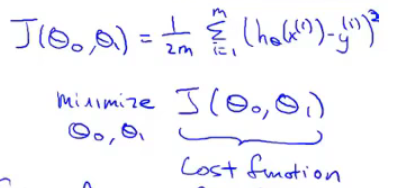

将预测的值减去实际值然后平方然后累加，然后取平均值，然后除以2

我们需要做的是让这个代价函数的值尽量小，这就能够尽量的使预测值和实际值误差足够小

## 2.3代价函数（一）

我们看下面的图去理解

代价函数是用来做什么：去寻找最优Θ1

为什么我们要使用它：用Θ1得最优hΘ，使得得出的预测值与实际值误差最小。

## 2.4代价函数（二）

更直观的理解代价函数

这一集，我们需要学会看等高线。这图对应的是两个参数，我们看图寻找这两个参数的最优解。（注这可能是局部最优解，而不是全局最优解），在后期会有多个变量，可视化就会很难。

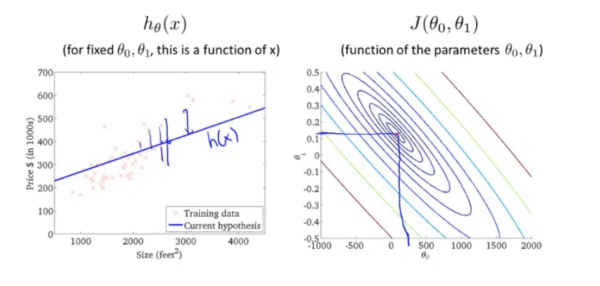

## 2.5梯度下降

不仅用于线性回归上

用梯度下降算法最小化任意函数J

梯度下降：不停的一点点改变Θ_1 等一系列的参数，来使得这个代价函数变小

想办法下山

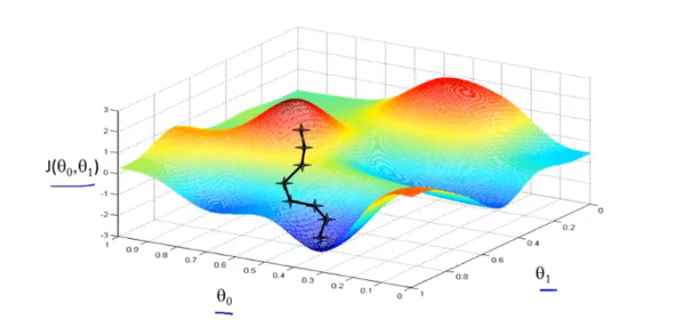

所以会有局部最优解，但不一定是全局最优解

**下图就是下山公式：**

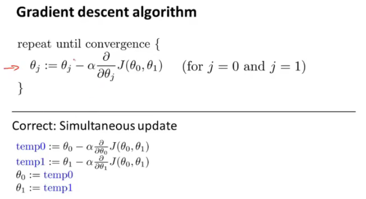

:=表示赋值（这是一个赋值运算）

α：学习率数字（控制梯度下降时，我们迈出多大步子）大步子也大，小步子也小

α后面的数字以后再来讨论（就是偏导数）

微妙之处：你需要同时更新Θ_1等变量 （就是上面有蓝色字的公式）（要同步更新，不是更新完一个，然后赋值，再更新一个）

不是同步更新的话，会有其他微小的变化。

## 2.6梯度下降知识点总结

这个算法是做什么的：得出最准确的值

梯度下降算法的更新过程有什么意义：寻找最低点（即最优解）

学习率数字太小或太大都会出现一些问题

太小运算太慢，太大，发散偏离正确答案

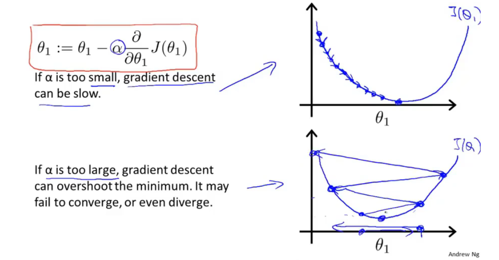

当到达最低点，偏导数就为0，此时点就不会改变，即找到了该局部的最优解

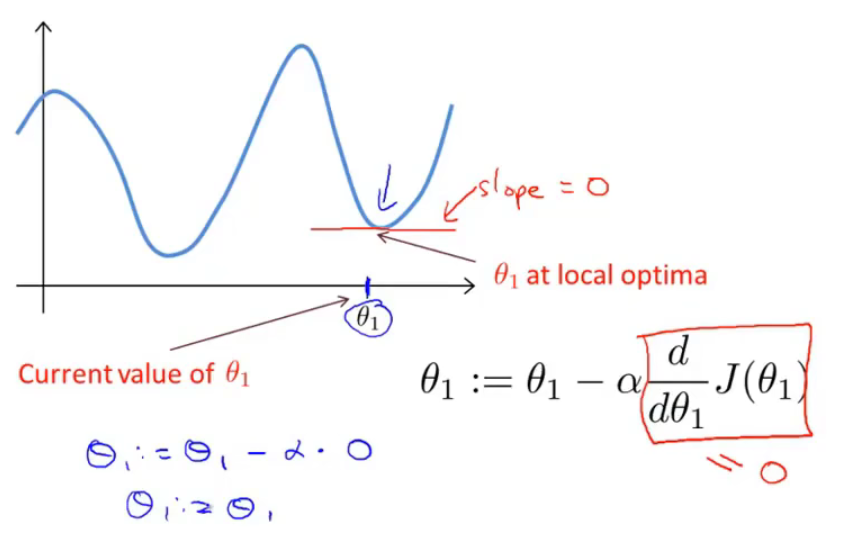

同时当越到达最底端，或最高段，斜率都会减少，此时根据公式，就可以发现，这个参数走的步数就会越来越小，知道停在局部最优解（导数和学习率共同决定步子的大小）

## 2.7线性回归的梯度下降

将梯度下降运用到代价函数上

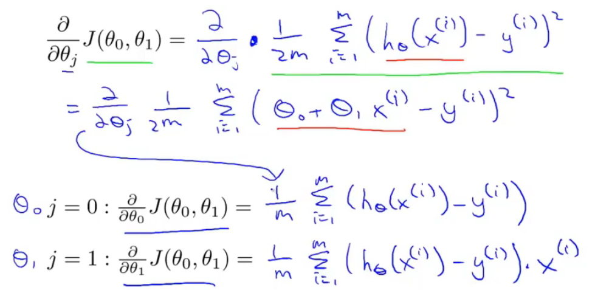

不断重复该过程直到收敛

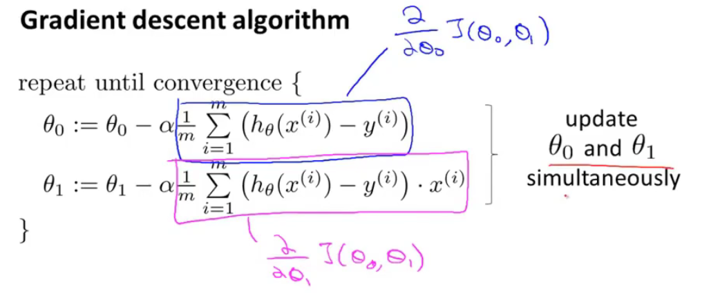

梯度下降如何实现（对于只有一个弓形，只要选取合适的参数，都能够达到最优解）

随着参数的改变，线的斜率，位置都会改变

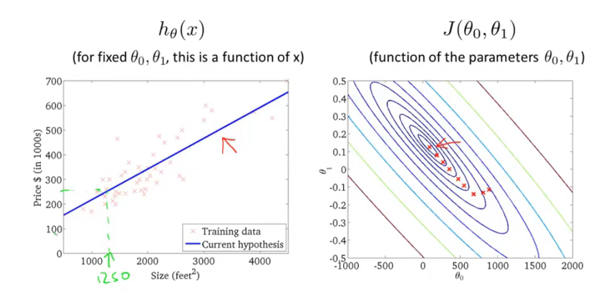

**Batch梯度下降**

每一步梯度下降，都会遍历所有的数据集

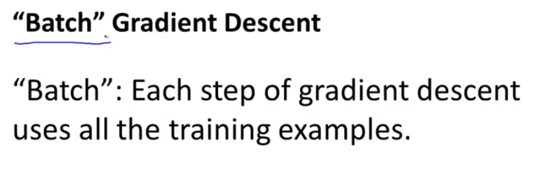

## 3.1矩阵和向量

复习线性代数

注意那些小的i,j表示什么

**矩阵**

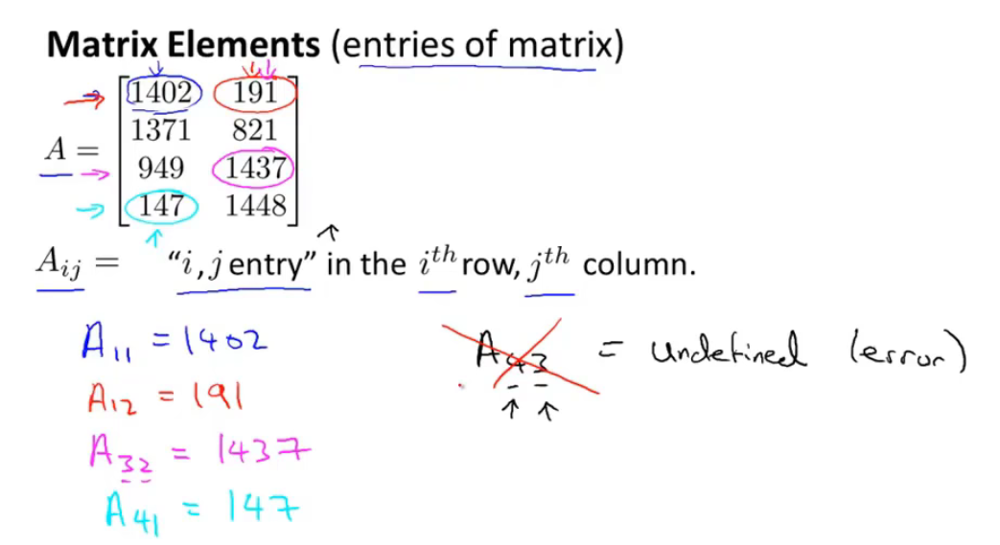

**向量**

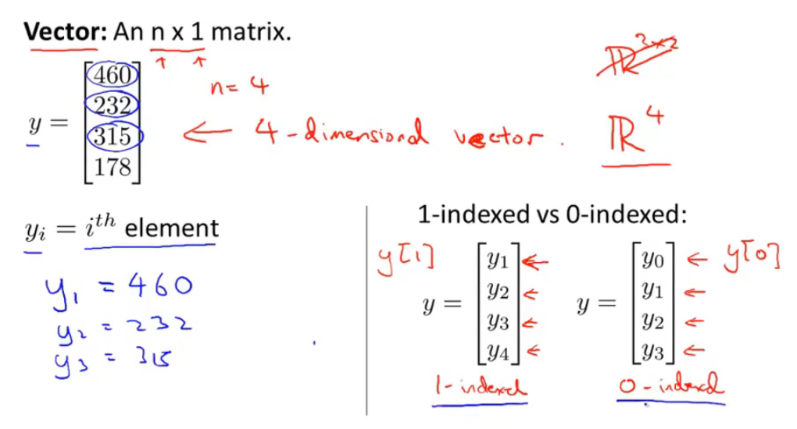

在这里，大写字母来表示矩阵，小写字母来表示向量

## 3.2加法和标量乘法

**矩阵的加法**

只能有相同纬度的矩阵相加、

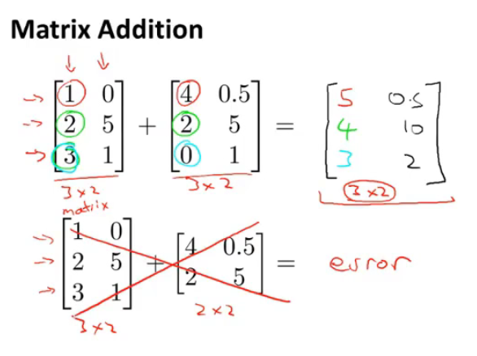

**矩阵和标量的乘法运算**

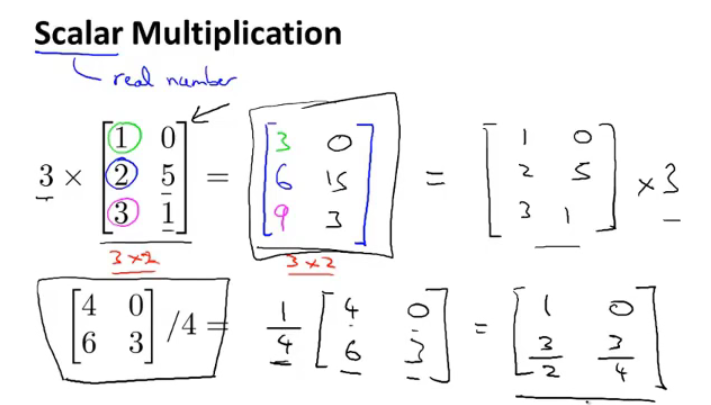

上两种方法的综合运算

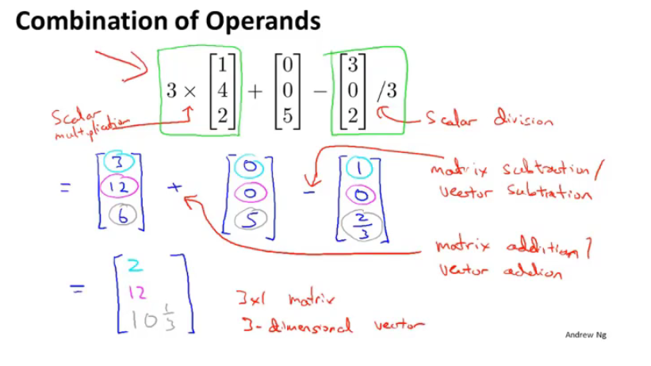

## 3.3矩阵向量乘法

线性代数可以看之前在b站的另一个教程，不会就看一下之前自己做的笔记，线性代数的本质

矩阵向量的乘法

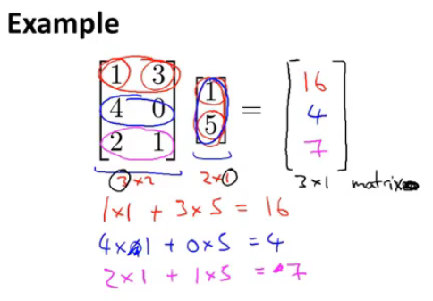

计算方式

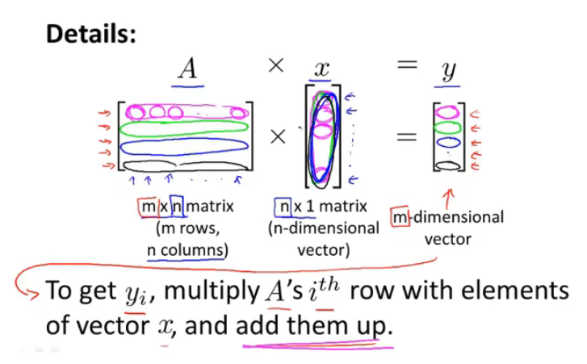

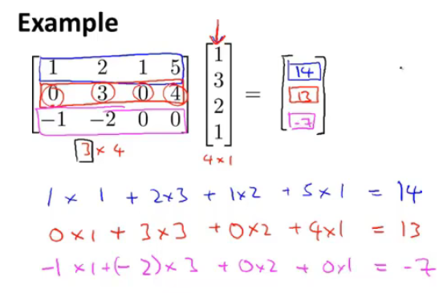

实例：快速计算四个房屋的价钱，注意它的表示方法，Θ1，Θ2放在了中间这个地方，可以想到，最左边的矩阵的表示方式，第一列为1常数不变，第二列为x变量。左侧为数据矩阵，中间为参数矩阵，右侧为结果。（这样只要一行代码就能够计算）

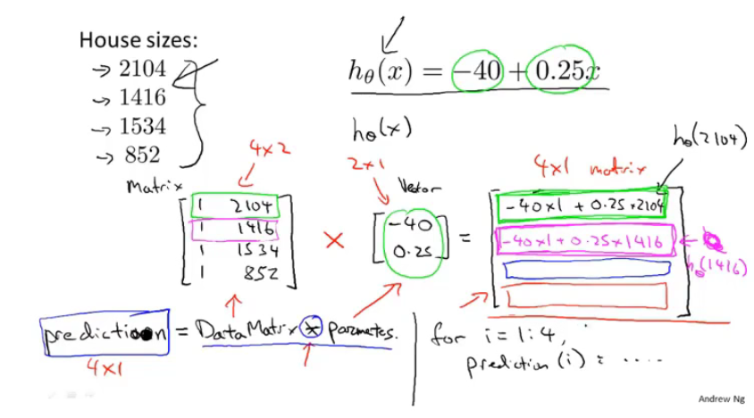

## 3.4矩阵乘法

**矩阵与矩阵的乘法**

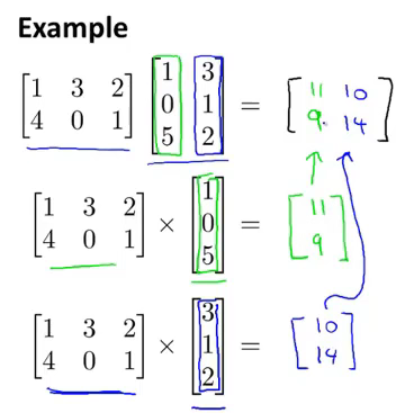

计算方式

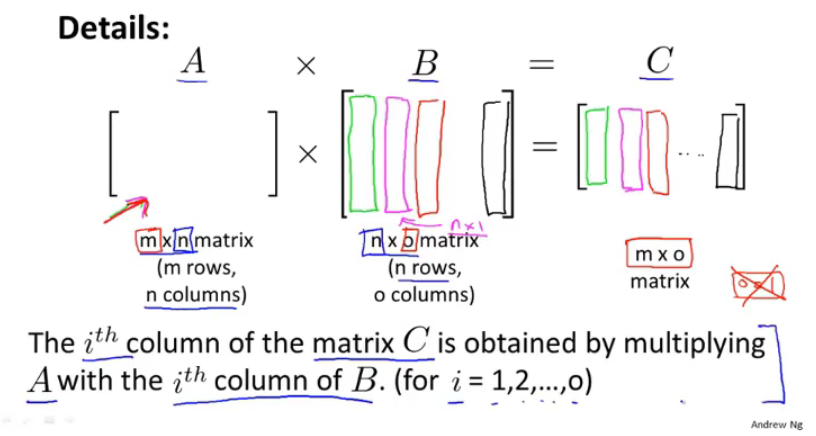

实例：使矩阵和矩阵乘法更加简洁的技巧

一次计算多个模型的计算（真的秀）

通过构建两个矩阵，同时运算3个模型，并得到12中基于三个假设对房屋的预测到的价格（矩阵理解见上一节）

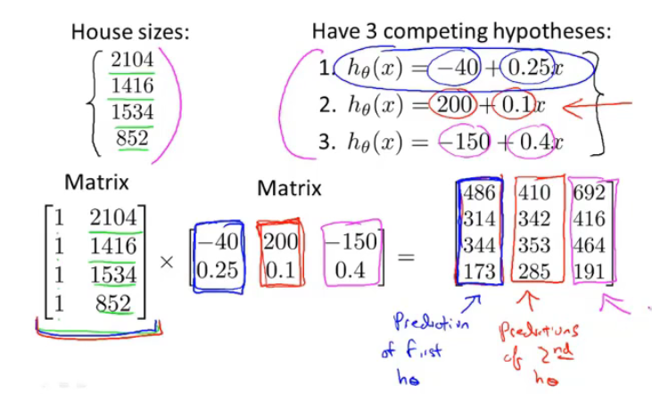

## 3.5矩阵乘法特征

详情看自己写的笔记——线性代数的本质

**矩阵没有交换律**

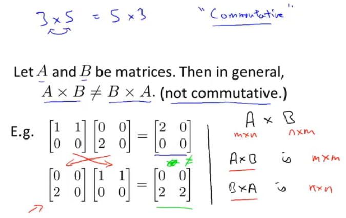

**矩阵有结合律**

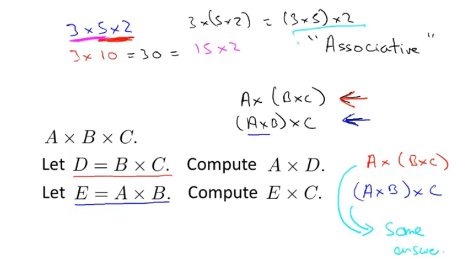

**单位矩阵**（注意维度）m x m还是 n x n（看下图的字母，着两个维度是不一样的）（注意矩阵没有交换律）

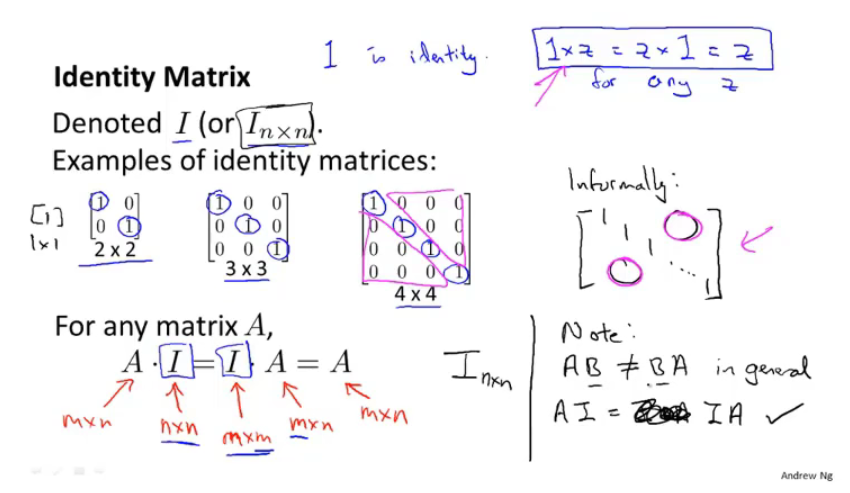

## 3.6逆和转置

就是矩阵和逆矩阵

矩阵和逆矩阵相乘为单位向量

（只有方阵才有逆矩阵）（计算机有很多类库都能算逆矩阵）

对于机器学习来说，可以吧哪些没有逆矩阵的举证想象成几乎元素都为零的矩阵（没有逆矩阵的矩阵被称为奇异矩阵）

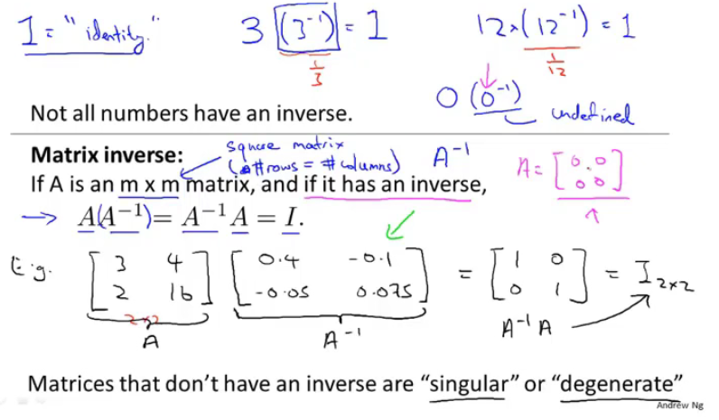

**矩阵的转置运算**

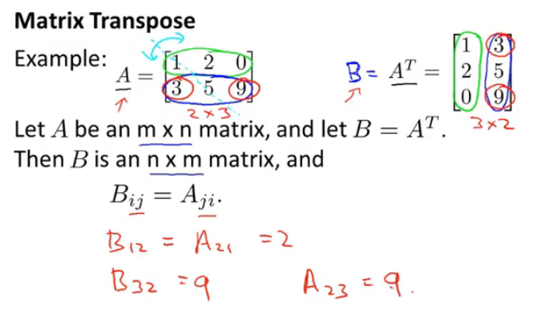

## 4.1多功能

