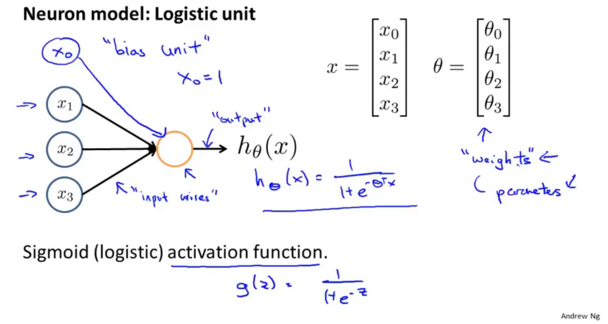
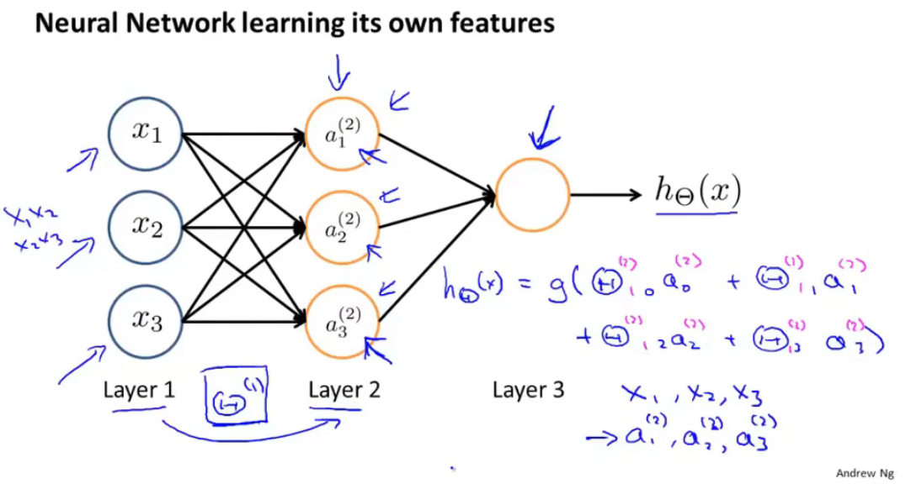
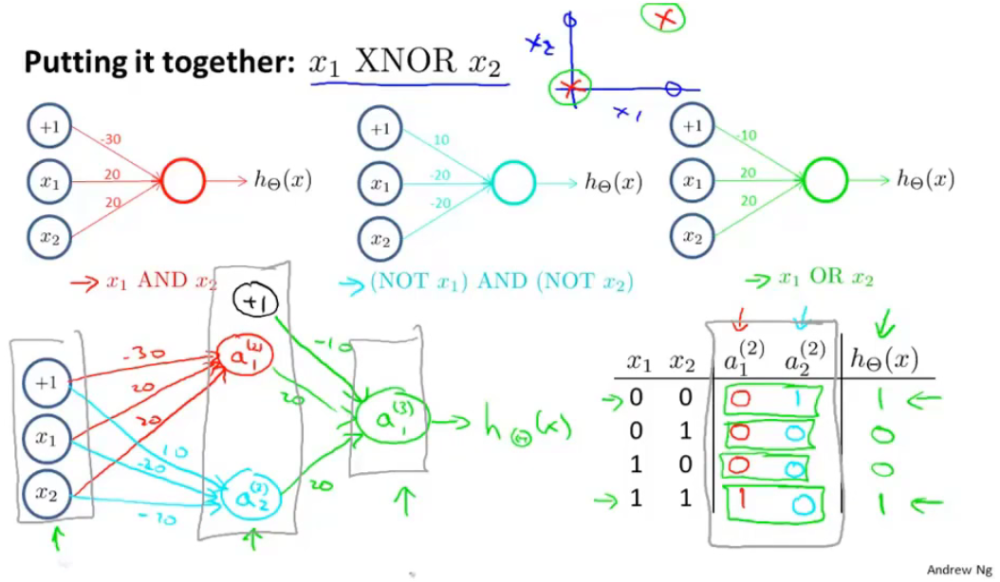
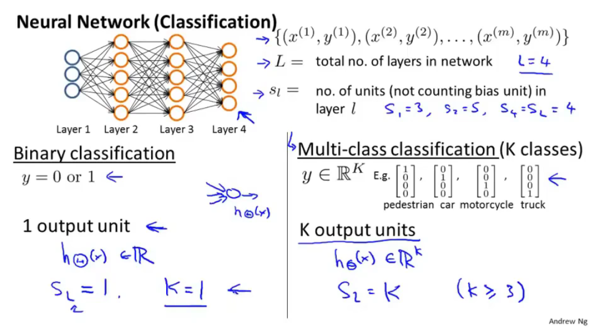
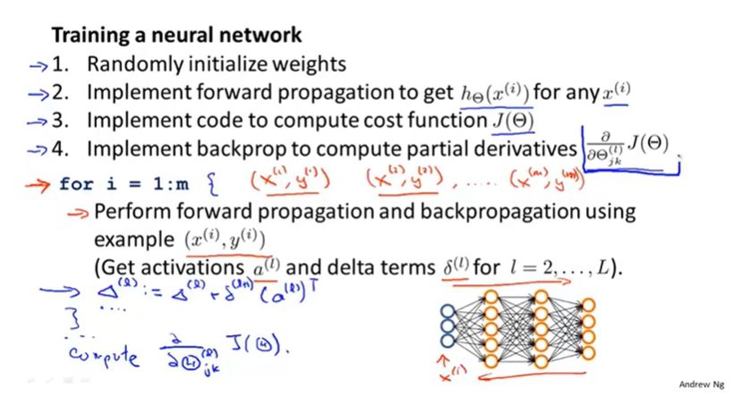
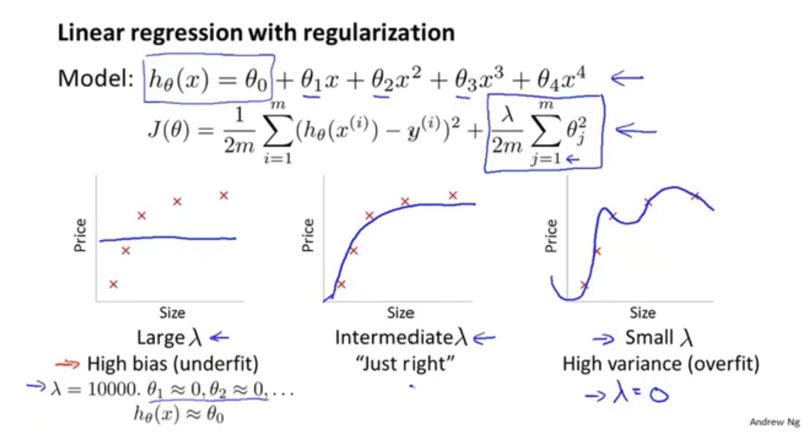
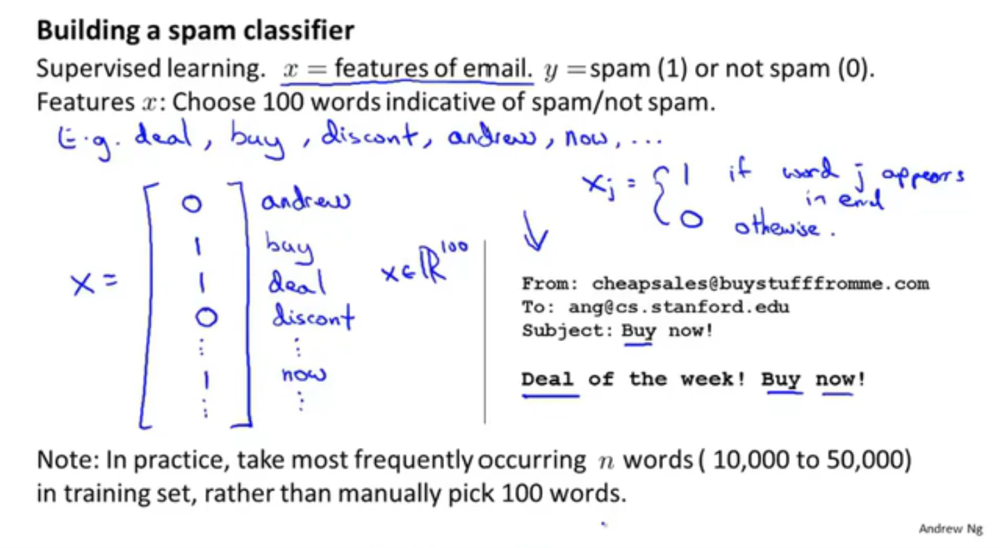
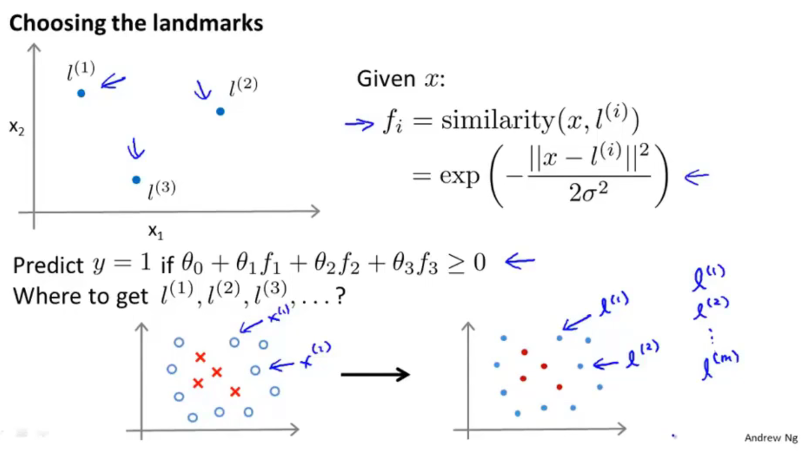

# 吴恩达系列课程

## 1.3监督学习

监督学习：

我们给算法一个数据集，其中包含了正确答案。 算法的目的就是给出更多的正确答案。

## 1.4无监督学习

无监督学习：

聚类算法——不告知任何准去答案，根据所获得到的数据，将这些数据进行自动分类，根据不同特征分成不同种类。然后说明其不同。

## 2.1模型描述

个人理解

模型：线性回归

线性回归：输入提供的数据集，智能计算出一条线性函数，这些数据都向着这条线靠近

单个变量就是单变量线性回归

## 2.2代价函数

代价函数又称平方误差函数

对于大多数回归问题，这都是一个很好的选择。

将预测的值减去实际值然后平方然后累加，然后取平均值，然后除以2

我们需要做的是让这个代价函数的值尽量小，这就能够尽量的使预测值和实际值误差足够小

## 2.3代价函数（一）

我们看下面的图去理解

代价函数是用来做什么：去寻找最优Θ1

为什么我们要使用它：用Θ1得最优hΘ，使得得出的预测值与实际值误差最小。

## 2.4代价函数（二）

更直观的理解代价函数

这一集，我们需要学会看等高线。这图对应的是两个参数，我们看图寻找这两个参数的最优解。（注这可能是局部最优解，而不是全局最优解），在后期会有多个变量，可视化就会很难。

## 2.5梯度下降

不仅用于线性回归上

用梯度下降算法最小化任意函数J

梯度下降：不停的一点点改变Θ_1 等一系列的参数，来使得这个代价函数变小

想办法下山

所以会有局部最优解，但不一定是全局最优解

**下图就是下山公式：**

:=表示赋值（这是一个赋值运算）

α：学习率数字（控制梯度下降时，我们迈出多大步子）大步子也大，小步子也小

α后面的数字以后再来讨论（就是偏导数）

微妙之处：你需要同时更新Θ_1等变量 （就是上面有蓝色字的公式）（要同步更新，不是更新完一个，然后赋值，再更新一个）

不是同步更新的话，会有其他微小的变化。

## 2.6梯度下降知识点总结

这个算法是做什么的：得出最准确的值

梯度下降算法的更新过程有什么意义：寻找最低点（即最优解）

学习率数字太小或太大都会出现一些问题

太小运算太慢，太大，发散偏离正确答案

当到达最低点，偏导数就为0，此时点就不会改变，即找到了该局部的最优解

同时当越到达最底端，或最高段，斜率都会减少，此时根据公式，就可以发现，这个参数走的步数就会越来越小，知道停在局部最优解（导数和学习率共同决定步子的大小）

## 2.7线性回归的梯度下降

将梯度下降运用到代价函数上

不断重复该过程直到收敛

梯度下降如何实现（对于只有一个弓形，只要选取合适的参数，都能够达到最优解）

随着参数的改变，线的斜率，位置都会改变

**Batch梯度下降**

每一步梯度下降，都会遍历所有的数据集

## 3.1矩阵和向量

复习线性代数

注意那些小的i,j表示什么

**矩阵**

**向量**

在这里，大写字母来表示矩阵，小写字母来表示向量

## 3.2加法和标量乘法

**矩阵的加法**

只能有相同纬度的矩阵相加、

**矩阵和标量的乘法运算**

上两种方法的综合运算

## 3.3矩阵向量乘法

线性代数可以看之前在b站的另一个教程，不会就看一下之前自己做的笔记，线性代数的本质

矩阵向量的乘法

计算方式

实例：快速计算四个房屋的价钱，注意它的表示方法，Θ1，Θ2放在了中间这个地方，可以想到，最左边的矩阵的表示方式，第一列为1常数不变，第二列为x变量。左侧为数据矩阵，中间为参数矩阵，右侧为结果。（这样只要一行代码就能够计算）

## 3.4矩阵乘法

**矩阵与矩阵的乘法**

计算方式

实例：使矩阵和矩阵乘法更加简洁的技巧

一次计算多个模型的计算（真的秀）

通过构建两个矩阵，同时运算3个模型，并得到12中基于三个假设对房屋的预测到的价格（矩阵理解见上一节）

## 3.5矩阵乘法特征

详情看自己写的笔记——线性代数的本质

**矩阵没有交换律**

**矩阵有结合律**

**单位矩阵**（注意维度）m x m还是 n x n（看下图的字母，着两个维度是不一样的）（注意矩阵没有交换律）

## 3.6逆和转置

就是矩阵和逆矩阵

矩阵和逆矩阵相乘为单位向量

（只有方阵才有逆矩阵）（计算机有很多类库都能算逆矩阵）

对于机器学习来说，可以吧哪些没有逆矩阵的举证想象成几乎元素都为零的矩阵（没有逆矩阵的矩阵被称为奇异矩阵）

**矩阵的转置运算**

## 4.1多功能

该算法用于多个变量和多个特征向量——**多元线性回归**

下图有4个特征变量（x1,x2,x3,x4），来预测价格y，m表示样本数量，x^(i)_j：第i个样本的第j个特征量

新的假设形式

理解：假设x0为1，特征向量X，为从0开始的n+1维向量，将Θ转置，然后相乘，就能得到h函数

该算法被称为**多元线性回归**

## 4.2多元梯度下降法

**利用梯度下降法解决多元线性回归**

注意把Θ0，Θ1...不要看成单独的个体，而是看成一个整的Θ的多维向量

查看下图，总结其多个特征值的计算，和新规

## 4.3多元梯度下降法演练1—特征缩放

**特征缩放**

例子：两个特征：1.房屋面积，2.卧室个数

如果直接计算，会出现一个比较夸张的椭圆，在这里如果计算，你就会发现，在梯度下降的过程中，运算起来会相对比较困难（走的不是很直，路径相对复杂），这是，我们就需要进行特征缩放，让这个图相对变的比较的圆润（偏移的不是那么严重），此时在做梯度下降，会相对来说比较简单（归一化想法？？不懂，但看样子是要快一点——应用统计学知识，还没学）

**执行特征缩放时的目的**：将特征的取值约束到-1到+1的范围内（对于打的范围，除以一个对应的数）-1，+1不是固定的，差不多就可以，离这个距离不要太远就可以

特征缩放时，有时会进行均值**归一化的工作**：如果你有一个特征x_i,就用x_i-u_i来替换，让你的特征值具有为0的平均值（这个又被叫啥正态分布？？不懂），（我个人理解，就是替换的这个值后，把它列成一个横轴，再来一个条形图，然后就是中间为0，然后慢慢的向两边散开，然后两边出现的概率几乎一样。）（注意是平均，所以如果出现概率不一样，应该中间可能不为0，可能往左边偏，也可能往右边偏）

为什么要这么干？：应为计算两个th的时候，梯度下降用的是同一个pha，若果两个差别太大，就会反复横跳（看到的弹幕，感觉是对的）

如何计算呢，看下图老师写的：u1是训练集中特征x_1的平均值，s1是特征值的范围，最大值减最小值（标准差），特征值x_2也是这么算

特征缩放不需要太精，能够让它运行的更快一些就可以

## 4.4多元梯度下降法2—学习率

调试是什么：

小技巧确保梯度下降正常：

如何选择学习率α：

下图，x轴表示梯度下降算法的迭代次数，y轴是最小的代价函数，曲线显示的是。梯度下降的每一步迭代后，代价函数的值，如果梯度下降正常工作，每一步迭代之后，J(Θ)都应该下降，通过曲线，可以看出梯度下降算法是否已经收敛了。（一般就是看这种曲线，来判断，梯度下降算法有没有收敛）

自动收敛测试：自动判断这个梯度下降算法是否收敛

看图，还可以提前警告你算法有没有正常工作

J(Θ)在逐渐向上，说明没有正常工作，需要将学习率调低

科学家以证明：只要学习率足够小，那么每次迭代之后代价函数J(Θ)都会下降

注意，学习率很低的话，梯度下降算法会收敛的很慢，太高可能不会每次迭代都下降，甚至可能不收敛，也可能出现收敛缓慢，对此，通常画出J(Θ)随迭代部署变化的曲线，来弄清发生了什么

## 4.5特征和多项式回归

告诉你一些可供选择的特征

如何得到不同的学习算法

多项式回归—利用线性回归的方式来拟合非常复杂的函数，甚至是非线性函数

例子：房价  两个特征，1.临街的宽度 2.垂直宽度

有时候不直接使用该特征，有时通过定义新的特征，可能会得到一个更好的模型

**多项式回归**

如何将模型与数据进行拟合？使用多元线性回归方法，拟合这条绿的线（三次方），修改这个特征值，就看下面，将size，平方还有三次方。通过将这三个特征这样设置，然后在应用线性回归的方法，就能够拟合这个模型，最终将三次函数拟合到数据上。这时候，特征缩放就变的更重要了，（个人觉得应为三个特征范围变的很大）

对应这个模型，除了建立三次模型外，也许有其他可选的特征，可能会得到更好的模型，看下图

**希望我们知道，我们可以自由选择使用什么特征，并通过设计不同的特征，能够用更复杂的函数拟合数据，而不只用一条直线去拟合，特别是你也可以使用多项式函数，有时如果从合适的角度来寻找特征值，你就能得到一个更符合你的数据的模型**

## 4.6正规方程（区别于迭代方法的直接解法）

对于某些线性回归问题，给我们更好的方法，求得参数Θ的最优值

梯度下降法，是迭代算出，正规方程式一次性算出（有优点，也有缺点）

直观理解：对J求导，并将导数置0，逐个求导数，逐个置0，就能得数Θ，（个人理解，不知道对不对，可以想一下那个三维图，里面包含了两个特征量，我们使用梯度下降到最后的结果，也就是箭头，变为平的。此时它的偏导数也就是为0，至于逐个求导，是应为只有多个特征量，最底端，应该是箭头都为平的）

看下图的解：X：是mx(n+1)大小的矩阵，y为m维向量，m为训练样本数量，n为特征变量数，然后最下面的Θ的公式就是得出最小化得Θ。Θ=X转置乘以X的逆乘以X的转置乘以y

下图是对上图的解释

继续解释（对代码的解释。pivn是求逆矩阵），如果使用正规方程法，就不需要特征缩放，这是没有问题的

对于这个矩阵求Θ的方法，没能够理解这个算式本质的含义，希望能在下面的视频中看到老师详细的解释。

何时使用梯度下降算法或正规方程法和优缺点

梯度下降法的缺点：

- 需要找学习率α，多些经历寻找运行效果最好的那个，这是额外的工作和麻烦
- 需要更多次迭代，计算会更慢

正规方程优点：

- 不需要选择学习速率α，所以方便，运行快
- 不需要迭代，不需要画J(Θ)图来看收敛性

梯度下降的优点：

- 在特征变量多的时候，也能够运行的很好，即便有上百万个也很好，通常也很有效

正规方程的缺点：

- X转置乘以X矩阵，是n*n的矩阵，n是特征变量的数量，对于大多数计算应用来说，实现逆矩阵的代价是以矩阵维度的三次方增长，如果特征变量过多，就会很慢（n过万就可能开始考虑用梯度下降法了）

## 4.7矩阵方程在矩阵不可逆情况下的解决方法

在Octave中，有方法保证它是可逆的，如果不可逆，就会算出伪逆

对于一些可能出现不可逆的情况（删除多的不必要的特征，还有其他）（没有理解其本质，先记着他的表面吧）

## 4.8导师的编程小技巧

开始使用Octave编程

## 5.1基本操作

老师讲了一些关于Octave的基本操作

## 5.2移动数据

老师讲了如何使用Octave来进行移动数据操作

## 5.3计算数据

老师讲了如何使用Octave来将这些数据进行计算

## 5.4数据绘制

老师讲了如何使用Octave来将这些数据进行绘制

## 5.5控制语句：for,while,if语句

老师讲了如何使用Octave来学习这些控制语句

## 5.6矢量

老师讲了如何使用写好的类库

## 6.1分类

预测的变量y是一个离散值情况下的分类

logistic回归算法

垃圾邮件分类

网上交易是否欺诈

是否患有癌症

**如何开发一个分类算法**

使用线性回归会出现一些问题，看下图，粉色的线是运气比较好的时候，没有一些特殊的数据集。此时我们定义阈值0.5这时候正好能分割Negative class 和positive class。 但是看蓝线，当出现了一些或一个特殊的数据集，他就会偏移，此时在定义阈值为0.5时，他的判断就不够标准，无法准确的判定negative class 和positive class

**对分类问题使用线性回归会出现什么问题？**

即便我们知道标准输出值为0或1但是，使用线性回归的输出值，会远大于1或远小于0。新算法会介于0~1之间

## 6.2假设陈述

**logistic回归（这不是线性回归算法，是分类算法）**

当出现分类问题，我们要使用哪个方程，来表示我们的假设

Sigmoid function 和 Logistic function几乎是同义词（可以互换）

看下图，我们如何将h(Θ)圈在（0,1），我们定义函数g如下，对应g的图像，也在下图表示。函数g就被称之为Sigmoid function 或称为Logistic function。然后我们将两个函数结合起来。（另一个函数h(Θ)的原型，就是之前讲的函数）

**对上图模型的解释**（涉及概率论的知识）

我们假设h(Θ)的输出。我们有一个特征向量x，我们还是像往常一样假设x0为1，x1为肿瘤的大小。我们将特征向量喂入假设中，并假设输出值为0.7。对于这个假设就说明了，对于一个特征为x的患者，y=1的概率是0.7。（这是个肿瘤）下面还有更加准确的书写方式，在给定x1的条件下，y=1的概率为Θ，应为这是一个分类任务，只有0和1，所以两个概率加起来要为1

## 6.3决策界限

决策边界概念——更好理解logistic回归函数，假设函数在计算什么

下图当概率大于0.5时，就预测y=1，反之y=0。由图和算法可知，当z>0时，概率就大于0.5，反之概率就小于0.5.那么由此可知，我们只需要确保xΘ^T>=0，那么y=1，当<=0，y=0。通过这个我们就能更好的理解logistic回归的假设函数。

下图是一个实际的例子：我们由上面的推导，那么要想y=1只需要确定Θ0+Θ1x1+Θ2x2>=0就可以。我们继续假设，我们知道了Θ0，Θ1，Θ2的值，分别为-3,1,1。（下面的图表，应该是根据这个假设画的一个数据集，使之可视化）。由此我们就可以确定x1+x2>=3，那么对应的这条线就是决策边界。（注意这里的属性是我们假设的，而不是数据集的属性），当我们有了确定的参数取值，我们将完全确定决策边界，这时我们没有必要通过绘制训练集来确定决策边界。

下图再看一个更复杂的例子：这种数据，如何拟合才能使用logistic回归（添加额外高阶多项式，和以前讲过的例子一样）（下节课指导如何自动选择参数Θ0~Θ4），假设已经使用了该方法，值为-1，0,0,1,1。要使y=1则看下图的式子。就是一半径为1的圆心，这就是决策边界。通过在特征中增加一些复杂的多项式我们可以得到更复杂的决策边界，而不只是用直线分开正负样本，（再次说明，决策边界不是训练集的属性，而是假设本身及其参数的属性），只要给定了参数，就能够得出决定边界（我们用训练集来拟合参数Θ），此外还会有更加复杂的例子

## 6.4代价函数

目标：如何拟合logistic回归模型的参数θ，具体来说，要定义用来拟合参数的优化目标或者叫代价函数

下图去定了我们要用的东西

看下图，我们首先写出我们之前用于计算线性回归的J(θ)，我们将其中后面的部分华为cost函数（详细式子的简写）。h(x)是我们预测的值，y是实际的值。如果我们就以这种方法带入，我们就极有可能会出现左边这张图表。（注，x轴为θ，y轴为J(θ) ）这是一个非凸函数。他会有很多局部最优解，这时候我们使用梯度下降算法，就极有可能获得局部最优解，而不是全局最优解。*（为什么会出现这种非凸函数，我个人理解：是应为，我们这里的算式是离散的。y值不是1，就是0。那么我们仔细想一下实际情况下的数据。h(x)-y就会出现大幅度的忽高忽低。就会导致这种情况）*，所以我们需要找一个不同的代价函数，来完成右侧的凸函数，更好的使用梯度下降。找到最小值

我们定义这个算法要付出的代价或者惩罚。我们看下图，我们重新定义了一个新的代价函数。首先我们要知道，这个Cost的值越大，就说明，这个算式越不准。所以我们要尽量使这个值越小，趋近于0。然后我们先看y=1的情况，假设我们预测肿瘤的概率为0.7，它确实是一个肿瘤。那么我们就能在途中找它对应的点，这个点y值不算大。但假设我们预测这个为肿瘤的概率为0，但是它却的确是一个肿瘤。此时。它的y值为无限大。

我们再来看看y=0时，它的意思。其实和上面也是差不多的意思。根据我们的预测，来判定。如果我们以大概率预测对了，我们的代价就小。如果我们以大概率预测错了，我们需要付出的代价就大。都是这样。那么通过这样的一个式子，我们在带入J(θ)，我们就能够获得一个凸函数，就能够使用梯度下降。

## 6.5简化代价函数与梯度下降

目标：知道如何实现一个完整的logistic回归算法

下图我们尝试用一个式子，表示这个条件函数，式子看下图

下图为我们新的代价函数（-号提前了），为什么选择这个式子：这个式子是从统计学中的极大似然法得来的

下图还告诉我们如何自动匹配这个新的参数

下图就是我们使用梯度下降算法，自动选择的新的参数θ，我们可以使用微积分的知识，来算一算这个式子的偏导数

如果有多个参数，就使用下图的这个方法，来同时更新θ。当我们运算这个偏导数，我们也会奇迹的发现，这个式子就是我们用来做线性回归梯度下降的。

那么这个线性回归会和logistic回归是同一个算法码？我们看下图对h(x)的定义，就可以知道，不是同一个算法

## 6.6高级优化

目的：学习高级优化算法和一些高级优化的概念，大大提高梯度下降算法的速度。解决大型的机器学习问题，比如有数目庞大的特征

我们编写算法，输入θ，获得J(西塔)和新的这些参数。梯度下降算法再反复执行这些更新。从而来更新这些参数

下图有比梯度下降算法跟好的算法，但是也更复杂。（超出教学范畴）我们来了解一下这些更好的算法的特性：1.使用下面的三种算法，我们可以不自己手动选择学习率α。（当然远远不止自动选择学习率α，它更复杂，让梯度下降算法运算更快）。缺点：比梯度下降算法复杂的多 （当个调包侠吧，拿着大佬的东西直接用就好了）

如何使用这些算法（加强版的梯度下降算法），举例 jVal ：代价函数J(θ)，(theta(1)-5)^2：计算这个代价函数，gradient：下图是一个2X1的向量，gradient（）：对应下图的两个偏导数 ，fminumc：无约束最小化函数（高级优化算法）  options：存储options的数据结构    GradObj on ：设置梯度目标参数为打开  MaxIter 100： 设置最大迭代次数  比方说100    initialThera：给出一个θ的猜测初始值，是2X1的向量  @costFunction 指向刚刚定义的代价函数的指针

这里θ必须是d维的，就是要大于等于2

## 6.7多元分类：一对多

目的：如何使用逻辑回归，解决多类别分类问题

看下图的例子，包含了有多个结果，不单单只有0, 1

下图多个分类的数据集的可视化样式 ，左边可以用一条直线来分类是正的，还是负的。同样的我们利用一对多的思想，也能够将其运用在多类别分类问题上。

例子：下图就是将左边的图，转化为三个独立的二元分类问题，将类型1定为正类，将其他类型定为负类。拟合第一个逻辑分类器h1(x)，1表示以三角形类别当做正类别，第二个分类器，第三个分类器也是这样做。最后给出每个分类器y=i的概率

总结一下：我们训练了一个逻辑回归分类器，hθ(x),预测i类别y=i的概率，最后为了作出预测，我们给出一个新的输入值x，期望获得预测。我们要做的就是比如三个分类器运行输入x，然后选择h最大的类别。也就是要选择分类器，选择出三个中，可信度最高，效果最好的那个分类器 ，无论i值有多好，我们预测的y值就是那个值。

## 7.1过拟合问题

目的：解释什么是过度拟合问题

下图例子：y轴为价格，x轴为面积

右图这个问题称为“欠拟合”，这个算法具有高偏差，没有很好地拟合数据（如果拟合一条直线，就好像算法有一个很强的偏见，或者说有非常大的偏差。认为这个房子价格与面积线性相关，而不顾及数据的不符，先入为主的拟合成一条直线）。

图二就是一个二次函数，拟合得很好，刚好适合

另一个极端情况，我们拟合一个四阶多项式，通过全部五个训练样本，似乎很好地拟合了5个数据，但是波动很大。我们就称之为过度拟合（另一种说法，这个算法具有高方差）

过度拟合会在变量过多的情况下出现，这时训练出的假设能很好地拟合训练集，所以你的代价函数实际上可能非常接近于0。但是他千方百计得拟合训练集，导致它无法泛化到新的样本，无法预测新样本的价格

下图左图就是欠拟合，中间的就是刚刚好，右边的就是过度拟合（辛苦右边这个算法了）

过拟合问题发生时，我们如何解决：

当我们使用一维或二维数据时，我们可以通过绘出假设模型的图像来研究问题的所在，在选择合适的多项式阶数。（但有时候这种方法不一定管用，有时我们往往有许多需要的特征变量，绘图更困难，通过数据可视化来决定保留哪些特征变量也更难）

如何解决呢？

两个办法

1.尽量减少选取变量的数量，具体而言人工检查变量清单，并以此决定，那些变量重要，哪些特征变量更重要，然后选择性的舍去（后面会讲模型选择算法，让电脑自动选择）（比较有效）（缺点：舍弃了一部分特征变量，你也舍弃了关于问题的一些信息）

2.正则化，我们将保留所有的特征变量，但是减少量级，或参数θ_j的大小。（这个方法非常有效）

## 7.2代价函数

目的：正则化是怎样运行的？进行正则化的时候，我们还将写出相应的代价函数

方法，在一些不重要的特征变量上，我们设计一种惩罚机制，来让这些不重要的特征变量，影响尽量减小。小到就像下面，不影响二次函数的大体走势。

背后思想：如果我们的参数值较小，参数值小意味着一个更简单的假设模型 ，就像上面的，让θ3，θ4趋向于0，我们就会得到一个更简单的假设模型，就相当于一个二次函数。——加上惩罚机制，尽量去简化这个模型

那么在大量的参数中，我们如何寻找到哪些相关度不那么高的参数呢？去减小它的值（假设有100个参数，1000各参数）

所以在正则化中，我们要对代价函数进行修改，来缩小所有的参数， 在后面添加一个新的项。（就是添加的粉色的字），添加一个额外的正则化项，来缩小每个参数的值，（这个项的作用是缩小每一个参数，从θ1到θ100） ，注意啊没有给θ0，这是约定俗成的。

最右边的就是正则化参数，λ 是控制两个不同目标之间的取舍 。

第一个目标，与目标函数的第一项有关，就是我们像更好的拟合数据，训练集。

第二个目标，保持参数尽量的小 ，与目标函数第二项有关，与正则化目标有关，与正则化项有关。

λ是正则化参数，控制两目标之间的平衡，即更好的去拟合训练集的目标和将参数控制得更小的目标，从而保持假设模型的想对简单，避免出现过拟合的情况。

为什么要平衡？如果正则化参数过大（即惩罚力度过大），那么第一个目标对应惩罚的这个参数θ_j，都会接近于0（就相当于把假设函数的全部项都忽略掉了，最后模型只剩下θ_1,那也就是一条直线了，欠拟合），说明这个假设模型的偏见性太强了。

所以我们需要去选择一个更合适的正则化参数λ

## 7.3线性回归的正则化

目的：在课程刚开始学的线性回归上使用正则化

也就是下图的这个式子

下图中间的原始黑子式子，就是我们一开始使用梯度下降算法更新参数的式子。

对于正则化线性回归，我们惩罚的对象是参数θ_1~θ_n，θ0除外（区别处理）

对于如何修改，就看下图中间的式子，我们加入粉色字的式子。这样做的话就可以对正则化代价函数J(θ),用梯度下降法进行最小化。

（用微积分证明）我们可以发现，方括号里的这一项正好是J(θ)的偏导数，（注意这里的J(θ)是包含正则化函数）

青色方框的也是偏导数，他是J(θ)对θ0的偏导数

仔细查看就会发现更有趣的东西：具体的θ_j的更新值就是用θ_j减去α乘以这个项，把这些包含θ_j的项汇总起来，那我们可以把这个更新值，等价地写成如下的形式

1-α*(λ/m)是一个很有趣的项：它的值只会比1略小一点的数。通常学习率α很小，m很大。这样θj就会减小的一点点（说正式一点θ_j的平方范数变小了）至于后面的式子，和梯度下降更新一样

我们要做的就是迭代，每次都把参数缩小一点，然后和之前一样的更新操作。 

看到了弹幕**（更新方法不变，但又极大的限制了高阶项）**

用正规方法来解决（正规方法与正则化的结合）

首先你要知道正则化的公式是如何来的（黑色字），最小值是怎么来的——里面核心理念是对θ的偏导数等于零。然后求出

如何与正则化结合呢？(只给了公式，没有给原理)

里面添加了一个λ后面乘以他的一个类似于单位向量的矩阵（第一个为0）。如果设n=2那么这个矩阵就是3x3. 矩阵大小为（n+1）x（n+1）

最后谈论不可逆的问题（不需要掌握，听听就可以）

样本总数m<n(特征的数量)

如果你的样本数量比特征数量少，那么这个x转置乘x的矩阵是不可逆的

幸运的是，在正则化中考虑到了矩阵不可逆的问题，具体来说，只要正则化参数>0,下面括号里得出来的式子，一定是可逆的。

因此进行正则化还可以解决一写X的转置乘X出现不可逆的问题

## 7.4Logistic 回归的正则化

目的：改进上节课的两种算法

在后面添加途中蓝色字（用途：惩罚θ1,θ2...防止他们过大）效果：即时当你拟合阶数很高，且参数很多，只要添加了这个正则化项，保持参数较小，仍然可以得到一条更适合的边界，防止过拟合

看下图将θ0单独处理，把第二个式子修改，看下图。    括号内的这个式子，它是新定义的代价函数J(θ)   

高级算法，看图片，每一步代码都有对应的数学式子表示

## 8.1非线性假设

为什么要研究神经网络：先看几个例子

看下图的例子，如果使用logistc回归，可以创建一个包含很多项的回归函数，当有足够多的回归项的时候，就能够分开正样本和负样本，当只有两个特征的时候，还算可以。但是当特征远不止两项的时候，就比如我们有100个特征，如果要包含所有的二次项即使只包含二次多项式，最终也有很多项（5000个），而且渐渐地二次项的个数大约以n^2的量级增长（n是原始特征的个数）（(n^2)/2）。这往往不太好，项数太多最后的结果很有可能是过拟合。同时也存在运算量过大的问题。如果假设的太少，又不能拟合出一个合适的结果。（如果假设有立方，那么这个量级有时不可想象的）——（**当初始特征个数n很大时，将这些高阶多项式包含到特征里，会使特征空间急剧膨胀**）——当特征数量n很多，增加特征来建立非线性分类器并不是一个很好地做法

看下图，假设我们使用机器学习算法，来训练一个分类器来检测图像，来判断图像是否为一辆汽车，为什么计算机视觉很难——应为计算机智能看到下图的数字矩阵（表示像素强度值的网格）

具体而言，当我们用机器学习算法构造一个汽车识别器时，我们要做的就是提供一个带标签的样本集，其中一些样本是各类汽车，还有一些不是汽车，将这些训练集输入给算法，以训练出一个分类器，然后我们进行测试，输入一个训练器，让分类器判定这是个什么东西。（理想情况下分类器能识别除这是一辆汽车）

为了证实引入非线性假设的必要性，我们从学习算法的训练样本中，找出一些汽车图片和一些非汽车图片。我们从图片中选择一组像素点位，（x1,x2），标出这幅汽车的位置，车的位置取决于像素点1和像素点2的强度。

让我们用同样方法在看一个（图中的兰博基尼），这又是一个位置，我们继续画，不是汽车的。然后再画更多更多的。我们发现了汽车和不是汽车分布在坐标系中不同的区域，因此我们现在需要一个非线性假设，来尽量分开这两类样本

这里的特征空间维数是多少呢？假设使用50*50像素的图片（已经非常小了），但这依然是2500个像素点，因此特征向量的元素数量n=2500。特征向量x包含了所有像素强度的列表，（这还是只用了255的灰度图像）（如果使用RGB n=7500）

所以logistic回归算法，并不是一个在n很大时，学习复杂的非线性假设的好办法，应为特征过多了

## 8.2神经元与大脑

目的：一些神经网络的背景知识，由此我们能够知道，可以用它来干什么，不仅应用到现代的机器学习问题上，对制造真正的智能机器人，也会讲解神经网络和这一问题的关系

原始想法，模仿人类的大脑，再一次兴起的原因之一是，神经网络的计算量较大，当今的机器的发展，才足以运行大规模的神经网络。

大脑的处理方式只需要一个学习算法就可以

将听觉神经与那一边的大脑皮层切断，将视神经连接到听觉皮层那边，听觉神经会学会看

躯体感觉，切断，连接视神经，那么躯体感觉皮层也能学会看。

统称神经重接实验

我们需要做的就是找出一近似的或实际的大脑学习算法，然后实现它，让大脑自己学习如何处理这些不同类型的数据

实际例子，头上绑摄像头数据传到线上，刺激舌头，让味觉学会看

人体声呐，触觉皮带。把眼睛移植到青蛙头上，青蛙能够使用第三只眼睛。

## 8.3模型展示1

目的：在运用神经网络时，我们该如何表示我们假设或模型

下图大脑中的神经元，值得注意的两点：1.神经元有像这样的细胞体 2.神经元有很多输入通道——树突（接受其他神经元的信息）轴突（输出通道，给其他神经元传递信号，轴突传送到其他结点） 

下图是神经元示意图，神经元之间利用微电流沟通——动作电位，通过轴突传递消息，轴突（输出通道），神经元计算，在传输到别的地方。

在计算机我们使用一个很简单的模型来模拟神经网络，黄色的圆想象成神经元。传输信息，黄色圆计算，然后再通过输出通道输出。下图就是表示对h(x)的计算，下图x和θ是我们的参数向量

通常我只会绘制输入结点x_1 x_2 x_3，有时候会增加必要节点x_0，这个结点有时候也被称为偏置单元或偏置神经元。但因为x_0总等于1，有时候会画，有时候不会画。

**自问自答：x0，x1等，对下一个神经来说是输入信号，但它本身可以被视作一个神经元，他处理并向后传递信息。**

最后讨论一个关于神经网络的术语：有时候会说下图这东西是一个带有sigmoid或者logistic激活函数的人工神经元。

激活函数是指代非线性函数g(z)的另一个术语 g(z)=(1/(e^(-z))).

在一些报告里，θ参数，又称为权重，说的也是这东西

看下图，神经网路其实就是一组神经元，连接在一起的集合，具体来说就是下图的，输入单元x_1,x_2和x_3，有时候可以画上额外结点x_0,黄色圆圈也差不多。然后再计算，多个参数传输到下一个神经元。

网络中的第一层也被称为输入层，最后一层也被称为输出层，应为这一层神经元它输出假设的最终计算结果，中间第二层也被称做隐藏层（在机器学习中你能看到输入，也能看到输出，而隐藏层的值在训练集里是看不到的），神经网络不应定只有一层隐藏层。

下图，a^(j)_i来表示第j个神经元或单元的激活项，具体来说这个a^(2)__1表示第2层的第1个激活项，所谓的**激活项**指的是由一个具体神经元计算并输出的值。

此外我们的神经网络被这些矩阵参数化θ^(j),就是权重矩阵，它控制从某一层，比如从第一层到第二层，或者第二层到第三层的映射。这就是下图所表示的计算。

这里的第一个隐藏单元（粉色），是像下面的计算公式，计算它的值的——a^(2)_1等于sigmoid函数，或者说sigmoid激活函数，也叫做logistic激活函数作用在这种输入的线性组合上的结果。

第二个隐藏单元（绿色），对应的，也是下图绿色画出来的计算公式。第三个也是这样。

θ^(1)就是控制着从三个输入单元到三个隐藏单元的映射的参数矩阵，因此θ^(1)就是一个3*4的矩阵（看下图的计算式子就可以知道），更一般的，如果一个网络在第j层有s_j个单元，在j+1层有s_j+1个单元，那么矩阵θ^(j)即控制j层到第j+1层映射的矩阵。*它的维度为s_(j+1) * (s_j  +1)   注意：后面的s_j是一个整体

最后在输出层，我们还有一个单元，它计算h(x)，这里也可以缩写成a^(3)_1,就等于后面的一块，θ(2)也是一个权重矩阵，控制第二层隐藏层的单个单元，到第三层的一个单元（即输出单元）的映射

**总结一下：**注意下图，我们是如何利用下图，来定义一个人工神经网络的，其中的神将网络定义了函数h，从输入x，到输出y的映射，这些假设被参数化，我们将参数记为大写的θ，这样一来改变θ，就能得到不同的假设，我们有不同的函数，比如从x到y的映射。

## 8.4 模型展示2

目的：让我们明白为什么这样是表示神经网络的好方法，并且明白它们如何帮助我们学习复杂的非线性假设函数

下图是解释这个算法的详细过程。

首先我们将下面蓝色，红色，粉色画出来的内容，分别认为是z^(2)_1  z^(2)_2   z^(2)_3。然后再看下面的式子的组合，就很像我们之前学习的需要矩阵的式子。所以我们分别将这些东西写成右边上面的的X矩阵，和Z矩阵。x为我们输入时的激活项。

此时z^(2) =θ^(1)*x   （z和x都为矩阵）。而后，在把它带入g() 这个函数，就能得到 a^(2)这一个矩阵，（2）代表是在第二层。**（算式简写就在右边绿色方框中的上面一部分）**

此时我们再看a^(2)，也就对于第二层，隐藏层的激活项，那么此时我们就能把x换成a,来继续完成第2层的运算，到达第三层输出层，输出结果**（算式简写就在右边绿色方框中的add下面一部分）**

那么对于第三层运算时的z^(3)我们也能看出他只有一维

注意：在这里都有一个偏置单元，这个偏置单元是需要另外考虑，它的值都是为x0=1，a0=1，它不是算出来的，而是人为加上去的。**（在绿色方框的Add的那部分）**

这个计算h(x)的过程，也称为**向前传播**，这样命名是应为我们从输入单元的激活项开始，然后进行项圈传播给隐藏层，计算隐藏层的激活项，然后我们继续向前传播，并计算输出层的激活项，这个一次计算激活项，从输入层到隐藏层再到输出层的过程叫做**向前传播**。我们推导的，是这一过程的向量化实现方法

我们再看下图：

我们先把左侧的x1，x2，x3先遮住。那么这个神经网络就很像一个逻辑回归，下面什么都没有圆，就是用这个逻辑回归单元，来预测h(x)的值。

具体来说，假设下图h(x)的式子，其中a1，a2，a3的三个值，由图中的三个单元给出。为了和我之前定义保持一致，我们在加上下图的粉色字。但是只要管啥符号中的蓝色部分，这看起来就非常像标准的逻辑回归模型。不同之处在于我现在用的是大写的θ，而不是小写的θ，

这实际上就是逻辑回归，但输入逻辑回归的特征，是通过隐藏层计算的这些数值。

再说议案，这个神经网络所做的事，就像是逻辑回归，但是它不使用原本的x1，x2，x3作为特征，而是用a1，a2，a3作为新特征。

有趣的是，特征项a1，a2，a3它们是学习得到的函数输入值，具体来说就是从第一层，映射到第二层的函数，这个函数由其他参数θ^(1)决定，它并没有用输入特征值x1，x2，x3来训练逻辑回归，而是用自己训练出的内容来训练

你也可以选择多项式来训练，但是这个算法可以灵活的尝试快速学习任意的特征项，转为a1,a2,a3然后再进行逻辑回归运算，这就是逻辑回归算法。

看下图：

我们还可以用其它类型图来表示神经网络，神经网络中神经元的连接方式称为神经网络的架构——不同神经元的连接方式

下图就包括了不同的神经网络架构，我们就可以了解到这个第二层是如何工作的。在这里我们三个隐藏单元，它们会计算一些比如说输入层的复杂工能，然后第三层可以将第二层训练出的特征作为输入然后在第三层计算出更复杂的特征，这样到达输出层，第四层时，就可以利用在第三层训练出的更复杂的特征作为输入。以此得到废仓有趣的非线性假设函数。

## 8.5例子与直觉理解1

目的：通过一个详细的例子来说明神经网络是怎样计算复杂非线性函数的输入的，希望能够让我们搞懂为什么神经网络可以用来学习复杂的非线性假设模型

看下图：

我们有x1，x2两个输入特征，它们都是二进制的，只能取0或1。

在这个例子只画了两个正样本和两个负样本，可以把它看做成复杂机器学习问题的简化版

XOR为异或运算，XNOR为异或非运算

为了建立XNOR运算的神经网络 ，我们先从一个简单的，能够拟合AND运算的网络入手

AND运算：

假设有两个二进制的输入，x1和x2，只能取1或0，现在目标函数y=x_1AND x_2 (AND逻辑与)

 怎样来得到只含单个神经元的网络来计算这个AND函数呢？

为此要在这里加一个偏置单元，也称为+1单元，现在我对神经网络中的权重或者说参数进行赋值，我们要把这些值都写在图上

看下图：将-30赋值给x0的系数θ0对应图中的+1单元，中间的+20对应x1的系数θ1，下边的+20对应的x2的系数θ2

这时我们的假设模型h(x)算式看下图

在神经网络中，标出这些权重或者说参数会方便后续的工作。把下图的这些值想象成网络边界中连接这些参数的权重，会让人更容易理解一些。

S型激活函数就是右边的图一样，从0，然后平滑上升，然后逐渐逼近于1（有对称性）

看图，然后对的对应的算式获得对应的值，右下角，对应的x的值，对应的g()函数的值

通过粉色框框出来的内容，这张表的值，我们就能够理解神经网络所计算的逻辑函数的取值是怎样的

看下图：

现在图上的神经网络可以实现或运算函数的功能，那它是如何实现的？

我们将下图的内容，写成式子，然后就是下面的蓝色式子，然后带入值：得出对应的结果过（右边就是结果）（这个就是一个逻辑或的运算）

## 8.6例子与直觉理解2

目的：继续通过例子，来向大家展示神经网络是怎样计算复杂的非线性假设模型的

看下图：

是一个逻辑非运算，这个神经网络只有一个输入特征x1 ，还有一个偏置单元+1，现在我们利用权重 ，也就是+10和-20把这些单元连接起来，那么假设模型是在计算h(x)等于S型函数g(10-20x_1)，然后右边就是算出来的结果。

所以：若要实现逻辑非运算，大体思想就是在预期得到非结果的变量前面，放一个很大的负权重比如-20 X x_1。这就是对x_1做逻辑非运算的主要思路。

接下来思考一下神经网络运算——逻辑（非x1）与（非x2）的运算

看下图：我们需要运算 x1XNORx2，很显然需要一个非线性的决策边界来分开正样本和负样本

取三个输入单元+1，x_1和x_2,来建立第一个隐藏单元，把它称为a^(2)_1，然后用红线表示它们与输入单元的关系，同样的建立第二个隐藏单元，用青线表示，对应的结果都在右侧不同颜色的字写出

最后建立一个输出单元，也就是输出单元a^(3)_1，它将会输出h(x)，然后把计算OR函数的神经网络照搬下来，这里需要一个偏置单元+1，然后把绿色网络的权值都复制过来，也就是-10,20,20

然后继续运算它的真值表，得出准确的值

因此，这个神经网络有一个输入层，一个隐藏层和一个输出层，最后会得到一个非线性的决策边界，用以计算XNOR函数

更通俗的理解是：我们的输入都放在输入层，然后中间放一个隐藏层，用来计算一些关于输入的略微复杂的功能，然后再继续增加一层用以计算一个更复杂的非线性函数

这就是为什么，神经网络可以计算这种复杂函数

看下图：理解

当神经网络拥有很多层，在第二层中有一些关于输入的相对简单的函数，第三层又在此基础上计算更加复杂的方程，再往后一层计算的函数越来越复杂。

在看一个实例：理解神经网络利用不断更深的层来计算更复杂的函数。是一个视屏，也是解释上述观点的，就不放了

## 8.7多元分类

目的：如何利用神经网络，解决多类别分类问题，因为我们可能需要去区分不止一个类别（比如识别手写数字）

要在神经网络中实现多类别分类，采用的方法本质上是一对多法的扩展 

假设我们一个新的例子，我们不只需要识别处图中的汽车，这是我们在最开始的例子中做的。

现在我们需要识别四个类别的对象，通过图像来辨别出，哪些是行人，汽车摩托车或者货车，

这样的话我们要建立一个有四个输出单元的神经网络，现在神经网络的输出，将是含4个数的向量，输出变成了一个四维向量。那么现在我们要做的就是，用第一个输出单元来判断，图中是否是一个行人，再用第二个输出单元来判断图片中是否是一辆汽车，再用第三个判断是否是辆摩托车，再用第四个判断是否是辆货车。

下图写的结果是我们理想情况下输出的结果

现在可以说我们有4个逻辑回归分类器，每一个都会识别图片中的物体，是否是四种类别的一种

下图是我们的对应结果和对应的表示方式

当我们的训练集中有各种图片，包含了行人，汽车，摩托车，卡车，我们应该怎么办呢？

在这之前，我们曾经用一个整数y作为输出的分类标签（y={1,2,3,4}），现在我们不用y表示，我们使用新的表示方式如下图的新y^(i)，y^(1)的值取决于对应的图像x^(i)，那么一个训练样本，将由一组（x^(i),y^(i)）组成，其中x^(i)就是四种物体其中一种的图像，而y^(i)也是其中的一个

我们希望找到一个办法让神经网络输出一些数值，输出值h(x^(i))约等于y^(i),并且h(x^(i))和y^(i),在该例子中，它们都是四维向量。分别代表着四种不同的类别。

## 9.1代价函数

目的：新的算法，他能在给定训练集时为神经网络拟合参数

下图：

大写字母L表示，神经网络的总层数，s_l表示第L层的单元数，也就是神经元的数量，这其中不包过第L层的偏差单元

图中这个神经网络有四个输出单元

如果我们遇到二元分类问题的话，我们就会只有一个输出单元，也就是计算出来的h(x)，同时神经网络的输出结果h(x)会是一个实数，在这种情况下s_l是输出单元的个数，其中l同样代表最后一层的序号，那么对于这个：s_L=1（在这类问题里，为了简化记法，我们会把K设为1，这样你可以把K也当做输出层的单元数目）

第二种分类问题，多类别分类问题，也就是会有K个不同的类，之前的例子中，如果我们有4个类，我们就有这种表达方式（右下角的内容）来表达y，这类问题中，我们会有K个输出单元，我们的假设会输出K维向量，同时输出单元的个数会等于K。通常情况下，K是大于或等于3的（因为如果只有两个类别，我们就不需要使用这种一对多的方法，只有K>=3时，我们才会使用这种一对多的方法，如果只有两种，就只需要一个输出单元就可以了）

下图是神经网络算法的代价函数的定义：**（难）**

我们在神经网络里使用的代价函数，是逻辑回归中使用的，代价函数的一般形式，对于逻辑回归而言，我们通常使代价函数J(θ)最小化，也就是- 1/m乘以横线画出来的代价函数，然后加上这个额外的正则项，这里是一个j到n的求和形式（后面的正则项）（这儿是从1到n，应为我们没有吧偏差项θ_0正则化）

对于一个神经网络来说，我们的代价函数，就会是这个式子的一般形式，这里不再仅有一个，逻辑回归输出单元取而代之的是K个，所以下半部分的式子，就是神经网络的代价函数。

神经网络现在输出了属于R^K的向量，如果我们处理的是二元分类问题（这里的K可能为1），这里我们使用h(x)_i来表示第i个输出。（也就是说h(x)是一个K维向量，这里的下标i表示选择输出神经网络输出向量中，第i个元素）

我们的代价函数，现在就会是下面这样——  -1/m乘以一个类似于我们在逻辑回归里所用的求和项，除了我们在这里求的K从1到K所有和，这个求和项主要是K个输出单元之和

所以如果我有四个输出单元,也就是神经网络最后一层有四个输出单元，那么这个求的项就为求K等于从1到4的每一个逻辑回归算法的代价函数，然后按四次输出的顺序，依次把这些代价函数加起来，所以，你会特别注意到，这个求和符号应用于y_K和h_K,应为我们主要是将第K个输出单元的值和y=K的值的大小作比较，y_k的值就是这些向量中表示其应属于哪个类的量

最后这里的第二项，就是类似于我们在逻辑回归里所用的正则化项，这个求和项看起来十分复杂，并且它总是对这些项求和。这里要除去那些对应于偏差值的项，我们不对它们进行求和（具体而言，我们不对那些(θ-(ji))^L中为0的项进行求和，这是因为当我们计算，神经元的激励值时，我们会有像这样的项 θ-i0加上θ_i1再乘以x1再加上等等,不会有很大的影响，一般就不加上）

**个人对下图式子的注解（不确定是不是正确）：**

首先代价函数的m累加部分：是对所有的预测值-确定值的和然后取平均（这边忽然忘记了，再提一下）。目的使这个最小

K：有多个输出单元，所以需要都加起来（个人觉得就是1个测试的多个输出单元结果都要加起来）

后面的惩罚机制：

L：是对应神经网络的层（从第一层到最后一个隐藏层都要进行惩罚机制） S_l：就是对应的神经网络输入单元   S_1+1：是我们计算的下一层的输出单元

需要联想上面的神经网络的图

## 9.2反向传播算法

看下图：

对于神经网络算法，我们需要获取的就是

1.获得输入参数θ 2.计算J(θ). 3.和这偏导项

对应的参数西塔(i)(j)都是实数，都是需要计算额偏导项

重点关注最下面的偏导项

看下图：

这是一个计算的算式流程

假设只有一个样本

a(1)是第一层的激活值，假设他是x

g是一个sigmoid激活函数，会计算出隐藏层的激活值（还要增加偏置项）

然后向前传播

这里，我们实现了把前向传播向量化，这使得我们可以计算出神经网络结构里的每一个神经元的激活值

看下图

这是反向传播算法

从直观上说：对每一个结点，我们计算这一项δ下标j上标(i).

就用这一种方法代表了i层的第j个结点的误差

某种程度上：获取了这个神经结点的激活值的误差（假设输出值-真实值）

如果把这三个值都看做成一个向量，向量卫视等于输出单元的数目

然后下面是它的公式，需要将特征值转置，点乘是乘法才操作

最后的图中导数的结果是右边的蓝色字体（等于激活函数g函数的偏导数）

第一层是不会存在误差的

反向传播是源于我们从输出开始计算δ项，然后返回到上一层，计算第三层隐藏层的δ，再向前

最下面的蓝色字体，就是最后的推导结果（忽略了标准化项）

通过反向传播，计算这些δ项，可以非常快速的计算出所有参数的偏导数项

看下图：

如何使用反向传播算法来计算这些参数的偏导数

假设有m个样本的训练集，（三角形是大写的δ）（会被用来计算偏导项）

对应J的上标(i)下标i j的θ 的偏导数

这些δ会看作为累加项，慢慢的增加已计算出这些编导数

接下来我们遍历我们的训练集

逐一去训练样本

设定a(1)，也就是输入层的激活函数,是x(i)也就是样本的输入值

然后运用正向传播，来计算第二层的激活值，然后第三层然后一直这样，到最后一层L

加下来，我们使用我们这个样本的输出值y(i)来计算这个输出值所对应的误差项δ(L)（注意公式）

然后运用反向传播，计算前面层的误差项，一直到δ(2),没有第一层（第一层没有误差）

最后累积我们在前面写好的偏导数项

红色框框出来的可以用向量表示

最后执行完所有，然后跳出，计算最下面的式子，计算大写的D,分两种情况讨论

j=0 时 ，诶呦写额外的标准化项

然后看右下角的式子，它就是对应代价函数得关于每个参数的偏导数，

然后就可以使用梯度下降，或者是另一种高级优化算法

## 9.3理解反向传播

理解这些固定步骤在做些什么

我们先理解向前传播的过程：
下图有两个输入单元，两个第一层隐藏层单元，第二层隐藏层单元（没有把偏置单元算进去）

再向前传播时，我们可能有一些特定的样本，下图i表示第几层

然后运算得权重和z(2)1 等，然后通过sigmoid函数得出a，然后继续向前

 然后我们注意那些用其他颜色标记出来的权重（特征值）

最下面是得出z的过程式子

反向传播的过程和下面的式子向前传播非常相似，只是这两个计算的方向不同

看下图：

下面这个式子，一般用于只有一个输出单元的情况

如果有多个输出单元，只需用k作为输出单元的下标，然后对它们进行求和即可

下图，我们用同样一组样本，同时使用了向前传播和反向传播算法

看式子下面的内容，我们使用的是只有一个输出单元的。所以忽略正则化，λ=0（所以正则化项没有了）

观察括号中的这个求和项

会发现这个代价函数对应第i个训练样本，是由下面的式子给出的，所以第i个样本的代价函数，可以写成下面式子的形式

这个式子：它扮演了一个类似方差的角色，（但比起关注这个，我们可以把这个复杂的式子，近似地当成是神经网络的输出值与实际值的方差——红色线画出的式子）括号内的是为了方便理解

看下图：

**我们再看看反向传播的过程：**

**一种直观的理解：**反向传播算法就是在计算这些δ^(l)_j项

我们可以把它看作是

我们在第l层中第j个单元中得到的激活项的误差

**更正式的说：**δ实际上是代价函数cost(i)关于z^(l)_j的偏导数，也就是计算出z项的加权和，或者说代价函数关于z项的偏导数

具体来说，这个代价函数是一个关于标签y，和神经网络中h(x)的输出值的函数，如果分析网络的内部，稍微把z(l)j改一下就会影响到神经网络的这些值，最终将改变代价函数的值

δ项：实际上是代价函数关于这些所计算出的中间项的偏导数，它们衡量的是为了影响这些中间值，我们想要改变神经网络中的权重的程度（z是通过权重影响的，看上图），进而影响整个神经网络的输出h(x),并影响所有的代价函数

**继续深入下去：继续了解反向传播的过程**

对于输出层而言，如果我们设δ，比如δ(4)_1,设它等于y^(i)，

当我们对训练样本i做向前传播和反向传播的时候，设它为y^(i)-a(4)_1,这是一个误差值（左边蓝色字体）（实际值与预测值的差）

得出最左边椭圆的δ(4)_1，然后进行反向传播，就可以计算出前一层的内容，然后再前一层。。。

**我们再来分析如何计算出δ(2)_2的值的**

先标出权重（紫红色，红色）

我们要做的：用δ(3)_1和对应的权重相乘，再加上δ(3)_2乘以对应的权重

实际上就是最后一层中δ项的加权和，由对应边的强度来进行加权（看左边的式子）

然后看左边的另一个例子 

顺带一提：这些δ值都只是关于隐藏单元，不包括偏置单元，这取决于你对反向传播的定义，以及你实现算法的方式，你也可以用其他方法来计算（没有限制，固定）

作者会计算它们，但到最后会丢掉，不使用这些值（应为不会影响偏导数的计算）

## 9.4使用注意：展开参数

目的：介绍反向传播的细节实现过程，怎样把你的参数从矩阵展开成向量，以便我们在最优化步骤中的使用需要

看下图：
输入参数是theta,  函数返回代价值以及导数值

然后将返回值传递给高级最优化算法fminunc （注意这个算法不是唯一的）

他们的功能都是取出这些输入值，@costFunction以及theta值的一些初始值

并且这些程序都嘉定theta和这些theta初始值都是参数向量（n维或者n+1维）

同时假定这个代价函数，也就是梯度值也是n维或者n+1维，所以他也是一个向量

上面这些对于逻辑回归是没有问题

但是在神经网络，我们的参数不是向量而是矩阵了，因此对于一个完整的神将网络，我们将参矩阵为θ^(1)  θ^(2)  θ^(3),可以设置为下图的Theta1，Theta2，Theata3。

同样的这些梯度项，也是需要得到的返回值（矩阵D1,D2,D3表示）

过程，传入参数并且得到梯度返回值

看下图：

具体来说：假设我们有下图这样的神经网络，输入层有10个输入单元，隐藏层也有10个单元，最后输出层只有一个输出单元

所以s1等于第一层的单元数，s2等于第二层的单元数，s3等于第三层的单元数

在这种情况下：矩阵θ和矩阵D的维度，将由这些表达式确定（下图多出来一个）

比如θ^(1)是一个10x11的矩阵，以此类推

对应下面代码，取出Theta1  Theta2  Theta3,然后使用这段代码，这段代码将取出三个θ矩阵中的所有元素，然后全部展开，成为一个很长的向量 也就是thetaVec

同样的，第二段代码，将取出D矩阵的所有元素，然后展开成一个长向量叫做DVec

最后如果你想从向量表达，返回到矩阵表达式的话——比如你想要得到Theta1，那么取thetaVec,抽出全110个元素，Theta1就有110个元素，应为他是一个10X11的矩阵

然后使用reshape函数，来改变矩阵的大小得到Theta1，同样的得到Theta2就要抽取下一组110个元素并且重新组合，然后再试Theta3

看下图：

**为了使这个过程更具体，下面我们开看怎样将这一方法，应用于我们的学习算法**

假设有一些初始参数值，θ^1  θ^2  θ^3,

我们要做的就是取这些参数，然后将它们展开为一个长向量，我们称之为初始的Theta值

然后最为theta参数的初始设置，传入优化函数fminunc

**我们要做的另一件事是**

实现代价函数，代价函数实现算法如下图：

代价函数黑得到输入参数thetaVec，它包含了我所有的参数向量，所有的参数都展开成一个向量的形式

因此我要做的第一件事是，我们要使用thetaVec和重组函数reshape

因此我要抽出thetaVec中的元素，然后重组以得到我的，初始化参数矩阵θ^1  θ^2  θ^3,这些是我需要得到的矩阵

这样我就有了一个使用这些矩阵的更方便的形式，这样就能够执行向前传播，和反向传播来计算出导数，以及计算代价函数J(θ)，最后取出这些导数值，然后展开它们，让它们保持和我展开的θ值同样的顺序

展开D1 D2 D3 来得到gradientVec  这个值可由代价函数返回，它可以以一个向量的形式，返回这些导数值

## 9.5梯度检测

------

从这一集开始加快进度不写具体内容，有必要会写一些内容

------

目的：解决反向传播，向前传播等算法运行过程中出现的一些奇奇怪怪的bug

下图：求导数的近似值 

看下图：

同样的思想求出偏导数

看下图：

是上图的代码实现

DVec是反向传播得到的导数，然后两者检验（两者误差较小）

看下图：

总结整个过程

1.通过反向传播来计算DVec

2.实现数值上的梯度检验

3.确保两者得出相似的结论

4.在使用梯度学习之后，关掉梯度检测（运算量极大，检验完后关闭）

注意：

训练模型时，一定要关掉梯度检验（走一步就检测一遍，超级慢）

## 9.6随机初始化

最后必要的思想：随机初始化

看下图：

我们意识到如何正确随机选择参数的重要性（默认都取0的局限性）

看下图：

说明了为什么不选择都从为0开始选择参数θ

每次更新之后，这两个隐藏单元的每个参数输入都是相等的（所以不行，即使使用梯度下降，都还是会更新成一模一样）（这是高度冗余的现象）

看下图：

为了解决这种现象，使用随机初始化思想

下图是方法，解决对称问题和代码实现

总结：训练神经网络，首先考虑权重，随机初始化一个接近0的，范围在-e到e之间的数

然后进行反向传播

再进行梯度检验

最后使用梯度下降（或其它高级优化算法）

来最小化代价函数J，这个关于参数θ的函数

整个模型，从随机初始化的值开始

这是打破对称性的方法

得到最优的θ

## 9.7组合到一起

目的：结合所讲的所有内容，做一个总体回顾，了解相互之间的关系，以及神经网络学习算法的总体实现过程

看下图：

首先选择一种网络架构（神经元之间的连接模式）

隐藏单元比特征数多或者一样

以后还会教如何选择合适的和隐藏单元数和隐藏层数

下图：

介绍训练神经网络需要首先的步骤

1.构建一个神经网络，然后随机初始化权重（不为0）

2.然后执行向前传播 

3.通过代码，计算出代价函数j(θ) 

4.然后执行反向传播算法，算出这些偏导数（推荐使用for循环）

5.使用梯度检查，比较这些已经算得到的偏导数项

6.检验完后，停用梯度检查

最后使用优化算法（比如梯度下降算法，还有其他）

顺带说一下：神经网络是一个费凸函数——可能获得的是局部最优解（但一般来说表现很不错）

看下图：

对神经网络的一个梯度下降有更直观的理解

## 9.8无人驾驶

举了一个例子：使用神经网络实现自动驾驶

## 10.1决定下一步做什么

这一集是做一个开头：当我们在尝试学习一个学习系统或者改进一个机器学习系统的性能，我们该如何选择路线

看下图：

提出这些方法：有时候路线选错时，再多的数据也是于事无补的

1.获取更多的数据

2.尝试选用更少的特征

3.也可能使用更多的特征

3.也可增加多项式特征的方法

4.减少或增加正则化参数λ

下图：介绍了机器学习诊断法

通过执行方法，了解算法在哪一步出现了问题

这些方法需要很多时间来理解和实现，但是是值得的

## 10.2评估假定

目的：如何评价你的算法学习得到的假设，下期视频，还将讨论过拟合和欠拟合的问题

看下图：

在确定算法之后，首先考虑如何选择参数，使得训练误差最小化

 如何评价过拟合：画图查看在特征过多的情况下不适合，我们需要另一种评价假设函数的方法

看下图：

给出了一种评价假设的标准方法

将数据集分成两份，一份训练集，一份测试集（7:3的比例）

如果数据有规律的话，最好是随机选择（7:3）（得打乱）

看下图：举例了一种典型的方法，来悬链和测试你的学习算法（比如线性回归算法）

先用70%计算最小化训练误差J(θ)，然后计算测试误差（计算假设函数的平方误差）

看下图：是逻辑回归的方法

和上面的非常类似（下图公式写错了，理解意思就好）

下图还有另一种形式的测试度量——错误分类（0/1错误分类）注意看下图的式子——重点是错误！然后对应的表示（理解概念就好，到用到时理解具体式子含义）

## 10.3模型选择和训练、验证、测试集

目的：如何选择正确的特征，来构造学习算法，或者加入你需要选择学习算法中的正则化参数λ，应该怎么做——模型选择问题（这节课我们将会了解这些内容，以及如何使用它们进行模型训练）

看下图：

说明即使训练时模型训练的很好，但是也有可能是过拟合，无法很好地泛华新的样本

看下图：教我们如何选择合适的模型

将所有的模型，对测试集进行拟合，都先训练出最小误差，得到不同的参数θ^(n)

然后通过测试集计算它的测试误差（对应测试集的性能）

然你选择测试误差最小的那个 

但是这样做仍然不能公平地估计出这个假设的泛化能力**（这个d是在测试集上得到，并且在测试集上验证）**

看下图：为了解决上述问题，得到的新方法

把它分成三个部分：训练集，交叉验证集（验证集），测试集**（6:2:2）**

训练集：训练模型

（学习样本数据集，通过匹配一些参数来建立一个分类器。建立一种分类的方式，主要是用来训练模型的。）

验证集：确定网络结构或者控制模型复杂程度的参数

（对学习出来的模型，调整分类器的参数，如在神经网络中选择隐藏单元数。验证集还用来确定网络结构或者控制模型复杂程度的参数。）

测试集：检验最终选择最优模型的性能如何

（主要是测试训练好的模型的分辨能力（识别率等））

下图是对应三种验证的公式

训练误差 训练误差（用交叉验证计算的） 测试误差

看下图：说明如何选择

使用验证集选择合适的模型（不用原来的测试集）看老师图中写的过程

使用验证集，省下了测试集

 

## 10.4诊断偏差与方差

目的：搞清楚偏差问题还是方差问题（欠拟合与过拟合）

理解和学会如何观察算法判断是偏差问题还是方差问题

看下图：再次说明什么是欠拟合，什么是过拟合

看下图：

粉红色训练误差

红色：训练误差（验证集）

中间的很坐标是d（次方）

从这张图理解偏差和方差的概念

看下图：

看下面的图表，蓝色圈出来的，左边的是高偏差（欠拟合）（两者都高），右边的是高方差（过拟合）（验证误差远远高于训练误差）

## 10.5正则化和偏差、方差

目的：更深入的探讨一下偏差和方差的问题，它们和算法的正则化之间的关系以及正则化是如何影响偏差和方差的

看下图：

正则化λ会影响拟合（对同一个d=4）（越大，越趋于平滑）

如果λ过大——惩罚过重，也会出现第一张图片的情况，欠拟合

如果过小——惩罚过轻，出现第三张图片，过拟合

所以要取合适的

看下图：目的，如何自动选择λ

说明一下，训练，验证，测试的定义都是平均的误差平方和（不使用正则化）

正则化的目的是得到更好的假设函数，得到之后，就不需要正则化——加强惩罚是为了调整参数，与验证时计算误差无关

所以说：正则化和验证集是两种选择模型的方法，我们应该先进行正则化lambda的选择，然后采用验证集的方法

看下图：说明如何自动选择

选取一系列的正则化的值，（从0开始，一般以两倍步长）

分别计算最小化代价函数，得出对应的θ^(n) 

选取这些模型所有验证集误差最小的模型

然后用测试集测试它的性能

上一级优化项数（次幂），这一集优化lambda的选择

看下图：更好的理解当改变正则化参数lambda时，交叉验证误差和训练误差怎样变化

想想lambda不同时，画出来的不同的图片

蓝色训练集，粉色验证集

太左边，高方差（过拟合），太右边，高偏差（欠拟合）

寻找交叉验证最小的那个点

## 10.6学习曲线

目的：介绍学习曲线，用它检查学习算法运行是否正常，改进算法表现

看下图：样本容量和误差之间的关系

m是训练样本的总数

（蓝色）训练误差：随着m增大而增大（一开始会拟合的很好）

（粉色）交叉验证集误差：一开始不能很好的适应新样本，随着样本容量m的增加而减小

看下图：高偏差（欠拟合），高方差（过拟合）与学习曲线之间的关系

这张图是对应高偏差的关系

蓝色：交叉集误差

粉色：训练误差

结论：如果一个学习算法有高偏差，随着我们增加训练样本 ，我们发现交叉验证误差不会明显下降，基本变成平的了

下图：学习曲线与高方差（过拟合）之间的关系

蓝色：训练误差

粉色：交叉验证集误差 

最明显的特点是：在悬链误差和交叉验证误差之间，有一段很大的差距 

结论：在高方差的情形中，使用很多的训练集数据对改进算法是有帮助的

## 10.7决定接下来做什么

目的：弄清哪些方法有助于我们改进学习算法的效果，哪些又是徒劳

看下图：是之前列出来的方法

1.获取更多的数据（用于解决高方差问题）

2.尝试选用更少的特征（对高方差有效）

3.也可能使用更多的特征（解决高偏差问题）

4.也可增加多项式特征的方法（修正高偏差问题）

5.减少正则化参数λ（修正高偏差）

6.增加正则化参数λ（解决高方差）

看下图：是它与神经网络之间的关系

对于下图，可以大概的猜出第一张图可能是欠拟合，第三张图可能就是过拟合

一般来说，使用一个大型的神经网络，并且使用正则化来修正过拟合问题，通常比使用一个小型的神经网络效果更好

可以试试拆分训练集测试不同结构的神经网络（1层隐藏层，2层隐藏层，3层隐藏层...）思想和上面的差不多

## 11.1确定执行的优先级

这一章目的：讨论机器学习系统设计

目的：讲解在实际工作过程中，我们应该优先处理哪些事情

 从邮件开始

看下图 ：如何判定是垃圾邮件还是普通邮件

用y=1 和y=0表示，构造分类器

看下图：

方法1：使用关键字（词集）判定是否为垃圾邮件

有为1，没有为0

工作一般是选择出现频率最高的词

看下图：如何再最短的时间内容，让你的模型有高精准度和低错误率

1.收集更多的数据集（对于邮件：钓鱼执法，草船借箭）

2.通过标题，添加更多的特征值，来判断是否是垃圾邮件

3.判断词是否一样（discount discounter）

4.关注邮件的主体部分，并构建更复杂的特征

## 11.2误差分析

目的：了解误差分析的概念，他帮助我们在众多方法中作出选择

看下图：（由粗糙到完善）

1.在一开始训练模型，**不需要很复杂的系统，先把他简单粗暴的作出一个很简单的模型**（**老师一般是一天之内设计出一个简单的模型**）

2.画出相应的学习曲线，以及检验误差，得出高偏差，还是高方差 

3.然后再决定是否需要使用更多的数据或者特征等等

 多看看模型出错的样例，多了，也能想出更好的特征值

看下图：举例垃圾邮件分类，且模型有的时候把普通邮件定为了垃圾邮件（较高的错误率）

寻找其线索，寻找这些邮件的共性

拼错字？不明的来源？特殊的字符？——新的特征值

看下图：介绍另一个技巧

保证自己对学习算法有一种数值估计的方法（返回一个数值评价指标，来估计算法执行的效果）

判断某种方法有没有用，就非常快速的使用这方法，然后看它是否起效

通过交差验证，返回各自的错误率，来估计算法的效果（数值评价）

推荐在交叉验证集上做误差分析，而不是测试集上

## 11.3不对称性分类的误差评估

目的：有了算法的评估，和误差度量值，有一件重要的事情需要注意，就是使用一个合适的误差度量值，这有时候会对于你的学习算法，造成非常微妙的影响，这类问题就是偏斜类的问题 

看下图：癌症分类问题——偏斜类

这是面对非均衡样本是的分类能力与分类准度问题

准确率99%错误率为1%  但另一个角度：只有0.5%的人得了癌症。与1%比，就显得不足。（万一错误的都是得癌症的呢？）

如果选择没有癌症的错误率，只有0.5%这更好看

这种情况发生在正例和负例的比例非常接近于一个极端的情况下

所以对应这种问题，我们希望有一个不同的误差度量值，或者不同的评估度量值

看下图：介绍评估度量值

查准率和召回率：

真阳性：预测和实际都为1

真阴性：预测和实际都为0

 假阳性：预测为1实际为0

假阴性：预测为0实际为1

查准率：**越高越好**（Precision）

我们预测的癌症患者，有多少是真癌症的比率（真阳性/所有预测的阳性）（真阳性/（真阳性+假阳性））

召回率：**越高越好**（Recall）

真阳性/实际阳性的数量（真阳性/（真阳性+假阴性））

## 11.4精确度和召回率的权衡

目的：我们应该如何保证查准率和召回率的相对平衡，同时展示查准率和召回率作为算法评估度量值的更有效的方式

 看下图：还是癌症的例子

为了确保病人心里压力不要太大，只有在很确定的情况下才判定为癌症，>=70%。此时经确度会比较高，但是召回率会比较小

下一个例子，希望避免遗漏掉病人，所以预测癌症病人得癌症的临界值较低，确诊为癌症的病人很大一部分涵盖了。召回率比较高，但是精确度比较低 

两者其实不可兼得，你需要权衡它们

问题：有没有自动选取临界值的方法

看下图：

总结：通过精确度和召回率的平均值不适合选择算法1 2 3

通过F值，是一个不错的选择，见下图式子

看测试的结果如果P,R 分别为0都没有什么好结果。会更加适用这个自动选择

## 11.5机器学习数据

目的：强调在一定条件下，得到大量数据，并在某种类型的学习算法中进行训练，可以是一种有效地方法来获得一个具有良好性能的学习算法（出现在这些条件对于你的问题都成立，并且你能得到大量的数据的情况下）

看下图：举了个故事（两位博士做了个研究，研究数据量与算法之间的关系）

得出：即使是一个劣质的算法，在数据量足够大时，也能得出一个较好的结果（甚至优于数据量少的好算法）

评论：数据决定下限，算法决定上限

看下图：强调第一个要求

**假设是特征能够提供足够的信息**

看下图：强调第二个要求：

训练集误差很小，测试集误差又接近训练误差——测试误差很小

有一个高性能算法（很好地算法），没有高偏差

在通过大量的数据，使得没有很高的方差

你的算法本身就是低偏差，高方差的模型（如神经网络），那么收集大量有效地数据往往是有帮助的

## 12.1优化目标

探讨支持向量机这一种算法（与logistic回归和神经网络相比支持向量机在学习复杂的非线性方程时能够提供一种更为清晰的和更强大的方式）——是一个监督学习算法

看下图：

重新说明了一下logistic函数这一算法

看下图：

第一行是logistic的代价函数，在运算时，都会加入这一项，计算总的代价影响

支持向量机就是在z=1处取点，画一条和logistic回归幅度相似的直线，另一条为水平线（粉红色  ）（效率会比logistic高很多）

下面是构建支持向量的第一步

左边是y=1的情况的画法（函数名cost_1(z)）   右边是y=0的情况的画法（z= -1 cost_0(z)）

可以这样理解：logistic函数太复杂，使用几条直线代替

看下图：

支持向量机（SVM），就是把图中的函数，修改成另一种对应的函数（看下图标记）

蓝色公式写明了支持向量机修改到一半的式子

然后将1/m去掉（不会影响式子最小化的值）

左边的是代价项，右边的是正则项，我们需要平衡这两项

最下面的就是支持向量机的函数式子

logistic是通过λ来控制正则项，从而控制权重，使两端平衡

支持向量机是通过C来控制代价项，从而控制权重，使这两项平衡

为什么要这么干，有什么意义下面的课程应该会有解释

看下图：

支持向量机（SVM）与logistic回归不同的是：支持向量机并不会输出概率，相对的我们得到的是通过优化这个代价函数得到一个参数θ，而预测，预测y=0还是1，如果θ的转置乘以x大于等于0，那么假设函数就会输出1，反之会输出0，学习得到参数值θ后这就是支持支持向量机的假设函数的形式

## 12.2直观上对大间隔的理解

支持向量机（大间距分类器）

目的：告诉这个别称的意思，同时给你直观的图像便于理解SVM假设大概是什么样子

看下图：

理解我们想要什么（让这个代价的数值最小）

对于一般的情况，如果我们需要确定y=1 我们只要保证θ的转置乘以x大于等于0，就能正确的分类。反之亦然

但是对于支持向量机不是恰好能正确分类就行了（就是略大于0或者略小于0）

这就相当于构建了一个安全间距

看下图：如果C特别特别大，看看SVM会做些什么

如果C特别大，我们就需要将前面的代价项=0——这该如何做

如果y=1 那么θ的转置乘以x大于等于1

如果y=0 那么θ的转置乘以x小于等于-1

你就会得到一个决策边界

 

看下图： 说明支持向量机更具有稳健性

红色，绿色也是边界，但是它更靠近样本，容易受到干扰

但是支持向量机会选择黑线，它与两条蓝线的间距，就是距离样本的间距会更大一些（支持向量机的间距），这使得它更不易受样本的干扰

支持向量机的间距使得支持向量机具有鲁棒性（robust）（可以理解为：误分类的概率更小，或者说有更高的容错性），所以被称为大间距分类器

 

看下图：说明最后一点

现在的大间距分类器是在常数C被设的非常大的情况下得出的

大间距分类器会对异常点会非常的敏感（当正则化常数C非常大时，会把黑线变为紫红色的线）

但C小的话，还是黑色的线（可以忽略像图中这样的异常点）（C大是用来理解大间距分类器的由来）

c的作用类似于1/λ（但不是1/λ） 

## 12.3大间隔分类器的数学原理

目的：讲解大间隔分类器背后的的数学原理

看下图：复习向量内积的性质

U的范数：就是这个向量的长度（模）

几何理解：**P** · **u**

就是向量成向量 模模cos()  ,

在线性代数就是U乘V的转置，倒过来也可以

P有正负（就是高中的向量知识，说牛一点，就是线性代数的知识）

看下图：就是先前给出的支持向量机模型的优化目标函数

注意理解老师蓝色写的字——为了方便理解规定了θ_0=0 n=2  就是一个向量的范数

看老师左下角推出来的式子

这告诉了我们什么：这两种条件，即θ的转置乘以x^(i)大于或等于1，或者小于或等于-1

这个条件可以换种方法表述：

即p^(i)x||θ||大于等于1，或者小于等于-1 

看下图：我们修改后的式子

继续使用之前的简化方法θ_0=0，我们看支持向量机会选择什么样的决策边界

为什么垂直：θ就是决策边界的法向量，应为决策边界的直线是以θ的构成的

θ是划分面的法向量 

看支持向量机为什么不会选择左图的绿线？

应为我们画出θ，查看它的投影，和公式，投影P就会很短，这就得使得θ需要很大

优化目标函数要做的是：试图找到一套参数θ，来使得它的范数足够小，因此这对选择参数向量θ而言，不是一个好方向

再看右图：

P会比左图的大，使得θ的范数就可以小一些，然后再看第一个式子，时根据θ来的。越小越好，所以选择右边

总结，为什么会有大间距？

算法确定，尽量找到大间距，使得P大，才能使得输出一个较小的θ范数

这就是支持向量机优化目标函数所做的，这也是为什么支持向量机会找到大间距分类器的原因

使θ_0=0 是让决策边界过原点（不为0就不过原点）（Ax+By+C=0） c=0 过原点

## 12.4核函数1

目的：了解核函数是什么以及如何使用它

看下图：提出问题

有很多不同的特征选择，我们如何去选择它们，我们也不知道是否有更好的特征，可以嵌入到假设函数中

看下图：

意思是说，给定一个样例x，我们来度量x与l1，等一系列的相似度，老师写的蓝色字体就是公式，分子像是颠倒点之间的距离，分子是2σ^2

这个函数就是称为核函数，实际上是高斯核函数，就是指图中的特殊的相似度函数

看下图：了解核函数做了什么，什么这写相似度函数是有意义的

下图举的例子是上图的第一个标记

如果非常接近，这个核函数就≈1

如果很远，这个核函数会约等于0

所以这些标记是衡量x到标记l的相似度 

看下图：来更好的理解这些函数是什么样的

和上面讲的差不多

σ是高斯核函数的参数，它会有多大的影响

看图上的变化，和第一张比，第二张好像变窄了，等高线也缩了，下降到0的速度更快

第三章，下降到0的速度更慢 

看下图：讲完特征定义，看看能得到什么样的预测函数

假设了θ的值 

看图中不同颜色的式子，然后通过计算，预测y=1还是y=0，表中不同颜色的点，对于不同的式子

这样我们在通过大量的数据，发现距离l_1,l_2进的为1，远的为0，就能够画出它的决策边界

**这就是如何定义标记点和核函数来训练出非常复杂的非线性决策边界的方法**

我们如何在支持向量机中使用他们——我们通过标记点和相似性函数来定义新的特征变量从而训练复杂的非线性边界

会不会是使用支持向量机的方法得出θ，然后运用到核函数？   

## 12.5核函数2

目的：补充上节课缺失的一些细节，并简单介绍一下如何在实际中应用这些思想，例如如何处理支持向量机中的偏差方差折中

看下图：如何选取l(1)...等标记点

直接将样本作为标记点

看下图：查看这个整个过程

f写做特征向量

看下图，把样本的位置，就作为标记点，然后将这些合理分配到测试集，验证集等。

f是测相似点，看下图的x(i)，就是样本到所有标记点的相似度，然后组成的集合。

对于每个给定的样本x，都可以得到新的特征向量。特征向量由x的n维转化为f的m维（也就是样本的个数）（最下面的蓝色式子）

看下图：我们如何使用简单的支持向量机

直接看图中的式子

核函数的作用在于帮助解决维数灾难 

弹幕：

1.x是线性的，决策面只能是平面不是曲面 2.高斯核可提取样本到x的距离的特征，从而根据样本来确定分类 

应为正常x作为特征向量，输出分类的话，决策边界是非线性的。利用x到f的转换，让这种非线性变成线性

把非线性的特征x，转换成线性的相似度F，这样可以算出分隔的边界

看下图：在使用支持向量机时，如何选择支持向量机中的参数

优化目标参数C

较小的C值的模型为高偏差，欠拟合

较大的C值的模型为高方差，过拟合

如果σ^2过大，那么相似度的变化会相对平缓

如果σ^2过小，那么相似度的变化会相对陡峭

## 12.6使用SVM

目的：讨论为了运行或者运用SVM，你实际上所需要的一些东西

 使用软件库

我们需要干的事：

1.参数C的选择

2.选择内核和参数或你想要使用的相似函数

第一种是没有核函数的SVM（线性内核函数）

第二种构建高斯内核函数

看下图：说明函数，强调缩放比率·，保证SVM能考虑到所有的特征变量，而不是应为一个特征变量，而使得其他特征变量影响很小

看下图：

核函数要能够使用成功需要满足一个定理——莫塞尔定理——确保所有的SVM包都能使用大类的优化方法并从而迅速得到参数θ

你还有多中核函数的选择

1.多项式核函数（使用的非常少）

还有其他的，但是更难懂，字符核函数，卡房核函数等  

看下图：

讨论最后两个细节

多分类问题，和之前讲的差不多，将其中一个类别定为正类别，剩下的都是负类别，然后接下来换一个

看下图：

如果n代表特征数量，m是训练样本的数量，我们该如何选择

当n比训练样本多时没**选择**逻辑回归或者不带核函数的SVM来拟合非常复杂的非线性函数

如果n较小，m大小适中选择线性核函数的SVM会工作得很好（高斯核函数）

n很小，m很大选择逻辑回归，或者没有核函数的支持向量机

最后，设计一个良好的神经网络可能非常的有效——缺点：对于许多这样的问题，神经网络训练起来可能有点慢（SVM实现包可能运行的更快）

SVM不需要担心局部最优

对于神经网络局部最优是一个不大不小的问题

## 13.1无监督学习

目的：介绍聚类算法
