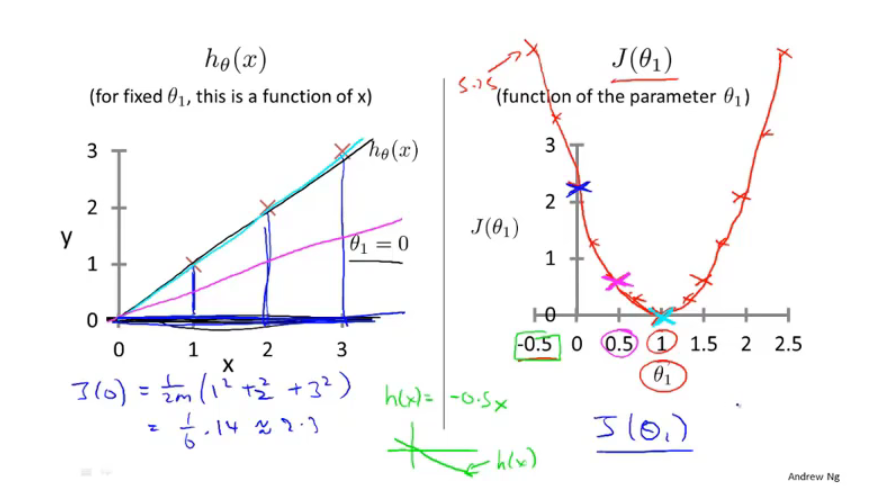
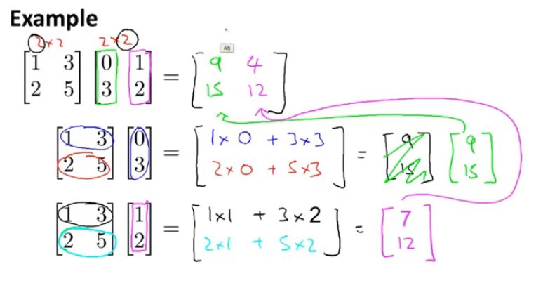
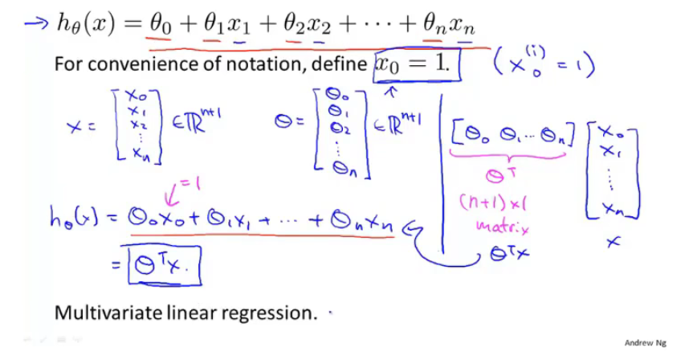

# 吴恩达系列课程

## 1.3监督学习

监督学习：

我们给算法一个数据集，其中包含了正确答案。 算法的目的就是给出更多的正确答案。

## 1.4无监督学习

无监督学习：

聚类算法——不告知任何准去答案，根据所获得到的数据，将这些数据进行自动分类，根据不同特征分成不同种类。然后说明其不同。

## 2.1模型描述

个人理解

模型：线性回归

线性回归：输入提供的数据集，智能计算出一条线性函数，这些数据都向着这条线靠近

单个变量就是单变量线性回归

## 2.2代价函数

代价函数又称平方误差函数

对于大多数回归问题，这都是一个很好的选择。

将预测的值减去实际值然后平方然后累加，然后取平均值，然后除以2

我们需要做的是让这个代价函数的值尽量小，这就能够尽量的使预测值和实际值误差足够小

## 2.3代价函数（一）

我们看下面的图去理解

代价函数是用来做什么：去寻找最优Θ1

为什么我们要使用它：用Θ1得最优hΘ，使得得出的预测值与实际值误差最小。

## 2.4代价函数（二）

更直观的理解代价函数

这一集，我们需要学会看等高线。这图对应的是两个参数，我们看图寻找这两个参数的最优解。（注这可能是局部最优解，而不是全局最优解），在后期会有多个变量，可视化就会很难。

## 2.5梯度下降

不仅用于线性回归上

用梯度下降算法最小化任意函数J

梯度下降：不停的一点点改变Θ_1 等一系列的参数，来使得这个代价函数变小

想办法下山

所以会有局部最优解，但不一定是全局最优解

**下图就是下山公式：**

:=表示赋值（这是一个赋值运算）

α：学习率数字（控制梯度下降时，我们迈出多大步子）大步子也大，小步子也小

α后面的数字以后再来讨论（就是偏导数）

微妙之处：你需要同时更新Θ_1等变量 （就是上面有蓝色字的公式）（要同步更新，不是更新完一个，然后赋值，再更新一个）

不是同步更新的话，会有其他微小的变化。

## 2.6梯度下降知识点总结

这个算法是做什么的：得出最准确的值

梯度下降算法的更新过程有什么意义：寻找最低点（即最优解）

学习率数字太小或太大都会出现一些问题

太小运算太慢，太大，发散偏离正确答案

当到达最低点，偏导数就为0，此时点就不会改变，即找到了该局部的最优解

同时当越到达最底端，或最高段，斜率都会减少，此时根据公式，就可以发现，这个参数走的步数就会越来越小，知道停在局部最优解（导数和学习率共同决定步子的大小）

## 2.7线性回归的梯度下降

将梯度下降运用到代价函数上

不断重复该过程直到收敛

梯度下降如何实现（对于只有一个弓形，只要选取合适的参数，都能够达到最优解）

随着参数的改变，线的斜率，位置都会改变

**Batch梯度下降**

每一步梯度下降，都会遍历所有的数据集

## 3.1矩阵和向量

复习线性代数

注意那些小的i,j表示什么

**矩阵**

**向量**

在这里，大写字母来表示矩阵，小写字母来表示向量

## 3.2加法和标量乘法

**矩阵的加法**

只能有相同纬度的矩阵相加、

**矩阵和标量的乘法运算**

上两种方法的综合运算

## 3.3矩阵向量乘法

线性代数可以看之前在b站的另一个教程，不会就看一下之前自己做的笔记，线性代数的本质

矩阵向量的乘法

计算方式

实例：快速计算四个房屋的价钱，注意它的表示方法，Θ1，Θ2放在了中间这个地方，可以想到，最左边的矩阵的表示方式，第一列为1常数不变，第二列为x变量。左侧为数据矩阵，中间为参数矩阵，右侧为结果。（这样只要一行代码就能够计算）

## 3.4矩阵乘法

**矩阵与矩阵的乘法**

计算方式

实例：使矩阵和矩阵乘法更加简洁的技巧

一次计算多个模型的计算（真的秀）

通过构建两个矩阵，同时运算3个模型，并得到12中基于三个假设对房屋的预测到的价格（矩阵理解见上一节）

## 3.5矩阵乘法特征

详情看自己写的笔记——线性代数的本质

**矩阵没有交换律**

**矩阵有结合律**

**单位矩阵**（注意维度）m x m还是 n x n（看下图的字母，着两个维度是不一样的）（注意矩阵没有交换律）

## 3.6逆和转置

就是矩阵和逆矩阵

矩阵和逆矩阵相乘为单位向量

（只有方阵才有逆矩阵）（计算机有很多类库都能算逆矩阵）

对于机器学习来说，可以吧哪些没有逆矩阵的举证想象成几乎元素都为零的矩阵（没有逆矩阵的矩阵被称为奇异矩阵）

**矩阵的转置运算**

## 4.1多功能

该算法用于多个变量和多个特征向量——**多元线性回归**

下图有4个特征变量（x1,x2,x3,x4），来预测价格y，m表示样本数量，x^(i)_j：第i个样本的第j个特征量

新的假设形式

理解：假设x0为1，特征向量X，为从0开始的n+1维向量，将Θ转置，然后相乘，就能得到h函数

该算法被称为**多元线性回归**

## 4.2多元梯度下降法

**利用梯度下降法解决多元线性回归**

注意把Θ0，Θ1...不要看成单独的个体，而是看成一个整的Θ的多维向量

查看下图，总结其多个特征值的计算，和新规

## 4.3多元梯度下降法演练1—特征缩放

**特征缩放**

例子：两个特征：1.房屋面积，2.卧室个数

如果直接计算，会出现一个比较夸张的椭圆，在这里如果计算，你就会发现，在梯度下降的过程中，运算起来会相对比较困难（走的不是很直，路径相对复杂），这是，我们就需要进行特征缩放，让这个图相对变的比较的圆润（偏移的不是那么严重），此时在做梯度下降，会相对来说比较简单（归一化想法？？不懂，但看样子是要快一点——应用统计学知识，还没学）

**执行特征缩放时的目的**：将特征的取值约束到-1到+1的范围内（对于打的范围，除以一个对应的数）-1，+1不是固定的，差不多就可以，离这个距离不要太远就可以

特征缩放时，有时会进行均值**归一化的工作**：如果你有一个特征x_i,就用x_i-u_i来替换，让你的特征值具有为0的平均值（这个又被叫啥正态分布？？不懂），（我个人理解，就是替换的这个值后，把它列成一个横轴，再来一个条形图，然后就是中间为0，然后慢慢的向两边散开，然后两边出现的概率几乎一样。）（注意是平均，所以如果出现概率不一样，应该中间可能不为0，可能往左边偏，也可能往右边偏）

为什么要这么干？：应为计算两个th的时候，梯度下降用的是同一个pha，若果两个差别太大，就会反复横跳（看到的弹幕，感觉是对的）

如何计算呢，看下图老师写的：u1是训练集中特征x_1的平均值，s1是特征值的范围，最大值减最小值（标准差），特征值x_2也是这么算

特征缩放不需要太精，能够让它运行的更快一些就可以

## 4.4多元梯度下降法2—学习率

调试是什么：

小技巧确保梯度下降正常：

如何选择学习率α：

下图，x轴表示梯度下降算法的迭代次数，y轴是最小的代价函数，曲线显示的是。梯度下降的每一步迭代后，代价函数的值，如果梯度下降正常工作，每一步迭代之后，J(Θ)都应该下降，通过曲线，可以看出梯度下降算法是否已经收敛了。（一般就是看这种曲线，来判断，梯度下降算法有没有收敛）

自动收敛测试：自动判断这个梯度下降算法是否收敛

看图，还可以提前警告你算法有没有正常工作

J(Θ)在逐渐向上，说明没有正常工作，需要将学习率调低

科学家以证明：只要学习率足够小，那么每次迭代之后代价函数J(Θ)都会下降

注意，学习率很低的话，梯度下降算法会收敛的很慢，太高可能不会每次迭代都下降，甚至可能不收敛，也可能出现收敛缓慢，对此，通常画出J(Θ)随迭代部署变化的曲线，来弄清发生了什么

## 4.5特征和多项式回归

告诉你一些可供选择的特征

如何得到不同的学习算法

多项式回归—利用线性回归的方式来拟合非常复杂的函数，甚至是非线性函数

例子：房价  两个特征，1.临街的宽度 2.垂直宽度

有时候不直接使用该特征，有时通过定义新的特征，可能会得到一个更好的模型

**多项式回归**

如何将模型与数据进行拟合？使用多元线性回归方法，拟合这条绿的线（三次方），修改这个特征值，就看下面，将size，平方还有三次方。通过将这三个特征这样设置，然后在应用线性回归的方法，就能够拟合这个模型，最终将三次函数拟合到数据上。这时候，特征缩放就变的更重要了，（个人觉得应为三个特征范围变的很大）

对应这个模型，除了建立三次模型外，也许有其他可选的特征，可能会得到更好的模型，看下图

**希望我们知道，我们可以自由选择使用什么特征，并通过设计不同的特征，能够用更复杂的函数拟合数据，而不只用一条直线去拟合，特别是你也可以使用多项式函数，有时如果从合适的角度来寻找特征值，你就能得到一个更符合你的数据的模型**

## 4.6正规方程（区别于迭代方法的直接解法）

对于某些线性回归问题，给我们更好的方法，求得参数Θ的最优值

梯度下降法，是迭代算出，正规方程式一次性算出（有优点，也有缺点）

直观理解：对J求导，并将导数置0，逐个求导数，逐个置0，就能得数Θ，（个人理解，不知道对不对，可以想一下那个三维图，里面包含了两个特征量，我们使用梯度下降到最后的结果，也就是箭头，变为平的。此时它的偏导数也就是为0，至于逐个求导，是应为只有多个特征量，最底端，应该是箭头都为平的）

看下图的解：X：是mx(n+1)大小的矩阵，y为m维向量，m为训练样本数量，n为特征变量数，然后最下面的Θ的公式就是得出最小化得Θ。Θ=X转置乘以X的逆乘以X的转置乘以y

下图是对上图的解释

继续解释（对代码的解释。pivn是求逆矩阵），如果使用正规方程法，就不需要特征缩放，这是没有问题的

对于这个矩阵求Θ的方法，没能够理解这个算式本质的含义，希望能在下面的视频中看到老师详细的解释。

何时使用梯度下降算法或正规方程法和优缺点

梯度下降法的缺点：

- 需要找学习率α，多些经历寻找运行效果最好的那个，这是额外的工作和麻烦
- 需要更多次迭代，计算会更慢

正规方程优点：

- 不需要选择学习速率α，所以方便，运行快
- 不需要迭代，不需要画J(Θ)图来看收敛性

梯度下降的优点：

- 在特征变量多的时候，也能够运行的很好，即便有上百万个也很好，通常也很有效

正规方程的缺点：

- X转置乘以X矩阵，是n*n的矩阵，n是特征变量的数量，对于大多数计算应用来说，实现逆矩阵的代价是以矩阵维度的三次方增长，如果特征变量过多，就会很慢（n过万就可能开始考虑用梯度下降法了）

## 4.7矩阵方程在矩阵不可逆情况下的解决方法

在Octave中，有方法保证它是可逆的，如果不可逆，就会算出伪逆

对于一些可能出现不可逆的情况（删除多的不必要的特征，还有其他）（没有理解其本质，先记着他的表面吧）

## 4.8导师的编程小技巧

开始使用Octave编程

## 5.1基本操作

老师讲了一些关于Octave的基本操作

## 5.2移动数据

老师讲了如何使用Octave来进行移动数据操作

## 5.3计算数据

老师讲了如何使用Octave来将这些数据进行计算

## 5.4数据绘制

老师讲了如何使用Octave来将这些数据进行绘制

## 5.5控制语句：for,while,if语句

老师讲了如何使用Octave来学习这些控制语句

## 5.6矢量

老师讲了如何使用写好的类库

## 6.1分类

预测的变量y是一个离散值情况下的分类

logistic回归算法

垃圾邮件分类

网上交易是否欺诈

是否患有癌症

**如何开发一个分类算法**

使用线性回归会出现一些问题，看下图，粉色的线是运气比较好的时候，没有一些特殊的数据集。此时我们定义阈值0.5这时候正好能分割Negative class 和positive class。 但是看蓝线，当出现了一些或一个特殊的数据集，他就会偏移，此时在定义阈值为0.5时，他的判断就不够标准，无法准确的判定negative class 和positive class

**对分类问题使用线性回归会出现什么问题？**

即便我们知道标准输出值为0或1但是，使用线性回归的输出值，会远大于1或远小于0。新算法会介于0~1之间

## 6.2假设陈述

**logistic回归（这不是线性回归算法，是分类算法）**

当出现分类问题，我们要使用哪个方程，来表示我们的假设

Sigmoid function 和 Logistic function几乎是同义词（可以互换）

看下图，我们如何将h(Θ)圈在（0,1），我们定义函数g如下，对应g的图像，也在下图表示。函数g就被称之为Sigmoid function 或称为Logistic function。然后我们将两个函数结合起来。（另一个函数h(Θ)的原型，就是之前讲的函数）

**对上图模型的解释**（涉及概率论的知识）

我们假设h(Θ)的输出。我们有一个特征向量x，我们还是像往常一样假设x0为1，x1为肿瘤的大小。我们将特征向量喂入假设中，并假设输出值为0.7。对于这个假设就说明了，对于一个特征为x的患者，y=1的概率是0.7。（这是个肿瘤）下面还有更加准确的书写方式，在给定x1的条件下，y=1的概率为Θ，应为这是一个分类任务，只有0和1，所以两个概率加起来要为1

## 6.3决策界限

决策边界概念——更好理解logistic回归函数，假设函数在计算什么

下图当概率大于0.5时，就预测y=1，反之y=0。由图和算法可知，当z>0时，概率就大于0.5，反之概率就小于0.5.那么由此可知，我们只需要确保xΘ^T>=0，那么y=1，当<=0，y=0。通过这个我们就能更好的理解logistic回归的假设函数。

下图是一个实际的例子：我们由上面的推导，那么要想y=1只需要确定Θ0+Θ1x1+Θ2x2>=0就可以。我们继续假设，我们知道了Θ0，Θ1，Θ2的值，分别为-3,1,1。（下面的图表，应该是根据这个假设画的一个数据集，使之可视化）。由此我们就可以确定x1+x2>=3，那么对应的这条线就是决策边界。（注意这里的属性是我们假设的，而不是数据集的属性），当我们有了确定的参数取值，我们将完全确定决策边界，这时我们没有必要通过绘制训练集来确定决策边界。

下图再看一个更复杂的例子：这种数据，如何拟合才能使用logistic回归（添加额外高阶多项式，和以前讲过的例子一样）（下节课指导如何自动选择参数Θ0~Θ4），假设已经使用了该方法，值为-1，0,0,1,1。要使y=1则看下图的式子。就是一半径为1的圆心，这就是决策边界。通过在特征中增加一些复杂的多项式我们可以得到更复杂的决策边界，而不只是用直线分开正负样本，（再次说明，决策边界不是训练集的属性，而是假设本身及其参数的属性），只要给定了参数，就能够得出决定边界（我们用训练集来拟合参数Θ），此外还会有更加复杂的例子

## 6.4代价函数

目标：如何拟合logistic回归模型的参数θ，具体来说，要定义用来拟合参数的优化目标或者叫代价函数

下图去定了我们要用的东西

看下图，我们首先写出我们之前用于计算线性回归的J(θ)，我们将其中后面的部分华为cost函数（详细式子的简写）。h(x)是我们预测的值，y是实际的值。如果我们就以这种方法带入，我们就极有可能会出现左边这张图表。（注，x轴为θ，y轴为J(θ) ）这是一个非凸函数。他会有很多局部最优解，这时候我们使用梯度下降算法，就极有可能获得局部最优解，而不是全局最优解。*（为什么会出现这种非凸函数，我个人理解：是应为，我们这里的算式是离散的。y值不是1，就是0。那么我们仔细想一下实际情况下的数据。h(x)-y就会出现大幅度的忽高忽低。就会导致这种情况）*，所以我们需要找一个不同的代价函数，来完成右侧的凸函数，更好的使用梯度下降。找到最小值

我们定义这个算法要付出的代价或者惩罚。我们看下图，我们重新定义了一个新的代价函数。首先我们要知道，这个Cost的值越大，就说明，这个算式越不准。所以我们要尽量使这个值越小，趋近于0。然后我们先看y=1的情况，假设我们预测肿瘤的概率为0.7，它确实是一个肿瘤。那么我们就能在途中找它对应的点，这个点y值不算大。但假设我们预测这个为肿瘤的概率为0，但是它却的确是一个肿瘤。此时。它的y值为无限大。

我们再来看看y=0时，它的意思。其实和上面也是差不多的意思。根据我们的预测，来判定。如果我们以大概率预测对了，我们的代价就小。如果我们以大概率预测错了，我们需要付出的代价就大。都是这样。那么通过这样的一个式子，我们在带入J(θ)，我们就能够获得一个凸函数，就能够使用梯度下降。

## 6.5简化代价函数与梯度下降

目标：知道如何实现一个完整的logistic回归算法

下图我们尝试用一个式子，表示这个条件函数，式子看下图

下图为我们新的代价函数（-号提前了），为什么选择这个式子：这个式子是从统计学中的极大似然法得来的

下图还告诉我们如何自动匹配这个新的参数

下图就是我们使用梯度下降算法，自动选择的新的参数θ，我们可以使用微积分的知识，来算一算这个式子的偏导数

如果有多个参数，就使用下图的这个方法，来同时更新θ。当我们运算这个偏导数，我们也会奇迹的发现，这个式子就是我们用来做线性回归梯度下降的。

那么这个线性回归会和logistic回归是同一个算法码？我们看下图对h(x)的定义，就可以知道，不是同一个算法

## 6.6高级优化

目的：学习高级优化算法和一些高级优化的概念，大大提高梯度下降算法的速度。解决大型的机器学习问题，比如有数目庞大的特征

我们编写算法，输入θ，获得J(西塔)和新的这些参数。梯度下降算法再反复执行这些更新。从而来更新这些参数

下图有比梯度下降算法跟好的算法，但是也更复杂。（超出教学范畴）我们来了解一下这些更好的算法的特性：1.使用下面的三种算法，我们可以不自己手动选择学习率α。（当然远远不止自动选择学习率α，它更复杂，让梯度下降算法运算更快）。缺点：比梯度下降算法复杂的多 （当个调包侠吧，拿着大佬的东西直接用就好了）

如何使用这些算法（加强版的梯度下降算法），举例 jVal ：代价函数J(θ)，(theta(1)-5)^2：计算这个代价函数，gradient：下图是一个2X1的向量，gradient（）：对应下图的两个偏导数 ，fminumc：无约束最小化函数（高级优化算法）  options：存储options的数据结构    GradObj on ：设置梯度目标参数为打开  MaxIter 100： 设置最大迭代次数  比方说100    initialThera：给出一个θ的猜测初始值，是2X1的向量  @costFunction 指向刚刚定义的代价函数的指针

这里θ必须是d维的，就是要大于等于2

## 6.7多元分类：一对多

目的：如何使用逻辑回归，解决多类别分类问题

看下图的例子，包含了有多个结果，不单单只有0, 1

下图多个分类的数据集的可视化样式 ，左边可以用一条直线来分类是正的，还是负的。同样的我们利用一对多的思想，也能够将其运用在多类别分类问题上。

例子：下图就是将左边的图，转化为三个独立的二元分类问题，将类型1定为正类，将其他类型定为负类。拟合第一个逻辑分类器h1(x)，1表示以三角形类别当做正类别，第二个分类器，第三个分类器也是这样做。最后给出每个分类器y=i的概率

总结一下：我们训练了一个逻辑回归分类器，hθ(x),预测i类别y=i的概率，最后为了作出预测，我们给出一个新的输入值x，期望获得预测。我们要做的就是比如三个分类器运行输入x，然后选择h最大的类别。也就是要选择分类器，选择出三个中，可信度最高，效果最好的那个分类器 ，无论i值有多好，我们预测的y值就是那个值。

## 7.1过拟合问题

目的：解释什么是过度拟合问题

下图例子：y轴为价格，x轴为面积

右图这个问题称为“欠拟合”，这个算法具有高偏差，没有很好地拟合数据（如果拟合一条直线，就好像算法有一个很强的偏见，或者说有非常大的偏差。认为这个房子价格与面积线性相关，而不顾及数据的不符，先入为主的拟合成一条直线）。

图二就是一个二次函数，拟合得很好，刚好适合

另一个极端情况，我们拟合一个四阶多项式，通过全部五个训练样本，似乎很好地拟合了5个数据，但是波动很大。我们就称之为过度拟合（另一种说法，这个算法具有高方差）

过度拟合会在变量过多的情况下出现，这时训练出的假设能很好地拟合训练集，所以你的代价函数实际上可能非常接近于0。但是他千方百计得拟合训练集，导致它无法泛化到新的样本，无法预测新样本的价格

下图左图就是欠拟合，中间的就是刚刚好，右边的就是过度拟合（辛苦右边这个算法了）

过拟合问题发生时，我们如何解决：

当我们使用一维或二维数据时，我们可以通过绘出假设模型的图像来研究问题的所在，在选择合适的多项式阶数。（但有时候这种方法不一定管用，有时我们往往有许多需要的特征变量，绘图更困难，通过数据可视化来决定保留哪些特征变量也更难）

如何解决呢？

两个办法

1.尽量减少选取变量的数量，具体而言人工检查变量清单，并以此决定，那些变量重要，哪些特征变量更重要，然后选择性的舍去（后面会讲模型选择算法，让电脑自动选择）（比较有效）（缺点：舍弃了一部分特征变量，你也舍弃了关于问题的一些信息）

2.正则化，我们将保留所有的特征变量，但是减少量级，或参数θ_j的大小。（这个方法非常有效）

## 7.2代价函数

目的：正则化是怎样运行的？进行正则化的时候，我们还将写出相应的代价函数

方法，在一些不重要的特征变量上，我们设计一种惩罚机制，来让这些不重要的特征变量，影响尽量减小。小到就像下面，不影响二次函数的大体走势。

背后思想：如果我们的参数值较小，参数值小意味着一个更简单的假设模型 ，就像上面的，让θ3，θ4趋向于0，我们就会得到一个更简单的假设模型，就想当于一个二次函数。——加上惩罚机制，尽量去简化这个模型

那么在大量的参数中，我们如何寻找到哪些相关度不那么高的参数呢？去减小它的值（假设有100个参数，1000各参数）

所以在正则化中，我们要对代价函数进行修改，来缩小所有的参数， 在后面添加一个新的项。（就是添加的粉色的字），添加一个额外的正则化项，来缩小每个参数的值，（这个项的作用是缩小每一个参数，从θ1到θ100） ，注意啊没有给θ0，这是约定俗成的。

最右边的就是正则化参数，λ 是控制两个不同目标之间的取舍 。

第一个目标，与目标函数的第一项有关，就是我们像更好的拟合数据，训练集。

第二个目标，保持参数尽量的小 ，与目标函数第二项有关，与正则化目标有关，与正则化项有关。

λ是正则化参数，控制两目标之间的平衡，即更好的去拟合训练集的目标和将参数控制得更小的目标，从而保持假设模型的想对简单，避免出现过拟合的情况。

为什么要平衡？如果正则化参数过大（即惩罚力度过大），那么第一个目标对应惩罚的这个参数θ_j，都会接近于0（就相当于把假设函数的全部项都忽略掉了，最后模型只剩下θ_1,那也就是一条直线了，欠拟合），说明这个假设模型的偏见性太强了。

所以我们需要去选择一个更合适的正则化参数λ

## 7.3线性回归的正则化

目的：在课程刚开始学的线性回归上使用正则化

也就是下图的这个式子

下图中间的原始黑子式子，就是我们一开始使用梯度下降算法更新参数的式子。

对于正则化线性回归，我们惩罚的对象是参数θ_1~θ_n，θ0除外（区别处理）

对于如何修改，就看下图中间的式子，我们加入粉色字的式子。这样做的话就可以对正则化代价函数J(θ),用梯度下降法进行最小化。

（用微积分证明）我们可以发现，方括号里的这一项正好是J(θ)的偏导数，（注意这里的J(θ)是包含正则化函数）

青色方框的也是偏导数，他是J(θ)对θ0的偏导数

仔细查看就会发现更有趣的东西：具体的θ_j的更新值就是用θ_j减去α乘以这个项，把这些包含θ_j的项汇总起来，那我们可以把这个更新值，等价地写成如下的形式

1-α*(λ/m)是一个很有趣的项：它的值只会比1略小一点的数。通常学习率α很小，m很大。这样θj就会减小的一点点（说正式一点θ_j的平方范数变小了）至于后面的式子，和梯度下降更新一样

我们要做的就是迭代，每次都把参数缩小一点，然后和之前一样的更新操作。 

看到了弹幕**（更新方法不变，但又极大的限制了高阶项）**

