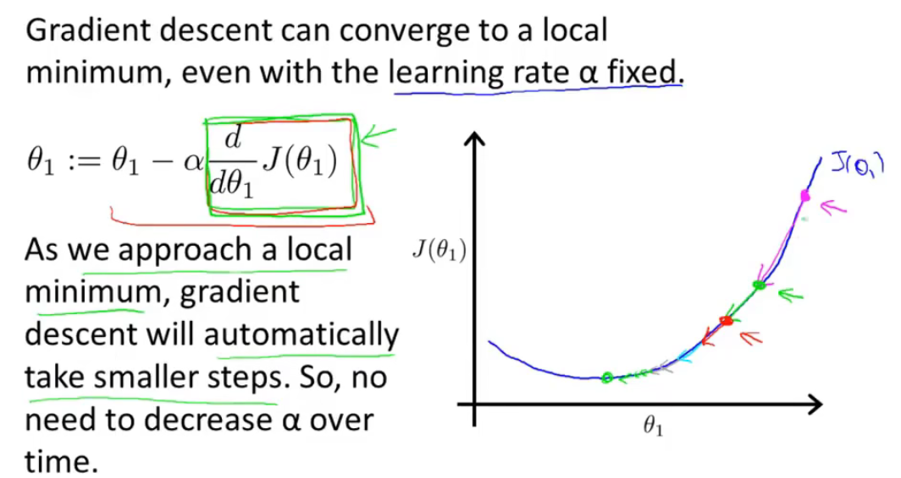
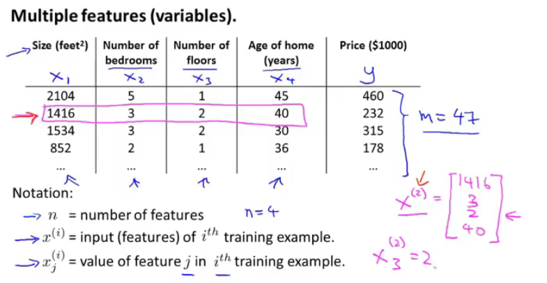
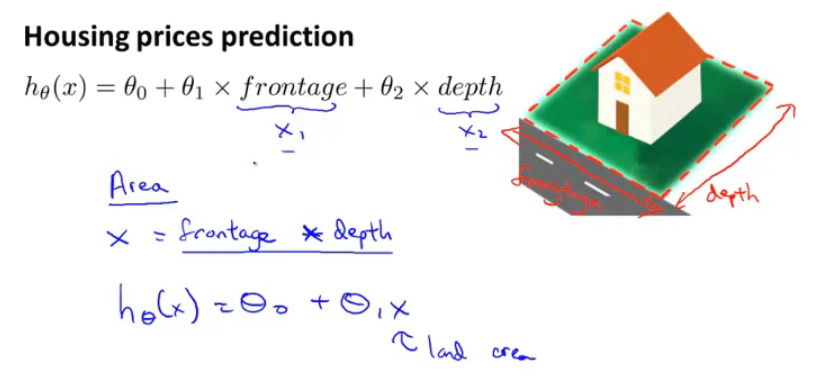

# 吴恩达系列课程

## 1.3监督学习

监督学习：

我们给算法一个数据集，其中包含了正确答案。 算法的目的就是给出更多的正确答案。

## 1.4无监督学习

无监督学习：

聚类算法——不告知任何准去答案，根据所获得到的数据，将这些数据进行自动分类，根据不同特征分成不同种类。然后说明其不同。

## 2.1模型描述

个人理解

模型：线性回归

线性回归：输入提供的数据集，智能计算出一条线性函数，这些数据都向着这条线靠近

单个变量就是单变量线性回归

## 2.2代价函数

代价函数又称平方误差函数

对于大多数回归问题，这都是一个很好的选择。

将预测的值减去实际值然后平方然后累加，然后取平均值，然后除以2

我们需要做的是让这个代价函数的值尽量小，这就能够尽量的使预测值和实际值误差足够小

## 2.3代价函数（一）

我们看下面的图去理解

代价函数是用来做什么：去寻找最优Θ1

为什么我们要使用它：用Θ1得最优hΘ，使得得出的预测值与实际值误差最小。

## 2.4代价函数（二）

更直观的理解代价函数

这一集，我们需要学会看等高线。这图对应的是两个参数，我们看图寻找这两个参数的最优解。（注这可能是局部最优解，而不是全局最优解），在后期会有多个变量，可视化就会很难。

## 2.5梯度下降

不仅用于线性回归上

用梯度下降算法最小化任意函数J

梯度下降：不停的一点点改变Θ_1 等一系列的参数，来使得这个代价函数变小

想办法下山

所以会有局部最优解，但不一定是全局最优解

**下图就是下山公式：**

:=表示赋值（这是一个赋值运算）

α：学习率数字（控制梯度下降时，我们迈出多大步子）大步子也大，小步子也小

α后面的数字以后再来讨论（就是偏导数）

微妙之处：你需要同时更新Θ_1等变量 （就是上面有蓝色字的公式）（要同步更新，不是更新完一个，然后赋值，再更新一个）

不是同步更新的话，会有其他微小的变化。

## 2.6梯度下降知识点总结

这个算法是做什么的：得出最准确的值

梯度下降算法的更新过程有什么意义：寻找最低点（即最优解）

学习率数字太小或太大都会出现一些问题

太小运算太慢，太大，发散偏离正确答案

当到达最低点，偏导数就为0，此时点就不会改变，即找到了该局部的最优解

同时当越到达最底端，或最高段，斜率都会减少，此时根据公式，就可以发现，这个参数走的步数就会越来越小，知道停在局部最优解（导数和学习率共同决定步子的大小）

## 2.7线性回归的梯度下降

将梯度下降运用到代价函数上

不断重复该过程直到收敛

梯度下降如何实现（对于只有一个弓形，只要选取合适的参数，都能够达到最优解）

随着参数的改变，线的斜率，位置都会改变

**Batch梯度下降**

每一步梯度下降，都会遍历所有的数据集

## 3.1矩阵和向量

复习线性代数

注意那些小的i,j表示什么

**矩阵**

**向量**

在这里，大写字母来表示矩阵，小写字母来表示向量

## 3.2加法和标量乘法

**矩阵的加法**

只能有相同纬度的矩阵相加、

**矩阵和标量的乘法运算**

上两种方法的综合运算

## 3.3矩阵向量乘法

线性代数可以看之前在b站的另一个教程，不会就看一下之前自己做的笔记，线性代数的本质

矩阵向量的乘法

计算方式

实例：快速计算四个房屋的价钱，注意它的表示方法，Θ1，Θ2放在了中间这个地方，可以想到，最左边的矩阵的表示方式，第一列为1常数不变，第二列为x变量。左侧为数据矩阵，中间为参数矩阵，右侧为结果。（这样只要一行代码就能够计算）

## 3.4矩阵乘法

**矩阵与矩阵的乘法**

计算方式

实例：使矩阵和矩阵乘法更加简洁的技巧

一次计算多个模型的计算（真的秀）

通过构建两个矩阵，同时运算3个模型，并得到12中基于三个假设对房屋的预测到的价格（矩阵理解见上一节）

## 3.5矩阵乘法特征

详情看自己写的笔记——线性代数的本质

**矩阵没有交换律**

**矩阵有结合律**

**单位矩阵**（注意维度）m x m还是 n x n（看下图的字母，着两个维度是不一样的）（注意矩阵没有交换律）

## 3.6逆和转置

就是矩阵和逆矩阵

矩阵和逆矩阵相乘为单位向量

（只有方阵才有逆矩阵）（计算机有很多类库都能算逆矩阵）

对于机器学习来说，可以吧哪些没有逆矩阵的举证想象成几乎元素都为零的矩阵（没有逆矩阵的矩阵被称为奇异矩阵）

**矩阵的转置运算**

## 4.1多功能

该算法用于多个变量和多个特征向量——**多元线性回归**

下图有4个特征变量（x1,x2,x3,x4），来预测价格y，m表示样本数量，x^(i)_j：第i个样本的第j个特征量

新的假设形式

理解：假设x0为1，特征向量X，为从0开始的n+1维向量，将Θ转置，然后相乘，就能得到h函数

该算法被称为**多元线性回归**

## 4.2多元梯度下降法

**利用梯度下降法解决多元线性回归**

注意把Θ0，Θ1...不要看成单独的个体，而是看成一个整的Θ的多维向量

查看下图，总结其多个特征值的计算，和新规

## 4.3多元梯度下降法演练1—特征缩放

**特征缩放**

例子：两个特征：1.房屋面积，2.卧室个数

如果直接计算，会出现一个比较夸张的椭圆，在这里如果计算，你就会发现，在梯度下降的过程中，运算起来会相对比较困难（走的不是很直，路径相对复杂），这是，我们就需要进行特征缩放，让这个图相对变的比较的圆润（偏移的不是那么严重），此时在做梯度下降，会相对来说比较简单（归一化想法？？不懂，但看样子是要快一点——应用统计学知识，还没学）

**执行特征缩放时的目的**：将特征的取值约束到-1到+1的范围内（对于打的范围，除以一个对应的数）-1，+1不是固定的，差不多就可以，离这个距离不要太远就可以

特征缩放时，有时会进行均值**归一化的工作**：如果你有一个特征x_i,就用x_i-u_i来替换，让你的特征值具有为0的平均值（这个又被叫啥正态分布？？不懂），（我个人理解，就是替换的这个值后，把它列成一个横轴，再来一个条形图，然后就是中间为0，然后慢慢的向两边散开，然后两边出现的概率几乎一样。）（注意是平均，所以如果出现概率不一样，应该中间可能不为0，可能往左边偏，也可能往右边偏）

为什么要这么干？：应为计算两个th的时候，梯度下降用的是同一个pha，若果两个差别太大，就会反复横跳（看到的弹幕，感觉是对的）

如何计算呢，看下图老师写的：u1是训练集中特征x_1的平均值，s1是特征值的范围，最大值减最小值（标准差），特征值x_2也是这么算

特征缩放不需要太精，能够让它运行的更快一些就可以

## 4.4多元梯度下降法2—学习率

调试是什么：

小技巧确保梯度下降正常：

如何选择学习率α：

下图，x轴表示梯度下降算法的迭代次数，y轴是最小的代价函数，曲线显示的是。梯度下降的每一步迭代后，代价函数的值，如果梯度下降正常工作，每一步迭代之后，J(Θ)都应该下降，通过曲线，可以看出梯度下降算法是否已经收敛了。（一般就是看这种曲线，来判断，梯度下降算法有没有收敛）

自动收敛测试：自动判断这个梯度下降算法是否收敛

看图，还可以提前警告你算法有没有正常工作

J(Θ)在逐渐向上，说明没有正常工作，需要将学习率调低

科学家以证明：只要学习率足够小，那么每次迭代之后代价函数J(Θ)都会下降

注意，学习率很低的话，梯度下降算法会收敛的很慢，太高可能不会每次迭代都下降，甚至可能不收敛，也可能出现收敛缓慢，对此，通常画出J(Θ)随迭代部署变化的曲线，来弄清发生了什么

## 4.5特征和多项式回归

告诉你一些可供选择的特征

如何得到不同的学习算法

多项式回归—利用线性回归的方式来拟合非常复杂的函数，甚至是非线性函数

例子：房价  两个特征，1.临街的宽度 2.垂直宽度

有时候不直接使用该特征，有时通过定义新的特征，可能会得到一个更好的模型

**多项式回归**

如何将模型与数据进行拟合？使用多元线性回归方法，拟合这条绿的线（三次方），修改这个特征值，就看下面，将size，平方还有三次方。通过将这三个特征这样设置，然后在应用线性回归的方法，就能够拟合这个模型，最终将三次函数拟合到数据上。这时候，特征缩放就变的更重要了，（个人觉得应为三个特征范围变的很大）

对应这个模型，除了建立三次模型外，也许有其他可选的特征，可能会得到更好的模型，看下图

**希望我们知道，我们可以自由选择使用什么特征，并通过设计不同的特征，能够用更复杂的函数拟合数据，而不只用一条直线去拟合，特别是你也可以使用多项式函数，有时如果从合适的角度来寻找特征值，你就能得到一个更符合你的数据的模型**

## 4.6正规方程（区别于迭代方法的直接解法）

对于某些线性回归问题，给我们更好的方法，求得参数Θ的最优值

梯度下降法，是迭代算出，正规方程式一次性算出（有优点，也有缺点）

直观理解：对J求导，并将导数置0，逐个求导数，逐个置0，就能得数Θ，（个人理解，不知道对不对，可以想一下那个三维图，里面包含了两个特征量，我们使用梯度下降到最后的结果，也就是箭头，变为平的。此时它的偏导数也就是为0，至于逐个求导，是应为只有多个特征量，最底端，应该是箭头都为平的）

看下图的解：X：是mx(n+1)大小的矩阵，y为m维向量，m为训练样本数量，n为特征变量数，然后最下面的Θ的公式就是得出最小化得Θ。Θ=X转置乘以X的逆乘以X的转置乘以y

下图是对上图的解释

继续解释（对代码的解释。pivn是求逆矩阵），如果使用正规方程法，就不需要特征缩放，这是没有问题的

对于这个矩阵求Θ的方法，没能够理解这个算式本质的含义，希望能在下面的视频中看到老师详细的解释。

何时使用梯度下降算法或正规方程法和优缺点

梯度下降法的缺点：

- 需要找学习率α，多些经历寻找运行效果最好的那个，这是额外的工作和麻烦
- 需要更多次迭代，计算会更慢

正规方程优点：

- 不需要选择学习速率α，所以方便，运行快
- 不需要迭代，不需要画J(Θ)图来看收敛性

梯度下降的优点：

- 在特征变量多的时候，也能够运行的很好，即便有上百万个也很好，通常也很有效

正规方程的缺点：

- X转置乘以X矩阵，是n*n的矩阵，n是特征变量的数量，对于大多数计算应用来说，实现逆矩阵的代价是以矩阵维度的三次方增长，如果特征变量过多，就会很慢（n过万就可能开始考虑用梯度下降法了）

## 4.7矩阵方程在矩阵不可逆情况下的解决方法

在Octave中，有方法保证它是可逆的，如果不可逆，就会算出伪逆

对于一些可能出现不可逆的情况（删除多的不必要的特征，还有其他）（没有理解其本质，先记着他的表面吧）

## 4.8导师的编程小技巧

开始使用Octave编程

## 5.1基本操作

老师讲了一些关于Octave的基本操作

## 5.2移动数据

老师讲了如何使用Octave来进行移动数据操作

## 5.3计算数据

老师讲了如何使用Octave来将这些数据进行计算

## 5.4数据绘制

老师讲了如何使用Octave来将这些数据进行绘制

## 5.5控制语句：for,while,if语句

老师讲了如何使用Octave来学习这些控制语句

## 5.6矢量

老师讲了如何使用写好的类库

## 6.1分类

