# 第2章 模型评估与选择

## 2.1 经验误差与过拟合

**训练误差（training error）/或经验误差（empirical error）**

学习器在训练集上的误差

**泛化误差（generalization error）**

在新样本上的误差

**过拟合（overfitting）**

学习器学的太好，把训练样本自身的一些特点当做了所有潜在样本都会具有的一般性质，导致泛化性能下降

**欠拟合（underfitting）**

指对训练样本的一般性质尚未学好

**模型选择（model selection）**

当使用不同的参数配置，也会产生不同的模型，我们应该选择哪一个学习算法、使用哪一种参数配置？这就是机器学习中的“模型选择”问题。

## 2.2 评估方法

**测试集（testing set）**

用于测试学习器对新样本的判别能力。

**测试误差（testing error）**

作为泛化误差的近似

既要训练又要测试，有什么方法呢？

### 2.2.1 留出法

**留出法（hold-out）**

直接将数据集D划分为两个互斥的集合，其中一个集合作为训练集S,另一个作为测试集T。在S上训练出模型后，用T来评估其测试误差，作为对泛化误差的估计。

**注意：**

训练/测试集的划分要尽可能保持数据分布一致性，避免因数据划分过程引入额外的偏差而对最终结果产生影响。

**从采样（sampling）的角度来看待数据集的划分过程**

保留类别比例的采样方式通常称为“分层采样”（stratified sampling）

不同的划分将导致不同的训练/测试集

**保真性（fidelity）**

**常见做法**

将大约2/3~4/5的样本用于训练，剩余的样本用于测试

### 2.2.2 交叉验证法

交叉验证法（cross validation）先将数据集D划分为k个大小相似的互斥子集，每个子集D_i都尽可能保持数据分布的一致性，即从D中通过分层采样得到。然后，每次用k-1个子集的并集作为训练集，余下的那个子集作为测试集；这样就可获得k组训练/测试集，从而可进行k次训练和测试，最终返回的是这个k个测试结果的均值。

通常把交叉验证法称为“k折交叉验证”（k-fold cross validation）

k最常用的取值是10，此时称为10折交叉验证

k折交叉验证通常要随机使用不同的划分重复p次

**留一法（Leave-One-Out——LOO）**

交叉验证的特例，与初始数据集相比只少了一个样本。留一法的评估结往往被认为比较准确。

**缺陷：**

在数据集较大时，训练m个模型的计算开销可能是难以忍受的。

### 2.2.3 自助法

**自助法（bootstrapping）**

减少训练样本规模不同造成的影响，同时还能比较高效地进行实验估计

直接以自助采样法（bootstrap sampling）为基础，给定包含m个样本的数据集D，我们对它进行采样产生数据集D’，每次随机从D总挑选一个样本的数据集D‘，然后再将该样本放回初始数据集D中，使得该样本在下次采样时仍有可能被采到，这个过程重复执行m次后，我们就得到了包含m个样本的数据集D’，这就是自助采样的结果。

**包外估计（out-of-bag estimate）**

**优点：**

自助法在数据集较小，难以有效划分训练/训练测试集时很有用处。

**缺点：**

自助法产生的数据集改变了初始数据集的分布，这会引入估计偏差

### 2.2.4 调参与最终模型

大多数学习算法都有写参数（parameter）需要设定，参数配置不同，学习模型的性能往往有显著的差别。除了要对使用学习算法进行选择，还需要对算法那参数进行设定，这就是通常所说的“参数调节”或简称“调参”（parameter tuning）。

**另外注意：**
我们通常把学得模型在实际使用中遇到的数据称为测试数据，为了加以区分，模型评估与选择中用于评估测试的数据集常称为“验证集”（validation set）

## 2.3 性能度量

**性能度量（performance measure）**

衡量模型泛化能力的评价标准

**均方误差（mean squared error）**

回归任务最常用的性能度量

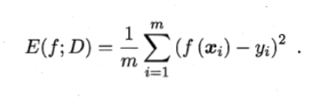

更一般的，对数据分布D个概率密度函数p(·)，均方误差的描述

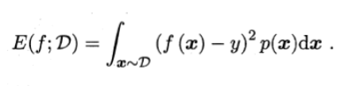

### 2.3.1 错误率与精度

**错误率**

分类错误的样本数占样本总数的比例

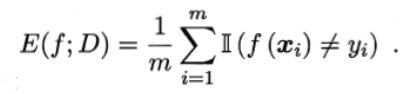

更一般的，对数据分布D个概率密度函数p(·)，的错误率

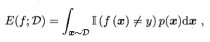

**精度**

分类正确的样本数占样本总数的比例

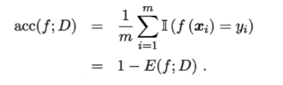

更一般的，对数据分布D个概率密度函数p(·)，的精度

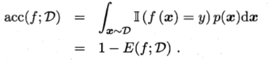

### 2.3.2查准率、查全率与F1

查准率（precision）与查全率（recall）用于满足更加细致的需求，也是一种性能度量

**TP**：真正例（true positive）

**FP**：假正例（false positive）

**TN**：真反例（true negative）

**FN**：假反例（false negative）

TP+FP+TN+FN = 样例总数

| 真实情况 | 预测结果     | 预测结果     |
| -------- | ------------ | ------------ |
| 真实情况 | 正例         | 反例         |
| 正例     | TP（真正例） | FN（假反例） |
| 反例     | FP（假正例） | TN（真反例） |

查准率P和查全率R分别定义为

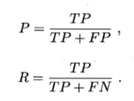

查准率和查全率是一对矛盾的度量

**P-R图**可以直观地显示出学习器在样本总体上的查全率、查准率

若一个学习器的P-R曲线被另一个学习器的曲线完全“**包住**”，则可断言后者的性能优于前者

如果发生了交叉，但是我们还是想要比较高下，这时一个比较合理的判断是比较P-R曲线下**面积的大小**

**平衡点（Break-Even Point——BEP）**

它是查**准率 = 查全率**时的取值

**F1度量（是BEP的优化）**

基于查准率与查全率的调和平均（harmonic mean）

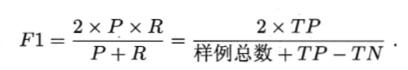

**F_β（F1度量的一般形式）**

用于对查准率与查全率不同的需求

能够让我们表达出队查准率/查全率的不同偏好

**再多个混淆矩阵上综合考察查准率和查全率**

先计算查准率和查全率，然后再计算平均值

宏查准率（macro-P）

宏查全率（macro-R）

宏F1（macro-F1）

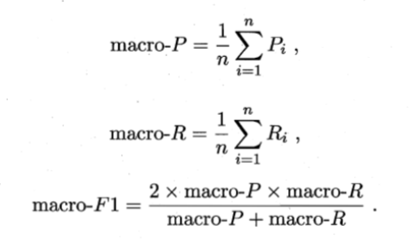

**先对混淆矩阵（误差矩阵）进行平均，得到TP、FP、TN、FN的平均值，在计算出查准率，查全率**

微查准率（micro-P）

微查全率（micro-R）

微F1（micro-F1）

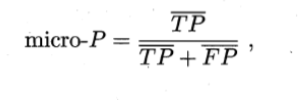

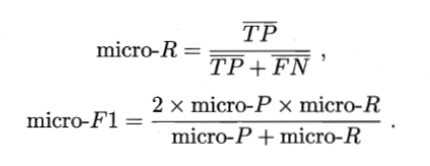

### 2.3.3 ROC与AUC

很多学习器是为测试样本产生一个实值或概率预测，然后将这个预测值与一个分类阈值（threshold）进行比较，若大于阈值则分为正类，否则为反类。

重视“查准率”，选择排序中靠前的位置进行截断

重视“查全率”，选择排序中靠后的位置进行截断

为了综合考虑学习器在不同任务下的“泛化性能”的好坏，或者说“一般情况下”泛化性能的好坏。ROC曲线则思从这个角度出发来研究学习器泛化性能的有力工具

**ROC——受试者工作特征（Receiver Operation Characterristic）曲线**

与P-R曲线使用查准率。查全率为纵、横轴不同，ROC曲线的纵轴是**“真正例率**”（True Positive Rate,简称TPR），横轴是“**假正例率**”（False Positive Rate，简称FPR）

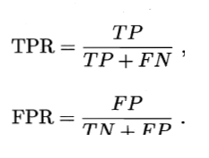

**AUC（Area under ROC Curve）**

若一个学习器的ROC曲线被另一个学习器的曲线完全“包住”，则可断言后者的性能优于前者。若两个学习器的ROC曲线发生交叉，那么合理的判据是比较ROC曲线下的面积，即AUC（Area under ROC Curve）

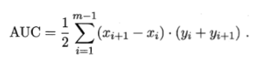

结合图表，这就是一个梯形公式

下图是另一种计算公式，给定m+个正例，m-个反例，令D+和D-分别表示正、反例集合，则排序“Loss”损失定义为

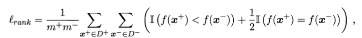

即考虑每一对正、反例，若正例的预测值小于反例，则记一个“罚分”，若相等，则记0.5个“罚分”、容易看出l_rank对应的是ROC曲线之上的面积。

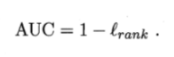

为了帮助理解提供两个视频连接：

**master学堂**

https://www.bilibili.com/video/BV1H54y1D7or?share_source=copy_web

**小萌五分钟**

https://www.bilibili.com/video/BV1wz4y197LU?share_source=copy_web

### 2.3.4 代价敏感错误率与代价曲线

为了权衡不同类型错误所造成的不同损失，可为错误赋予**“非均等代价”（unequal cost）**

我们根据任务的领域知识设定一个**“代价矩阵”（cost matrix）**

其中cost_ij 表示将第i类样本预测为第j类样本的代价。

损失程度相差越大，cost01与cost02值的差别越大

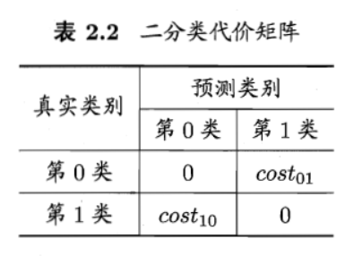

在非均等代价下，我们所希望的不再是简单地最小化错误次数，而是希望最小化**“总体代价”（total cost）**

将上图第0类作为正类，第1类作为反类，D+与D-分别代表样例集D的正例子集，和反例子集，则**“代价敏感”（cost-sensitive）**错误率为

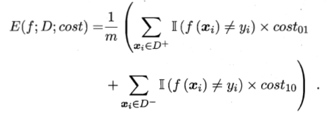

若令cost_ij中的i，j取值不限于0、1则可以定义出多分类任务的代价敏感性能度量

ROC曲线不能直接反映出学习器的期望总体代价，而**“代价曲线”（cost curve）**则可达到该目的。代价曲线图的横轴是取值为[0,1]的正例概率代价

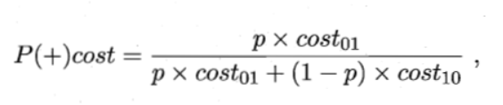

其中p是样例为正例的概率；纵轴是取值为[0,1]的归一化代价

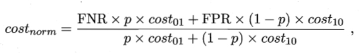

（“规范化”normalization 是将不同变化范围的值映射到相同的固定范围中，常见的是[0,1]，此时亦称“归一化”）

FPR是式子定义的假正例率，FNR=1-TPR是假反例率

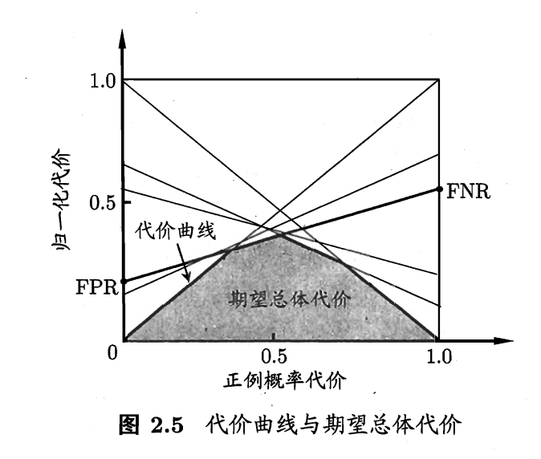

## 2.4 比较检验

机器学习的性能比较，要比上面的更加复杂。

1. 我们希望比较的是泛化性能，然而通过实验评估方法我们获得的是测试集上的性能，两者的对比结果可能未必相同。
2. 测试集上的性能与测试集本身的选择有很大的关系，且不论使用不同大小的测试集会得到不同的结果，即便使用相同大小的测试集，若包含的测试样例不同，测试结果也会不同。
3. 很多机器学习算法本身有一定的随机性，即便用相同的参数设置在同一个测试集上多次运行，其结果也会有所不同。

统计假设检验（hypothesis test）为我们进行学习器性能比较提供了重要依据。

本节默认以错误率为性能度量，用ε表示

### 2.4.1 假设检验

 (看不懂)

二项检验（binomial test）

置信度（confidence）

t检验（t-test）

双边（two-tailed）

### 2.4.2 交叉验证t检验

使用了5x2交叉验证，能大概看懂

成对t检验（paired t-tests）

### 2.4.3 McNemar检验

列联表（contingency table）

### 2.4.4 Friendman检验与Nemeny后续检验

## 2.5 偏差与方差

“偏差—方差分解”（bias-variance decompose）是解释学习算法泛化性能的一种重要工具

偏差—方差分解，试图对学习算法的期望泛化错误率进行拆解

泛化误差可分解为偏差、方差、与噪声之和

期望输出与真实标记的差别称为偏差（bias）

偏差、方差、噪声的含义：

- 偏差：度量了学习算法的期望预测与真实结果的偏离程度，即刻画了学习算法本身的拟合能力
- 方差：度量了同样大小的训练集的变动所导致的学习性能的变化，即刻画了数据扰动所造成的影响
- 噪声：表达了在当前任务上任何学习算法所能达到的期望泛化误差的下界，即刻画了学习问题本身的难度

偏差—方差分解说明，泛化性能是由学习算法的能力、数据的充分性以及学习任务本身的难度所共同决定的。

**偏差—方差窘境（bias-variance dilemma）**

偏差与方差是有冲突的，这称为偏差—方差窘境（bias-variance dilemma）

## 2.6 阅读材料

机器学习过程设计许多类型的代价，除了误分类代价，还有测试代价、标记代价、属性代价等，即便仅考虑误分类代价，仍可进一步划分为基于类别的误分类代价以及基于样本的误分类代价。

**代价敏感学习（cost-sensitive learning）**

专门研究非均等代价下的学习

# 第3章 线性模型

## 3.1 基本形式

线性模型（linear model）试图学得一个通过属性的线性组合来进行预测的函数。

## 3.2 线性回归

线性回归（linear regression）

线性回归试图学得一个线性模型以尽可能准确地预测实值输出标记。

均方误差有非常好的集合意义，它对应了常用的欧几里得距离或简称“欧氏距离”（Euclidean distance）。

基于均方误差最小化来进行模型求解的方法称为“最小二乘法”（learning square method）

在线性回归中，最小二乘法就是试图找到一条直线，使所有样本到直线上的欧氏距离之和最小

多元线性回归（multivariate linear  regression）

对数线性回归（log-linear regression）

广义线性模型（generalized linear model）

联系函数（link function）

## 3.3 对数几率回归

若要做分类任务怎么办？

只需要找一个单调可微单调函数将分类任务的真实标记y与线性回归模型的预测值联系起来

“替代函数”（surrogate function）

“对数几率函数”（logistic function）

“对数几率回归”（logistic regression 亦称 logit regression）

“极大似然法”（maximum likelihood method）

"对数似然"（log-likelihood）

## 3.4 线性判别分析

**线性判别分析（Linear Discriminant Analysis 简称LDA）**

线性判别分析是一种经典的线性学习方法，在二分类问题上应为最早由Fisher提出，亦称“Fisher 判别分析”

**LDA思想**

给定训练样例集，设法将样例投影到一条直线上，使得同类样例的投影点尽可能接近、异类样例的投影点尽可能远离；在对新样本进行分类时，将其投影到同样的这条直线上，再根据投影点的位置来确定新样本的类别。

类内散度矩阵（within-class scatter matrix）

类间散度矩阵（between-class scatter matrix）

广义瑞利商（generalized Rayleigh quotient）

## 3.5 多分类学习

在更多的情形下，我们基于一些基本策略，利用二分类学习器来解决多分类问题

**多分类学习的基本思想**

“拆解法”，即将多分类任务拆为若干个二分类任务求解。

具体来说：先对问题进行拆分，然后为拆出的每个二分类任务训练一个分类器，在测试时，对这些分类器的预测结果进行集成以获得最终的多分类结果。

**最经典的拆分策略有三种**

- 一对一（One vs. One 简称OvO）
- 一对其余（One vs. Rest 简称OvR）
- 多对多（Many vs. Many 简称MvM）

**MvM技术：“纠错输出码”（Error Correcting Output Codes，简称ECOC）**

ECOC是将编码的思想引入类别拆分，并尽可能在解码过程中具有容错性。

类别划分通过“编码矩阵”（coding matrix）指定。

编码矩阵有多种形式，常见的主要有二元码和三元码

- 二元码
  - 将每个类别分别指定为正类和反类
- 三元码
  - 在正反类之外，还可以指定“停用类”

**为什么称为“纠错输出码”呢？**

这是因为在测试阶段，ECOC编码对分类器的错误有一定的容忍和修正。

## 3.6 类别不平衡问题

前面介绍的分类学习方法都有一个共同的基本假设，即不同类别的训练样例数目相当。如果不同类别的训练样例数目稍微有差别，通常影响不大，但若差别很大，则会对学习过程造成困扰。

**类别不平衡（class-imbalance）**

类别不平衡就是指分类任务中不同类别的训练样例数目差别很大的情况。

**再缩放（rescaling）——（亦称“再平衡”—rebalance）**

**再缩放技术大体上有三类做法**

- 对训练集里的反类样例进行“欠采样”（undersampling）
  - 即去除一些反例使得正、反例数目接近，然后再进行学习
- 对训练集里的正类样例进行“过采样”（oversampling）
  - 即增加一些正例使得正、反例数目接近，然后再进行学习
- 阈值移动（threshold-moving）
  - 直接基于原始训练集进行学习，但在用训练好的分类器进行与测试，将式子嵌入到其决策过程中

**值的一提**

"再缩放"也是”代价铭感学习“（cost-sensitive learning）的基础。

## 3.7 阅读材料

“稀疏表示”（sparse representation）

“稀疏性”（sparsity）

代价敏感学习中研究得最多的是基于类别的“误分类代价”（misclassificatin cost）

“多标记学习”（multi-label learning ）这是机器学习中近年来相当活跃的一个研究领域

# 第4章 决策树

## 4.1 基本流程

**决策树（decision tree）**

是一类常见的机器学习方法

决策树是基于树结构来进行决策的，这恰是人类在面临决策问题时一种很自然的处理方式。

**一般的一棵决策树包含一个根结点、若干个内部结点和若干个叶结点**

- 叶结点对应于决策结果，其他每结点则对应于一个属性测试
- 每个结点包含的样本集合根据属性测试的结果被划分到子结点中
- 根结点包含样本全集，从根结点到每个叶结点的路径对应了一个判定测试序列。
- 决策树学习的目的是为了产生一棵泛化能力强，即处理未见示例能力强的决策树，其基本流程遵循简单且直观的“分而治之”（divide-and-conquer）策略

在决策树基本算法中，有三种情形会导致递归返回：

1. 当前结点包含的样本全属于同一类别，无需划分
2. 当前属性集为空，或是所有样本在所有属性上取值相同，无法划分
3. 当前结点包含的样本集合为空，不能划分

## 4.2 划分选择

决策树学习的关键是如何选择最优划分属性

随着划分过程不断进行，我们希望决策树的分支结点所包含的样本尽可能属于同一类别，即结点“纯度”（purity）越来越高。

### 4.2.1 信息增加

“信息熵“（information entropy）是度量样本集合纯度最常用的一种指标

”信息增加“（information gain）

一般而言，信息增益越大，则意味着使用属性a来进行划分所得的“纯度提升”越大，因此，我们可用信息增益来进行决策树的划分属性选择。

### 4.2.2 增益率

实际上，信息增益准则对可取值数目较多的属性有所偏好，为减少这种偏好可能带来的不利影响，著名的C4.5决策树算法不直接使用信息增量，而是使用“增益率”（gain ratio）来选择最优划分属性。

需要注意的是，增益率准则对可取值数目较少的属性有所偏好，因此C4.5算法并不是直接选择增益率最大的候选划分属性，而是使用了一个启发式：先从候选划分书信中找出新消息增益高于平均水平的属性，再从中选择增益率最高的。

### 4.2.3 基尼指数

CART决策树使用“基尼指数”（Gini index）来选择划分属性

直观来说，Gini(D)反应了从数据集D中随机抽取两个样本，其类别标记不一致的概率。因此，Gini(D)越小，则数据集D的纯度越高。

## 4.3 剪枝处理

剪枝（pruning）是决策树学习算法对付“过拟合”的主要手段

**决策树剪枝的基本策略有“预剪枝”（prepruning）和“后剪枝”（postpruning）**

- 预剪枝
  - 在决策树生成过程中，对每个结点在划分前先进行估计，若当前结点的划分不能带来决策树泛化性能提升，则停止划分并将当前结点标记为叶结点。
- 后剪枝
  - 先从训练集生成一棵完整的决策树，然后自底向上地对非叶结点进行考察，若将该结点对应的子树替换为叶结点能带来决策树泛化性能提升，则将该子树替换维叶结点。

### 4.3.1 预剪枝

预剪枝要对划分前后的泛化性能进行估计

预剪枝使得决策树的很多分支都没有“展开”，这不仅降低了过拟合的风险，还显著减少了决策树的训练时间开销和测试时间开销。但另一方面，有些分支的当前划分虽不能提升泛化性能、甚至可能导致泛化性能暂时下降，但在其基础上进行的后续划分却有可能导致性能显著提高。

预剪枝基于“贪心”本质禁止这些分支展开，给预剪枝决策树带来了欠拟合的风险。

### 4.3.2 后剪枝

后剪枝决策树通常比预剪枝决策树保留了更多的分支。一般情况下，后剪枝决策树的欠拟合风险很小，泛化性能往往优于预剪枝决策树。但后剪枝过程是在生成完全决策树之后进行的，并且要自底向上地对树种的所有非叶结点进行逐一考察，因此其徐那脸时间开销比未剪枝决策树和预剪枝决策树都要大得多。

## 4.4 连续与缺失值

讨论如何在决策树学习中使用连续属性

连续属性离散化技术派上了用场。最简单的策略是采用二分法（bi-partition）对连续属性进行处理。

需要注意的是，与离散属性不同，若当前结点划分属性为连续属性，该属性还可作为其后代结点的划分属性。

### 4.4.2 缺失值处理

现实任务重常会遇到不完整样本，即样本的某些属性值缺失。如果简单地放弃不完整的样本，仅使用过无缺失值的样本来进行学习，显然是对数据信息极大的浪费。

**我们需要解决两个问题**

1. 如何在属性值缺失的情况下进行划分属性选择？
2. 给定划分属性，若样本在该属性上的值缺失，如何对样本进行划分？

## 4.5 多变量决策树

“多变量决策树”（multivariate decision tree）就是能实现这样的“斜划分”甚至更复杂划分的决策树。

与传统的“单变量决策树”（univariate decision tree）不同，在多变量决策树的学习过程中，不是为每个非叶结点寻找一个最优划分属性，而是试图建立一个合适的线性分类器。

## 4.6 阅读材料

有一些决策树学习算法可进行“增量学习”（incremental learning），即在接收到新样本后可对已学得的模型进行调整，而不用完全重新学习。主要机制是通过调整分支路径上的划分属性次序来对数进行部分重构，代表性算法有ID4、ID5R、ITI等。

增量学习可有效地降低每次接收到新样本后的训练时间开销，但多步增量学习后的模型会与基于全部数据训练而得的模型有较大差别。

# 第5章 神经网络

## 5.1 神经元模型

神经网络（Neural networks）方面的研究很早就已出现，今天“神经网络”已是一个相当大的、多学科交叉的学科领域。

目前使用得最广泛的一种，即“神经网络是由具有适应性的简单单元组成的广泛并进行互联网的网络，它的组织能够模拟生物神经系统对真实世界物体所作出的交互反应”

神经元（neuron）

阈值（threshold）

**激活函数**

我们实际常用Sigmoid函数作为激活函数。典型的Sigmoid函数，它把可能在较大范围内变化的输入值挤压到（0,1）输出值范围内，因此有时也称为“挤压函数”（squashing function）

我们把许多个这样的神经元按一定的层次结构连接起来，就得到了神经网络。

## 5.2 感知机与多层网络

感知机（Perception）由两层神经元组成，输入层接受外接输入信号后传递给输出层，输出层是M-P神经元，亦称“阈值逻辑单元”（threshold logic unit）

需要注意的是，感知机只有输出神经元进行激活函数处理，即只拥有一层功能神经元（functional neuron），其学习能力非常有限。

要解决非线性可分问题，需考虑使用多层功能神经元。

输出层与输入层之间的一层神经元，被称为隐层或隐含层（hidden layer）隐含层和输出层神经元都是拥有激活函数的功能神经元。

更一般的，常见的神经网络是形如图5.6所示的层级结构，每层神经元与下一层神经元全互联，神经元之间不存在同层连接，也不存在跨层连接，这样的神经网络结构通常称为“多层前馈神经网络”。

神经网络的学习过程，就是根据训练数据来调整神经元之间的“连接权”（connection weight）以及每个功能神经元的阈值。换言之，神经网络“学”到的东西，蕴涵在连接权与阈值中。

## 5.3 误差逆传播算法

多层网络的学习能力比单层感知机强得多。误差逆传播算法（error BackPropagation 简称BP）是其中最杰出的代表，它是迄今最成功的神经网络学习算法。

**BP算法执行以下操作**

- 先将输入示例提供给输入神经元
- 然后逐层将信号前传，直到产生输出层的记过
- 然后计算输出层的误差，再将误差逆向传播至隐层神经元
- 最后根据隐层神经元的误差来对连接权和阈值进行调整
- 该迭代过程循环进行，直到达到某些停止条件位置

需要注意的是，BP算法的目标是要最小化训练集D上的累积误差

Hornik et al. 证明，只需要一个包含足够多神经元的隐层，多层前馈网络就能以任意精度逼近任意复杂度的连续函数。

然而，如何设置隐层神经元的个数仍是个未决问题，实际应用中通常靠“试错法”（trial-by-error）调整。

BP神经网络经常遭遇过拟合，其训练误差持续降低，但测试误差却可能上升。

**有两种策略常用来缓解BP网络的过拟合**

- 第一种策略——“早停”（early stopping）
  - 将数据分成训练集和验证集，训练集用来计算梯度、更新连接权和阈值，验证集用来估计误差，若训练集误差降低但验证集误差升高，则停止训练，同时返回最具有最小验证集误差的连接权和阈值。
- 第二种策略——“正则化”（regularization）
  - 基本思想是在误差目标函数中增加一个用于描述网络复杂度的部分，例如连接权与阈值的平方和。

## 5.4 全局最小与局部极小

神经网络的训练过程可看做一个参数寻优过程

基于梯度的搜索是使用最为广泛的参数寻优方法

**在现实任务中，人们常采用以下策略来试图“跳出”局部极小，从而进一步接近全局最小。**

- 以多组不同参数值初始化多个神经网络，按标准方法训练后，取其中误差最小的解作为最终参数。这相当于从多个不同的初始点开始搜索，这样就可能陷入不同的局部极小，从中进行选择有可能获得更接近全局最小的结果。
- 使用“模拟退火”技术，模拟退火在每一步都以一定的概率接受比当前解更差的结果，从而有助于“跳出”局部极小。在每步迭代过程中，接受“次优解”的概率要随着时间的推移而逐渐降低，从而保证算法稳定。
- 使用随机梯度下降。与标准梯度下降法精确计算梯度不同，随机梯度下降法在计算梯度时加入了随机因素。于是，即便陷入局部极小点，它计算出的梯度仍可能不为零，这样就有机会跳出局部极小，继续搜索。

此外，遗传算法（genetic algorithms）也常用来训练神经网络以更好地逼近全局最小。

**需要注意：**上述用于跳出局部极小的技术大多是启发式，理论上尚缺乏保障。

## 5.5 其他常见神经网络

只对特别常见的几种网络稍作简介。

### 5.5.1 RBF网络

RBF（Radial Basis Function，径向基函数）网络，是一种单隐层前馈神经挽留过，它使用径向基函数作为隐层神经元激活函数，而输出层则是对隐层神经元输出的线性组合。

### 5.5.2 ART网络

竞争型学习（competitive learning）是神经挽留过中最常用的无监督学习策略，在使用该策略时，网络的输出神经元相互竞争，每一时刻仅有一个竞争获胜的神经元被激活其他神经元的状态被抑制。这种机制亦称“胜者通吃”（winner-take-all）原则。

ART（Adaptive Resonance Theory，自适应协振理论）网络是竞争型学习的重要代表。

ART比较好地缓解了竞争型学习中的“可塑性-稳定性窘境”（stability-plasticity dilemma），可塑性是指神经网络有要学习新知识的能力、而稳定性则是指神经网络在学习新知识时要保持对旧知识的记忆。这就使得ART网络具有一个很重要的优点：可进行增量学习（incremental learning ）或在线学习（online learning）

### 5.5.3 SOM网络

SOM（Self-Organizing Map，自组织映射）网络是一种竞争学习型的无监督神经网络，它能将高维输入数据映射到低维空间（通常为二维），同时保持输入数据在高维空间的拓扑结构，即将高位空间中相似的样本点映射到网络输出层中的邻近神经元。

### 5.5.4 级联相关网络

一般的神经网络模型通常假定网络结构是事先固定的，训练的目的是利用训练样本来确定合适的连接权、阈值等参数。与此不同，结构自适应网络则将网络结构也当做学习的目标之一，并希望能在训练过程中找到最符合数据特点的网络结构。

级联相关（Cascade-Correlation）网络是结构自适应网络的重要代表。

与一般的前馈神经网络相比，级联相关网络无需设置网络层数、隐层神经元数目，且训练速度较快，但其在数据较小时易陷入过拟合。

### 5.5.5 Elman网络

与前馈神经挽留过不同，“递归神经网络”（recurrent neural networks）允许网络中出现环形结构，从而可让一些神经元的输出反馈回来作为输入信号。

这样的结构与信息反馈过程，使得网络在t时刻的输出状态不仅与t时刻的输入有关，还与t-1时刻的网络状态有关，从而能处理与时间有关的动态变化。

### 5.5.6 Boltzmann机

神经网络中有一类模型是为网络状态定义一个“能量”（energy），能量最小化时挽留过达到理想状态，而网络的训练就是在最小化这个能量函数。

Boltzmann机就是一种“基于能量的模型”

## 5.6 深度学习

随着云极端。大数据时代的到来，计算能力的答复提高可缓解训练低效性，训练数据的大幅增加则可降低过拟合风险，因此，以“深度学习”（deep learning）为代表的复杂模型开始受到人们的关注。

典型的深度学习模型就是很深层的神经网络。

无监督逐层训练（unsupervised layer-wise training）是多层隐层网络训练的有效手段，其基本思想是每次训练一层隐结点，训练时将上一层隐结点的输出作为输入，而本层隐结点的输出作为下一层隐结点的输入，这称为“预训练”（pre-training）；在预训练全部完成后，再对整个网络进行“微调”训练。

通过多层处理，逐渐将初始的“低层”特征表示转化为“高层”特征表示后，用“简单模型”即可完成复杂的分类等学习任务。由此可将深度学习理解为进行“特征学习”（feature learning）或“表示学习”（representation learning）

特征学习通过机器学习技术自身来产生好特征，这使机器学习向“全自动数据分析”又前进了一步。

## 5.7 阅读材料

M-P神经元模型使用最为广泛，但还有一些神经元模型也受到关注，如考虑了点位脉冲发放时间而不仅是累积电位的脉冲神经元（spiking neuron）模型

神经网络是一种难解释的“黑箱模型”，但已有一些工作尝试改善神经挽留过的可解释性，主要途径是通过神经网络中抽取易理解的符号规则。

# 第6章 支持向量机

## 6.1 间隔与支持向量

分类学习最基本的想法就是基于训练集D在样本空间中找到一个划分超平面，将不同类别的样本分开。

## 6.2 对偶问题

“对偶问题”（dual problem）

## 6.3 核函数

在本章前面的讨论中，我们假设训练样本是线性可分的，即存在一个划分超平面能将训练样本正确分类。然而在现实任务中，原始样本空间内也许并不存在一个能正确划分两类样本的超平面。

我们希望样本在特征空间内线性可分，因此特征空间的好坏对支持向量机的性能至关重要。

需要注意的是：在不知道特征映射的形式时，我并不知道什么样的核函数是合适的，而核函数也仅是隐式地定义了这个特征空间。于是，“核函数选择”成为支持向量机的最大变数。若核函数选择不合适，则意味着将样本映射到了一个不适合的特征空间，很可能导致性能不佳。

## 6.4 软间隔与正则化

在前面讨论中，我们已知假定训练样本在样本空间或特征空间中是线性可分的，及存在一个超平面能将不同类的样本完全划分开。然而在现实任务中往往很难确定合适的核函数使得训练样本在特征空间中线性可分，退一步说，即便恰好找到了某个核函数使训练集在特征空间中线性可分，也很难断定这个貌似线性可分的结果不是由于过拟合所造成的。

缓解该问题的一个办法是允许支持向量机在一些样本上出错，为此，要引入“软间隔”（soft margin）的概念

具体来说，前面介绍的支持向量机形式是要求所有样本均满足约束，即所有样本都必须划分正确，这称为“硬间隔”（hard margin），而软间隔则是允许某些样本不满足约束。

### 6.5 支持向量回归

考虑回归问题

## 6.6 核方法

支持向量机的求解通常是借助于凸优化技术，如何提高效率，使SVM能适用于大规模数据一直是研究重点。

核函数直接决定了支持向量机与核方法的最终性能，但遗憾的是，核函数的选择是一个未决问题。多核学习（multiple kernel learning）使用多个核函数并通过学习获得其最优凸组合作为最终的核函数，这实际上实在借助集成学习机制。

# 第7章 贝叶斯分类器

## 7.1 贝叶斯决策论

贝叶斯决策论（Bayesian decisiontheory）是概率框架下实施决策的基本方法。对分类任务来说，在所有相关概率都已知的理想情形下，贝叶斯决策论考虑如何基于这些概率和误判损失来选择最优的类别标记。

## 7.2 极大似然估计

估计类条件概率的一种常用策略是：

先假定其具有某种确定的概率分布形式，再基于训练样本对概率分布的参数进行估计。

事实上，概率模型的训练过程就是参数估计（parameter estimation）过程

对于参数估计，统计学界的两个学派分别提供了不同的解决方案：

- 频率主义学派（Frequentist）认为：
  - 参数虽然未知，但却是客观存在的固定值，因此，可以通过优化似然函数等准则来确定参数值
- 贝叶斯学派（Bayesian）认为：
  - 参数是未观察到的随机变量，其本身也可有分布，因此，可假定参数服从一个先验分布，然后基于观测到的数据来计算参数的后验分布。

## 7.3 朴素贝叶斯分类器

不难发现，基于贝叶斯公式（7.8）来估计后验概率P(c|**x**)的主要困难在于：类条件概率P(x|c)是所有属性上的联合概率，难以从有限的训练样本直接估计而得。为避开这个障碍，朴素贝叶斯分类器（naive Bayes classifier）采用了“属性条件独立性假设”（attribute conditional independence assumption）：对已知类别，假设所有属性相互独立，换言之，假设每个属性独立地对分类结果发生影响。

## 7.4 半朴素贝叶斯分类器

为了降低贝叶斯公式（7.8）汇总估计后验概率P(c|**x**)的困难，朴素贝叶斯分类器采用了属性条件独立性假设，但在现实任务中，这个假设往往很难成立。于是人们尝试对属性条件独立性假设进行一定程度的放松，由此产生了一类称为“半朴素贝叶斯分类器”（semi-maive Bayes classifiers）的学习方法

“独依赖估计”（One-Dependent Estimator 简称ODE）是版半朴素贝叶斯分类器最常用的一种策略。

## 7.5 贝叶斯网

贝叶斯网（Bayesian network）亦称“信念网”（belief network），它借助有向无环图（Directed Acyclic Graph，简称DAG）来刻画属性之间的依赖关系，并使用条件概率表（Conditional Probability Table，简称CPT）来描述属性的联合概率分布。

### 7.5.1 结构

贝叶斯网结构有效地表达了属性间的条件独立性

### 7.5.2 学习

若网络结构已知，即属性间的依赖关系已知，则贝叶斯网的学习过程相对简单，只需通过对训练样本“技术”，估计出每个结点的条件概率即可。但在现实应用中，我们往往并不知道网络结构，于是，贝叶斯网学习的首要任务就是更具训练数据集来找出结构最“恰当”的贝叶斯网。

### 7.5.3 推断

贝叶斯网训练好之后就能用来回答“查询”（query），即通过一些属性变化的观测值来推测其他属性变量的取值。

## 7.6 EM算法

在前面的讨论中，我们一直假设训练样本所有属性变量的值都已被观测到，即训练样本是“完整”的。但在现实应用中，往往会遇到“不完整”的训练样本，在这种存在“未观测”变量的情形下，是否仍能对模型参数进行估计呢？

EM（Expectation-Maximization）算法是常用的估计参数隐变量的利器，它是一种迭代式的方法，其基本想法是：若参数θ已知，则可以根据训练数据推断出最优隐变量**Z**的值（E步）；反之，若**Z**的值已知，则可方便地对参数θ座极大似然估计（M步）

简要来说，EM算法使用两个步骤交替计算：

第一步是期望步（E）步，利用当前估计的参数值来计算对数似然的期望值；

第二步四最大化（M）步，寻找能使E步产生的似然期望最大化的参数值，

然后，新得到的参数值重新被用于E步，......直至收敛到局部最优解。

事实上，隐变量估计问题也可通过梯度下降等优化算法求解，但由于求和项数将随着隐变量的数目以指数级上升，会给梯度计算带来麻烦，而EM算法则可看做一种非梯度优化方法。

## 7.7 阅读材料

贝叶斯网为不确定学习和推断提供了基本框架，因其强大的表示能力、良好的可解释性而广受关注。

# 第8章 集成学习

## 8.1 个体与集成

集成学习（ensemble learning）通过构建并结合多个学习器来完成学习任务，有时也被称为多分类器系统（multi-classifier system)、基于委员会的学习（committee-based learning）等。

**集成学习的一般结构：**先产生一组“个体学习器”（individual learner），再用某种策略将它们结合起来。

- 同质（homogeneous）
  - 集成中只包含同种类型的个体学习器，这样的集成是“同质”的
  - 同质集成中的个体学习器亦称“基学习器”（base learner），相应的学习算法称为“基学习算法”。
- 异质（heterogenous）
  - 异质集成中的个体学习器由不同的学习算法生成，这时就不再有基学习算法，相应的，个体学习器一般不称为基学习器，常称为“组件学习器”（component learner）或直接称为个体学习器

集成学习通过将多个学习器进行结合，常可获得比单一学习器显著优越的泛化性能。这对“弱学习器”（weak learner）尤为明显，因此集成学习的很多理论研究都是针对若学习器进行的，而基学习器有时也被直接称为弱学习器。

**需要注意的是：**虽然从理论上来说使用弱学习器集成足以获得好的性能，但在实践中处于种种考虑，例如希望使用较少的个体学习器，或是重用关于常见学习器的一些经验等，人们往往会使用比较强的学习器。

在一般经验中，如果把好坏不等的东西掺到一起，那么通常结果会是比最坏的要好一些，比最好的要坏一些。集成学习把多个学习器结合起来，如何能获得比最好的单一学习器更好的性能呢？

要获得好的集成，个体学习器应“好而不同”，即个体学习器要有一定的“准确性”，即学习器不能太坏，并且要有“多样性”（diversity），即学习器间具有差异。

然而我们必须注意到，上面的分析有一个关键假设：基学习器的误差相互独立。在现实任务中，个体学习器是为解决同一个问题训练出来的，它们显然不可能相互独立！

事实上，个体学习器的“准确性”和“多样性”本身就存在冲突。一般的，准确性很高之后，要增加多样性就需牺牲准确性。

事实上，如何产生并结合“好而不同”的个体学习器，恰是集成学习研究的核心。

根据个体学习器的生成方式，目前的集成学习方法大致可分为两大类，即个体学习器间存在强依赖关系、必须串行生成的序列化方法，以及个体学习器间不存在强依赖关系、可同时生成的并行化方法；前者的代表室Boosting，后者的代表是Bagging和“随机森林”（Random Forest）

## 8.2 Boosting

Boosting 是一族可将弱学习器提升为强学习器的算法。

这族算法的工作机制类似：先从初始训练集训练出一个基学习器，再根据基学习器的表现对训练样本分布进行调整，使得先前基学习器做错的训练样本在后续受到更多关注，然后基于调整后的样本分布来训练下一个基学习器，如此重复进行，直至基学习器数目达到实现指定的值T，最终将这个T个基学习器进行加权结合。

Boosting 组算法最著名的代表是AdaBoost

AdaBoost算法有多种推导方式，比较容易理解的是基于“加性模型”，即基学习器的线性组合来最小化指数损失函数（exponential loss function）

Boosting算法要求基学习器能对特定的数据分布进行学习，这可通过“重赋权法”（re-weighting）实施。即在训练的过程的每一轮中，根据样本分布为每个训练样本重新赋予一个权重。对无法接受带权样本的基学习算法，则可通过“重采样法”（re-sampling）来处理，即在每一轮学习中，根据样本分布对训练集重新采样，在用重采样而得的样本集对基学习器进行训练。

从偏差-方差分解的角度看，Boosting主要关注降低偏差，因此Boosting能基于泛化性能相当弱的学习器构建出很强的集成。

## 8.3 Bagging与随机森林

由8.1节可知，欲得到泛化性能强的集成，集成中的个体学习器应尽可能相互独立；虽然“独立”在现实任务中无法做到，但可以设法使基学习器尽可能具有较大的差异。

**问题：**

为了获得好的集成，我们同时还希望个体学习器不能太差。如果采样出的每个子集都完全不同，则每个基学习器只用到了一小部分训练数据，甚至不足以进行有效学习，这显然无法确保产生出比较好的基学习器。

为解决这个问题，我们可考虑使用相互有交叠的采样子集。

### 8.3.1 Bagging

Bagging是并行式集成学习方法最著名的代表。它直接基于我们在2.2.3节介绍过得自助采样法（bootstrap sampling）

值的一提的是：自主采样过程还给Bagging带来了另一个优点：由于每个基学习器只使用了初始训练集中越63.2%的样本，剩下36.8%的样本可用作验证集来对泛化性能进行“包外估计”（out-of-bag estimate）

包外样本的其他用途：

- 当基学习器是决策树时，可使用包外样本来辅助剪枝
- 用于估计决策树中各节点的后验概率以辅助对零训练样本结点的处理
- 当基学习器是神经网络时，可使用包外样本来辅助早期停止以减小过拟合风险

从偏差-方差分解的角度看，Bagging主要关注降低方差，因此它在不剪枝决策树、神经网络等易受样本扰动的学习器上效用更为明显。

### 8.3.2 随机森林

随机森林（Random Forest，简称RF）是Bagging的一个扩展变体。RF在以决策树为基学习器构建Bagging集成的基础上，进一步在决策树的训练过程中引入了随机属性来选择。

**具体来说：**传统决策树在选择划分属性时是在当前结点的属性集合（假定有d个属性）中选择一个最优属性；而在RF中，对基决策树的每个结点，先从该结点的属性集合中随机选择一个包含k个属性的子集，然后再从这个子集中选择一个最优属性用于划分。

随机森林简单、容易实现、计算开销小，令人惊奇的是，它在很多现实任务中展现出强大的性能，被誉为“代表集成学习技术水平的方法”。

随机森林的收敛性与Bagging相似。

## 8.4 结合策略

学习器结合可能会从三个方面带来好处：

- 首先，从统计的方面来看，由于学习任务的假设空间往往很大，可能有多个假设在训练集上达到同等性能，此时若使用单学习器可能因误选而导致泛化性能不佳，结合多个学习器则会减小这一风险。
- 第二，从计算的方面来看，学习算法往往会陷入局部极小，有的局部极小点所对应的泛化性能可能很糟糕，而通过多次运行之后进行结合，可降低陷入糟糕局部极小点的风险。
- 从表示的方面来看，某些学习任务的真实假设可能不在当前学习算法所考虑的假设空间中，此时若使用单学习器则肯定无效，而通过结合多个学习器，由于相应的假设空间有所扩大，有可能学得更好的近似。

### 8.4.1 平均法

对数值型输出h_i(**x**) ∈**R** ,最常见的结合策略是使用平均法（averaging）

- 简单平均法（simple averaging）
- 加权平均法（weighted averaging）

加权平均法可认为是集成学习研究的基本出发点，对给定的基学习器，不同的集成学习方法可视为通过不同的方式来确定加权平均法中的基学习器权重。

一般而言，在个体学习器性能相差较大时宜使用加权平均法，而在个体学习器性能相近时宜使用简单平均法。

### 8.4.2 投票法

- 绝对多数投票法（majority voting）

  即若某标记得票过半数，则预测为该标记；否则拒绝预测

- 相对多数投票法（plurality voting）

  即预测为得票最多的标记，若同时有多个标记获得最高票，则从中随机选取一个

- 加权投票法（weighted voting）

标准的绝对多数投票法（8.24）提供了“拒绝预测”选项，这在可靠性要求较高的学习任务中是一个很好的机制。但若学习任务要求必须提供预测结果，则绝对多数投票法将退化为相对多数投票法。因此，在不允许拒绝预测的任务中，绝对多数、相对对数投票法统称为“多数投票法”

### 8.4.3 学习法

当训练数据很多时，一种更为强大的结合策略是使用“学习法”，即通过另一个学习器来进行结合。是学习法的典型代表。

这里我们把个体学习器称为**初级学习器**，用于结合的学习器称为**次级学习器**或元学习器（meta-learner）

Stacking 先从初始数据集训练出初级学习器，然后“生成”一个新数据集用于训练次级学习器。在这个新数据集中，初级学习器的输出被当做样例输入特征，而初始样本的标记仍被当做样例标记。

## 8.5 多样性

### 8.5.1 误差-分歧分解

8.1节提到，与构建泛化能力强的集成，个体学习器应“好而不同”。现在我们来做一个简单的理论分析。

### 8.5.2 多样性度量

顾名思义，多样性度量（diversity measure）是用于度量集成中个体分类器的多样性，即估算个体学习器的多样化程度。典型做法是考虑个体分类器的两两相似/不相似性。

### 8.5.3 多样性增强

在集成学习中需要有效地生成多样性大的个体学习器。与简单地直接用初始数据训练出个体学习器相比，如何增强多样性呢？

**一般思路**：在学习过程中引入随机性，常见做法主要是对数据样本，输入属性、输出表示、算法参数进行扰动。

- 数据样本扰动

  给定初始数据集，可从中产生出不同的数据子集，再利用不同的数据子集训练出不同的个体学习器。数据样本扰动通常是基于采样法。

- 输入属性扰动

  训练样本通常由一组属性描述，不同的“子空间”（subspace，即属性子集）提供了观察数据的不同视角。显然，从不同子空间训练出的个体学习器必然有所不同。著名的随机子空间（random subspace）算法就依赖于输入属性扰动。

- 输出表示扰动

  此类做法的基本思路是对输出表示进行操纵以增强多样性。

- 算法参数扰动

  基学习算法一般都有参数需进行设置，例如神经网络的隐层神经元数、初始连接权值等，通过随机设置不同的参数，往往可生产差别较大的个体学习器。

不同的多样性增强机制可同时使用。

## 8.6 阅读材料

在集成产生之后在试图通过取出一些个体学习器来获得较小的集成，称为集成修建（ensemble pruning）这有助于减小模型的存储开销和预测时间开销。

由于集成包含多个学习器，即便个体学习汽油较好的可解释性，集成仍是黑箱模型。已有一些工作试图改善集成的可解释性。

# 第9章 聚类

## 9.1 聚类任务

在“无监督学习”（unsupervised learning）中，训练样本的标记信息是未知的，目标是通过对无标记训练样本的学习来揭示数据的内在性质及规律，为进一步的数据分析提供基础。此类学习任务中研究最多、应用最广的是“聚类”（clustering）

聚类试图将数据集中的样本划分为若干个通常是不相交的子集，每个子集称为一个“簇”（cluster）

需说明的是，这些概念对聚类算法而言事先是未知的，聚类过程仅能自动形成簇结构，簇所对应的概念语义需由使用者来把握和命名。

聚类既能作为一个单独的过程，用于寻找数据内在的分布结构，也可作为分类等其他学习任务的前驱过程。

讨论聚类算法涉及的两个基本问题——性能度量和距离计算

## 9.2性能度量

聚类性能度量亦称聚类“有效性指标”（validity index）。与监督学习中的性能度量作用相似，对聚类结果，我们需通过某种性能度量来评估其好坏；另一方面，若明确了最终将要使用的性能度量，则可直接将其作为聚类过程的优化目标，从而更好地得到符合要求的聚类结果。

聚类是将样本集D划分为若干互不相交的子集，即样本簇。那么，什么样的聚类结果比较好呢？

同一簇内的样本尽可能彼此相似，不同簇的样本尽可能不同。换言之，聚类结果的”簇内相似度“（inrta-cluster similarity）高且”簇间相似度“（inter-cluster similarity）低。

**聚类性能度量大致有两类**

- 将聚类结果与某个“参考模型”（reference model）进行比较，称为“外部指标”（external index）；
- 直接考察聚类结果而不利用任何参考模型，称为“内部指标”（internal index）。

## 9.3  距离计算

我们常将属性划分为“连续属性”（continuous attribute）和“离散性”（categorical attribute），前者在定义域上有无穷多个可能的取值，后者在定义域上是有限个取值。**然而**，在讨论距离计算时，属性上是否定义了“序”关系更为重要。

对无序属性可采用VDM（Value Difference Metric）

**需要注意的是**，通常我们是基于某种形式的距离来定义“相似度度量”（similarity measure），距离越大，相似度越小。然而用于相似度度量的距离未必一定要满足距离度量的所有基本性质，尤其是**直递性**。

## 9.4 原型聚类

原型聚类亦称“基于原型的聚类”（prototype-based clustering），此类算法假设聚类结构能通过一组原型刻画，在显示聚类任务中极为常用。通常情况下，算法先对原型进行初始化，然后对原型进行迭代更新求解。采用不同的原型表示、不同的求解方式，将产生不同的算法。

### 9.4.1 k均值算法

### 9.4.2 学习向量化

与k均值算法类似，“学习向量化”（Learning Vector Quantization，简称LVQ）也是试图找到一组原型向量来刻画聚类结构，但与一般聚类算法不同的是，LVQ假设数据样本带有类别标记，学习过程利用样本的这些监督信息来辅助聚类。

### 9.4.3 高斯混合聚类

与k均值、LVQ用原型向量来刻画聚类结构不同，高斯混合（Mixture-of-Gaussian）聚类采用概率模型来表达聚类原型。

## 9.5 密度聚类

密度聚类亦称“基于密度的聚类”（density-based clustering），此类算法假设聚类结构能通过样本分布的紧密程度确定。通常情况下，密度聚类算法从样本密度的角度来考察样本之间的可连接性，并基于可连接样本不断扩展聚类簇以获得最终的聚类结果。

DBSCAN是一种著名的密度聚类算法，它基于一组“领域”（neigh-borhood）参数来刻画样本分布的紧密程度。

## 9.6  层次聚类

层次聚类（hierarchical clustering）试图在不同层次对数据集进行划分，从而形成树形的聚类结构。数据集的划分可采用“自底向上”的聚合策略，也可采用“自顶向下”的分拆策略。

AGNES是一种采用自底向上聚合策略的层次聚类算法。

它先将数据集中的每个样本看作一个初始聚类簇，然后再算法运行的每一步中找出距离最近的两个聚类簇进行合并，该过程不断重复，直至达到预设的聚类簇个数。——这里的关键是如何计算聚类簇之间的距离。实际上，每个簇是一个样本集合。因此，只需采用关于集合的某种距离即可。

## 9.7 阅读材料

聚类也许是机器学习中“新算法”出现最多，最快的领域。一个重要原因是聚类不存在客观标准；给定数据集，总能从某个角度找到以往算法未覆盖的某种标准从而设计出新算法。

k均值算法可看做高斯混合聚类在混合成分方差相等、且每个样本仅指派给一个混合成分时的特例。

聚类集成（clustering ensemble）通过对多个聚类学习器进行集成，能有效降低聚类假设与真实聚类结构不符、聚类过程中的随机性等因素带来的不利影响。

异常检测（anomaly detection）长借助聚类或距离计算进行，如将远离所有簇中心的样本作为异常点，或将密度极低处的样本作为异常点。最近有研究提出基于“隔离性”（isolation）可快速检测出异常点。

# 第10章 降维与度量学习

## 10.1 k邻近学习

k邻近（k-Nearest Neighbor, 简称kNN）学习是一种常用的监督学习方法，其工作机制非常简单：给定测试样本，基于某种距离度量找出训练集中与其最靠近的k个训练样本，然后基于某种距离度量找出选林集中与其最靠近的k个训练样本，然后基于这k个“邻居”的信息来进行预测。通常：

- 在分类任务中使用“投票法”——即选择这k个样本中出现最多的类别标记作为预测结果
- 在回归任务中可使用“平均法”——即将这k个样本的实值输出标记的平均值作为预测结果
- 还可基于距离远近加权平均或加权投票，距离越近的样本权重越大

与前面介绍的学习学习方法相比，k近邻学习有一个明显的不同之处：它似乎没有显式的训练过程！

事实上，它是"懒惰学习"（lazy learning）的著名代表，此类学习技术在训练阶段仅仅是把样本保存起来，训练时间开销为零，待收到测试样本后再进行处理；相应的，哪些在训练阶段就对样本进行学习处理的方法，称为“急切学习”（eager learning）.

我们得到了优点令人惊讶的结论：最近邻分类器虽简单，但它的泛化错误率不超过贝叶斯最优分类器的错误率的两倍。

## 10.2 低维嵌入

上一节的讨论时基于一个重要的假设：任意测试样本**x**附近任意小的δ距离范围内总能找到一个训练样本，即训练样本的采样密度足够大，或称为“密采样”（dense sample）。然而，这个假设在显示任务中通常很难满足。

事实上，在高维情形下出现的数据样本稀疏、距离计算困难等问题，是所有机器学习方法共同面临的严重障碍；被称为“维数灾难”（curse of dimensionality）

缓解维数灾难的一个重要途径是**降维**（dimension reduction），亦称“维数约简”，即通过某种数学变换将原始高维属性空间转变为一个低维“子空间”（subspace），在这个子空间中样本密度大幅提高，距离计算也变得更为容易。

**为什么能进行降维？**

这是因为在很多时候，人们观测或搜集到的数据样本虽是高维的，但与学习任务密切相关的也许是某个低维分布，即高维空间中的一个低维“嵌入”（embedding）

若要求原始空间中样本之间的距离在低维空间中得以保持，即得到“多维缩放”（Multiple Dimensional Scaling，简称 MDS）这样的一种经典的降维方法。

在现实应用中为了有效降维，往往仅需降维后的距离与原始空间中的距离尽可能的接近，而不必严格相等。

对降维效果的评估，通常是比较降维前后学习的性能，若性能有所提高则认为降维起到了作用。若将维数降至二维或三维，则可通过可视化技术来直观地判断降维的效果。

## 10.3 主成分分析

主成分分析（Principal Component Analysis，简称PCA）是最常用的一种降维方法。

**我们考虑这样一个问题：**对于正交属性空间中的样本点，如何用一个超平面（直线的高维推广）对所有样本进行恰当的表达？

容易想到，若存在这样的超平面，那么它大概率应具有这样的性质：

- 最近重构性：样本点到这个超平面的距离都足够近
- 最大可分性：样本点在这个超平面上的投影能尽可能分开。

有趣的是，基于最近重构性和最大可分性，能分别得到主成分分析的两种等价推导。

## 10.4  核化线性降维

线性降维方法假设从高维空间到地位空间的函数映射是线性的，然而，在不少显示任务中，可能需要非线性映射才能找到恰当的低维嵌入。

为了对“原本采样的”低维空间与降维后的低维空间加以区别，我们称前者为“本真”（intrinsic）低维空间。

非线性降维的一种常用方法，是基于核技巧对线性降维方法进行“核化”（kernelized）

## 10.5 流行学习

流行学习（manifold learning）是一类借鉴了拓扑流行概念的降维方法。“流形”是在局部与欧氏空间同胚的空间，换言之，它在局部具有欧氏空间的性质，能用欧氏距离来进行距离计算。

### 10.5.1 等度量映射

等度量映射（Isometric Mapping，简称Isomap）的基本出发点，是认为低维流行嵌入到高维空间之后，直接在高维空间中直接计算直线距离具有误导性，应为高维空间中的直线距离在低维嵌入流行上是不可达的。

### 10.5.2 局部线性嵌入

与Isomap试图保持邻近样本之间的距离不同，局部线性嵌入（Locally Linear Embedding，简称LLE）试图保持领域内样本之间的线性关系。

## 10.6 度量学习

在机器学习中，对高维数据进行降维的主要目的是希望找到一个合适的低维空间，再此空间中进行学习能比原始空间性能更好。

事实上：每个空间对应了在样本属性上定义的一个距离度量，而寻找合适的空间，实质上就是在寻找一个合适的距离度量。那么，为何不直接尝试“学习”出一个合适的距离度量呢？这就是**度量学习**（metric learning）的基本动机。

## 10.7 阅读材料

懒惰学习方法主要有k邻近学习器、懒惰决策树；朴素贝叶斯分类器能以懒惰学习方式使用，也能以急切学习方式使用。

# 第11章 特征选择与稀疏学习

## 11.1 子集搜索与评价

我们能用很多属性描述一个西瓜，例如色泽、根蒂、敲声、纹理、触感等，但有经验的人往往只需看根蒂、听听敲声就知道是否好瓜。换言之，**对一个学习任务来说**，给定属性集，其中有些属性可能很关键、很有用，另一些属性可能没什么用。我们将属性称为“**特征**”（feature），对当前学习任务有用的属性称为“**相关特征**”（relevant feature）、没什么用的属性称为“无关特征”（irrelevant feature）。从给定的特征集合中选择出相关特征子集的过程，称为“**特征选择**”（feature selection）。

特征选择是一个重要的“数据预处理”（data preprocessing）过程，在现实机器学习任务中，获得数据之后通常先进行特征选择，此后再训练学习器。那么，为什么要进行特征选择呢？

**两个重要原因：**

- 首先我们在现实任务中经常会遇到维数灾难问题，这是由于属性过多而造成的，若能从中选择出重要的特征，使得后续学习过程仅需在一部分特征上构建模型，则维数灾难问题会大为减轻。
- 第二个原因：去除不相关特征往往会降低学习任务的难度，这就像侦探破案一样，若将纷繁复杂的因素抽丝剥茧，只留下关键因素，则真相往往更容易看破。

**需要注意的是**：特征选择过程必须确保不丢失重要特征，否则后续学习过程会因为重要信息的缺失而无法获得好的性能。

无关特征

特征选择中所谓的“无关特征”是指与当前学习任务无关。

冗余特征（redundant feature）

有一类特征称为冗余特征，它们所包含的信息能从其他特征中推演出来。冗余特征在很多时候不起作用，除去它们会减轻学习过程中的负担。但有时冗余特征会降低学习任务的难度。更确切的说，若某个冗余特征恰好对应了完成学习任务所需的“中间概念”，则该冗余特征是有益的。

本章暂且假定数据中不涉及冗余特征，并且假定初始的特征集合包含了所有重要的信息。

常见的特征选择方法大致可分为三类：过滤式（filter）、包裹式（wrapper）和嵌入式（embedding）。

## 11.2 过滤式选择

过滤式方法先对数据集进行特征选择，然后再训练学习器，特征选择过程与后续学习器无关。这相当于先用特征选择过程对初始特征进行“过滤”，再用过滤后的特征来训练模型。

Relief（Relevant Features）是一种著名的过滤式特征选择方法，该方法设计了一个“相关统计量”来度量特征的重要性。

Relief是为二分类问题设计的，其扩展变体Relief-F能处理多分类问题。

## 11.3 包裹式选择

与过滤式特征选择不考虑后续学习器不同，包裹式特征选择直接把最终要使用的学习器的性能作为特征子集的评价准则。换言之，包裹式特征选择的目的就是为给定学习器选择最有利于其性能、“量身定做”的特征子集。

一般而言，由于包裹式特征选择方法直接针对给定学习器进行优化，因此从最终学习器性能来看，包裹式特征选择比过滤式特征选择更好，但另一方面，由于在特征选择过程中需多次训练学习器，因此包裹式特征选择的计算开销通常比过滤式特征选择大得多。

LVW（Las Vegas Wrapper）是一个典型的包裹式特征选择方法。

## 11.4 嵌入式选择与L1正则化

在过滤式和包裹式特征选择方法中，特征选择过程与学习器训练过程有明显的分别；与此不同，嵌入式特征选择是将特征选择过程与学习器训练过程融为一体，两者在同一个优化过程中完成，即在学习器训练过程中自动地进行了特征选择。

## 11.5 稀疏表示与字典学习

不妨把数据集D考虑成一个矩阵，其每行对应于一个样本，每列对应于一个特征。特征选择所考虑的问题是特征具有“稀疏性”，即矩阵中的许多列与当前学习任务无关，通过特征选择去除这些列，则学习器训练过程仅需在较小的矩阵上进行，学习任务的难度可能有所降低，设计的计算和存储开销会减少，学得模型的可解释性也会提高。

## 11.6 压缩感知

在现实任务中，我们常希望根据部分信息来恢复全部信息，例如在数据通讯中要将模拟信号转换为数字信号，根据奈奎斯特（Nyquist）采样定理，令采样频率达到模拟信号最高频率的两倍，则采样后的数字信号就保留了模拟信号的全部信息。换言之，由此获得的数字信号能精确重构原模拟信号。**然而**，为了便于传输。存储，在实践中人们通常对采样的数字信号进行压缩，这有可能损失一些信息，而在信号传输过程中，由于信道出现丢包等问题，又可能损失部分信息。那么，接收方基于收到的信号，能否精确地重构出原信号呢？压缩感知为解决此类问题提供了新的思路。

## 11.7 阅读材料

特征选择是机器学习中研究最高的分支领域之一，早期研究主要是按特征子集“生成与搜索-评价”过程进行。

# 第12章 计算学习理论

## 12.1 基础知识

顾名思义，计算机学习理论（computational learning theory）研究的是关于通过“计算”来进行“学习”的理论，即关于机器学习的理论基础，其目的是分析学习任务的困难本质，为学习算法提供理论保证，并根据分析结果指导算法设计。

## 12.2 PAC学习

计算机学习理论中最基本的是概率近似正确（Probably Approximately Correct，简称PAC）学习理论。

## 12.3 有限假设空间

### 12.3.1 可分情形

### 12.3.2 不可分情形

## 12.4 VC维

现实任务所面临的通常是无限假设空间，例如实数域中的所有区间、**R**^d空间中的所有线性超平面。欲对此种情形的可学习性进行研究，需度量假设空间的复杂度。最常见的办法是考虑假设空间的“**VC维**”（Vapnik-Chervonenkis dimension）

介绍VC维之前，我们先引入几个概念：增长函数（growth function）、对分（dichotomy）和打散（shattering）。

## 12.5 Rademacher复杂度

12.4节提到，基于VC维的泛化误差界是分布无关、数据独立的，也就是说，对任何数据分布都成立。这使得基于VC维的可学习性分析结果具有一定的“普适性”；但从另一方面来说，由于没有考虑数据自身，基于VC维得到的泛化误差界通常比较“松”。对那些与学习问题的典型情况相差甚远的较“坏”分布来说尤其如此。

Rademacher复杂度（Rademacher complexity）是另一种刻画假设空间复杂度的途径，与VC不同的是，它在一定程度上考虑了数据分布。

## 12.6 稳定性

无论是基于VC维还是Rademacher复杂度来推导泛化误差界，所得到的的结果均与具体学习算法无关，对所有学习算法都适用。这使得人们能够脱离具体学习算法的设计来考虑学习算问题本身的性质，但在另一方面，若希望获得与算法有关的分析结果，则需另辟蹊径。稳定性（stability）分析是这方面一个值的关注的方向。

顾名思义，算法的“稳定性”考察的是算法在输入发生变化时，输出是否会随之发生较大的变化。学习算法的输入是训练集，因此下面我们先定义训练集的两种变化。

## 12.7 阅读材料

VC维由[Vapnik and Chervonenkis]提出，它的出现使研究无限假设空间的复杂度成为可能。

# 第13章 半监督学习

## 13.1 未标记样本

我们有一个训练样本集D_l,我们可以用D_l先训练一个模型，那这个模型去地里挑一个瓜，询问瓜农好不好，然后把这个新获得的有标记样本加入D_l中重新训练一个模型，再去挑瓜，......，这样若每次都挑出对改善模型性能帮助大的瓜，则只需询问瓜农比较少的瓜就能构建出比较强的模型，从而大幅度降低标记成本。这样的学习方式称为“主动学习”（active learning），其目标是使用少量的“查询”（query）来获得尽量好的性能。

显然，主动学习引入了额外的专家知识，通过与外界的交互来将部分未标记样本转变为有标记样本。若不与专家交互，没有获得额外信息，还能利用未标记样本来提高泛化性能吗？

答案是“YES！”

让学习器不依赖外界交互、自动地利用未标记样本来提升学习性能，就是半监督学习（semi-supervised learning）。半监督学习的现实需求非常强烈，应为在显示应用中往往能容易地收集到大量未标记样本，而获取“标记”却需耗费人力、物力。

半监督学习恰是提供了一条利用“廉价”的未标记样本的途径。

要利用未标记样本，必然要做一些将未标记样本所揭示的数据分布信息与类别标记相联系的假设。

**“聚类假设”（cluster assumption）**

即假设数据存在簇结构，同一个簇的样本属于同一个类别。

**“流形假设”（manifold assumption）**

即假设数据分布在一个流形结构上，邻近的样本拥有相似的输出值。“邻近”程度常用“相似”程度来刻画，因此，流形假设可看做聚类假设的推广，但流形假设对输出值没有限制，因此比聚类假设的适用范围更广，可用于更多类型的学习任务。事实上，无论聚类假设还是流形假设，其本质都是“相似的样本拥有相似的输出”这个基本假设。

半监督学习可进一步划分为纯（pure）半监督学习和直推学习（transductive learning），前者假定训练数据中的未标记样本并非待预测的数据，而后者则假定学习过程中所考虑的未标记样本恰是待预测数据，学习的目的就是在这些未标记样本上获得最优泛化性能。换言之，纯半监督学习时基于“开放世界”假设，希望学得模型能适用于训练过程中未观察到的数据；而直推学习是基于“封闭世界”假设，仅试图对学习过程中观察到的未标记数据进行预测。

## 13.2 生成式方法

生成式方法（generatice methods）是直接基于生成式模型的方法。此类方法假设所有数据（无论是否有标记）都是由用一个潜在的模型“生成的”。这个假设使得我们能通过潜在模型的参数将未标记数据与学习目标联系起来，而未标记数据的标记则看作模型的缺失参数，通常可基于EM泛进行极大似然估计求解。此类方法的区别主要在于生成式模型的假设，不同的模型假设将产生不同的方法。

## 13.3 半监督SVM

半监督支持向量机（Semi-Supervised Support Vector Machine,简称S3VM）是支持向量机在半监督学习上的推广。在不考虑未标记样本时，支持向量机试图找到最大间隔划分超平面，而在考虑未标记样本后，S3VM试图找到能将两类有标记样本分开，且穿过数据低密度区域的划分超平面，如图13.3所示，这里的基本假设是“低密度分隔”（low-density separation），显然，这是聚类假设在考虑了线性超平面划分后的推广。

半监督支持向量机中最著名的是TSVM（Transductive Support Vector Machine）。与标准SVM一样，TSVM也是针对二分类问题的学习方法。

## 13.4 图半监督学习

给定一个数据集，我们可将其映射为一个图，数据集中每个样本对应于图中一个结点，若两个样本之间的相似度很高（或相关性很强），则对应的结点之间存在一条边，边的“强度”（strength）正比于样本之间的相似度（或相关性）。我们可将有标记样本所对应的结点想象为染过色，而未标记所对应的结点尚未染色。于是半监督学习就对应于“颜色”在图上扩散或传播的过程。由于一个图对应了一个矩阵，这就使得我们能基于矩阵运算来进行半监督学习算法的推导与分析。

## 13.5 基于分歧的方法

与生成式方法、半监督SVM、图半监督学习等基于单学习器利用未标记数据不同，基于分歧的方法（disagreement-based methods）使用多学习器，而学习器之间的“分歧”（disgreement）对未标记数据的利用至关重要。

“协同训练”（co-training）是此类方法的重要代表，它最初是针对“多试图”数据设计的，因此也被看作“多视图学习”（multi-view learning）的代表。

在不少现实应用中，一个数据对象往往同时拥有多个“属性集”（attribute set），每个属性集就构成了一个“试图”（view）。

协同训练正是很好地利用了多视图的“相容互补性”

基于分歧的方法只需要采用合适的基学习器，就能较少受到模型假设、损失函数非凸性和数据规模问题的影响，学习方法简单有效。理论基础相对坚实、适用范围较为广。为了使用此类方法，需能生成具有显著分歧、性能尚可的多个学习器，但当有标记的样本很少，尤其是数据不具有多视图时，要做到这一点并不容易，需要巧妙的设计。

## 13.6半监督聚类

聚类是一种典型的无监督学习任务，然而在显示聚类任务中我们往往能获得一些额外的监督信息，于是可通过半监督聚类（semi-supervised clustering）来利用监督信息以获得更好的聚类效果。

聚类任务中获得的监督信息大致有两种类型。第一种类型是“必连”（must-link）与“勿连”（cannot-link）约束，前者是指样本必须同属一个簇，后者是指样本必不属于同一个簇；第二种类型的监督信息则是少量的有标记样本。

约束k均值（Constrained k-means）算法是利用第一类监督信息的代表。

## 13.7 阅读材料

生成式半监督学习方法出现最早。由于需有充分可靠的领域知识才能确保模型假设不至于太坏，因此该范型后来主要是在具体的应用领域加以研究。

# 第14章 概率图模型

## 14.1 隐马尔可夫模型

机器学习最重要的任务，是根据一些已观察到的证据（例如训练样本）来对感兴趣的未知变量（例如类别标记）进行估计和推测。概率模型（probabilistic model）提供了一种描述框架，将学习任务归结于计算变量的概率分布。在概率模型中，利用已知变量推测未知变量的分布称为“推断”（inference），其核心是如何基于可观测变量推测出未知变量的条件分布。

概率模型图（probabilistic graphical model）是一类用图来表达变量相关关系的概率模型。

隐马尔可夫模型（Hidden Markov Model，简称HMM）是结构最简单的动态贝叶斯网（dynamic Bayesian network），这是一种著名的有向图模型，主要用于时序数据建模，在语音识别。自然语言处理等领域有广泛应用。

## 14.2 马尔可夫随机场

马尔可夫随机场（Markov Random Field，简称MRF）是典型的马尔可夫网，这是一种著名的无向图模型。图中每个结点表示一个或一组变量，结点之间的边表示两个变量之间的依赖关系。马尔可夫随机场有一组势函数（potential functions）,亦称“因子”（factor），这是定义在变量子集上的非负实函数，主要用于定义概率分布函数。

## 14.3 条件随机场

条件随机场（Conditional Random Field，简称CRF）是一种判别式无向图模型。14.1节提到过，生成式模型是直接对联合分布进行建模，而判别式模型则是对条件分布进行建模。前面介绍的隐马尔可夫模型和马尔可夫随机场都是生成式模型，而条件对机场则是判别式模型。

条件随机场试图对多个变量在给定观测值后的条件概率进行建模。

## 14.4 学习与推断

基于概率图模型定义的联合概率分布，我们能对目标变量的边际分布（marginal distribution）或以某些可观测白能量为条件的条件分布进行推断。

### 14.4.1 变量消去

精确推断的实质是一类动态规划算法，它利用图模型所描述的条件独立性来削减计算目标概率值所需的计算量。变量消去法是最直观的精确推断算法，也是构建其他精确推断算法的基础。

变量消去法有一个明显的缺点：若需计算多个边际分布，重复使用变量消去法将会造成大量的冗余计算。

### 14.4.2 信念传播

信念传播（Belief Propagation）算法将变量消去法中的求和操作看做一个消息传递过程，较好地解决了求解多个边际分布时的重复计算问题。

## 14.5 近似推断

精确推断方法通常需要很大的计算开销，因此在现实应用中近似推断方法更为常用。近似推断方法大致可分为两大类：第一类是采样（sampling），通过使用随机化方法完成近似；第二类是使用确定性近似完成近似推断，典型代表为变分推断（variational inference）

### 14.5.1 MCMC采样

在很多任务中，我们关心某些概率分布并非因为对这些概率分布本身感兴趣，而是要基于它们计算某些期望，并且还可能进一步基于这些期望作出决策。

采样法正是基于这个思路。

### 14.5.2 变分推断

变分推断通过使用已知简单分布来逼近需推断的复杂分布，并通过限制近似分布的类型，从而得到一种局部最优、但具有确定解的近似后验分布。

在实践中使用变分法时，最重要的是考虑如何对隐变量进行拆解，以及假设各变量自己服从何种分布，在此基础上套用式（14.40）的结论再结合EM算法即可进行概率图模型的推断和参数估计。显然，若隐变量的拆解或变量子集的分布假设不当，将会导致变分法效率低、效果差。

## 14.6 话题模型

话题模型（topic model）是一族生成式有向图模型，主要用于处理离散型的数据（如文本集合），在信息检索、自然语言处理等领域有广泛应用。隐狄利克雷分配模型（Latent Dirichlet Allocation，简称LDA）是话题模型的典型代表。

## 14.7 阅读材料

概率图模型的建模和推断，尤其是变分推断在20世纪90年代中期逐步发展成熟。

# 第15章 规则学习

## 15.1 基本概念

机器学习中的“规则”（rule）通常是指语义明确、能描述数据分布所隐含的客观规律或领域概念、可写成“若......,则......”形式的逻辑规则。“规则学习”（rule learning）是从训练数据中学习出一组能用于对未见示例进行判别的规则。

与神经网络、支持向量机这样的“黑箱模型”相比，规则学习具有更好的可解释性，能使用户更直观地对判别过程有所了解。另一方面，数理逻辑具有极强的表达能力，绝大多数人类知识都能通过数理逻辑进行简洁的刻画和表达。

此外，逻辑规则的抽象描述能力在处理一些高度复杂的AI任务是具有显著的优势，例如在问答系统中有时可能遇到非常多、甚至无穷种可能的答案，此时若能基于逻辑规则进行抽象表述或者推理，则将带来极大便利。

## 15.2 序贯覆盖

规则学习的目标是产生一个能覆盖尽可能多的样例的规则集。最直接的做法是“序贯覆盖”（sequential covering），即逐条归纳：在训练集上每学到一条规则，就将该规则覆盖的训练样例去除，然后以剩下的训练样例组成训练集重复上述过程。由于每次只处理一部分数据，因此也被称为“分治”（separate-and-conquer）策略。

## 15.3剪枝优化

规则生成本质上是一个贪心搜索过程，须有一定的机制来缓解过拟合的风险，最常见的做法是剪枝（pruning）。与决策树相似，剪枝可发生在规则生长过程中，即“预剪枝”，也可发生在规则产生后，即“后剪枝”。通常是基于某种性能度量指标来评估增/删逻辑文字前后的规则性能，或增/删规则前后的规则集性能，从而判断是否要进行剪枝。

剪枝还可借助统计显著性检验来进行

## 15.4 一阶规则学习

受限于命题逻辑表达能力，命题规则学习难以处理对象之间的“关系”（relation），而关系信息在很多任务中非常重要。

## 15.5 归纳逻辑程序设计

归纳逻辑程序设计（Inductive Logic Programming，简称ILP）在一阶规则学习中引入了函数和逻辑表达式嵌套。一方面，这使得机器学习系统具备了更为强大的表达能力；另一方面，ILP可看作用机器学习技术来解决基于背景知识的逻辑程序（logistic program）归纳，其学得的“规则”可被PROLOG等逻辑程序设计语言直接使用。

然而，函数和逻辑表达式嵌套的引入也带了计算上的巨大挑战。

### 15.5.1 最小一般泛化

归纳逻辑程序设计采用自底向上地规则生成策略，直接将一个或多个正例所对应的距离事实（grounded fact）作为初始规则，在对规则逐步进行泛化以增加其对样例的覆盖率。泛化操作可以使将规则中的常量替换为逻辑变量，也可以是删除规则体中的某个文字。

### 15.5.2 逆归结

在逻辑学中，“演绎”（deduction）与“归纳”（induction）是人类认识世界的两种基本方式。大致来说，演绎是从一般性规律出发来探讨具体事物，而归纳则是从个别事物出发概括出一般性规律。一般数学定理证明是演绎实践的代表，而机器学习显然是属于归纳的范畴。

## 15.6 阅读材料

规则学习是“符号主义学习”的主要代表，是最早开始研究机器学习技术之一。

# 第16章 强化学习

## 16.1 任务与奖赏

我们考虑一下如何种西瓜。种瓜有许多步骤，从一开始的选种，到定期浇水、施肥、除草、杀虫，经过一段时间才能收获西瓜。通常要等到收获后，我们才知道种出的瓜好不好。若将得到好瓜作为辛勤种瓜劳动的奖赏，则在种瓜过程中当我们执行某个操作（例如，施肥）时，并不能立即获得这个最终奖赏，甚至难以判断当前操作对最终奖赏的影响，仅能得到一个当前反馈（例如，瓜苗看起来更健壮了）。我们需多次种瓜，在种瓜过程中不断摸索，然后才能总结出较好的种瓜策略。这个过程抽象出来，就是“强化学习”（reinforcement learning）

需注意“机器”与“环境”的界限，例如在种西瓜任务中，环境是西瓜生长的自然世界；在下棋对弈中，环境是棋盘与对手；在机器人控制中，环境是机器人的躯体与物理世界。总之，在环境中状态的转移、奖赏的返回是不受机器控制的，机器只能通过选择要执行的动作来影响环境，也只能通过观察转移后的状态和返回的奖赏来感知环境。

策略的优劣取决于长期执行这一策略后得到的累积奖赏，例如某个策略使得瓜苗哭死，它的累积奖赏会很小，另一个策略种出了好瓜，它的累积奖赏会很大。在强化学习任务中，学习的目的就是要找到能使长期累积奖赏最大化的策略。

**强化学习与监督学习的差别**

## 16.2 K-摇臂赌博机

### 16.2.1 探索与利用

与一般监督学习不同，强化学习任务的最终奖赏实在多步动作之后才能观察到。

实际上，单步强化学习任务对应了一个理论模型，即“K-摇臂赌博机”（K-armed bandit）

事实上，“探索”（即估计摇臂的优劣）和“利用”（即选择当前最优摇臂）这两者是矛盾的，因为尝试次数（即总投币数）有限，加强了一方则会自然削弱了一方，这就是强化学习所面临的“探索-利用窘境”（Exploration-Exploitation dilemma）。显然，欲累积奖赏最大，则必须在探索与利用之间达成较好的折中。

### 16.2.2 ϵ-贪心

ϵ贪心法基于一个概率来对探索和利用进行折中：每次尝试时，以ϵ的概率进行探索，即以均匀概率随机选取一个摇臂；以1-ϵ的概率进行利用，即选择当前平均奖赏最高的摇臂（若有多个，则随机选取一个）

### 16.2.3 Softmax

Softmax 算法基于当前已知的摇臂平均奖赏来对探索和利用进行折中。若各摇臂的平均奖赏相当，则选取各摇臂的概率也相当；若某些摇臂的平均奖赏明显高于其他摇臂，则它们被选取的概率也明显更高。

ϵ-贪心算法与Softmax算法孰优孰劣，主要取决于具体应用。

## 16.3 有模型学习

考虑多步强化学习任务，暂且先假定任务对应的马尔可夫决策过程四元组E=<X,A,P,R>均为已知，这样的情形称为“模型已知”，即机器已对环境进行了建模，能在机器内部模拟出与环境相同或近似的状况，在已知模型的环境中学习称为“有模型学习”（model-based learning）。

### 16.3.1 策略评估

在模型已知时，对任意策略π能估计出该策略带来的期望累积奖赏。

### 16.3.2 策略改进

对某个策略的累积奖赏进行评估后，若发现它并非最优策略，则当然希望对其进行改进。

### 16.3.3 策略迭代与值迭代

由前两小节我们知道了如何评估一个策略的值函数，以及在策略评估后如何改进至获得最优策略。显然，将这两者结合起来即可得到求解最优解的方法：从一个初始策略（通常是随机策略）出发，先进行策略评估，然后改进策略，评估改进的策略，再进一步改进策略，......不断迭代进行策略评估和改进，知道策略收敛、不再改变为止。这样的做法称为“策略迭代”（policy iteration）

从上面的算法可看出，在模型已知时强化学习任务能归结为基于动态规划的寻优问题。与监督学习不同，这里并未涉及到广泛能力，而是为每一个状态找到最好的动作。

## 16.4 免模型学习

在现实的强化学习任务中，环境的转移概率、奖赏函数往往很难得知，甚至很难知道环境汇总一共有多少状态。若学习算法不依赖与环境建模，则称为“免模型学习”（model-free learning），这比有模型学习要困难得多。

### 16.4.1 蒙特卡罗强化学习

在免模型情形下，策略迭代算法首先遇到的问题是策略无法评估这是由于模型位置而导致无法做全概率展开。此时，只能通过在环境中执行选择的动作，来观察转移的状态和得到的奖赏。受K摇臂赌博机的启发，一种直接的策略评估替代方法是多次“采样”，然后求取平均累积奖赏来作为期望累积奖赏的近似，这称为蒙特卡罗强化学习。由于采样必须为有限册数因此该方法更适合于使用T步累积奖赏的强化学习任务。

### 16.4.2 时序差分学习

蒙特卡罗强化学习算法通过考虑采样轨迹，克服了模型未知给策略估计造成的困难。此类算法需在完成一个采样轨迹后在更新策略的值估计，而前面介绍的基于动态规划的策略迭代和值迭代算法在每执行一步策略后就进行值函数更新。两者对比，蒙特卡罗强化学习算法的效率低很多，这里的主要问题是蒙特卡罗强化学习算法没有充分利用强化学习任务的MDP结构。时序差分（Temporal Difference，简称TD）学习则结合了动态规划与蒙特卡罗方法的思想，能做到更高效的免模型学习。

蒙特卡罗强化学习算法的本质，是通过多次长时受求平均来作为期望累积奖赏的近似，但它在求平均时是“批处理式”进行的，即在一个完整的采样轨迹完成后再对所有的状态-动作对进行更新。实际上这个更新过程能增量式进行。

## 16.5 值函数近似

前面我么已知假定强化学习任务是在有限状态空间上进行，每个状态可用一个编号来指代；值函数则是关于有限状态的“表格值函数”（tabular value function），即值函数能表示为一个数组，输入i对应的函数值就是数组元素i的值，且更改一个状态上的值不会影响其他状态上的值。然而，现实强化学习任务所面临的状态空间往往是连续的，有无穷多个状态。该怎么办？

一个直接的想法是对状态空间进行离散化，将连续状态空间转换为有限离散状态空间，然后就能使用前面介绍的方法求解。遗憾的是，如何有效地对状态空间进行离散化是个难题，尤其是在对状态空间进行探索之前。

## 16.6 模仿学习

在强化学习的经典任务设置中，机器所能获得的反馈信息仅有多步决策后的累积奖赏，但在现实任务中，往往能得到人类专家的决策过程范例，例如在种瓜任务上能得到农业专家的种植过程范例。从这样的范例中学习，称为“模仿学习”（imitation learning）

### 16.6.1 直接模仿学习

强化学习任务中多步决策的搜索空间巨大，基于累积奖赏学习很多步很多之前的合适决策非常困难，而直接模仿人类专家的“状态-动作对”可显著缓解这一困难，我们称其为“直接模仿学习”。

### 16.6.2 逆强化学习

在很多任务中，设计奖赏函数往往相当困难，从人类专家提供的范例数据中反推出奖赏函数有助于解决该问题，这就是逆强化学习（inverse reinforcement learning）

## 16.7 阅读材料

# 附录

## A 矩阵

### A.1 基本演算

### A.2 导数

### A.3 奇异值分解

## B 优化

### B.1 拉格朗日乘子法

拉格朗日乘子法（Lagrange multipliers）是一种寻找多元函数在一组约束下的极值的方法。通过引入拉格朗日乘子，可将有d个变量与k个约束条件的最优化问题转化为具有d+k个变量的无约束优化问题求解。

### B.2 二次规划

二次规划（Quadratice Programming，简称QP）是一类典型的优化问题，包括二次优化和非凸二次优化，在此类问题中，目标函数是变量的二次函数，而约束条件是变量的线性不等式。 

常用的二次规划解法有椭球法（ellipsoid method）、内点法（interior point）、增广拉格朗日法（augmented Lagrangian）、梯度投影法（gradient projection）等。若Q为正定矩阵，则相应的二次规划问题可由椭球法在多项式是间内求解。

### B.3 半正定规划

半正定规划（semi-Definite Programming,简称SDP）是一类凸优化问题，其中的变量可组织成半正定堆成矩阵形式，且优化问题的目标函数和约束都是这些变量的线性函数。

### B.4 梯度下降

梯度下降法（gradient descent）是一种常用的一阶（first-order）优化方法，是求解无约束优化问题最简单、最经典的方法之一。

### B.5 坐标下降法

坐标下降法（coordinate descent）是一种非梯度优化方法，他在每步迭代中延一个坐标方向进行搜索，通过循环使用不同的坐标方向来达到目标函数的局部极小值。

## C 概率分布

### C.1 常见的概率分布

#### C.1.1 均匀分布

#### C.1.2 伯努利分布

#### C.1.3 二项分布

#### C.1.4 多项分布

#### C.1.5 贝塔分布

#### C.1.6 狄利克雷分布

#### C.1.7 高斯分布

高斯分布（Gaussian distribution）亦称正态分布（normal distribution），是应用最为广泛的连续概率分布。

### C.2 共轭分布

### C.3 KL散度

KL散度（Kullback-Leibler divergence）,亦称相对熵（relative entorpy）或信息散度（information divergence），可用于度量两个概率分布之间的差异。
