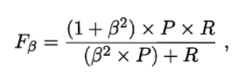

# 第2章 模型评估与选择

## 2.1 经验误差与过拟合

**训练误差（training error）/或经验误差（empirical error）**

学习器在训练集上的误差

**泛化误差（generalization error）**

在新样本上的误差

**过拟合（overfitting）**

学习器学的太好，把训练样本自身的一些特点当做了所有潜在样本都会具有的一般性质，导致泛化性能下降

**欠拟合（underfitting）**

指对训练样本的一般性质尚未学好

**模型选择（model selection）**

当使用不同的参数配置，也会产生不同的模型，我们应该选择哪一个学习算法、使用哪一种参数配置？这就是机器学习中的“模型选择”问题。

## 2.2 评估方法

**测试集（testing set）**

用于测试学习器对新样本的判别能力。

**测试误差（testing error）**

作为泛化误差的近似

既要训练又要测试，有什么方法呢？

### 2.2.1 留出法

**留出法（hold-out）**

直接将数据集D划分为两个互斥的集合，其中一个集合作为训练集S,另一个作为测试集T。在S上训练出模型后，用T来评估其测试误差，作为对泛化误差的估计。

**注意：**

训练/测试集的划分要尽可能保持数据分布一致性，避免因数据划分过程引入额外的偏差而对最终结果产生影响。

**从采样（sampling）的角度来看待数据集的划分过程**

保留类别比例的采样方式通常称为“分层采样”（stratified sampling）

不同的划分将导致不同的训练/测试集

**保真性（fidelity）**

**常见做法**

将大约2/3~4/5的样本用于训练，剩余的样本用于测试

### 2.2.2 交叉验证法

交叉验证法（cross validation）先将数据集D划分为k个大小相似的互斥子集，每个子集D_i都尽可能保持数据分布的一致性，即从D中通过分层采样得到。然后，每次用k-1个子集的并集作为训练集，余下的那个子集作为测试集；这样就可获得k组训练/测试集，从而可进行k次训练和测试，最终返回的是这个k个测试结果的均值。

通常把交叉验证法称为“k折交叉验证”（k-fold cross validation）

k最常用的取值是10，此时称为10折交叉验证

k折交叉验证通常要随机使用不同的划分重复p次

**留一法（Leave-One-Out——LOO）**

交叉验证的特例，与初始数据集相比只少了一个样本。留一法的评估结往往被认为比较准确。

**缺陷：**

在数据集较大时，训练m个模型的计算开销可能是难以忍受的。

### 2.2.3 自助法

**自助法（bootstrapping）**

减少训练样本规模不同造成的影响，同时还能比较高效地进行实验估计

直接以自助采样法（bootstrap sampling）为基础，给定包含m个样本的数据集D，我们对它进行采样产生数据集D’，每次随机从D总挑选一个样本的数据集D‘，然后再将该样本放回初始数据集D中，使得该样本在下次采样时仍有可能被采到，这个过程重复执行m次后，我们就得到了包含m个样本的数据集D’，这就是自助采样的结果。

**包外估计（out-of-bag estimate）**

**优点：**

自助法在数据集较小，难以有效划分训练/训练测试集时很有用处。

**缺点：**

自助法产生的数据集改变了初始数据集的分布，这会引入估计偏差

### 2.2.4 调参与最终模型

大多数学习算法都有写参数（parameter）需要设定，参数配置不同，学习模型的性能往往有显著的差别。除了要对使用学习算法进行选择，还需要对算法那参数进行设定，这就是通常所说的“参数调节”或简称“调参”（parameter tuning）。

**另外注意：**
我们通常把学得模型在实际使用中遇到的数据称为测试数据，为了加以区分，模型评估与选择中用于评估测试的数据集常称为“验证集”（validation set）

## 2.3 性能度量

**性能度量（performance measure）**

衡量模型泛化能力的评价标准

**均方误差（mean squared error）**

回归任务最常用的性能度量

更一般的，对数据分布D个概率密度函数p(·)，均方误差的描述

### 2.3.1 错误率与精度

**错误率**

分类错误的样本数占样本总数的比例

更一般的，对数据分布D个概率密度函数p(·)，的错误率

**精度**

分类正确的样本数占样本总数的比例

更一般的，对数据分布D个概率密度函数p(·)，的精度

### 2.3.2查准率、查全率与F1

查准率（precision）与查全率（recall）用于满足更加细致的需求，也是一种性能度量

**TP**：真正例（true positive）

**FP**：假正例（false positive）

**TN**：真反例（true negative）

**FN**：假反例（false negative）

TP+FP+TN+FN = 样例总数

| 真实情况 | 预测结果     | 预测结果     |
| -------- | ------------ | ------------ |
| 真实情况 | 正例         | 反例         |
| 正例     | TP（真正例） | FN（假反例） |
| 反例     | FP（假正例） | TN（真反例） |

查准率P和查全率R分别定义为

查准率和查全率是一对矛盾的度量

**P-R图**可以直观地显示出学习器在样本总体上的查全率、查准率

若一个学习器的P-R曲线被另一个学习器的曲线完全“**包住**”，则可断言后者的性能优于前者

如果发生了交叉，但是我们还是想要比较高下，这时一个比较合理的判断是比较P-R曲线下**面积的大小**

**平衡点（Break-Even Point——BEP）**

它是查**准率 = 查全率**时的取值

**F1度量（是BEP的优化）**

基于查准率与查全率的调和平均（harmonic mean）

**F_β（F1度量的一般形式）**

用于对查准率与查全率不同的需求

能够让我们表达出队查准率/查全率的不同偏好

**再多个混淆矩阵上综合考察查准率和查全率**

先计算查准率和查全率，然后再计算平均值

宏查准率（macro-P）

宏查全率（macro-R）

宏F1（macro-F1）

**先对混淆矩阵（误差矩阵）进行平均，得到TP、FP、TN、FN的平均值，在计算出查准率，查全率**

微查准率（micro-P）

微查全率（micro-R）

微F1（micro-F1）

### 2.3.3 ROC与AUC

很多学习器是为测试样本产生一个实值或概率预测，然后将这个预测值与一个分类阈值（threshold）进行比较，若大于阈值则分为正类，否则为反类。

重视“查准率”，选择排序中靠前的位置进行截断

重视“查全率”，选择排序中靠后的位置进行截断

为了综合考虑学习器在不同任务下的“泛化性能”的好坏，或者说“一般情况下”泛化性能的好坏。ROC曲线则思从这个角度出发来研究学习器泛化性能的有力工具

**ROC——受试者工作特征（Receiver Operation Characterristic）曲线**

与P-R曲线使用查准率。查全率为纵、横轴不同，ROC曲线的纵轴是**“真正例率**”（True Positive Rate,简称TPR），横轴是“**假正例率**”（False Positive Rate，简称FPR）

**AUC（Area under ROC Curve）**

若一个学习器的ROC曲线被另一个学习器的曲线完全“包住”，则可断言后者的性能优于前者。若两个学习器的ROC曲线发生交叉，那么合理的判据是比较ROC曲线下的面积，即AUC（Area under ROC Curve）

结合图表，这就是一个梯形公式

下图是另一种计算公式，给定m+个正例，m-个反例，令D+和D-分别表示正、反例集合，则排序“Loss”损失定义为

即考虑每一对正、反例，若正例的预测值小于反例，则记一个“罚分”，若相等，则记0.5个“罚分”、容易看出l_rank对应的是ROC曲线之上的面积。

为了帮助理解提供两个视频连接：

**master学堂**

https://www.bilibili.com/video/BV1H54y1D7or?share_source=copy_web

**小萌五分钟**

https://www.bilibili.com/video/BV1wz4y197LU?share_source=copy_web

### 2.3.4 代价敏感错误率与代价曲线

为了权衡不同类型错误所造成的不同损失，可为错误赋予**“非均等代价”（unequal cost）**

我们根据任务的领域知识设定一个**“代价矩阵”（cost matrix）**

其中cost_ij 表示将第i类样本预测为第j类样本的代价。

损失程度相差越大，cost01与cost02值的差别越大

在非均等代价下，我们所希望的不再是简单地最小化错误次数，而是希望最小化**“总体代价”（total cost）**

将上图第0类作为正类，第1类作为反类，D+与D-分别代表样例集D的正例子集，和反例子集，则**“代价敏感”（cost-sensitive）**错误率为

若令cost_ij中的i，j取值不限于0、1则可以定义出多分类任务的代价敏感性能度量

ROC曲线不能直接反映出学习器的期望总体代价，而**“代价曲线”（cost curve）**则可达到该目的。代价曲线图的横轴是取值为[0,1]的正例概率代价

其中p是样例为正例的概率；纵轴是取值为[0,1]的归一化代价

（“规范化”normalization 是将不同变化范围的值映射到相同的固定范围中，常见的是[0,1]，此时亦称“归一化”）

FPR是式子定义的假正例率，FNR=1-TPR是假反例率

## 2.4 比较检验

机器学习的性能比较，要比上面的更加复杂。

1. 我们希望比较的是泛化性能，然而通过实验评估方法我们获得的是测试集上的性能，两者的对比结果可能未必相同。
2. 测试集上的性能与测试集本身的选择有很大的关系，且不论使用不同大小的测试集会得到不同的结果，即便使用相同大小的测试集，若包含的测试样例不同，测试结果也会不同。
3. 很多机器学习算法本身有一定的随机性，即便用相同的参数设置在同一个测试集上多次运行，其结果也会有所不同。

统计假设检验（hypothesis test）为我们进行学习器性能比较提供了重要依据。

本节默认以错误率为性能度量，用ε表示

### 2.4.1 假设检验

 (看不懂)

二项检验（binomial test）

置信度（confidence）

t检验（t-test）

双边（two-tailed）

### 2.4.2 交叉验证t检验

使用了5x2交叉验证，能大概看懂

成对t检验（paired t-tests）

### 2.4.3 McNemar检验

列联表（contingency table）

### 2.4.4 Friendman检验与Nemeny后续检验

## 2.5 偏差与方差

“偏差—方差分解”（bias-variance decompose）是解释学习算法泛化性能的一种重要工具

偏差—方差分解，试图对学习算法的期望泛化错误率进行拆解

泛化误差可分解为偏差、方差、与噪声之和

期望输出与真实标记的差别称为偏差（bias）

偏差、方差、噪声的含义：

- 偏差：度量了学习算法的期望预测与真实结果的偏离程度，即刻画了学习算法本身的拟合能力
- 方差：度量了同样大小的训练集的变动所导致的学习性能的变化，即刻画了数据扰动所造成的影响
- 噪声：表达了在当前任务上任何学习算法所能达到的期望泛化误差的下界，即刻画了学习问题本身的难度

偏差—方差分解说明，泛化性能是由学习算法的能力、数据的充分性以及学习任务本身的难度所共同决定的。

**偏差—方差窘境（bias-variance dilemma）**

偏差与方差是有冲突的，这称为偏差—方差窘境（bias-variance dilemma）

## 2.6 阅读材料

机器学习过程设计许多类型的代价，除了误分类代价，还有测试代价、标记代价、属性代价等，即便仅考虑误分类代价，仍可进一步划分为基于类别的误分类代价以及基于样本的误分类代价。

**代价敏感学习（cost-sensitive learning）**

专门研究非均等代价下的学习

# 第2章 线性模型

## 3.1 基本形式

线性模型（linear model）试图学得一个通过属性的线性组合来进行预测的函数。

## 3.2 线性回归

线性回归（linear regression）

线性回归试图学得一个线性模型以尽可能准确地预测实值输出标记。

均方误差有非常好的集合意义，它对应了常用的欧几里得距离或简称“欧氏距离”（Euclidean distance）。

基于均方误差最小化来进行模型求解的方法称为“最小二乘法”（learning square method）

在线性回归中，最小二乘法就是试图找到一条直线，使所有样本到直线上的欧氏距离之和最小

多元线性回归（multivariate linear  regression）

对数线性回归（log-linear regression）

广义线性模型（generalized linear model）

联系函数（link function）

## 3.3 对数几率回归

若要做分类任务怎么办？

只需要找一个单调可微单调函数将分类任务的真实标记y与线性回归模型的预测值联系起来

“替代函数”（surrogate function）

“对数几率函数”（logistic function）

“对数几率回归”（logistic regression 亦称 logit regression）

“极大似然法”（maximum likelihood method）

"对数似然"（log-likelihood）

## 3.4 线性判别分析

**线性判别分析（Linear Discriminant Analysis 简称LDA）**

线性判别分析是一种经典的线性学习方法，在二分类问题上应为最早由Fisher提出，亦称“Fisher 判别分析”

**LDA思想**

给定训练样例集，设法将样例投影到一条直线上，使得同类样例的投影点尽可能接近、异类样例的投影点尽可能远离；在对新样本进行分类时，将其投影到同样的这条直线上，再根据投影点的位置来确定新样本的类别。

类内散度矩阵（within-class scatter matrix）

类间散度矩阵（between-class scatter matrix）

广义瑞利商（generalized Rayleigh quotient）

## 3.5 多分类学习

在更多的情形下，我们基于一些基本策略，利用二分类学习器来解决多分类问题

**多分类学习的基本思想**

“拆解法”，即将多分类任务拆为若干个二分类任务求解。

具体来说：先对问题进行拆分，然后为拆出的每个二分类任务训练一个分类器，在测试时，对这些分类器的预测结果进行集成以获得最终的多分类结果。

**最经典的拆分策略有三种**

- 一对一（One vs. One 简称OvO）
- 一对其余（One vs. Rest 简称OvR）
- 多对多（Many vs. Many 简称MvM）

**MvM技术：“纠错输出码”（Error Correcting Output Codes，简称ECOC）**

ECOC是将编码的思想引入类别拆分，并尽可能在解码过程中具有容错性。

类别划分通过“编码矩阵”（coding matrix）指定。

编码矩阵有多种形式，常见的主要有二元码和三元码

- 二元码
  - 将每个类别分别指定为正类和反类
- 三元码
  - 在正反类之外，还可以指定“停用类”

**为什么称为“纠错输出码”呢？**

这是因为在测试阶段，ECOC编码对分类器的错误有一定的容忍和修正。

## 3.6 类别不平衡问题

前面介绍的分类学习方法都有一个共同的基本假设，即不同类别的训练样例数目相当。如果不同类别的训练样例数目稍微有差别，通常影响不大，但若差别很大，则会对学习过程造成困扰。

**类别不平衡（class-imbalance）**

类别不平衡就是指分类任务中不同类别的训练样例数目差别很大的情况。

**再缩放（rescaling）——（亦称“再平衡”—rebalance）**

**再缩放技术大体上有三类做法**

- 对训练集里的反类样例进行“欠采样”（undersampling）
  - 即去除一些反例使得正、反例数目接近，然后再进行学习
- 对训练集里的正类样例进行“过采样”（oversampling）
  - 即增加一些正例使得正、反例数目接近，然后再进行学习
- 阈值移动（threshold-moving）
  - 直接基于原始训练集进行学习，但在用训练好的分类器进行与测试，将式子嵌入到其决策过程中

**值的一提**

"再缩放"也是”代价铭感学习“（cost-sensitive learning）的基础。

## 3.7 阅读材料

“稀疏表示”（sparse representation）

“稀疏性”（sparsity）

代价敏感学习中研究得最多的是基于类别的“误分类代价”（misclassificatin cost）

“多标记学习”（multi-label learning ）这是机器学习中近年来相当活跃的一个研究领域

# 第四章 决策树

## 4.1 基本流程

**决策树（decision tree）**

是一类常见的机器学习方法

决策树是基于树结构来进行决策的，这恰是人类在面临决策问题时一种很自然的处理方式。

**一般的一棵决策树包含一个根结点、若干个内部结点和若干个叶结点**

- 叶结点对应于决策结果，其他每结点则对应于一个属性测试
-  每个结点包含的样本集合根据属性测试的结果被划分到子结点中
- 根结点包含样本全集，从根结点到每个叶结点的路径对应了一个判定测试序列。
- 决策树学习的目的是为了产生一棵泛化能力强，即处理未见示例能力强的决策树，其基本流程遵循简单且直观的“分而治之”（divide-and-conquer）策略

在决策树基本算法中，有三种情形会导致递归返回：

1. 当前结点包含的样本全属于同一类别，无需划分
2. 当前属性集为空，或是所有样本在所有属性上取值相同，无法划分
3. 当前结点包含的样本集合为空，不能划分

## 4.2 划分选择

决策树学习的关键是如何选择最优划分属性

随着划分过程不断进行，我们希望决策树的分支结点所包含的样本尽可能属于同一类别，即结点“纯度”（purity）越来越高。

### 4.2.1 信息增加

“信息熵“（information entropy）是度量样本集合纯度最常用的一种指标

”信息增加“（information gain）

一般而言，信息增益越大，则意味着使用属性a来进行划分所得的“纯度提升”越大，因此，我们可用信息增益来进行决策树的划分属性选择。

### 4.2.2 增益率

实际上，信息增益准则对可取值数目较多的属性有所偏好，为减少这种偏好可能带来的不利影响，著名的C4.5决策树算法不直接使用信息增量，而是使用“增益率”（gain ratio）来选择最优划分属性。

需要注意的是，增益率准则对可取值数目较少的属性有所偏好，因此C4.5算法并不是直接选择增益率最大的候选划分属性，而是使用了一个启发式：先从候选划分书信中找出新消息增益高于平均水平的属性，再从中选择增益率最高的。

### 4.2.3 基尼指数

CART决策树使用“基尼指数”（Gini index）来选择划分属性

直观来说，Gini(D)反应了从数据集D中随机抽取两个样本，其类别标记不一致的概率。因此，Gini(D)越小，则数据集D的纯度越高。

## 4.3 剪枝处理

剪枝（pruning）是决策树学习算法对付“过拟合”的主要手段

**决策树剪枝的基本策略有“预剪枝”（prepruning）和“后剪枝”（postpruning）**

- 预剪枝
  - 在决策树生成过程中，对每个结点在划分前先进行估计，若当前结点的划分不能带来决策树泛化性能提升，则停止划分并将当前结点标记为叶结点。
- 后剪枝
  - 先从训练集生成一棵完整的决策树，然后自底向上地对非叶结点进行考察，若将该结点对应的子树替换为叶结点能带来决策树泛化性能提升，则将该子树替换维叶结点。

### 4.3.1 预剪枝

预剪枝要对划分前后的泛化性能进行估计

预剪枝使得决策树的很多分支都没有“展开”，这不仅降低了过拟合的风险，还显著减少了决策树的训练时间开销和测试时间开销。但另一方面，有些分支的当前划分虽不能提升泛化性能、甚至可能导致泛化性能暂时下降，但在其基础上进行的后续划分却有可能导致性能显著提高。

预剪枝基于“贪心”本质禁止这些分支展开，给预剪枝决策树带来了欠拟合的风险。

### 4.3.2 后剪枝

后剪枝决策树通常比预剪枝决策树保留了更多的分支。一般情况下，后剪枝决策树的欠拟合风险很小，泛化性能往往优于预剪枝决策树。但后剪枝过程是在生成完全决策树之后进行的，并且要自底向上地对树种的所有非叶结点进行逐一考察，因此其徐那脸时间开销比未剪枝决策树和预剪枝决策树都要大得多。

## 4.4 连续与缺失值

讨论如何在决策树学习中使用连续属性

连续属性离散化技术派上了用场。最简单的策略是采用二分法（bi-partition）对连续属性进行处理。

需要注意的是，与离散属性不同，若当前结点划分属性为连续属性，该属性还可作为其后代结点的划分属性。

### 4.4.2 缺失值处理

现实任务重常会遇到不完整样本，即样本的某些属性值缺失。如果简单地放弃不完整的样本，仅使用过无缺失值的样本来进行学习，显然是对数据信息极大的浪费。

**我们需要解决两个问题**

1. 如何在属性值缺失的情况下进行划分属性选择？
2. 给定划分属性，若样本在该属性上的值缺失，如何对样本进行划分？

## 4.5 多变量决策树

“多变量决策树”（multivariate decision tree）就是能实现这样的“斜划分”甚至更复杂划分的决策树。

与传统的“单变量决策树”（univariate decision tree）不同，在多变量决策树的学习过程中，不是为每个非叶结点寻找一个最优划分属性，而是试图建立一个合适的线性分类器。

## 4.6 阅读材料

有一些决策树学习算法可进行“增量学习”（incremental learning），即在接收到新样本后可对已学得的模型进行调整，而不用完全重新学习。主要机制是通过调整分支路径上的划分属性次序来对数进行部分重构，代表性算法有ID4、ID5R、ITI等。

增量学习可有效地降低每次接收到新样本后的训练时间开销，但多步增量学习后的模型会与基于全部数据训练而得的模型有较大差别。

