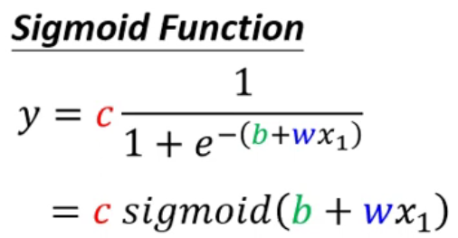
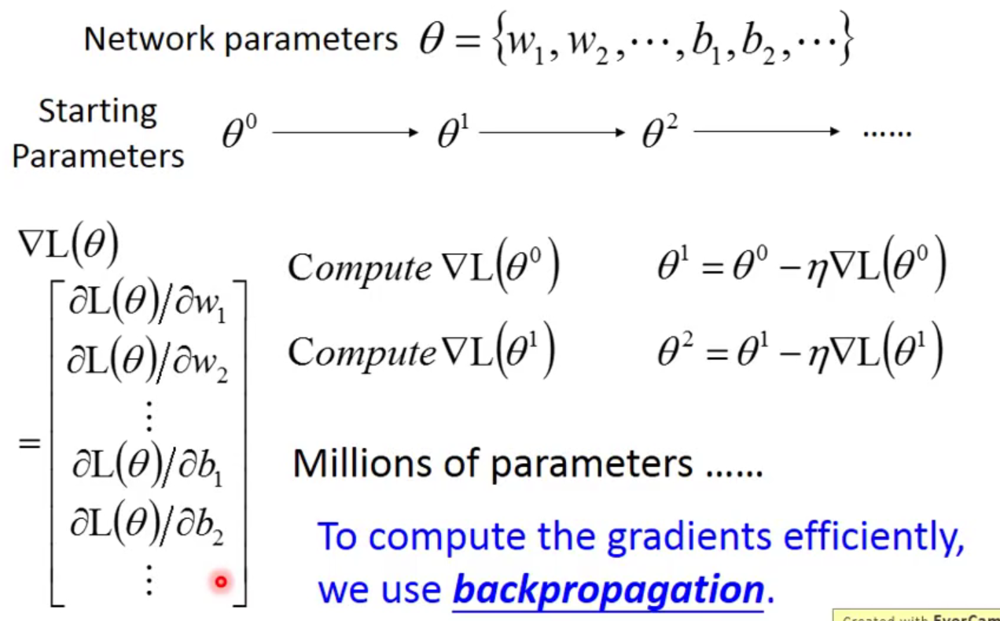

# 2021李宏毅机器学习笔记

## 机器学习基本概念简介

Regression ：回归

提供一些输入，机器计算后，提供一些输出

Classification：分类

设置一些类别，让计算机选择一个选项

Structured learning

让机器学会创造一些有结构的东西（写作，图片等）

训练的整个流程：

1. Function with Unknow Parameters
2. Define Loss from Training Data
   1. Loss is a function of parameters 
   2. Loss: how good a set of values is
3. Optimization（最佳化）
   1. 使用梯度下降等方法
      1. 注意可能会有局部最优解（local minima与 global minima）
   2. hyperparameters（超参数——在机器学习中需要自己设的东西：学习率等）
4. 训练之后，看数据，发现一些规律，在重新修改参数，进行新的训练

Liner model ：线性模型

piecewise Linear Curves：分段线性法（不同的线性函数组合成一条分段线性函数）

sigmoid function ：s型函数（x过大，趋近于1，过小趋近于0）

修改b,w,c会有不同的效果

累加不同的sigmoid function 就会得到一个更加复杂的函数（去逼近各式各样不同的function）

**New Model ：More Features（特征）**

结合得出更多复杂的式子，应对跟多的场景

最下面的图，解释了那个式子的所由的含义

这个式子，就是我们全新定义的function with unknow(未知的参数统一称为θ)

**Optimization of new Model**

对新的模型使用梯度下降(Gradient descent)等方法，继更新模型

batch：批处理——把大量的的资料，随机分成一组一组的东西，一组东西就是一个batch

求Loss： 拿一组batch，来计算一次Loss——L_(n)，然后去更新西塔

epoch: see all the batch (将batch都看过一遍)

update：每一次计算Loss来更新参数θ，就称为一次update

所以这么来看，一次epoch并不是更新一次参数，更具batch的分配，和数据量的大小决定

**所以到目前Hyperparameters（超参数）有：**

学习率，sigmoid，Batch Size

**ReLU(线性整流函数)**

c max(0, b + w*x_1)

两个ReLU就能够组成一个Sigmoid函数

用ReLU替代Sigmoid，就只要把i变为2i

**Activation function（激活函数）**

上面两个式子统称为激活函数

继续修改我们的模型，反复多做几次，做几次？（这也是一个Hyper Parameter）

这一个小计算就是Neuron

所有的统称Neural Network（神经网络）

每一排Neural 称之为Layer（层）

它们有的叫Hidden Layer

**Many Hidden Layer means Deep ——> Deep Learning（深度学习）**

为什么需要将network变的更深，而不是平铺，直接把函数变的（fat）排成排足够复杂

## Google Colab教学

## Pytorch 教学 part 1

Tensor ：High-dimensional matrix(array)（高纬度的矩阵） 

Tensor-- Data Type

| Data type              | dtype       | tensor            |
| ---------------------- | ----------- | ----------------- |
| 32-bit floating point  | torch.float | torch.FloatTensor |
| 64-bit integer(signed) | torch.long  | torch.LongTensor  |

Tensor-- Shape of Tensors(Tensor 的形状)

Tensor --Constructor(如何产生tensor)

就是讲一些对高维矩阵的一些代码操作，到时候需要了再看

## 深度学习简介

The Steps for Deep Learning 

1. define a set of function
2. goodness of function 
3. the best function

**Deep Learning 也是一个Neural Network**

可以用不同的方法连接不同的Neural，就得到了不同的structure

在Neural Network里有一堆Logistic Regression，每个Logistic Regression 都有自己的weight和bias，这些weight好bias结合起来，就是network的parameter（用θ来描述）

如何连接起来呢？

有不同的方法：

**Fully Connect Feedforward Network（全连接前向传播神经网络）** 

每一组Neural 都有一组weight和bias——根具training data去找出来的 

一个Neural network 就可以看作是一个function，它的input是一个vector，它的output是另一个vector（矢量）

Given network structure define a function set

in general

就是下面这张图

输入层 input layer

输出层 output layer

隐藏层 Hidden layer

Deep = Many hidden layers

**matrix operation（矩阵运算）**

把weight 和 bias都变为矩阵的形式

去理解图片

Using parallel computing techniques to speed up matrix operation(使用并行计算技术来加速矩阵运算——GPU)

feature engineering：特征工程

feature extractor replacing：特征提取器更换

feature transformation：特征变换

Multi-class Classifier：多类分类器

softmax：归一化指数函数

通过Hidden Layers计算获得更好的feature

**How many layers? How many neurons for each layer?**（如何确定层，和每层神经元的数量）

Trail and Error  + Intuition

**Can the structure be automatically determined?**（有结构可以自行决定吗）

E.g. Evolutionary Artificial Neural Networks

**Can we design the network structure?**（我们可以自己定义网络结构吗）

Convolutional Neural Network(CNN)(（卷积神经网络）

**Loss for an Example**

Cross Entropy（交叉熵）

我们要让Cross Entropy 越小越好

**Total Loss**

上图使用的方法就是 Gradient Descent（梯度下降）

Backpropagation（反向传播）：an efficient way to compute  ∂L / ∂w in Neural network

## 反向传播（Backpropagation）

**Gradient Descent**

 To compute the gradients efficiently, we use backpropagation

**Chain Rule**（链式法则）

**Backpropagation**

C^n 是y^n 与y^n/head 的距离，距离越大就说明误差越大，计算Total Loss

**Backpropagation - Forward pass**

向前传播

**Backpropagation - Backward pass**

向后传播

套娃

正难则反，反过来做，就简单了

**Backpropagation - Summary**

首先做Forward Pass，只要知道这一个activation function的output（就是它所连接weight 的 ∂z / ∂w ）

在Backward pass里面，你把原来的neural network 的方向倒过来，每一个三角形的network 就是 ∂C / 偏微分z

将上面两个偏微分乘起来，就知道某一个weight对w的偏微分是什么

我自己来个解释，就是首先Forward Pass，获得最终我们预测的值，然后通过这个预测值，我们就能够计算其值的误差。然后在通过Backward path到前面，计算每一个权重对总误差的偏微分（应为我们通过向前传播知道了这个值），这时候我们理解一下偏微分的导数的图像。是一个U形，然后我们去理解梯度下降，就明白我们让他的权重是下降还是上升。然后再一步一步向前传递，将所有的权重，进行一次更替（注：这些误差都是拿的原始权重进行的计算出来的）。在更替后，在进行第二次Forward pass 然后再继续Backward Pass

这应该就是Backpropagation （BP算法）

## 机器学习任务攻略

General Guide

- loss on training data
  - large
    - model bias
      - make your model complex
      - The model is too simple
      - Solution ：redesign your model to make it more flexible 
    - optimization（最佳化——不太好）
      - Large Loss not always imply model bias. There is another possibility (Gradient descent 到了局部最优解)
    - 如何判定是上面的哪一种问题
      - Gaining the insights from comparison
      - Start from shallower networks (or other models),which are easier to optimize
      - if deeper networks do not obtain smaller loss on **training data**, then there is optimization issue.
  - small
    - loss on testing data
      - large
        - overfitting（过拟合）
          - small loss on training data, large loss on testing data. Why?
          - more training data (not in HWs) data augmentation make your model simpler
          - 给你的model一些限制
            - Less parameters, sharing parameters
            - Less features
            - Early stopping
            - Regularization
            - Dropout
          - 验证model是否合适
            - 分成训练集（Training Set），验证集（Validation Set）和测试集（Testing Set）
              - N-fold Cross Validation（更好的验证方式——交叉验证）
                - 
            - Using the results of public testing data to select your model 
        - mismatch
          - Your training and testing data have different distributions(分布)
          - Most HWs do not have this problem,except HW11
      - small
        - (*^▽^*)

Bias-Complexity Trade-off（偏差平衡）

寻找最适合的模型

## 类神经网络训练不起来怎么办（一）局部最小值与鞍点

局部最小值（local minimal）与鞍点（saddle point）

