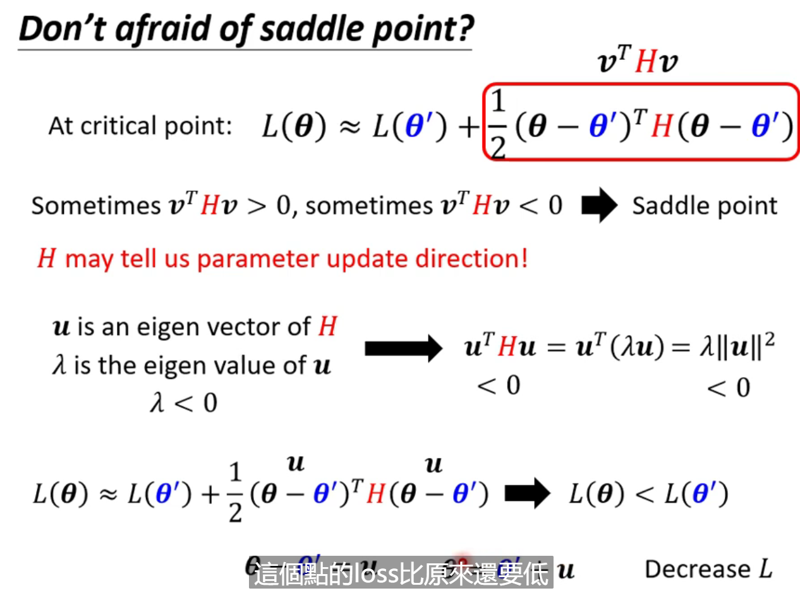
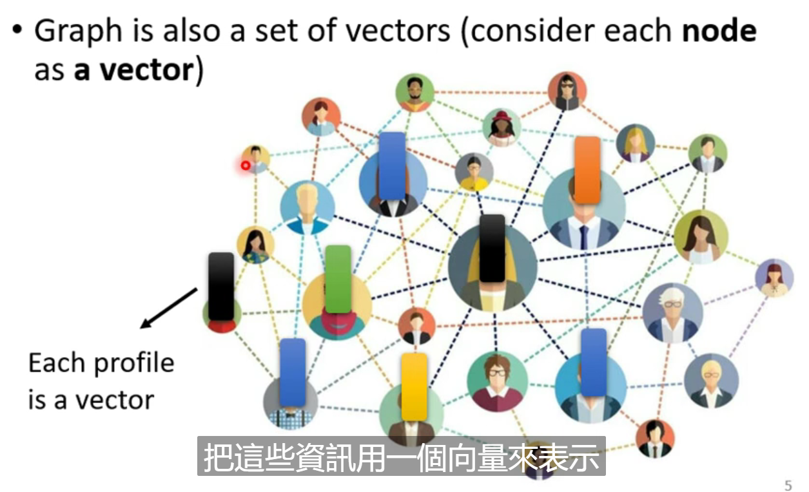
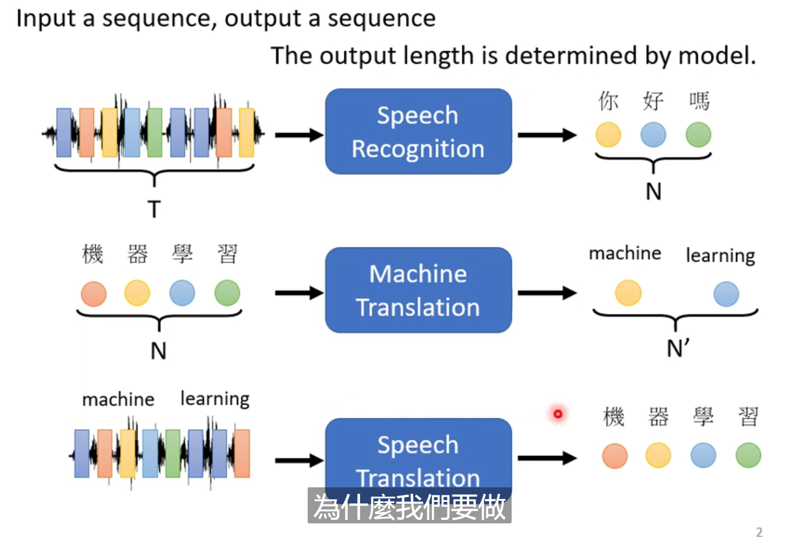
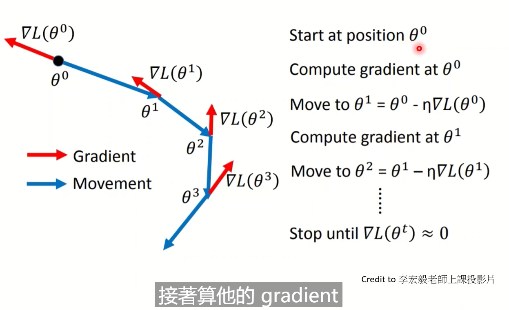
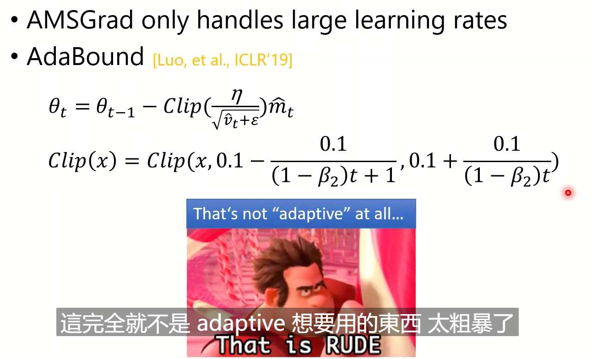
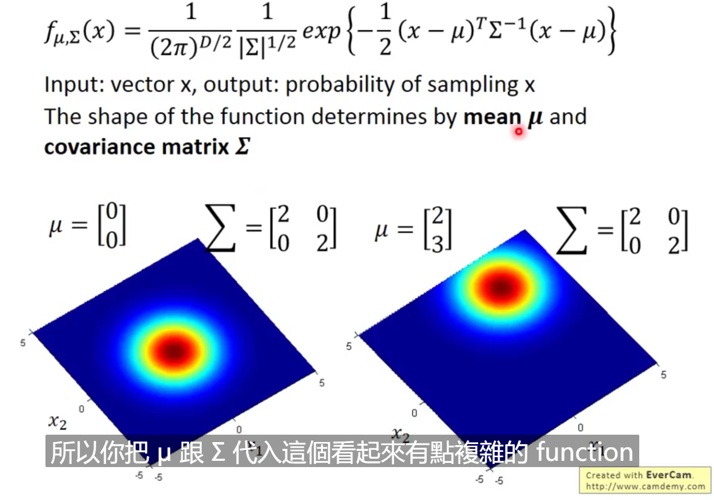
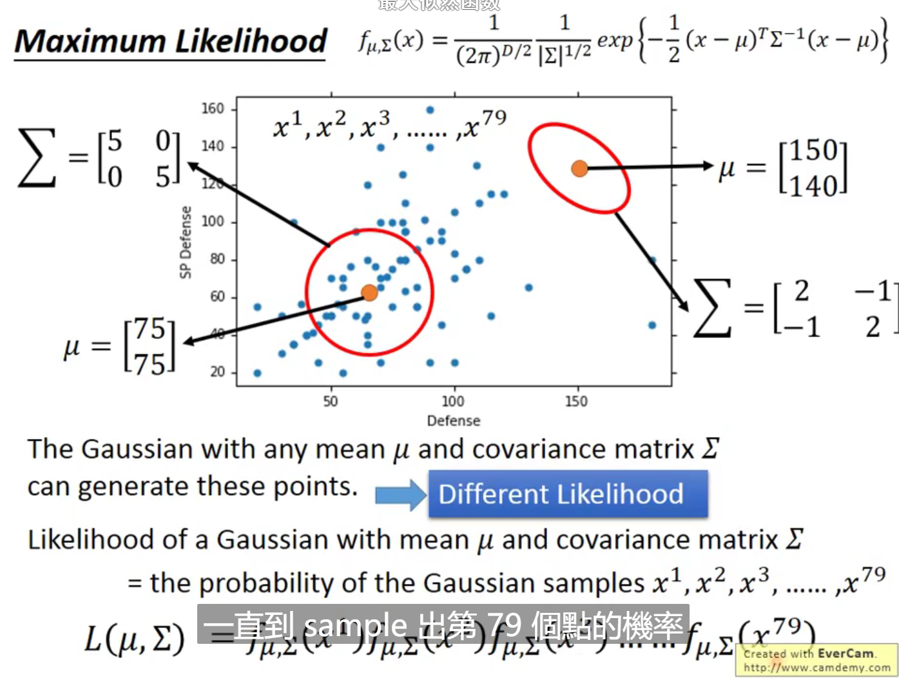
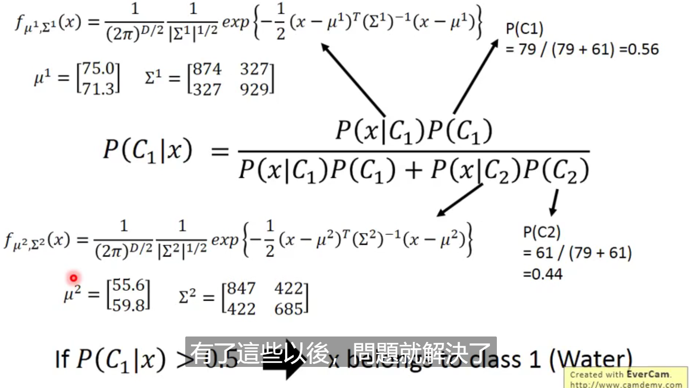

# 机器学习基本概念简介

Regression ：回归

提供一些输入，机器计算后，提供一些输出

Classification：分类

设置一些类别，让计算机选择一个选项

Structured learning

让机器学会创造一些有结构的东西（写作，图片等）

训练的整个流程：

1. Function with Unknow Parameters
2. Define Loss from Training Data
   1. Loss is a function of parameters 
   2. Loss: how good a set of values is
3. Optimization（最佳化）
   1. 使用梯度下降等方法
      1. 注意可能会有局部最优解（local minima与 global minima）
   2. hyperparameters（超参数——在机器学习中需要自己设的东西：学习率等）
4. 训练之后，看数据，发现一些规律，在重新修改参数，进行新的训练

Liner model ：线性模型

piecewise Linear Curves：分段线性法（不同的线性函数组合成一条分段线性函数）

sigmoid function ：s型函数（x过大，趋近于1，过小趋近于0）

修改b,w,c会有不同的效果

累加不同的sigmoid function 就会得到一个更加复杂的函数（去逼近各式各样不同的function）

**New Model ：More Features（特征）**

结合得出更多复杂的式子，应对跟多的场景

最下面的图，解释了那个式子的所由的含义

这个式子，就是我们全新定义的function with unknow(未知的参数统一称为θ)

**Optimization of new Model**

对新的模型使用梯度下降(Gradient descent)等方法，继更新模型

batch：批处理——把大量的的资料，随机分成一组一组的东西，一组东西就是一个batch

求Loss： 拿一组batch，来计算一次Loss——L_(n)，然后去更新西塔

epoch: see all the batch (将batch都看过一遍)

update：每一次计算Loss来更新参数θ，就称为一次update

所以这么来看，一次epoch并不是更新一次参数，更具batch的分配，和数据量的大小决定

**所以到目前Hyperparameters（超参数）有：**

学习率，sigmoid，Batch Size

**ReLU(线性整流函数)**

c max(0, b + w*x_1)

两个ReLU就能够组成一个Sigmoid函数

用ReLU替代Sigmoid，就只要把i变为2i

**Activation function（激活函数）**

上面两个式子统称为激活函数

继续修改我们的模型，反复多做几次，做几次？（这也是一个Hyper Parameter）

这一个小计算就是Neuron

所有的统称Neural Network（神经网络）

每一排Neural 称之为Layer（层）

它们有的叫Hidden Layer

**Many Hidden Layer means Deep ——> Deep Learning（深度学习）**

为什么需要将network变的更深，而不是平铺，直接把函数变的（fat）排成排足够复杂

# 机器学习任务攻略

General Guide

- loss on training data
  - large
    - model bias
      - make your model complex
      - The model is too simple
      - Solution ：redesign your model to make it more flexible 
    - optimization（最佳化——不太好）
      - Large Loss not always imply model bias. There is another possibility (Gradient descent 到了局部最优解)
    - 如何判定是上面的哪一种问题
      - Gaining the insights from comparison
      - Start from shallower networks (or other models),which are easier to optimize
      - if deeper networks do not obtain smaller loss on **training data**, then there is optimization issue.
  - small
    - loss on testing data
      - large
        - overfitting（过拟合）
          - small loss on training data, large loss on testing data. Why?
          - more training data (not in HWs) data augmentation make your model simpler
          - 给你的model一些限制
            - Less parameters, sharing parameters
            - Less features
            - Early stopping
            - Regularization
            - Dropout
          - 验证model是否合适
            - 分成训练集（Training Set），验证集（Validation Set）和测试集（Testing Set）
              - N-fold Cross Validation（更好的验证方式——交叉验证）
                - 
            - Using the results of public testing data to select your model 
        - mismatch
          - Your training and testing data have different distributions(分布)
          - Most HWs do not have this problem,except HW11
      - small
        - (*^▽^*)

Bias-Complexity Trade-off（偏差平衡）

寻找最适合的模型

# 类神经网络训练不起来怎么办

## 1.局部最小值与鞍点

！！需要去理解Tayler Series Approximation（泰勒展开式）

局部最小值（local minimal）与鞍点（saddle point）

gradient descent 没有办法再继续下降，可能是local minimal 或者是saddle point

**Tayler Series Approximation（泰勒展开式）**

听不懂就理解：下面式子L(θ)可以写成右边的这个式子 

然后通过红色框里面的式子Hessian，来确定是local minimal 还是 saddle point

下面就是对应需要的式子

然后就是计算这个式子，如果都是正的，就是local minimal，如果都是负的，就是local maximal 。如果有正有负。就是saddle point

下图就是Hessian的计算的一个例子，看看这个矩阵是怎样计算的

Critical point：临界点

Hessian 不仅可以告诉我们是不是saddle point，还可以给我们指明saddle point 优化的方向

但this method is seldom used in practice 应为它的计算量有点大，还有其他一些好的方法去寻找，所以一般很少用

**saddle point V.S. Local Minima**

会不会在低维度是local minima，会不会在高纬度中就是一个saddle minima

when you have lots of parameters, perhaps local minima is rare

**Empirical study(证实研究)**

minimum ratio = (Number of positive Eigen values)/(Number of Eigen values)

根据下图研究数据表明，minimum ratio 其实是非常难达到全部 positive Eigen values，最好也只有一半出出头，这就说明，我们还有一半的Eigen values 没有达到最低点，还有一半的路可以让loss下降，所以我们的模型，其实达到local minimal 是一个概率非常小的事情。

## 2.局部批次与动量

批次（Batch）与动量（Momentum）

### Batch 局部批次

**Review ：Optimization with Batch**

Shuffle：洗牌，每一个Epoch的batch都不一样，当Epoch一次后，会重新分配batch

为什么要使用batch呢？

**Small Batch V.S. Large Batch**

左边训练的时间比较长，右边的训练时间比较短

左边走的比较稳，右边走的相对不稳

考虑平行运算，左边的运算时间不一定比较长

要考虑GPU平行运算的极限

应为有平行运算的能力，所以小的batch，可能会让epoch时间反而太长，大的batch反而更有效率

**与直觉相反的是，Noisy的Gradient 反而可以帮助training**

batch size越大 validation Acc上的结果越差 

Smaller batch size has better performance

What's wrong with large batch size? ——Optimization Fails

**为什么会出现这样的状况？**

小的batch，会让训练数据有差异，这样可以让让gradient descent时可能在这个batch上训练点卡住，但是下一个batch上，就不一定会卡住。

smaller batch size has better performance 

"Noisy" update is better for training

**小的batch 也是对testing data也有帮助**

下图为实验结果

下图是一个解释，不一定准确

小的batch更容易跳出峡谷，大的batch不容易跳出峡谷

下图是两者的比较

那么能不能鱼和熊掌都兼得呢？

有可能有很多文章，可以自行搜索。

**Have both fish and bear's paws?**

### **Momentum 动量梯度下降法**

考虑到物理的动量，解决局部最优解的问题

**（Vanilla-一般）Gradient descent**

**Gradient Descent +Momentum**

Movement : movement of last step minus gradient at present (最后一步的运动减去当前的坡度)

Movement not just based on gradient ,but previous movement 

不止考虑当前的gradient,而是考虑过去所有gradient的总和

这就是加上动量的好处

 

即时临时走到了一个小高点，会因为有之前的动量，而使得其能够冲出局部最优解

### Concluding Remarks

- Critical points have zero gradients
- Critical points can be either saddle points or local minima
  - Can be determined by the Hessian matrix(可以有Hessian 矩阵确定吗)
  - It is possible to escape saddle points along the direction of eigenvectors（特征向量） of the Hessian matrix.
  - Local minima may be rare（少见）.
- Smaller batch size and momentum help escape critical points（临界点）.

## 3.自动调整学习率

学习率（Learning Rate）

**Training stuck(卡住) ≠ Small Gradient**

可能是出现了以下的状况

**Training can be difficult even without critical points**

可能出现了一下的状况

参数才山壁两端振荡（learning rate 太大）

走的太慢（learning rate 太小）

所以Learning rate cannot be one-size-fits-all

**Different parameters needs different learning rate**

Formulation for one parameter(单参数公式)

**Root Mean Square(均方根)**

在这一方法被用在Adagrad的方法里边

为什么上面的方法是有用的呢？

通过这样子，就能够在平缓的时候，让它步长变大，在陡峭的时候，让他步长变小。其中g是gradient descent.

**Learning rate adapts dynamically(学习率是动态适应的)**

Error Surface(面) can be very complex

**RMSProp（这是一个动态修改学习率的方法）**

添加一个确定之前学习率重要性的参数

是上文方法的改进

The recent gradient has larger influence, and the past gradients have less influence.(最近梯度下降影响较大，之前梯度下降影响最小)

**Adam : RMSProp + Momentum(动量)**

这是现在最常用的optimization的策略

添加自动调整学习率的方法之后的效果

为什么会出现走到最后，出现误差激增的失误？

是应为在走直线之后，在横轴走出一段路后，纵轴应为gradient descent 很少，就是的上面的σ在纵轴会变得很小，这就会使得纵轴的学习率激增，而导致爆出。然后再重新调整回来。

**Learning Rate Scheduling（学习速率调整）**

如何解决上面把爆出的问题？

**Learning Rate Decay（学习速率衰减）**

随着时间不断的进行，随着参数不断的update，我们让学习率η越来越小

as the training goes, we are closer to the destination (目的地),so we reduce the learning rate

另一种方法

**Warm Up（热身）**

Increase and then decrease?（先增加，后减少？）

就像是一个黑科技

下图有对应的实验论文

为什么需要Warm Up？（还没有完全解答，还可以研究）

一开始我们的参数是不精准的，所以先探索情报，然后再让学习率慢慢趴升（这只是一种解释）

### Summary of Optimization 

Momentum ：weighted sum of the previous gradients(前一个梯度的加权和)

root mean square of the gradients（梯度的均方根）

## 4.损失函数也可能有影响

损失函数（Loss）

Classification as Regression ?

Class as one-hot vector(单热点向量)

在分类问题中，y不是一个数值，而是一个向量

对于classification要通过softmax函数计算新的y‘，然后在和最终的结果做比较

Soft-max做的事情就是，本来y中可以放任何值这件事情，改成挪到0到1之间

**Soft-max**

它如何运作

如果是两个class直接用sigmoid（与Soft-max是一样的）

**Loss of Classification**

分类的损失

下图是两种分类的方法

Mean Square Error（MSE）（均方误差）

Cross-entropy(交叉熵)

交叉熵更适合用在分类上，还没有解释原因

Minimizing cross-entropy is equivalent to maximizing likelihood (最小化交叉熵等于最大化可能性)（还没解释）

Soft-max 和Cross-entropy 往往是被绑在一起一起使用的

**从optimization方面说明为什么Cross-entropy比较好**

图中就是不同式子y1，y2不同的影响

Mean Square Error 在loss大和loss小的时候，都是非常平坦，这就使得在loss大的时候（training 会很艰难），很难走到loss小的地方，但是Cross-entropy就没有这个问题

Loss function 的定义都可能会影响你的training的艰难程度

问题：还没有理解这两种方法的根，可以继续去了解

## 5.批次标准化

批次标准化（Batch Normalization）

**Changing Landscape**（改变地形）

Batch Normalization 是一个铲平山的好方法

对于下图，举了一个简单的例子，个人感觉就是吴恩达老师提到的特征缩放的问题。我们意识到，对应dimension的值差距很大的话，我们走的路也是不一样的。如何让这个相对难走的地形变的更好走？让不同的dimension有同样的数值范围。

**Feature Normalization（特征归一化）**

下面所有解决问题的方法都统称特征归一化

下图方法为：每一个值减去中间值除以标注差（standard deviation）获得一个在0左右上下，小于1的值，这样就能够改变地形（和吴恩达老师的特征缩放是一样的方法）

In general feature normalization makes gradient descent converge(聚集) faster.

**Considering Deep Learning**

Different dims have different ranges.

Also difficult to optimize

所以还可以继续做feature normalization

Feature normalization 放在z还是放在a都是可以的，差异不大，如果中间的函数是Sigmoid 函数，那就放在z应为在0左右，sigmoid敏感度比较大

如何对z做normalization？

看上面和下面这两张图片，我们知道，第一z1会对第二个z2有影响，这就会导致接连的影响，从而就相当于一个大型的network。同时我们意识到，我们的data set是非常大的，那么我们就不会用全部的data set，而是使用拆分开来的batch来做一次normalization。这就是我们长说的batch normalization 。（注意：这就说明我们也需要一个比较大的batch）

下图又加上的β和γ，也想象成network中的参数。应为在通过normalization过后，会使得z系列的值平均一定为0，从而导致network一些限制，也许会带来负面影响。所以加β和γ来解除这些限制。

但是加上β和γ不就重新让他分布不均了吗？所以一开始β被定为0，γ被定为1。只有到后来找到好的error surface 或者其他好方法，才会把β和γ慢慢的加进去

**Batch normalization -Testing**

We do not always have batch at testing stage(我们并不总是在测试阶段有批次)

Computing the moving average of μ and σ of the batches during training （计算训练过程中各批次的μ和σ的移动平均值）

**Batch normalization**

黑色线没有使用batch normalization 

**Internal Covariate Shift?**

Batch normalization 为什么会有帮助

有解释，但是也是有争议

Batch normalization make a and a' have similar statistics (批处理规范化使a和a'具有相似的统计数据)

Experimental results do not support the above idea(实验结果并不支持上述观点)

Experimental results(and theoretically analysis )support batch normalization change the landscape of error surface.

(实验结果(和理论分析)支持批处理归一化改变误差表面的景观。)

也许batch normalization是一个偶然的发现

当然还有其他normalization，就可以自己找

# 卷积神经网络（CNN）

**Image Classification**

All the images to be classified have the same size.

Cross entropy：交叉熵

channels：通道，一张彩色图片都是有RGB三个颜色组成，3个channel 就代表了三个颜色

将所有的值排成排

**Fully Connected Network**

全连接网络

该例子有3X10^7的权重，代表弹性越大，而弹性越大就越容易over fitting

考虑影像特性，不需要使用fully connect Network

**Observation 1**

观察

Indentifying some critical patterns

some patterns(图案) are much smaller than the whole image .

**Simplification 1**

Receptive field(感受野)

**如何决定 Receptive field?**

can be overlapped (重叠)

Can different neurons have different sizes of receptive field? 

Cover only some channels?

Not square receptice field?

**Simplification 1 — Typical Setting**

Kernel size(核尺寸) 一般都设3X3，也可以设成更大的比如7X7

each receptive field has a set of neurons(每个感受区都有一组神经元)

stride 移动的步长  移动的量，一般设为1或2

超出范围就padding（补值）

这是第一个简化 fully connect network 的方式

**Observation 2**

The same patterns appear in different regions(地区)

Each receptive field needs a "beak" detector?(每个接受区都需要一个“喙”探测器?)

**Simplification 2**

parameters sharing?

因为是输入关系，尽管它们两的参数是一样的但是它们的输出是不一样的

Two neurons with the same receptice field would not share parameters

**Simplification 2 - Typical Setting**

Each receptive field has a set of neurons

Each receptive field has the neurons with the same set of parameters

Benefit o Convolutional Layer

some patterns are much smaller than the whole image.

The same patterns appear in different regions (地区)

Fully Connected Layer 全连接层

Receptive Field  感受野

Parameter Sharing   参数共享

Convolutional Layer  卷积层

**第二个版本解释CNN**

**Convolutional Layer**

Filter:过滤器

通过filter 寻找一些特殊的点

接下来，把每一个filter做同样的操作

feature map ： 特征图谱

后一层Filter的高度，必须是前一层Convolution Layers 的高度数目，要一致

只要足够深，范围就会越来越大

**Comparison of Two Stories**

把一组参数扫过一张图片，就叫做一次convolution，这一组参数就称之为一个filter

**Convolutional Layer**

**Observation 3**

**Pooling — Max Pooling**

池化

将数值分为几组，每一组都选择特殊的点，可以是最大，可以使平均，可以是最小

**Convolutional Layers + Pooling**

实践过程中，Convolution Layers 和Pooling 组合用，但随着算力的增强，pooling 的功能逐渐弱化

**The whole CNN**

**Application : Playing Go**

**Why CNN for Go playing?**

Subsampling the pixels will not change the object(对像素进行子采样不会改变对象)

他没有用pooling

**More Applications**

**To learn more...**

CNN is not invariant（不变） to scaling(缩放) and rotation（旋转） (we need data augmentation)

CNN也有它的局限，在放大和旋转之后，它的向量就变得不一样，在理解了CNN原理之后，我们也就能知道，为什么再放大和缩小之后，它认不出来。

# 自注意力机制（Self-attention）

**Sophisticated Input（复杂的输入）**

解决只能输入单个向量的问题

**Vector Set as Input**

例子1：文字

向量集作为输入

One-hot Encoding

例2：声音信号

一个图

Graph

社交网络

分子图

**What is output?**

有什么样的输出？

有三种

**Each vector has a lable**

每个向量对应一个标签

**The whole sequence has a label.**

整个序列有一个标签

**Model decides the number of labels itself.**

模型本身决定多少标签

**Sequence Labeling**

**序列标注**

是第一种类型的

Is it possible to consider te context?

How to consider the whole sequence?

**Self-attention**

**Self-attention 运作方式**

如何产生b1向量，

Find the relevant vectors in a sequence

找出序列中相关的向量

Dot-product：点击

Additive ：累积

如何套用在Self-attention里面呢？
计算

每一个向量的关联性，也会更自己计算关联性

不一定用Soft-max  也可以用其他

得到α‘

更具α’的分数，来抽取重要的资讯

b1 b2等并不需要依次产生，而是一次性都出来

看b2的形成过程

**矩阵乘法的角度在重新讲一次Self-attention**

都把小向量拼起来，得出所有的值

如何从a得到  q k v

Q:词的查询向量（最适合查找目标）

K：备查向量（最适合接收查找的）

V：容量向量（内容）

学习出最适合的Q,K,V以此增强网络能力

获得不同的α，分数，在对每个分数做normalization

最后如何获取b

wq,wk,wv是未知的，需要我们通过training data找出来

**Multi-head Self-attention**

different types of relecanve

不同的类型相关

**Positional Encoding**

位置编码

No position information in self-attention

将位置的资讯放在算法中

Each position has a unique positional vector e_i

Positional Encoding仍然是一个尚待研究的问题

**Self-attention for Speech**

Truncated Self-attention

注意一部分的向量，而不是全部的向量

**Self-attention for Image**

**Self-Attention v.s. CNN**

CNN: self-attention that an only atteds in a receptive field

**Self-attention v.s. RNN**

**To learn more about RNN .....**

**Self-attention for Graph**

**To Learn More......**

# Transformer

变压器，变形金刚

**Sequence-to-sequence**

是一个Sequence-to-sequence (Seq2seq)（序列到序列）的model

input a sequencem, output a sequence The output length is determined by model.

由电脑决定输出多少sequence

有些语言是没有文字的，所以有的只能选择语言直接翻译，而不是先翻译成文字，再翻译成对应的文字

翻译台语

**硬train一发**

不管有没有奇奇怪怪的问题，直接塞入资料训练

例子：直接台语讯号转成中文

也会有失误，特别在倒装句上

**Text-to-Speech(TTS) Synthesis**

声音合成

**Seq2seq for Chatbot**

另一个领域——聊天机器人

**Most Natural language Processing applications ...**

大多数自然语言处理应用

Question Answering 

QA can be done by seq2seq

**Deep Learning for Human Language Processing**

深度学习人类语言处理

**Seq2seq for Syntactice parsing**

seq2seq 用于语法解析

**Seq2seq for Multi-label Classification**

用于多标签分类

An object can belong to multiple classes.

一个对象可以属于多个类。

**Seq2seq for Object Detection**

用于对象检测

**Seq2seq**

**Encoder 部分**

Block做多个layer层的事情，所以不称之为layer，细节看图

residual connection

是将input 和 output加起来

下图是block的1个过程

**To learn more ......**

**Decoder—Autoregressive(AT)**

**Autoregressive**

Speech Recongnition as example

 没学完，感觉有点力不从心了，先暂停一下，学习一下别的东西

# 作业说明系列

## Google Colab教学

## Pytorch 教学 

Tensor ：High-dimensional matrix(array)（高纬度的矩阵） 

Tensor-- Data Type

| Data type              | dtype       | tensor            |
| ---------------------- | ----------- | ----------------- |
| 32-bit floating point  | torch.float | torch.FloatTensor |
| 64-bit integer(signed) | torch.long  | torch.LongTensor  |

Tensor-- Shape of Tensors(Tensor 的形状)

Tensor --Constructor(如何产生tensor)

就是讲一些对高维矩阵的一些代码操作，到时候需要了再看

# 选修系列——To learning more

## 深度学习简介

The Steps for Deep Learning 

1. define a set of function
2. goodness of function 
3. the best function

**Deep Learning 也是一个Neural Network**

可以用不同的方法连接不同的Neural，就得到了不同的structure

在Neural Network里有一堆Logistic Regression，每个Logistic Regression 都有自己的weight和bias，这些weight好bias结合起来，就是network的parameter（用θ来描述）

如何连接起来呢？

有不同的方法：

**Fully Connect Feedforward Network（全连接前向传播神经网络）** 

每一组Neural 都有一组weight和bias——根具training data去找出来的 

一个Neural network 就可以看作是一个function，它的input是一个vector，它的output是另一个vector（矢量）

Given network structure define a function set

in general

就是下面这张图

输入层 input layer

输出层 output layer

隐藏层 Hidden layer

Deep = Many hidden layers

**matrix operation（矩阵运算）**

把weight 和 bias都变为矩阵的形式

去理解图片

Using parallel computing techniques to speed up matrix operation(使用并行计算技术来加速矩阵运算——GPU)

feature engineering：特征工程

feature extractor replacing：特征提取器更换

feature transformation：特征变换

Multi-class Classifier：多类分类器

softmax：归一化指数函数

通过Hidden Layers计算获得更好的feature

**How many layers? How many neurons for each layer?**（如何确定层，和每层神经元的数量）

Trail and Error  + Intuition

**Can the structure be automatically determined?**（有结构可以自行决定吗）

E.g. Evolutionary Artificial Neural Networks

**Can we design the network structure?**（我们可以自己定义网络结构吗）

Convolutional Neural Network(CNN)(（卷积神经网络）

**Loss for an Example**

Cross Entropy（交叉熵）

我们要让Cross Entropy 越小越好

**Total Loss**

上图使用的方法就是 Gradient Descent（梯度下降）

Backpropagation（反向传播）：an efficient way to compute  ∂L / ∂w in Neural network

## 反向传播（Backpropagation）

**Gradient Descent**

 To compute the gradients efficiently, we use backpropagation

**Chain Rule**（链式法则）

**Backpropagation**

C^n 是y^n 与y^n/head 的距离，距离越大就说明误差越大，计算Total Loss

**Backpropagation - Forward pass**

向前传播

**Backpropagation - Backward pass**

向后传播

套娃

正难则反，反过来做，就简单了

**Backpropagation - Summary**

首先做Forward Pass，只要知道这一个activation function的output（就是它所连接weight 的 ∂z / ∂w ）

在Backward pass里面，你把原来的neural network 的方向倒过来，每一个三角形的network 就是 ∂C / 偏微分z

将上面两个偏微分乘起来，就知道某一个weight对w的偏微分是什么

我自己来个解释，就是首先Forward Pass，获得最终我们预测的值，然后通过这个预测值，我们就能够计算其值的误差。然后在通过Backward path到前面，计算每一个权重对总误差的偏微分（应为我们通过向前传播知道了这个值），这时候我们理解一下偏微分的导数的图像。是一个U形，然后我们去理解梯度下降，就明白我们让他的权重是下降还是上升。然后再一步一步向前传递，将所有的权重，进行一次更替（注：这些误差都是拿的原始权重进行的计算出来的）。在更替后，在进行第二次Forward pass 然后再继续Backward Pass

这应该就是Backpropagation （BP算法）

## Optimization for Deep learning

New Optimizers for Deep Learing

**Some Notations**(一些符号)

**What Optimization about?**

**On-line vs Off-line**

The rest of this lecture will focus on the off-line cases

**SGD（随机梯度下降）**

stochastic(随机) gradient descent

**SGD with Momentum(SGDM)**

动量随机梯度下降

**Why momentum?**

看李宏毅老师的课程就知道为什么要加上动量

**Adagrad**

What if the gradients at the first few time steps are extremely large...

该算法是防止错过好的最低点（步子先小，然后变大）

**RMSProp**

上面的式子，除号下面的式子是随时间一直累加变大，如果一开始的gradient很大，就会导致learning rate 一下子变的很小。这样就会导致后面就停住了。该算法就是解决上面算法应为前面几步gradient步子太大而learning rate 变太小的问题，确保vt不断的变化，而不是永无止境的变大，而是会在时间上有一个weighted sum。

**Adam**

上面两种算法结合

解决gradient descent 卡在一个地方的问题

算法内容还没有理解清楚，只清楚能够解决问题

**What you have known before**

**Optimizers : Real Application**

优化器:真正的应用:

BERT(ADAM)

Transformer(ADAM)

Tacotron(ADAM)

Yolo(SGDM)

Mask R-CNN(SGDM)

ResNet(SGDM)

Big-GAN(ADAM)

MAML(ADAM)

我们发现所有的模型几乎都是在2014年被训练出来，近六年没有什么进展

**Back to 2014...**

真的没有超过ADAM 和SGDM的算法了

**Adam vs SGDM**

Adam: fast training ,large generalization gap, unstable（训练快，泛化距离大，不稳定）

SGDM: stable little generalization gap, better convergence（稳定，泛化距离小，收敛性好）

**Simply combine Adam with SGDM?**

将上面两个算法进行简单的结合

SWATS

### Towards Improving Adam...

Trouble shooting（问题解答）

**AMSGrade** 

对上面问题的解答，也出现了问题

另一种解法

**AdaBound**

AMSGrad only handles large learning rates

但这个式子也不好，太粗暴

### Towards lmproving SGDM

希望加速SGDM的训练速度，让他也能够向ADAM能够动态调整学习率

**LR range test**

**Cyclical LR**

**SGDR**

**One-cycle LR**

**Does Adam need warm-up?**

 Adam 需要热身吗？

当然需要，在做了warm-up之后，就可以防止一开始跳太多，保证它相对稳定。

**另一种warm-up的方法**

走小步可能不能让他有一个太好的收敛，但是能保证它不会暴走，像下图这样

**RAdam**

**RAdam vs SWATS**

RAdam：我认为应为一开始走大步不稳，所以一开始我需要走小步

SWATS：应为Adam一开始走的比较快，所以我就先用这个，等走的差不多我在走稳一点

两者的目的就是不同的，可以到时候再去仔细研究

**k step forward , 1 step back**

**Lookahead（预测先行）**

每  走几步就退回来看看我们走的那几步ok不ok

训练结果：

避免去做太危险的探险（走进很深的峡谷走不出来）

**More than momentum**

从相反的方向走，走向高山，但是走不上去，新的算法让我们预知到前面的算法会很差，不准让你走

**Can we look into the future?**

**Nesterov accelerated gradient(NAG)(Nesterov加速梯度)**

下面是数学推导，我先截图，可以以后理解

**Adam in the future**

**Do you really know your optimizer?**

**Something helps optimization...**

**What we learned today?**

水平不够，理解不了这些算法

**Advices**

**Universal Optimizer？**

No Way！！！

## Classification

classification（分类）

**Classification**

Classification应用的领域

**Example Application**

举例子：宝可梦例子

 

can we predict the "type" of pokemon based on the information

我们能够通过基础信息来预测它的属性吗？

**How to do Classification**

出现了在很远的地方也有样例，影响分类的准确性

使用惩罚的机制，来惩罚距离很远地方的样本

吴恩达老师也讲过

**Ideal Alternatives（理想的替代品）**

下图是解决方法

**Two Boxes**

**Two Classes**

我们需要抽出来的概率

贝叶斯公式

Generative Model（生成模型）

如何通过训练计算这些纪律呢?就是使用Generative Model

**Prior**

**Probability from Class(类中的概率)**

将每一个特性用向量表示出来

**Probability from Class -Feature**

**Gaussian Distribution**

高斯分布

**Maximum Likelihood**

最大似然率

极大似然估计

**Now we can do classification**

**Modifying Model**

修正模型

**Three Steps**

**Probability Distribution**

**Posterior Probability**

后验概率

这是一个数学验证，等以后厉害了，再去深究把

## Logistic Regression

