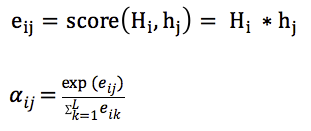

# Do ImageNet Classifiers Generalize to ImageNet?

**12 Jun 2019**

**名词解析**

------

**置信区间**

置信区间是衡量测量精度的一个指标。它也能显示出你的估算有多稳定，也就是说如果你重复做某项实验，得到的结果与最初的估计有多接近。

**博客摘抄**

[木子说python](https://www.bilibili.com/video/BV1UU4y1M77w?share_source=copy_web)

------

再测试新的test set上，不可避免的会发生准确度下降。——为什么？

**结果表明：准确率下降不是由适应性造成的，而是由于模型无法泛化到比原始测试集中更难分类的图像上。**

**实验：**

通过使用CIFAR-10和ImageNet两个注明基准的数据集。发现许多分类模型都不能达到它们原来准确度分数。在ImageNet上，在机器学习研究高度活跃的使其，准确度损失相当于大约5年的进步。

**传统观点：**

出现这种下降时因为模型已经适应了原始测试集中的特定图像。（例如，通过广泛的超参数调整）

结果：原始测试集上精度最高的模型仍然是新测试集上进度最高的模型，此外在准确性发面没有递减回报。相反，原先测试集上精度提高一个百分点，新测试集提高不止一个百分点。

结论：适应性是准度下降的一个不太可能的解释。

**作者推测：**

基于原始和新测试集的相对难度提出了另一种解释——如果新数据集只包含候选池中最简单的图像，几乎可以完全回复原始的ImageNet准确率（表明：1.目前为止，即便是最好的图像分类器，其准曲率分数也对数据清理过程的细节高度敏感。2.即使在精心控制得重复性实验的良性环境中，目前的分类器仍然不能可靠的泛化。）

看下图：

图1：在原始测试集和新测试集上的模型准确率，每个数据点对应于测试平台的一个模型（显示为95%的Clopper-Person 置信区间）

**两个主要现象**

1. 从原始测试集到新测试集的准确率明显下降
2. 模型准确率遵循斜率大于1的线性函数（CIFAR-10为1.7，ImageNet 为1.1）
   1. 这意味着，原始测试集上的每个百分点的改进会转换为新测试集上超过一个百分点的改进，从图上也能很直观的看到。

图二：

研究人员为CIFAR-10和ImageNet数据集构建了新的测试集。增加了过度城府使用测试集的风险。通过密切关注原始数据集创建过程，测试当前分类模型泛化到新数据的程度。评估大量模型，发现CIFAR-10 上的准确率下降了3%-10%，在ImageNet上的准确率下降了11%-14%。但是，原始测试集上准确率的改进能够为新测试集带来更大的改进。

结果表明：准确率下降不是有适应性造成的，而是由于模型无法泛化到比原始测试集中更难分类的图像上。

**原文解读**（能力有限，目前无法解读）

------

# Sequence to Sequence Learning with Neural Networks

**名词解析**

------

**LSTM网络**

长短期记忆网络（Long Short-Term Memory）是一种时间循环神经网络，是为了解决一般的RNN（循环神经网络）存在的长期依赖问题而专门设计出来的，所有的RNN都具有一种重复神经网络模块的链式形式。在标准RNN中，这个重复的结构模块只有一个非常简单的结构，例如一个tanh层。

**end to end神经网络模型**

end-to-end（端对端）的方法，一端输入我的原始数据，一端输出我想得到的结果。只关心输入和输出，中间的步骤全部都不管。

**beam search 解码方式**

beam search尝试在广度优先基础上进行进行搜索空间的优化（类似于剪枝）达到减少内存消耗的目的。

**博客摘抄**

[【NLP论文笔记】Sequence to Sequence Learning with Neural Networks - 简书 (jianshu.com)](https://www.jianshu.com/p/f5c2cc5b661c)

[数学家是我理想——seq2seq的PyTorch实现](https://www.bilibili.com/video/BV1Q5411W7zz?share_source=copy_web)

------

**1.1论文摘要**

深度神经网络（DNNS）在2014年之前已经被证明可用于各种复杂的学习任务，且均被证实其可行性及高准确性。但是有个弊端，即他需要有足够的标注数据，因此并不适用于去做序列到序列的映射任务（map sequences to sequences）。

本论文主要贡献在于提出了一种端到端（end-to-end）的神经网络模型，来学习这种映射关系。作者用一个多层的LSTM网络来将输入序列映射（编码）为一个固定大小维度的向量，再用另外一个多层的LSTM网络来解码该向量为输出序列。

为了论证其可行性，作者将其应用于英语-法语的翻译任务，最终发现其所达到的效果与当时最好的成绩（可能是某一种SMT，统计机器翻译模型）相差无几。

最后，作者对模型以及实验结果进行分析以后要，还发现几个有趣的点：

1. 模型对句子的主动与被动语态并不敏感，但是对输入词的顺序很敏感
2. 倒序输入句子能提升模型效果

**2.1论文模型结构**

NLP里面的王牌长短时记忆模型（LSTM）当仍不让的被选作为该模型的基础。

**主要思想：**

用一个LSTM（已经被证实能很好的解决长时序列依赖问题）来编码输入序列，顺序输入序列（one step at a time，并没有对输入序列对长度做限制！），以此就会得到一个固定大小维度的向量表达，然后再用另一个LSTM（本质上就是一个语言模型，除了其初始状态就是输入序列被编码得到的向量）来解码该向量，并得到输出序列。

可以说这套Seq2Seq框架的提出，为之后的序列映射任务（比如机器翻译等）的质量提升，奠定了扎实的基础。

看下图，理解透其原理

简单理解一下：
输入序列为ABC以及输入序列结束符号< EOS >,从< EOS >开始解码出WXYZ以及结束符号< EOS >，停止解码。

（多说一句：该模型架构在翻译任务上，均取得了不错的效果，且好有巨大的提升空间（比如引入注意力机制））

**介绍模型第二章**

强调了他们对LSTM一些改进的点（主要归纳为如下三点）

1. 他们使用了2个不同的LSTM模型，以此在增加模型参数的同时，计算量的增加几乎微乎其微，但却提高模型的泛化能力
2. 实验证明，深层的LSTM模型要比浅层的表现效果更好，复合一贯认知
3. 倒序输入句子，意思就是ABC输入的顺序为CBA，实验表征这样的效果更好。（论文坦诚说自己还没有给出完善的理论依据）

**还有一个模型细节提一下**

在解码阶段，beam search 解码方式被采用，且能显著提高准确率。

该方法本质：

在解码各阶段保留多个候选句子，最后再选择概率最大的序列。如果该方法的保留个数为1，其实就是贪心的思想，每次解码都选取概率最大的那个值。该沦为给出的结果是当size为2的时候，模型表现的最好。

**更多的细节，可仔细看一下论文的第三章**

提一点，他们实验的时候尽量保证一个Batch的句子长度相似，据说提高了2倍的训练速度。

**2.2论文实验结果分析**

具体谈两个比较有趣有价值的点

1. 模型对句子中词的先后顺序较为铭感，但是对其语态并不敏感。

   

   大家可以发现，John和Mary的顺序颠倒以后，并没有很好的聚合到一起，倒是admires和is in love with 能聚合到一起，由此可见，我们的模型对句子的顺序是十分敏感的。

2. 该框架模型对长句的翻译表现出乎意料的好

   

   左图呈现了BLEU分随着句子的长度增加，我们的模型表现并没有呈现明显的下降趋势（其实还在上升），只有在超过35字以后，才略微有一点下降。这也说明了该模型框架对于长句的处理也是足够胜任的，能想到的就是在实际应用中可能也不需要特别对长句做特殊处理

   右图呈现的就是对那些比较生僻的句子，模型的泛化能力，可以看到模型下降的趋势还是比较明显的，这也倒不难理解，毕竟生僻句子在数据集本身占比就少，如果有特殊的应用场景，那通常的做法我们都是加该场景下的特殊数据，进行微调，应该也能取得不错的效果。

**3.1总结**

这套seq2seq的框架，也为后续的序列映射任务奠定了基础。论文作者也是由其惊诧逆序输入句子对效果的提升，以及该模型对长句的翻译能力。

**原文解读**（能力有限，目前无法解读）

------

# Attention Is All You Need

**名词解析**

------

**Seq2Seq（Sequence to Sequence）**

也就是从序列到序列的转换模型框架，应用在机器翻译，自动应答等场景。

**Self attention** 

自注意力机制，也是由该文章首次提出的新的注意力机制

**relu激活函数**

线性整流函数（Rectified Linear Unit, ReLU），又称修正线性单元，是一种人工神经网络中常用的激活函数（activation function），通常指代以斜坡函数及其变种为代表的非线性函数。

**Encoder-Decoder**

Encoder-Decoder是一个模型构架，是一类算法统称，并不是特指某一个具体的算法，在这个框架下可以使用不同的算法来解决不同的任务。首先，编码（encode）由一个编码器将输入序列转化成**一个固定维度的稠密向量**，解码（decode）阶段将这个激活状态生成目标译文。

**博客摘抄**

[《attention is all you need》解读 - 知乎 (zhihu.com)](https://zhuanlan.zhihu.com/p/34781297)

[数学家是我理想——seq2seq(attention)的PyTorch实现](https://www.bilibili.com/video/BV1op4y1U7ag?share_source=copy_web)

[木子说python](https://www.bilibili.com/video/BV1UU4y1M77w?share_source=copy_web)

------

**Motivation(积极的地方)**

- 靠attention机制，不使用rnn和cnn，并行度高
- 通过attentio，抓长距离依赖关系比rnn强

**创新点**

- 通过self-attention，自己和自己做attention，使得每个词都有全局的语义信息（长依赖）
- 由于Self-Attention 是每个词和所有词都要计算Attention，所以不管他们中间有多长距离，最大的路径长度也都只是1。可以以捕获长距离依赖关系
- 提出multi-head attention（多头关注） ，可以看成attention的ensemble（总体）版本，不同head学习不同的子空间语义。

**attention 表示成k、q、v的方式：**

传统的attention（sequence2sequence问题）：

上下文context表示成如下的方式（h的加权平均）：

那么权重alpha（attention weight）可表示成Q和K的乘积，小h即V（下图中很清楚的看出，Q是大H，K和V是小h）：

上述可以做个变种，就是K和V不相等，但需要一一对应，例如：

- V = h+embedding
- Q = H
- k = h 

**乘法VS加法attention**

**加法注意力：**

还是以传统的RNN的seq2seq问题为例子，加性注意力是最经典的注意力机制，它是用了有一个隐藏层的前馈网络（全连接）来计算注意力分配：

**乘法注意力：**

就是常见的用乘法来计算attention score：

乘法注意力不使用一个全连接层，所以空间复杂度占优；另外由于乘法可以使用优化的矩阵陈发运算，所以计算上也一般占优势。

论文中的乘法注意力除了一个scale factor（比例因子）：

论文中指出当dk比较小的时候，乘法注意力和加法注意力效果差不多；但当d_k比较大的时候，如果不使用scale factor，则加法注意力要好一些，因为乘法结果会比较大，容易进入softmax函数的“饱和区”，梯度较小。

**self-attention**

以一般的RNN的S2S为例子，一般的attention的Q来自Decoder（解码器）（如下图中的大H），K和V来自Encoder（编码器）（如下图中的小h）。self-attention就是attention的K、Q、V都来自encoder或者decoder，使得每个位置的表示都具有全局的语义信息，有利于建立长依赖关系。

**Layer normalization(LN)(层正常化)**

batch normalization 是对一个每一个结点，针对一个batch，做一次normalization，即纵向的normalization：

layer normalization(LN)，是对一个样本，同一个层网络的所有神经元做normalization，不涉及到batch的概念，即横向normalization：

BN适用于不同mini batch数据分布差异不大的情况，而BN需要开辟变量存每个结点的均值和方差，空间消耗略大；而且BN适用于有mini_batch的场景。

LN只需要一个样本就可以做normalization，可以避免BN中受mini-batch数据分布影响的问题，也不需要开辟空间存每个结点的均值和方差。

但是，BN的转换是针对单个神经元可训练的——不同神经元的输入经过再平移和在缩放后分布在不同的区间，而LN对于一整层的神经元得到同一个转换——所有的输入都在同一个范围内。如果不同输入特征不属于相似的类别（比如颜色和大小，和scale不一样），那么LN的处理可能会降低模型的表达能力。

**encoder：**

- 输入：和conv s2s类似，词向量加上了positional embedding（位置嵌入），即给位置1,2,3,4...n等编码（也用一个embedding表示）。然后再编码的时候可以使用正弦和余弦函数，使得位置编码具有周期性，并且有很好的表示相对位置的关系的特性（对于任意的偏移量k，PE[pos+k]可以由PE[pos]表示）：

  

- 输入的序列长度是n，embedding维度是d，所以输入时**n*d的矩阵**

- N=6,6个重复一样的结构，由两个子层组成：

  - 子层1：

    - Multi-head self-attention

    - 参与连接和LN：

      - Output = LN（x+sublayer(x)）

        

  - 子层2：

    - position-wise fc层（跟卷积层很像）

    - 对n*d的矩阵的每一行进行操作（相当于把矩阵每一行平铺，接一个FC），同一层的不同行FC层用一样的参数，不同层用不同的参数（对于全连接的节点数目，先从512变大为2048，再缩小为512），这里的max表示使用relu激活函数：

      

    - 整个encoder的输出也是n*d的矩阵

      

**decoder：**

- 输入：假设已经翻译出k个词，向量维度还是d

- 同样使用N=6个重复的层，依然使用参与连接和LN

- 3个子层，比encoder多一个attention层，是Decoder端去attend encoder 端的信息的层

- Sub-L1：self-attention，同encoder，但要Mask掉未来的信息，得到k*d的矩阵

  

- Sub-L2和encoder做attention的层，输出k*d的矩阵

- Sub-L3：全连接层，输出k*d的矩阵，用第k行去预测输出y

  

**mutli-head attention：**

MultiHead可以看成是一种ensemble方式，获取不同子空间的语义：

获取每个子任务的Q、K、V：

- 通过全连接进行线性变换映射成多个Q、K、V，线性映射得到的结果维度可以不变，也可以减少（类似降维）
- 或者通过Split对Q、K、V进行划分（分段）

如果采用线性映射的方式，使得维度降低；或者通过split的方式使得维度降低，那么多个head做attention合并起来的复杂度和原来一个head做attention的复杂度不会差多少，而且多个head之间做attention可以并行。

**总结：**

本文提出用attention做翻译，不用RNN和CNN，attention计算快，并行度高，而且任何两个词的距离都是1，抓长距离依赖擅长，但是如果要堆那么多层的话，其实也不见得快到哪里去。

另外，一些经验，不一定放诸四海皆准，仅供参考（在语义匹配里的任务的经验，不是翻译）：

- positional encoding 一般可以加快收敛，但是对提升效果一般作用微小
- multi-head attention 在emb较小事，例如128，一般无效果。但是像原文中的512就可能有用。但是对工业界的系统，emb开不到512，内存没那么大。
- attention和gru一起用，效果会有提升，在匹配任务里，attention替换不了gru，但是attention计算快。

**原文解读**

------

# Jukebox: A Generatice Model for Music

名词解析

------

博客摘抄

------

原文解读

------

