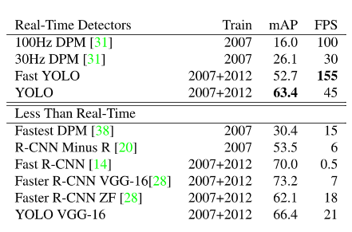

# 前言

在我正真的手动理解论文的时候，我才发现，不是每一篇文章都要从头开始逐字逐句的去翻译和理解。它不光浪费时间，同时很难很快的进入主题。很难对核心算法进行一个理解。（通过理解 Automatic Differentiation in Machine Learning: a Survey意识到，这算是我第一篇主动去理解，只借助有道翻译）。

所以到目前总结的经验是，不要将论文所有的细节都翻译出来然后写在自己笔记本上。而是直接用有道翻译直接理解，再使用GoodNotes类似的软件上，进行关键点的标注。

首先看概述，然后快速翻译每一小节的标题。寻找到自己最主要的算法，然后理解。如果发现与上下文有关联，再向前向后去寻找对应内容。

最后一定注意：只有对整个行业有着巨大指引作用的文章才值得全文理解和摘抄。比如YOLO，比如GAN

# Do ImageNet Classifiers Generalize to ImageNet?

**12 Jun 2019**

**名词解析**

------

**置信区间**

置信区间是衡量测量精度的一个指标。它也能显示出你的估算有多稳定，也就是说如果你重复做某项实验，得到的结果与最初的估计有多接近。


**博客摘抄**

[木子说python](https://www.bilibili.com/video/BV1UU4y1M77w?share_source=copy_web)

------

再测试新的test set上，不可避免的会发生准确度下降。——为什么？

**结果表明：准确率下降不是由适应性造成的，而是由于模型无法泛化到比原始测试集中更难分类的图像上。**

**实验：**

通过使用CIFAR-10和ImageNet两个注明基准的数据集。发现许多分类模型都不能达到它们原来准确度分数。在ImageNet上，在机器学习研究高度活跃的使其，准确度损失相当于大约5年的进步。

**传统观点：**

出现这种下降时因为模型已经适应了原始测试集中的特定图像。（例如，通过广泛的超参数调整）

结果：原始测试集上精度最高的模型仍然是新测试集上进度最高的模型，此外在准确性发面没有递减回报。相反，原先测试集上精度提高一个百分点，新测试集提高不止一个百分点。

结论：适应性是准度下降的一个不太可能的解释。

**作者推测：**

基于原始和新测试集的相对难度提出了另一种解释——如果新数据集只包含候选池中最简单的图像，几乎可以完全回复原始的ImageNet准确率（表明：1.目前为止，即便是最好的图像分类器，其准曲率分数也对数据清理过程的细节高度敏感。2.即使在精心控制得重复性实验的良性环境中，目前的分类器仍然不能可靠的泛化。）


看下图：


图1：在原始测试集和新测试集上的模型准确率，每个数据点对应于测试平台的一个模型（显示为95%的Clopper-Person 置信区间）

**两个主要现象**

1. 从原始测试集到新测试集的准确率明显下降
2. 模型准确率遵循斜率大于1的线性函数（CIFAR-10为1.7，ImageNet 为1.1）
   1. 这意味着，原始测试集上的每个百分点的改进会转换为新测试集上超过一个百分点的改进，从图上也能很直观的看到。


图二：


研究人员为CIFAR-10和ImageNet数据集构建了新的测试集。增加了过度城府使用测试集的风险。通过密切关注原始数据集创建过程，测试当前分类模型泛化到新数据的程度。评估大量模型，发现CIFAR-10 上的准确率下降了3%-10%，在ImageNet上的准确率下降了11%-14%。但是，原始测试集上准确率的改进能够为新测试集带来更大的改进。

结果表明：准确率下降不是有适应性造成的，而是由于模型无法泛化到比原始测试集中更难分类的图像上。


**原文解读**（能力有限，目前无法解读）

------


# Sequence to Sequence Learning with Neural Networks

**名词解析**

------

**LSTM网络**

长短期记忆网络（Long Short-Term Memory）是一种时间循环神经网络，是为了解决一般的RNN（循环神经网络）存在的长期依赖问题而专门设计出来的，所有的RNN都具有一种重复神经网络模块的链式形式。在标准RNN中，这个重复的结构模块只有一个非常简单的结构，例如一个tanh层。


**end to end神经网络模型**

end-to-end（端对端）的方法，一端输入我的原始数据，一端输出我想得到的结果。只关心输入和输出，中间的步骤全部都不管。


**beam search 解码方式**

beam search尝试在广度优先基础上进行进行搜索空间的优化（类似于剪枝）达到减少内存消耗的目的。


**博客摘抄**

[【NLP论文笔记】Sequence to Sequence Learning with Neural Networks - 简书 (jianshu.com)](https://www.jianshu.com/p/f5c2cc5b661c)

[数学家是我理想——seq2seq的PyTorch实现](https://www.bilibili.com/video/BV1Q5411W7zz?share_source=copy_web)

------

**1.1论文摘要**

深度神经网络（DNNS）在2014年之前已经被证明可用于各种复杂的学习任务，且均被证实其可行性及高准确性。但是有个弊端，即他需要有足够的标注数据，因此并不适用于去做序列到序列的映射任务（map sequences to sequences）。

本论文主要贡献在于提出了一种端到端（end-to-end）的神经网络模型，来学习这种映射关系。作者用一个多层的LSTM网络来将输入序列映射（编码）为一个固定大小维度的向量，再用另外一个多层的LSTM网络来解码该向量为输出序列。

为了论证其可行性，作者将其应用于英语-法语的翻译任务，最终发现其所达到的效果与当时最好的成绩（可能是某一种SMT，统计机器翻译模型）相差无几。

最后，作者对模型以及实验结果进行分析以后要，还发现几个有趣的点：

1. 模型对句子的主动与被动语态并不敏感，但是对输入词的顺序很敏感
2. 倒序输入句子能提升模型效果


**2.1论文模型结构**

NLP里面的王牌长短时记忆模型（LSTM）当仍不让的被选作为该模型的基础。

**主要思想：**

用一个LSTM（已经被证实能很好的解决长时序列依赖问题）来编码输入序列，顺序输入序列（one step at a time，并没有对输入序列对长度做限制！），以此就会得到一个固定大小维度的向量表达，然后再用另一个LSTM（本质上就是一个语言模型，除了其初始状态就是输入序列被编码得到的向量）来解码该向量，并得到输出序列。

可以说这套Seq2Seq框架的提出，为之后的序列映射任务（比如机器翻译等）的质量提升，奠定了扎实的基础。


看下图，理解透其原理


简单理解一下：
输入序列为ABC以及输入序列结束符号< EOS >,从< EOS >开始解码出WXYZ以及结束符号< EOS >，停止解码。

（多说一句：该模型架构在翻译任务上，均取得了不错的效果，且好有巨大的提升空间（比如引入注意力机制））


**介绍模型第二章**

强调了他们对LSTM一些改进的点（主要归纳为如下三点）

1. 他们使用了2个不同的LSTM模型，以此在增加模型参数的同时，计算量的增加几乎微乎其微，但却提高模型的泛化能力
2. 实验证明，深层的LSTM模型要比浅层的表现效果更好，复合一贯认知
3. 倒序输入句子，意思就是ABC输入的顺序为CBA，实验表征这样的效果更好。（论文坦诚说自己还没有给出完善的理论依据）


**还有一个模型细节提一下**

在解码阶段，beam search 解码方式被采用，且能显著提高准确率。

该方法本质：

在解码各阶段保留多个候选句子，最后再选择概率最大的序列。如果该方法的保留个数为1，其实就是贪心的思想，每次解码都选取概率最大的那个值。该沦为给出的结果是当size为2的时候，模型表现的最好。


**更多的细节，可仔细看一下论文的第三章**

提一点，他们实验的时候尽量保证一个Batch的句子长度相似，据说提高了2倍的训练速度。


**2.2论文实验结果分析**

具体谈两个比较有趣有价值的点

1. 模型对句子中词的先后顺序较为铭感，但是对其语态并不敏感。

   

   大家可以发现，John和Mary的顺序颠倒以后，并没有很好的聚合到一起，倒是admires和is in love with 能聚合到一起，由此可见，我们的模型对句子的顺序是十分敏感的。

2. 该框架模型对长句的翻译表现出乎意料的好

   

   左图呈现了BLEU分随着句子的长度增加，我们的模型表现并没有呈现明显的下降趋势（其实还在上升），只有在超过35字以后，才略微有一点下降。这也说明了该模型框架对于长句的处理也是足够胜任的，能想到的就是在实际应用中可能也不需要特别对长句做特殊处理

   右图呈现的就是对那些比较生僻的句子，模型的泛化能力，可以看到模型下降的趋势还是比较明显的，这也倒不难理解，毕竟生僻句子在数据集本身占比就少，如果有特殊的应用场景，那通常的做法我们都是加该场景下的特殊数据，进行微调，应该也能取得不错的效果。


**3.1总结**

这套seq2seq的框架，也为后续的序列映射任务奠定了基础。论文作者也是由其惊诧逆序输入句子对效果的提升，以及该模型对长句的翻译能力。


**原文解读**（能力有限，目前无法解读）

------


# Attention Is All You Need

**名词解析**

------

**Seq2Seq（Sequence to Sequence）**

也就是从序列到序列的转换模型框架，应用在机器翻译，自动应答等场景。


**Self attention** 

自注意力机制，也是由该文章首次提出的新的注意力机制


**relu激活函数**

线性整流函数（Rectified Linear Unit, ReLU），又称修正线性单元，是一种人工神经网络中常用的激活函数（activation function），通常指代以斜坡函数及其变种为代表的非线性函数。


**Encoder-Decoder**

Encoder-Decoder是一个模型构架，是一类算法统称，并不是特指某一个具体的算法，在这个框架下可以使用不同的算法来解决不同的任务。首先，编码（encode）由一个编码器将输入序列转化成**一个固定维度的稠密向量**，解码（decode）阶段将这个激活状态生成目标译文。


**博客摘抄**

[《attention is all you need》解读 - 知乎 (zhihu.com)](https://zhuanlan.zhihu.com/p/34781297)

[数学家是我理想——seq2seq(attention)的PyTorch实现](https://www.bilibili.com/video/BV1op4y1U7ag?share_source=copy_web)

[木子说python](https://www.bilibili.com/video/BV1UU4y1M77w?share_source=copy_web)

------

**Motivation(积极的地方)**

- 靠attention机制，不使用rnn和cnn，并行度高
- 通过attentio，抓长距离依赖关系比rnn强


**创新点**

- 通过self-attention，自己和自己做attention，使得每个词都有全局的语义信息（长依赖）
- 由于Self-Attention 是每个词和所有词都要计算Attention，所以不管他们中间有多长距离，最大的路径长度也都只是1。可以以捕获长距离依赖关系
- 提出multi-head attention（多头关注） ，可以看成attention的ensemble（总体）版本，不同head学习不同的子空间语义。


**attention 表示成k、q、v的方式：**

传统的attention（sequence2sequence问题）：


上下文context表示成如下的方式（h的加权平均）：


那么权重alpha（attention weight）可表示成Q和K的乘积，小h即V（下图中很清楚的看出，Q是大H，K和V是小h）：


上述可以做个变种，就是K和V不相等，但需要一一对应，例如：

- V = h+embedding
- Q = H
- k = h 


**乘法VS加法attention**

**加法注意力：**

还是以传统的RNN的seq2seq问题为例子，加性注意力是最经典的注意力机制，它是用了有一个隐藏层的前馈网络（全连接）来计算注意力分配：


**乘法注意力：**

就是常见的用乘法来计算attention score：


乘法注意力不使用一个全连接层，所以空间复杂度占优；另外由于乘法可以使用优化的矩阵陈发运算，所以计算上也一般占优势。

论文中的乘法注意力除了一个scale factor（比例因子）：


论文中指出当dk比较小的时候，乘法注意力和加法注意力效果差不多；但当d_k比较大的时候，如果不使用scale factor，则加法注意力要好一些，因为乘法结果会比较大，容易进入softmax函数的“饱和区”，梯度较小。


**self-attention**

以一般的RNN的S2S为例子，一般的attention的Q来自Decoder（解码器）（如下图中的大H），K和V来自Encoder（编码器）（如下图中的小h）。self-attention就是attention的K、Q、V都来自encoder或者decoder，使得每个位置的表示都具有全局的语义信息，有利于建立长依赖关系。


**Layer normalization(LN)(层正常化)**

batch normalization 是对一个每一个结点，针对一个batch，做一次normalization，即纵向的normalization：


layer normalization(LN)，是对一个样本，同一个层网络的所有神经元做normalization，不涉及到batch的概念，即横向normalization：


BN适用于不同mini batch数据分布差异不大的情况，而BN需要开辟变量存每个结点的均值和方差，空间消耗略大；而且BN适用于有mini_batch的场景。


LN只需要一个样本就可以做normalization，可以避免BN中受mini-batch数据分布影响的问题，也不需要开辟空间存每个结点的均值和方差。


但是，BN的转换是针对单个神经元可训练的——不同神经元的输入经过再平移和在缩放后分布在不同的区间，而LN对于一整层的神经元得到同一个转换——所有的输入都在同一个范围内。如果不同输入特征不属于相似的类别（比如颜色和大小，和scale不一样），那么LN的处理可能会降低模型的表达能力。


**encoder：**

- 输入：和conv s2s类似，词向量加上了positional embedding（位置嵌入），即给位置1,2,3,4...n等编码（也用一个embedding表示）。然后再编码的时候可以使用正弦和余弦函数，使得位置编码具有周期性，并且有很好的表示相对位置的关系的特性（对于任意的偏移量k，PE[pos+k]可以由PE[pos]表示）：

  

- 输入的序列长度是n，embedding维度是d，所以输入时**n*d的矩阵**

- N=6,6个重复一样的结构，由两个子层组成：

  - 子层1：

    - Multi-head self-attention

    - 参与连接和LN：

      - Output = LN（x+sublayer(x)）

        

  - 子层2：

    - position-wise fc层（跟卷积层很像）

    - 对n*d的矩阵的每一行进行操作（相当于把矩阵每一行平铺，接一个FC），同一层的不同行FC层用一样的参数，不同层用不同的参数（对于全连接的节点数目，先从512变大为2048，再缩小为512），这里的max表示使用relu激活函数：

      

    - 整个encoder的输出也是n*d的矩阵

      

**decoder：**

- 输入：假设已经翻译出k个词，向量维度还是d

- 同样使用N=6个重复的层，依然使用参与连接和LN

- 3个子层，比encoder多一个attention层，是Decoder端去attend encoder 端的信息的层

- Sub-L1：self-attention，同encoder，但要Mask掉未来的信息，得到k*d的矩阵

  

- Sub-L2和encoder做attention的层，输出k*d的矩阵

- Sub-L3：全连接层，输出k*d的矩阵，用第k行去预测输出y

  

**mutli-head attention：**

MultiHead可以看成是一种ensemble方式，获取不同子空间的语义：


获取每个子任务的Q、K、V：

- 通过全连接进行线性变换映射成多个Q、K、V，线性映射得到的结果维度可以不变，也可以减少（类似降维）
- 或者通过Split对Q、K、V进行划分（分段）


如果采用线性映射的方式，使得维度降低；或者通过split的方式使得维度降低，那么多个head做attention合并起来的复杂度和原来一个head做attention的复杂度不会差多少，而且多个head之间做attention可以并行。


**总结：**

本文提出用attention做翻译，不用RNN和CNN，attention计算快，并行度高，而且任何两个词的距离都是1，抓长距离依赖擅长，但是如果要堆那么多层的话，其实也不见得快到哪里去。


另外，一些经验，不一定放诸四海皆准，仅供参考（在语义匹配里的任务的经验，不是翻译）：

- positional encoding 一般可以加快收敛，但是对提升效果一般作用微小
- multi-head attention 在emb较小事，例如128，一般无效果。但是像原文中的512就可能有用。但是对工业界的系统，emb开不到512，内存没那么大。
- attention和gru一起用，效果会有提升，在匹配任务里，attention替换不了gru，但是attention计算快。


**视频摘抄**

------

**Seq2Seq模型的特点：**

改模型是由encoder和decoder共同组成，它们之间是依赖于attention机制去建立关联性。

Seq2Seq模型，他的基础模块可以分为三类

- CNN
  - 权重共享
    - 平移不变性
    - 可并行计算
  - 滑动窗口
    - 局部关联性建模
      - 依靠多层堆积来进行长程建模
  - 对相对位置敏感，对绝对位置不敏感
- RNN
  - 依次有序递归建模
    - 对顺序敏感
    - 串行计算耗时
    - 长程建模能力弱
    - 计算复杂度与序列长度程线性关系
    - 单步计算复杂度不变
    - 对相对位置敏感，对绝对位置敏感
- transformer
  - 无局部假设
    - 可并行计算
    - 对相对位置不敏感
  - 无有序假设
    - 需要位置编码来反映位置变化对于特征的影响
    - 对绝对位置不敏感
  - 任意两字符都可以建模
    - 擅长长短程建模
    - 自注意力机制需要序列长度的平方级别的复杂度


**对Transformer框架的整体理解**

左边是Encoder 部分，编码器部分，右边是Decoder部分，解码器部分。

encoder是以输入字符作为输入，然后以状态作为输出。decoder会以上一时刻的字符作为输入，会把encoder的状态作为输入的一部分。最终返回字符的预测概率。

**Encoder部分**

- 首先是由输入字符得到的Embedding，以及位置编码来作为输入。
- 然后Encoder又是由n个block构成的，每个block中，包含两部分。
  - 第一个部分是一个Multi-Head Attention，该attention是对序列自身的表征运算
  - 第二部分是一个前馈神经网络，这个Feed Forward就是一个position wise。也就是说每个位置上都有一个独立的，但是是相同的MLP来算出新的表征。（FFN）

**Decoder部分**

- 它会以输入字符的Embedding和Positional Encoding（位置编码）来作为输入，对自身训练来作为表征（通过的就是Multi-Head attention）
- 也是由n个block构成，但是这里的block，每个block分为三个模块。
  - 最下面的模块，是由Multi-Head self attention构成的（这里的attention需要符合因果，预测的字符接收的输入必须是这个字符之前的那些字符，不能把未来的，后面的字符作为信息传递进去）这就是第一个自注意力，带掩码的自注意力。
  - 第二个模块是Decoder所特有的，它是以第一个模块的自注意力的输出做为query，以Encoder的输出作为t和value来取算出Decoder序列和Encoder序列之间的关联性，然后算出一个表征。（它其实算的是Decoder的输出序列和Encoder的输出序列之间的关系，并且将这个关系得到一个权重，再跟Encoder的状态做一个加权求和来得到一个新的表征。）
  - 第三个模块和Encoder中的FNN是没有区别的
  - Decoder最后，再n个block之后，会有一个线性层来去映射到概率空间，那么在自然语言处理中，把这分类网络，分配到n个单词上去。

**Positional Encoding**

Transformer对局部是不敏感的，对全局位置也是不敏感的，所以我们需要增加一个带有位置信息的一个向量，来去加到每一个Input Embedding上面去，这样的话就会使得Input输入的字符即使位置变了，我们得到了输出的表征其实是不一样的，就是要对位置敏感。那么这个Position Encoding 虽然是加载了最底层，但是由于每一个block中都有很多残差连接，所以使得这个位置信息可以充分的传到上层网络中。包括Decoder 也是一样的。 


**Transformer**

- Encoder
  - input word embedding
    - 由于稀疏的one-hot进入一个不带bias的FFN得到一个稠密的连续向量（本来每个单词都是由010000(只有一个位置上是1后面全是0)的one-hot向量，我们通过one-hot向量跟一个Embedding table进行矩阵相乘，就能够得到一个稠密的连续向量，然后我们就可以用这个稠密的矩阵向量表示这个单词，这样一方可以节约内存，而是可以让这个表征更加丰富，每个单词都会有一个稠密的向量来代表它）
  - position encoding（仅仅由word embedding还不行，因为我们是Seq2Seq的任务，是一个训练建模的任务，而Transformer对位置不敏感，所以我们需要加一个位置编码的信息position encoding，来把它加到word Embedding 上，那么再本模型中，这两个的维度是一致的）
    - 通过sin/cos来固定表征（position encoding 需要由一些前置的假设，通过这三个假设，在本文中作者通过sin/cos组合来去表征位置信息）
      - 每个位置确定性的（  我们希望每个位置上的position encoding 是确定的，最好不是不确定的。在一个序列中它第二个位置上跟另外一个序列中它第二个位置上的序列编码要是一样的值 （是有不确定的position encoding的））
      - 对于不同的句子，相同位置的距离（再一个长句子中，如果两个字符隔着3个单词与再一个短句子中隔着三个单词，它们相对的距离要保持一致）
      - 可以推广到更长的测试句子（假如训练集中，训练长度都是小于10以内的，但是在测试集中会有长度15的句子，这时我们希望即使测试集中句子长度更长的话，再训练集中没有见过的话，我们也能通过这一个position encoding 推广过去）
    - pe(pos+k)可以写成pe(pos)的线性组合（这是对sin/cos这么一个组合的好处）(即使测试集中出现了pos+k这种未见过的位置的话，我们也可以把它写成训练集中见过的位置的线性组合，这样就不用担心测试集中遇到更长的句子无法推广的问题)
    - 通过残差连接来使得位置信息流入深层（这样就不会出现更深层的self-attention中它没有位置信息）
  - multi-head self-attention（多头的自注意力机制）（为什么要用多头）（多头还会对这个特征向量的维度有所降低，比如原来的特征维度是512的话，如果我们分为8个头，那么每个头向量的维度就变成了64，这样做也是保证运算量整体上没有多大改变）
    - 使得建模能力更强，表征空间更丰富（多头可以使得建模能力更强，可以捕捉到位置与位置之间的关系，而且能够使得表征控件更加丰富一些）
    - 多头会由多组Q（query）,K（key）,V（value）构成，每组单独计算一个attention向量(上下文的向量)
    - 把每组的attention向量拼起来，并进入一个的FFN得到最终的向量
  - feed-forward network(前馈网络)（再NLP中，这个做的是embeding每一个维度的融合）
    - 只考虑每个单独位置进行建模（这里考虑的是字符）
    - 不同位置参数共享
    - （对于这一个FFN让视频作者想到了）类似于1*1 pointwise convolution（它只考虑每个单独的像素点）（1 * 1pointwise卷积可以用一个linear层实现，而一个linear层可以用一个1*1卷积来实现）（pointwise 是对通道的融合）
- Decoder（基本上和上面差不多）
  - output word embedding（也就是说是另外一个序列的embedding，比方说是中英文翻译，可能encoder接收中文字符，decoder接收英文字符）
  - masked multi-head self-attention（masked 这个要符合因果律）
  - multi-head cross-attention（cross 主要意思是我们现在主要想知道decoder 的multi-head attention的输出和encoder的multi-head attention输出状态之间的关联性）（这里cross是指我们通过用decoder MHA的输出作为query，用encoder的输出作为key和value来去计算上下文表征）
  - feed-forward network（还是一个FFN,对于每个位置上进行一个单独的建模，对于特征维度进行一个融合）
  - sfotmax（最后通过softmax归一化，来计算出每个单词的目标概率）

这就是整个Transformer模型的模块与细节


**原文解读**

------


# Jukebox: A Generatice Model for Music

名词解析

------


博客摘抄

------


原文解读

------


# You Only Look Once : Unified, Real-Time Object Detection

**作者：**Joseph Redmon* ,Santosh Divvala* ,Ross Girshick ,AliFarhadi*

**机构：**University of Washington* ,Allen Institute for AI , Facebook AI Research

**名词解析**

------

**DPM算法：**滑动窗口分类器

**R-CNN算法：**

1. 第一阶段：提取潜在的候选框（Region Proposa）
2. 第二阶段：用分类器逐一筛选每一个候选框

**NMS：**Non-max suppresion 非极大值抑制，用于过滤重复的预测框

**AP：**average precision 平均查准率（详细看西瓜书）

**IOU：**Intersection over Union 是一种测量在特定数据集中检测相应物体准确度的一个标准

**confident：**置信度

**$1^{obj}_{ij}$ :**指示函数（indicator function）含义是：当输入为True的时候，输出为1，输入为False的时候，输出为0。

**dropout：**在训练过程中每一步都随机掐死一半的全连接层的神经元，使得它的输出和反向传播回来的都为0（打破神经元联合依赖适应性） 

**数据增强：**可以扩充数据集，可以防止过拟合可以让模型适应各种各样的变化，提高鲁棒性


**视频解读摘抄：同济子豪兄-yolov1**

https://www.bilibili.com/video/BV15w411Z7LG?p=11&share_source=copy_web

------

**摘要：**

从分类问题转化为回归问题，使用单独的神经网络，既可以预测预测框的坐标，也可以预测类别。可以进行端到端的优化（这是神经网络的优点），一次性解决所有问题，而不需要像多阶段问题解决，一个环节出错，就不能够使用。

识别速度快，出现更多的定位误差，但是把背景误判为目标的问题，比较小。同时yolo泛化迁移能力比较强，各行各业都能使用yolo。

**1. Introduciton：**

以前的目标检测器都是重复使用分类器。比如DPM算法，滑动窗口分类器。 

另一种方法是R-CNN，先提取出2~3000个候选框，然后再逐一的进行分类和回归，这里就可能用到一些算法进行后处理，比如用非极大抑制NMS来消除重复的预测框，然后再微调每一个预测框，根据图像上其他物体，重新给每一个预测框打分（这里是非常繁琐的，依赖庞大的供应链，一个问题出错，就不能使用了）。

而yolo重新定义回归问题。从输入图像，直接获得每一个定位信息还有就是预测结果，目标和类别。下图就是yolo的预测阶段的演示图


**优点：**

1. 速度快，可以达到每秒45帧的速度（Titan X显卡），最快的可以达到150fps。可以达到实时检测，同时相对于其他实时检测模型，准确模型是他们的两倍。
2. 能够捕获全图的信息，上下文信息。把背景无当做目标的错误是很少的。
3. 泛化能力，迁移能力比较强。是要比DPM，R-CNN模型的泛化能力高得多。用于新领域，它的性能下降的是比较少的。迁移能力是比较好的。

**缺点：**

1. 在定位能力和小目标的识别能力是比较差的。（后面论文可以看出来） 


**2.Unified Detection**

**统一的目标检测框架**

​		该神经网络能够捕获全图的信息，预测每一个预测框的坐标和分类。这意味着网络能够挖掘全图的信息。同时能够一步到位的识别出所有物体，让实时预测称为可能，同时保持一个高的**AP（Average Precision）**

​		在这个系统，我们将图片划分为S x S 个 **grid cell**（网格单元） ，该论文用的是7*7的网格。

​		每个grid cell 预测 B 个**bounding boxes**(包围盒)  ，该论文用的是2个bounding boxes。**在训练阶段**，哪一个bounding box与人工标注的**IOU**（交并比）最大，就由哪一个bounding boxes去负责预测这个物体。训练阶段是一个监督学习，来使得损失函数最小化的过程。下图是**置信度的计算公式（$Pr(Object)*IOU^{truth}_{pred}$）**，用于损失函数。


包含该物体的概率（非0即1） * 人工标注框的交并比（包含物体*离这个物体有多近）

**在预测阶段**：回归出多少就是多少，不需要直接计算Pr(Object)和IOU，而是隐式的包含两者。

​		每一个bounding box都包含5个参数，x,y,w,h,和confidence（x,y：中心点的横纵坐标 w,h：bounding box的宽高），每一个bounding box 的中心点，都应该落在grid cell里面，不能超出。无论bounding box多大。 所以(x,y)是相对于grid cell 坐标，是在0~1之间的。(w,h)是相对于整幅图片的，所以也在0~1之间，confidence，也是在0~1之间的。这样都归一化了，比较好处理。confidence是预测框和实际框之间的IOU。

​		每一个grid cell 还需要预测C个**conditional class probablities**（条件类别概率）**$ Pr(Class_i|Object)$**（在当前bounding  box 已经包含物体的条件下，各类别的概率）。给个grid cell 只预测一组条件类别概率，它对应的B个bounding box共享这个条件类别概率

​		测试阶段 将每个bounding box 的confidence score 与所在grid cell的条件类别概率相乘。 等号右边即表明了分类的精度，又表明了IOU的精度
$$
Pr(Class_i|Object)*Pr(Object)*IOU^{truth}_{pred}=Pr(Class_i)*IOU^{truth}_{pred}
$$


**预测阶段：**

1. 将输入图片划分为s*s个grid cell
2. 每个grid cell 预测出两个bounding box（可以大小各异，只要中心点在这个grid cell里面）
3. 每一个grid cell 都产生4个参数 和一个confidence参数，confidence 就用线的粗细来表示，位置参数就用框来表示
4. 每一个gird cell 预测一组条件类别概率
5. 把上下两张图整合到一起，把低置信度框过滤掉，把重复的预测框用非极大值抑制剃掉，然后再加上类别就产生了最后图片的结果
6. 我们就知道了图像上，每个框的位置和图像类别

**训练阶段：**

1.  人工标注的Ground Truth框中心点落在哪一个grid cell中就应由哪个grid cell预测这个物体
2. 每个grid cell 预测B个bounding boxes
3. 与Ground Truth 框IOU最大的bounding boxes负责预测这个物体 
4. 每个grid cell只能检测一个物体
5. 所以所有的bounding box被分成了三类
   1. 负责预测物体的bounding box
   2. 在预测的grid cell里面，但是不负责预测物体的bounding box——这是被挤占掉的bounding box 
   3. 不负责预测物体的grid cell 里边的bounding box

​		改论文用的是PASCAL VOC数据集上，S=7 B=2 ，有20个标签分类C=20.最后张量的维度是7 * 7 * 30（张量：7 * 7的矩阵，构成了一张纸，把30张纸堆起来，形成了一本书，这本书就形成了该数据结构）

 

**2.1Network Design 网络设计**

​		使用卷积神经网络来实现在PASCAL VOC目标检测数据集上进行评估，最开始的卷积层负责提取特征。后面的全连接层负责预测出这些数值。和图像分类类似（图像分类示全连接层预测每一个类别的概率，而这里的全连接层负责预测这个图片的张量）

​		该神经网络是受到了**GoogLeNet** 模型的启发。包含了24个卷积层，最后有两个全连接层。GoodLeNet使用的是inception modules。但我们这儿没有使用这个，而是使用了1 * 1卷积（1 * 1卷积是启发与network in network 这篇文章）（1 * 1卷积有很多作用，比如降维，升维，跨通道信息交流，减少权重，都是由1 * 1卷积实现的）跟上3 * 3卷积。

​		我们也训练了更快的yolo版本，Fast YOLO，将快速达到极致，使用更少的卷积层（9个），使用了更少的卷积核。但是其他的网络参数都是和基准的yolo是一样的。


​		**Figure 3：The Architecture**:该检测神经网络含有24个卷积层跟着2个全连接层。交替使用1 * 1卷积层和3 * 3卷积，1*1卷积的目的是降维，减少feature map的个数，也就是减少了权重个数和计算量。整个网络先是用ImageNet 图像分类这个数据集去训练。使用的是224 * 224的输入图片的分辨率。然后再在448*448分辨率上训练检测的模型。

​		**看一下这个图：**输入448 * 448 * 3通道。先用64个7 * 7的卷积核，以步长为2进行卷积来最大池化（2 * 2）。然后再用192个3 * 3卷积核去卷积，然后再2 * 2池化，步长为2。然后还是一样，级联一步一步的走下去。到末尾，获得一个7 * 7 *1024维的张量，拉平，喂到一个4096的全连接层里面，输出一个4096维的向量，再把4096维的向量，喂到有1470个神经元的全连接层。输出1470维的向量。吧1470维的向量在reshape一下，就变成了7 * 7 *30的张量。（所有的坐标，类别，confidence等信息，都在这个7 * 7 * 30维的数据结构里）

**2.2 Training 训练细节**

​		先在1000个图像类别的ImageNet上面预训练模型，训练出前20个卷积层。在20个卷积层后加上一个全局平均池化（替代了全连接层），在跟上一个全连接层去训练图像分类模型。（训练了1个星期）。达到single-crop top-5准确度为88%。在ImageNet 2012的训练集上和在Caffe的框架里的GoogLeNet准确率是相当的。（用了自己的做的Darknet 框架训练）

​		上面就是预训练的图像分类模型，然后再保留这个模型的权重来训练目标检测的模型。 任少卿的论文证明在后面加上卷积层和全连接层能够提升性能。所以根据这个思路在后面又加上了4个卷积层和2个全连接层。这些层的权重都是随机初始化的。目标检测通常需要细粒度的视觉信息（应为要进行框的定位，不可能太粗粒度），所以吧图像的分辨率从224 * 224，提高到448 * 448。

​		 最后这层即预测出类别概率也预测出定位坐标，宽度和高度，横坐标和纵坐标都是经过归一化的，都是0~1之间。横纵坐标是grid cell左上角的偏移量，所以也是在0~1之间的。

​		最后一层使用的是线性激活函数(相当于是没有非线性激活函数)，其他的层使用的是Leaky ReLU函数（下图和下面的公式）
$$
\phi(x)=\left\{
\begin{matrix}
 x,\qquad if \quad x>0 \\
 0.1x,\qquad otherwise 
\end{matrix}
\right.
$$


相比于传统的ReLU函数，小于0就一刀切，只有正值才能获得梯度不一样。Leaky ReLU函数可以再负值的时候也能获得一定的梯度，让其有可能翻盘。

​		平方和误差很容易优化，但是它跟最大化平均精度和最大化平均性能不能够完全的吻合。在识别图像中，平方和误差对定位误差和分类误差是一视同仁的，而且一张图片上有许多grid cell不包含图像，不负责预测物体。这会导致confidence尽可能的变为0，这些坏的损失函数的效应就会压倒梯度，削弱好的损失函数的作用。甚至导致早期的发散（如果强行使用平方和误差，就会导致坏的损失函数占主导。好的损失函数的作用就发挥不出来了）。所以需要采取不同的权重。（平方和误差回归问题损失函数易于优化，但对于定位和分类误差一视同仁，对包含物体和不包含物体的bounding box 一视同仁，对大框和小框一视同仁）

​		为了削弱坏孩子（坏的损失函数）的作用，为了补偿这个效应，我们增加负责预测物体的bounding box的权重，削弱不负责不包含物体的bounding box的权重。分别给与$\lambda_{coord}=5$ （负责检测物体的bbox）和$\lambda_{noobj}=.5$（.5是0.5的意思）（不负责检测物体的bbox）的权重。

​		同样的平方和误差对也对大小框一视同仁。在原来的绝对误差情况下，同样的相对误差情况下大框的绝对误差要大很多，对大框是很不公平的，所以现在取了一个根号。同样的相对误差的情况下，大框的绝对误差也就比较小了。（针对大小框一视同仁的情况，计算h和w平方根之差，引入损失函数削弱大框误差）

​		YOLO在每个grid cell 预测b个bounding box。在训练期间每一个bounding box 来负责预测一个物体。 让这个预测框与真实的框(ground truth)交并比最大。这就会导致预测框专门化（训练过分的话，那么也会导致过拟合）。这样每一个预测框能更好的预测特定大小，横纵比，对象类别从而提高整体回忆能力。

**loss function:** 
$$
\lambda_{coord}\sum_{i=0}^{s^2}\sum_{j=0}^B1^{obj}_{ij}[(x_i-\hat{x_i})^2+(y_i-\hat{y_i})^2]\\
+\lambda_{coord}\sum_{i=0}^{s^2}\sum_{j=0}^B1^{obj}_{ij}[(\sqrt{\omega_i} -\sqrt{\hat{\omega_i}})^2+(\sqrt{h_i}-\sqrt{\hat{h_i}})^2]\\
+\sum_{i=0}^{s^2}\sum_{j=0}^B 1^{obj}_{ij}(C_i-\hat{C_i})^2\\
+\lambda_{noobj}\sum_{i=0}^{s^2}\sum_{j=0}^B 1^{noobj}_{ij}(C_i-\hat{C_i})^2\\
+\sum_{i=0}^{s^2}1^{obj}_{i} \sum_{c \in classes}(P_i(c)- \hat{P_i}(c))^2
$$
每一项都是平方和误差，将目标检测问题当做回归问题

**函数解析**：

1. 负责检测物体的bbox中心点定位误差
2. 负责检测物体的bbox宽高定位误差（求根号能使小框对误差更敏感）
3. 负责检测物体的bbox confidence误差
4. 不负责检测物体的bbox confidence误差
5. 负责检测物体的grid cell 分类误差

**注意：**

1. $1^{obj}_{i}$：第i个grid cell是否包含物体，也即是否有ground truth框的中心点落在此grid cell中，若有为1否则为0

2. $1^{obj}_{ij}$：第i个grid cell 的第j个bounding box 若负责预测物体则为1否则为0

3. $1^{noobj}_{ij}$：第i个grid cell 的第j个bounding box 若不负责预测物体则为1否则为0

   （$\lambda_{coord}$权值为5，$\lambda_{noobj}$权值为0.5）

（若2式子为1那么1式子也为1，2式子或者3式子有一个为1，那另一个必为0）


​		在学习率策略方面，再一开始慢慢增加学习率，如果一开始使用很高的学习率那么该模型会很容易发散，不稳定。然后跟着用$10^{-2}$的学习率学习75轮，然后用$10^{-3}$学习30轮，然后用$10^{-4}$学习30轮。

​		为了避免过拟合，我们使用dropout和data augmentation（数据增强），随机调整曝光度和饱和度，使用1.5因子在HSV色彩空间。

**2.3 Inference推断预测**

​		和训练一样，该模型只要一次就能够获得最终结果。非常快。

​		网格的设计，强制它在空间上形成差异。虽然每个物体它该由那个grid cell 负责预测是比较清晰地，但是对于较大的物体和靠近边缘的物体可能会有多个预测框预测同一个物体。这时候就需要使用非极大值抑制（Non-maximal suppression）来吧低置信度的预测框过滤掉，只保留高预测度的框。对于yolo非极大值抑制增加了2~3%的mAP。

**2.4 Limitations of YOLO （YOLO的缺陷）**

​		应为yolo强制的使用空间限制，每个grid cell只能产生两个bbox和一个类别（一个物体）对小物体检测效果差。（对鸟群而言，效果是比较差的）

​		虽然该模型能够预测边界框，但是它在新的场景和不寻常的高宽比的图像域里面，它的泛化性能是受限的。而且该模型还是使用的是较粗粒度的特征。中间会有很多的池化层和下采样层。会导致空间信息的缺失。所以颗粒就不会太细粒度。

​		同时，损失函数是对大小框同等对待的，对于大框而言，一点小小的误差是良性的，但是对于小框而言会带来很大的IOU的影响。所以分类正确但定位误差大是YOLO误差的主要来源。（坐标拟合能力较差）

**3.Comparison to other Detection Systems （与其他目标检测框进行对比）**

​		目标检测的核心是计算机视觉的核心问题。而目标检测的流程通常是从图像中提取一系列鲁棒的特征（Haar，SIFT，HOG，convolutional features）。提取这些特征之后再用分类器和回归器在特征空间上进行识别，分类和回归。分类器或者回归器要么是通过划窗的方式，要么是通过候选框从图像中采集子集区域的方式来进行。YOLO是完全不一样的结构。

​		**Deformable parts models（DPM）**,与DPM进行比较（DPM 传统特征：HOG 传统分类器：SVM 滑窗套模板，弹簧模型：子模型+主模型）（DPM鲁棒性很差）与DPM不一样，yolo没有使用人工设计好的静态特征。而是使用端到端的优化，深度学习去训练，这种统一的架构，会实现一种比DPM更快更准的模型。

​		**R-CNN**,R-CNN是region proposal（候选区域提取）的一个变种，从图像中提取若干个候选框（2~3000）。再逐一的对每个候选框用卷积神经网络进行特征提取，然后再使用SVM（支持向量机）进行分类。然后再用线性模型进行坐标的回归。再用非极大值抑制去除重复的框。这是多阶段的，每一个阶段都需要进行非常精确地独立的调整（依赖一个精准的上下游协作产业链，一旦某个工序有问题，就全部崩盘，而且非常慢，容易出问题）

​		YOLO和R-CNN有一些相似性，每个grid cell 产生若干个候选框，再用卷积神经网络去进行分类。然而grid cell是有限的，所以候选框也是有限的。所以速度非常快。（而不会像R-CNN产生2000~3000个候选框），而且yolo是把各个部件整合在一起，共同的工作。

​		**Other Fast Detectors** Fast 和Faster R-CNN，Fast R-CNN先用卷积神经网络在全图过一遍，再筛选出候选框，这样所有的候框就能共享一套特征。而不用逐一的去提取特征。而Faster R-CNN使用RPN网络代替Selective Search 来产生候选框。虽然这两个精度和速度都要比R-CNN要高，但是都达不到实时的性能。 

​		有很多研究都在尝试加速DPM这个古老的方式，但是都不太行。（大清裱糊匠，该倒还是得倒）

​		YOLO是把所有的工作整合到一起，从根上就是快的。（而不是去优化每一个工作流）

​		在人脸和文字上面都是可以被高度优化的。图像域里面不会发生太大的变化，同时yolo是非常通用的，任何产业都能用。

​		**Deep MultiBox**类似RPM的模型，用神经网络来提取候选框，提取这个regions of interest(ROI)。其可以实现单物体的检测。但是其不能使用通用物体检测。同时也因为依赖于庞大的工作流，需要对每一个候选框进行分类。是多阶段的。两者都用到了卷积神经网络，但是对于YOLO是完整的检测系统，而对于MultBox是一个组件。

​		**OverFeat**该模型是2013年定位竞赛冠军，使用全卷积神经网络进行搞笑的滑窗运算。但是还是一个disjoint system(各工序分离)，而且其是针对定位任务优化，而不是针对目标检测任务。同时其只能看到滑窗内部物体，也是管中窥豹，无法分析全图上下文信息。

​		**MultiGrasp**作者自己的模型，受到自己模型的启发-回归出了一个可抓取的区域。然而MultiGrasp是一个更简单的任务，不像目标检测这么复杂，只要负责一个可抓取区域让机器人去抓就可以。图片只需要包含一个物体。它不需要预测图像的尺寸，位置，边界。

**4.Experiments（实验）**

​		把yolo和其他模型进行一个对比，特别是Fast R-CNN和Faster R-CNN把错误的比类进行了分析。YOLO错误的把背景识别成物体的比例是比较少的。进一步把YOLO和Fast R-CNN进一步进行结合，可以有效地提高目标检测的性能。同时泛化性能会更好。

**4.1Compariso to Other Real-Time Systems(与其他实时检测系统的比较)**

​		有许多研究在努力让目标检测变得更快，但是只有YOLO真的实现了实时检测。都进行了对比。



​		上半部分是实时检测（FPS>30）下半部分是非实时目标检测（FPS<30）

​		在实时目标检测里面，YOLO是最准的，同时Fast YOLO是最快的（又快又好）。在非实时目标检测里面，YOLO是最快的。

​		**Fast YOLO**速度最快，同时准确度也不错

​		**YOLO VGG-16** 速度相对较慢，没有达到实时效果，网络本身就比较庞大，参数量比较大，但是准确度也不错。

​		**Fastest DPM** 差实时检测的两倍性能，同时牺牲了很多准确性,同时受限于DPM，从原理上就决定了较低的性能和准确性，相比于神经网络方法

​		**R-CNN minus R** 把Selective Search 方法转化为一个静态的bounding box proposals，虽然比原生的R-CNN快，但是还是没有达到实时的性能。 同时因为替换了Selective Search方法，所以准确率也大大降低了

​		**Fast R-CNN**虽然对RCNN进行了提速，但是还是需要用到Selective Search进行候选框提取，还是需要很长的预测时间。虽然准确率很高

​		**Faster R-CNN**把Selective search 替换为RPN神经网络来提取候选框，和Szegedy模型类似。准确度要比YOLO高，但是速度没它快。

**4.2 VOC 2007 Error Analysis(YOLO和Faster R-CNN各错误比例分析)**

​		为了更进一步分析YOLO和目前最新的其他目标检测模型的区别，我们使用了一个能够打破它黑箱子预测结果的方法。将YOLO与Fast R-CNN做了比较。

​		通过Hoiem提出的工具，把测试阶段的每一个类别的前n个预测结果来进行归类，每个预测结果要么是正确的，要么是错误的，错误的话会被分为以下几类：

1. Correct : correct class and IOU >.5	（类别预测正确且IOU>0.5）
2. Localization : correct class , .1<IOU<.5 （类别正确且 0.1<IOU<0.5）
3. Similar : class is similar , IOU >.1          （类别相似且IOU>0.1）
4. Other : class is wrong ,IOU > .1               （类别预测错误 IOU>0.1）
5. Background : IOU < .1 forany object       （IOU < 0.1）


**Figure 4 : Rrror Analysis : Fast R-CNN vs. YOLO** 首先Fast R-CNN准确率要比YOLO高，同时Fast R-CNN定位误差要比YOLO低。但是YOLO的Background 误差要比Fast R-CNN低很多。YOLO的定位误差错误很大，甚至比其他误差之和加起来都多，而Fast R-CNN的背景误差是YOLO背景误差的将近3倍。

**4.3 Combining Fast R-CNN and YOLO（将Fast R-CNN和YOLO结合）**

​		两者结合能不能优势互补呢？对于每一个预测框，Fast R-CNN预测的预测框看看YOLO有没有预测类似的预测框。如果两者都预测到了这个框，就加一个boost（提升）——根据这两个框的重叠程度。实验结果如下：


​		这证明了两者可以有效地优势互补，所以集成模型要“好而不同”优势互补，避免近亲繁殖。


**Table3 : PASCAL VOC 2012 LeaderBoard** 所有模型的排行榜，Fast R-CNN加上了YOLO提高了2.3%。对于小物体，YOLO性能较差，对于大物体，性能是较好的。

​		不幸的是，这张排行榜不能展现出YOLO的速度性能

**4.4 VOC 2012 Results（在该数据集上的测试结果）**

​		虽然比当时最好的模型表现要差，但也是达到了原生的R-CNN性能。Fast R-CNN和YOLO结合在一起，会有很好的提升。

**4.5 Generalizability : Person Detection in Art Work（说明YOLO泛化性能）**

​		比较了Picasso Dataset 和People-Art Dataset数据集上的性能。所有模型都是在VOC 2007图像数据集上训练的。对于Picasso 数据集是在VOC 2012自然数据集上训练的。对于People-Art 数据集是在VOC 2010自然图像数据集上训练的。


​		可以看到VOC数据集上的准确率是59.2%到艺术作品上的准确率为53.3%掉的并不多。会比其他人工智能模型要好，但是比真人的性能要差。R-CNN会掉的比较多，这种多阶段的模型鲁棒性会比较差。YOLO在自然数据集上表现的不错，在艺术作品上表现的也不错。

**5.Real_Time Detection In The Wild（在真实世界的实时目标检测）** 

​	YOLO又快又准，能够作为计算机视觉应用的理想载体，吧YOLO接在摄像头上，验证了它可以保持实时检测的性能。包含了捕获图像和画框的时间。可以连续不断的处理视频流，甚至做一个追踪系统。

**6.Conclusion结论**

​		介绍了YOLO是一个统一的目标检测模型，该模型能够直接输入全图和获取全图信息的简单模型，不像基于滑窗或者候选区域的方法。YOLO是在回归损失函数上进行训练的。直接就能够预测出目标检测的结果。而这个损失函数是直接跟目标检测函数性能挂钩的。整个模型是端到端联合一体训练的。

​		Fast YOLO是当前学术界最快的通用目标检测模型。同时YOLO把目标检测推向了实时目标检测的领域。同样的YOLO泛化性能很强，在新的图像域中有很好的性能。

​		最后致谢撒花~ ~ ~ ~ ~ ~ ~


**原文解读**

------


# YOLOv5 源码笔记

知识点解析

------

**Backbone**：人的脊梁骨，引申为支柱，核心的意思。在神经网络中，尤其是CV领域，一般先对图像进行特征提取（常见的有vggnet，resnet，谷歌的inception），这一部分是整个CV任务的根基，因为后续的下游任务都是基于提取出来的图像特征去做文章（比如分类，生成等等）

**head**：head是获取网络输出内容的网络，利用之前提取的特征，head利用这些特征，做出预测。

**neck**:是放在backbone和head之间的，是为了更好的利用backbone提取的特征

**bottleneck**:瓶颈的意思，通常指的是网络输入的数据维度和输出的维度不同，输出的维度比输入的小了许多，就像脖子一样，变细了。经常设置的参数 bottle_num=256，指的是网络输出的数据的维度是256 ，可是输入进来的可能是1024维度的。

**GAP**：在设计的网络中经常能够看到gap这个层，就是Global Average Pool全局平均池化，就是将某个通道的特征取平均值，经常使用AdaptativeAvgpoold(1),在pytorch中，这个代表自适应性全局平均池化，说人话就是将某个通道的特征取平均值

**Embedding**: 深度学习方法都是利用使用线性和非线性转换对复杂的数据进行自动特征抽取，并将特征表示为“向量”（vector），这一过程一般也称为“嵌入”（embedding）

**pretext task/downstream task**：用于预训练的任务被称为前置/代理任务(pretext task)，用于微调的任务被称为下游任务(downstream task)

**热身Warm up**：Warm up指的是用一个小的学习率先训练几个epoch，这是因为网络的参数是随机初始化的，一开始就采用较大的学习率容易数值不稳定。

**domain adaptation 和domain generalization** ：域适应和域泛化域适应中，常见的设置是源域D_S完全已知，目标域D_T有或无标签。域适应方法试着将源域知识迁移到目标域。第二种场景可以视为domain generalization域泛化。这种更常见因为将模型应用到完全未知的领域，正因为没有见过，所以没有任何模型更新和微调。这种泛化问题就是一种开集问题，由于所需预测类别较多，所以比较头疼


博客摘抄

------


源码解读

------


# Automatic Differentiation in Machine Learning: a Survey

作者：Baydin, Pearlmutter, Radul, Siskind


名词解析

------


博客摘抄

------


原文解读

------

**摘要**

导数，主要以`gradients`和`Hessians`的形式，在机器学习中无处不在。自动微分(AD)是一个类似但比反向传播更通用的技术家族。用于高效和准确地计算用计算机程序表示的数值函数的导数。AD是一个小而成熟的领域。用在了很多地方，但是直到2018年，机器学习和AD领域还不知道彼此。尽管具有相关性，但是通用AD已经从机器学习工具箱中消失了。

随着它在“动态计算图”（dynamic computational graphs）和“可微分编程”（differentiable programming）等名称下的不断采用，这种情况正在慢慢改变。作者调查了AD与机器学习的交集，涵盖了与人工智能直接相关的应用，并解决了主要的实现技术。

通过精确定义主要的微分技术和它们之间的相互关系，因为这些再机器学习设置中越来越多的遇到，所以我们的目标就是清晰的使用术语`autodiff`,`automatic differentation`（自动微分）和`symbolic differentiation`（符号微分）。

**关键词** 反向传播（Backpropagation），可微分规划（Differentiable Programming）


**1.介绍**

在计算机程序中计算导数的方法可分为四类：

1. 人工计算导数并进行编码
2. 有限差分近似的数值微分法（numerical differentiation）
3. 在Mathematic、Maxima和Maple等计算机代数系统中使用表达式操作的符号微分
4. 自动微分（automatic differnentiation）,又称算法微分，是本文的研究课题

​		大多数传统学习算法依赖于目标函数的梯度和Hessians的计算,在引入新模型时，机器学习研究人员花费了相当大的精力来手工推导解析导数，随后将其插入标准优化程序，如BFGS或随机梯度下降（stochastic gradient descent）。手工区分非常耗时且容易出错。而替代方案中，数值微分实现简单，但由于舍入和截断错误，可能非常不准确。同时对于梯度缩放很差，使得它不适用于通常需要数百万个参数梯度的机器学习。符号微分解决了手工和数值方法的弱点，但往往导致复杂和神秘的表达式，困扰“表达式膨胀”的问题。此外，手工和符号方法需要将模型定义为封闭形式的表达式，排除或严重限制算法控制流和表现力。

​		有上述原因，我们关注的是强大的第四种技术，自动分化(AD)。AD对给定的计算机程序执行非标准的解释，通过替换变量的域来合并导数值，并重新定义算子的语义来根据微分链式法则传播导数。随着深度学习的出现，在机器学习任务和现代工作流的基础上代码重用框架的出现（如Theano,Torch,TensorFlow，Pytorch）。慢慢的改变了AD与机器学习间的关系。让通用AD成为主流。

​		作为一个技术术语，AD指的是一种特定的技术家族，它通过在代码执行期间积累值来计算导数，从而生成数值导数计算，而不是导数表达式。这允许精确的评估在机器精度的导数只有开销和理想渐近效率的一个小常数因子。与在符号区分的语法和语义约束下将代码安排为封闭形式表达式所涉及的工作相比，AD可以用最小的更改应用于常规代码，允许分支、循环和递归。由于这种普遍性，AD已被应用于工业和学术界的计算机模拟，并在工程设计优化等领域找到了应用（流体动力学，物理建模，最优控制，计算金融等）。

​		再机器学习中，有一个和AD相应的反向传播算法（backpropagation alorithm）是训练神经网络的主流算法。简单地说，反向传播模型学习作为神经网络权值空间的梯度下降，寻找目标函数的最小值。需要的梯度是通过对目标值在输出处的灵敏度反向传播得到的(图1)利用链式法则计算目标对每个权重的偏导数。所得到的算法本质上相当于在反模AD下变换由目标函数组成的网络评价函数，我们将看到，这实际上是对反向传播思想的推广。因此，对反向传播背后的数学有适当的理解，就为掌握AD技术提供了充分的背景知识。

​		在这篇文章中，我们从机器学习的角度回顾了AD，包括它的起源，在机器学习中的应用，以及实现的方法。在第2节中，我们首先解释AD与数值和符号微分的区别。第三节介绍AD技术及其正向和反向累加方式。第4节讨论了衍生品在机器学习中的作用，并检查了与AD相关的案例


**2.What AD Is Not**(AD不是什么？)

如果没有适当的介绍，人们可能会认为AD是一种数值或符号微分。混淆会出现是因为AD提供了数值的衍生品(相对于导数表达式),它是通过使用符号规则的区别(但跟踪导数值而不是生成的表达式),给它一个双边性质部分符号和部分数值。我们首先强调AD如何不同于这两种常见的计算导数的技术，并且在几个方面优于这两种技术。


Figure 1:

反向传播的概述。(a)训练输入$x_i$被前馈，产生相应的激活$y_i$. 计算实际输出$y_3$和目标输出$t$之间的误差$E$。(b)误差伴随被反向传播，给出关于权值的梯度$\bigtriangledown_{w_i}E=(\frac{\partial E}{\partial w_1},\dots,\frac{\partial E}{\partial w_6})$它它随后被用于梯度下降过程。关于$\bigtriangledown_{x_i}E$的梯度也可以再相同的反向过程中计算出来。

**2.1 AD 不是数值微分**

​		数值微分是利用原始函数在一些样本点上的值对导数进行有限差分逼近。它最简单的形式是基于导数的极限定义。例如，对于多元函数$f:\mathbb{R}^n\rightarrow\mathbb{R}$，我们可以近似梯度$\bigtriangledown f=(\frac{\partial f}{\partial x_1},\dots,\frac{\partial f}{\partial w_n})$用
$$
\frac{\partial f(x)}{\partial x_i} \approx \frac{f(x+he_i)-f(x)}{h}
$$
式中，$e_i$为第$i$个单位向量，$h>0$为小步长。这样做的优点是实现起来不复杂，但缺点是对$n$维的梯度执行$O(n)$次f的计算，并且在选择步长h时需要仔细考虑。

​		导数的数值逼近本质上是病态的和不稳定的，只适用于有限的全纯函数集的复变量方法。这是因为引入了截断（truncation）和舍入（round-off）错误造成的。受限于计算精度和步长h的选取值。当$h→0$时，截断误差趋于零。然而，随着h的减少，舍入误差会增加，并成为主导(图3)。


​		在数值微分中已经发展了各种技术来减轻近似误差（这部分内容不是主要的，我就省略了）


**2.2 AD不是符号分化微分**

符号微分是对表达式的自动操作，以获得导数表达式，通过应用表示微分规则的变换来实现，如
$$
\frac{d}{dx}(f(x)+g(x))\leadsto \frac{d}{dx}f(x)+\frac{d}{dx}g(x)\\
\frac{d}{dx}(f(x)g(x))\leadsto(\frac{d}{dx}f(x))g(x)+f(x)(\frac{d}{dx}g(x))\\
(3)
$$
​		当公式被表示为数据结构时，对表达式树进行符号上的微分是一个完美的机械过程，甚至在微积分的最初阶段就被认为是机械自动化的。这是在现代计算机代数系统(如Mathematica、Maxima和Maple)和机器学习框架(如Theano)中实现的。

​		在优化中，符号导数可以对问题域的结构提供有价值的见解，在某些情况下，产生极值的解析解(例如，求解$\frac{d}{dx}f(x)=0$)从而完全消除导数计算的需要。另一方面，符号导数不能有效地进行导数值的运行时计算，因为它们可能比它们所表示的导数的表达式大得多。

​		考虑一个函数$h(x)=f(x)g(x)$和公式3中的乘法规则。因为$h$是一个乘积，$h(x)$和$\frac{d}{dx}h(x)$)有一些共同分量，即$f(x)$和$g(x)$。注意右边，$f(x)$和$\frac{d}{dx}f(x)$是分开出现的。如果我们继续对$f(x)$进行符号微分并把它的导数代入适当的位置，我们就会得到$f(x)$和$\frac{d}{dx}f(x) $之间任何相同的计算的嵌套重复。因此，不小心的符号微分很容易产生指数级大的符号表达式，相应的需要很长时间。

​		当我们关心导数的精确数值计算而不关心它们的实际符号形式时，原则上可以通过只在内存中存储中间子表达式的值来显著简化计算。此外，为了进一步提高效率，我们可以尽可能地穿插区分和简化步骤。这种交织的思想构成了AD的基础，并提供了其最简单的形式:在基本操作层和应用符号微分。

Table 1：逻辑映射$l_{n+1} = 4l_n(1-l_n),l_1=x$的迭代以及$l_n$对$x$相应导数，表示表达式膨胀。


**3.AD 及其主要模式**

​		AD可以被认为是执行一个计算机程序的非标准解释，这种解释涉及到用各种导数的计算来扩大标准计算。所有数值计算最终都是由导数已知的一组有限的基本操作组成的,，通过链式法则将组成运算的导数结合起来，就得到了整体组合的导数。通常这些基本运算包括二进制算术运算，一元符号。

​		在表2的左边，我们看到计算$f(x_1,x_2)=ln(x_1)+x_1x_2-sin(x_2)$的表达式，它是基本操作的求值轨迹，也称为Wengert列表。我们采用的是三部分表示法。其中函数$f:\mathbb{R}^n\rightarrow \mathbb{R}^m$使用中间变量$v_i$。

- 变量 $v_{i-n}=x_i,i=1,\dots,n$是输入变量
- 变量 $v_ii=1,\dots,l$是工作（中间）变量
- 变量$y_{m-i}=v_{l-i},j=m-1,\dots,0$是输出变量

​		图4显示了用计算图表示的基本操作的给定轨迹，这对可视化中间变量之间的依赖关系很有用。

​		评估痕迹构成了AD技术的基础。这里需要注意的一点是，AD不仅可以区分经典意义上的封闭表达式，同时算法也使用了控制流，如分支、循环、递归和过程调用，这使得它比严重限制了这种表达能力的符号区分具有重要的优势。这要感谢这样一个事实:任何数值代码最终都会产生带有特定输入、中间和输出变量值的数值求值跟踪，这是使用链式法则组合计算导数所需知道的唯一事情，不管在执行期间采取了什么特定的控制流路径。另一种表达方式是，AD对任何操作都是盲目的，包括不直接改变数值的控制流语句。

**3.1 正向模型**

​		正向积累模型的AD是概念上最简单的类型。考虑表2左边给出的函数$f(x_1,x_2)=ln(x_1)+x_1x_2-sin(x_2)$)的求值轨迹，其图形形式见图4。为了计算$f$对$x_1$的导数，我们从每一个中间变量$v_i$的导数开始
$$
\dot{v_i}=\frac{\partial v_i}{\partial x_1}
$$
​		将链式法则应用于前向原始轨迹中的每个基本操作，我们生成相应的切(导数)轨迹，如表2中右侧所示。将原始的$v_i$其对应的切线$\dot{v_i}$求值，得到最终变量中所需的导数$\dots{v_5}=\frac{\partial y}{\partial{x_i}}$

​		这可以很自然地推广到计算有$n$个独立(输入)变量$x_i$和$m$个独立(输出)变量$y_j$函数$f$的雅可比矩阵$f:\mathbb{R}^n\rightarrow\mathbb{R}^m$。在这种情况下，AD的每一次向前传递都是通过只设置变量中的一个变量$\dot{x_i} = 1$并将其余的变量设为0(换句话说，设$\dot{x}= e_i,$其中$e_i$为第$i$个单位向量)然后使用特定的输入值$x = a$运行代码。
$$
\dot{y_i}=\frac{\partial y_j}{\partial x_i}|_{x=a},j=1,\dots,m,
$$
Table2：正向模式AD示例，$y = f(x_1, x_2) = ln(x_1)+x_1x_2−sin(x_2)$在$(x_1, x_2) =(2,5)$处求值并设置$\dot{x_1} = 1$来计算$\frac{\partial y}{\partial x_1}$。左边原素的原始正向求值被右边的切线运算增加，其中每一行都与左边的原素直接互补。


给出雅可比矩阵的一列,因此，整个雅可比矩阵可以在n次计算中计算出来。
$$
J_f=
\Bigg[
\begin{matrix}
\frac{\partial{y_1}}{\partial{x_1}} & \dots & \frac{\partial{y_1}}{\partial{x_n}} \\
\vdots & \ddots &\vdots \\
\frac{\partial{y_n}}{\partial{x_1}} & \dots & \frac{\partial{y_m}}{\partial{x_n}}
\end{matrix}
\Bigg]\Bigg\lvert_{x=a}
$$
​		此外，正向模态AD提供了一种非常有效的、无矩阵的计算雅可比矩阵向量积的方法
$$
J_f=r
\Bigg[
\begin{matrix}
\frac{\partial{y_1}}{\partial{x_1}} & \dots & \frac{\partial{y_1}}{\partial{x_n}} \\
\vdots & \ddots &\vdots \\
\frac{\partial{y_n}}{\partial{x_1}} & \dots & \frac{\partial{y_m}}{\partial{x_n}}
\end{matrix}
\Bigg]
\Bigg[
\begin{matrix}
r_1\\
\vdots\\
r_n
\end{matrix}
\Bigg]
$$
简单地用$\dot{x}= r$初始化，这样，我们只需向前一次就可以计算出雅可比矩阵与向量的乘积。作为一种特殊情况，当$f: \mathbb{R}^n→\mathbb{R}$时，我们可以得到沿给定向量**r**的方向导数，它是偏导数的线性组合以$\dot{x}= r$值开始AD计算
$$
\bigtriangledown f ·r
$$
正向模式AD对于函数$f: \mathbb{R}^n→\mathbb{R}^m$是有效和直接的，因为所有的导数$\frac{dy_i}{dx}$只需向前传递一次就可以计算出来。相反，在$f: \mathbb{R}^n→\mathbb{R}$的另一个极端，正向模式AD需要$n$次计算梯度。它也对应于1 × n的雅可比矩阵，该雅可比矩阵在n次计算中以正向模态一次建立一列。
$$
\bigtriangledown f=(\frac{\partial y}{\partial x_1},\dots,\frac{\partial y}{\partial x_n})
$$
一般来说，对于f: R n→R m的情况下n的作用是不同的。我们将在第3.2节以反向积累模式描述AD。

**后面我直接自己再GoodNotes上做了笔记，上面一个一个打字太浪费时间了！**


# R-Drop: Regularized Dropout for Neural Networks

名词解析

------


**视频摘抄**

------

**摘要**

我们在训练时我们是同时训练多个神经网络。通过多个神经网络来预测目标值。准确度当然要高。在这一个基本假设之下，所提出来的一个方法，细节如下：每一个minibatch输入到网络中，没有个minibatch都会有一个自己的随机的mask来对那些需要dropout的那些层进行一个mask。所以可以理解为每个minibatch中的每一个样本它们所经过的神经网络模型都是不一样的。这是训练阶段。

但是在推理的时候，n个神经元可以有$2^n$不同的子模型，我们不可能说把这么多模型，每一个模型都算一遍，然后进行推理，不管是平均也好，还是投票也好最终得到最终的结果，最后得到的结果是和训练是一致的。但是由于计算资源的限制，我们不可能在推理的时候，将这么多子模型进行逐一计算。所以我们推理的时候，就会采取近似的方法，就希望我们的推理值和训练的期望值保持一致就差不多了。

在这篇论文中呢，作者就提出了一种有效的，且一致的策略，来对正则化进行约束。提出了R-Dropout,它的意思：我们希望通过Dropout所产生的不同的子模型，输出的分布彼此要能够相一致。具体的说就是对每一个训练样本，R-dropout它都会去将两个子模型的KL-散度进行一个最小化。然后也提出了一些理论分析。再常用的机器学习的任务重，都表明了R-dropout都有着比较好的改进。源码都放在了github上。

**原理部分**

在该文中，它提出了一个简单并且更加有效的方法来去约束dropout，叫做R-Drop。具体来说就是：在每一个小批次训练中，每一个数据样本都会去输送到网络中，输送两次。每一次都会由不同的子模型进行处理，这个子模型是通过dropout得到的。然后R-Drop会使得同一个数据输送到的这两个子模型它们所产生的分布是要保持一致的。也就是说我们会去最小化双向的KL-散度。所谓双向KL-散度就是，（KL散度不是对称的，换句话说KL-PQ≠KL-QP）双向就是会同时计算出KL-PQ和KL-QP。然后同时对它们两进行一个最小化。这样的话就是说，我们每次把同一批样本输送到网络中，输送两次，要使得每一个样本它所经过的两个自网络输出的分布要保持一致。这样的话，总体上就是说，虽然有$2^n$个不同的网络，但是我们希望每个样本所经过的某一个子网络中得到的分布都是保持一致的，这样的话我们在推理的时候，我们做一个期望值的匹配就可以了。就跟训练值的差距小多了。

本文的贡献有三点

1. 第一个提出了R-Drop,它是建立在Drop上面的一个简单有效的方法。可以普遍的用到不同的网络中
2. 减少训练和推理的不一致性
3. 在18个数据集上做了实验，明显得到了一个更强的效果

对于这个效果我们等下会关注几个问题

1. 这个R-Drop是否能够使得确实比不加R-Drop效果要好
2. R-Drop既然将同一个样本输送到网络中输送两次，那么它带了的运算成本是否有所提高，这个提高是否是有效的

**实验部分**

表格证明R-Drop效果的确要好一些


原文解读

------


# Patches Are All You Need?

名词解析

------


视频摘抄

------

**摘要**

patches are all you need?

在ViT模型中，我们会把图片分成很多Patch（小块）。然后把这些小块连起来就构成了Sequence，由于Transformer接收的就是一个Sequence。所以我们就把图片分成块以后再输入到Transformer中。那我们就可以用这样一种特征处理和Transformer结构来训练一个CV模型。就是一个分类或者检测模型。

本文就是说，我们不用Transformer，我们直接用卷积，当然还是会用Patch来看看这样的模型是否也能达到一个比较好的效果。其实patch才是最重要的，至于是不是卷积或者Transformer可能都可以。

ViT模型，再某些方面，也是超过了CNN的表现。最近Swin Transformer是真正的超越了CNN，原本的ViT还是依赖大数据预训练才能取得比较好的效果。后面Swin上面才是真的起到了划时代的作用。

ViT需要用到patch embeddings将图片的以下部分像素点拼成一个单一的输入特征，这样做是为了降低计算量。如果完全用像素点输入到Transformer中的话，训练时间会非常长，时间一长，self-attention计算量会成平方数放大，不大现实。所以我们需要把图片的某些区域的一小部分像素点拼起来构成一个patch，然后一张图片就分成了很多patch，这些patch再输入到Transformer中，这样训练的长度就减小了。这就带来一个问题：这个ViT的表现，到底是由Transformer这个架构决定的，还是由patch表征决定的。这是需要思考的问题。

 在本篇论文中，提供了一些证据，我们提出了ConvMixer。这个模型是非常简单的模型，灵感来源是MLP-Mixer和ViT。然后ConvMixer也是以Patch作为输入，同时也能够把空间混合和通道混合分离开来。再整个网络中它能够维持像素和大小。虽然该网络是以卷积构成的，但是它和以往的卷积还不太一样，普通的卷积，可能我们会随着卷积的越来越深，它的像素大小或者特征大小越来越小。但是在本文，ConvMixer中它会维持像素大小不变。维持patch后特征大小不变。并且该ConvMixer它只用了标准的卷积，实现了混合的步骤。尽管该ConvMixer很简单，但是它能够战胜ViT，等一些变体。

**介绍**


上图展示的是在ImageNet Top-1数据上Accuracy和Parameters之间的关系。在相同参数的情况下，ConvMixer的效果还是很不错的。

现在Transformer大火，可以预知未来Transformer会占领计算机视觉。文中提出一个问题，这个准确度是否是由Transformer这个架构决定的，还是由Patch来决定的。

ConvMixer和ViT有几个相似点和不同点

1. ConvMixer也是作用在Patch上面的，同时在所有层中，都维持着相同的像素，和大小的表征（没有对表征做下采样的过程）
2. 同时它将通道的混合（pointwise）和空间的混合（depthwise）分离开来。
3. ConMixer不同于ViT和MLP-Mixer，ConMixer完全用标准的卷积模型来完成这些操作。
4. 结果表明ConvMixer尽管很简单，但是它能够超越ViT等一些模型的效果。

我们不一定非要Transformer模型，我们可以用卷积+patch模型也能达到一样好的效果。

**本文模型**

图2，是ConvMixer的架构。


c是输入图片的通道数，n是图片的高度和宽度。对于这样的图片，我们首先获得该图片的patch Embedding，这个Patch Embedding就不同于ViT中的Patch Embedding。它并不是我们画网格，然后将像素拼起来，然后再经过一个线性层得到这个Patch Embedding。但是在本文ConvMixer中，它完全是由卷积操作完成的。在获取Patch Embedding中呢，也是通过卷积获取。我们通过PxP的二维卷积所带来的。滑动步长也是P。没有交叠。所以c x n x n的图片经过处理之后就得到了h x n/p x n/p。图片的通道数为h，高度和宽度都缩小了。构成了这么多块。对于这样一个块状图片特征以后呢，首先通过GELU非线性激活函数，以及批归一化（对于每个通道，取一个滑动均值和滑动方差）。对于这样一个结果，我们会把他经过n个ConvMixer Layer。在这个ConvMixer中，分两部分，第一部分是带残差连接的DepthWise Convolution 第二部分是1x1 的PointWise Convolution加上非线性函数以及皮归一化，这就构成了一个ConvMixer Layer。在第一部分只做空间混合，不考虑空间混合，在第二部分只考虑一个像素块，只做通道混合。于是这一个层也完成了和普通卷积同样的效果。既有空间混合，也有通道混合，但是它比不同的卷积的计算量是要少的。

对于这样的ConvMixer Layer进行堆叠，堆叠depth层，这样我们就得到了最后的特征输出，对于这个特征输出，我们再接一个平均池化，再接一个全连接层的Layer得到分类的概率。这就是ConvMixer的架构。

下面是ConvMixer的源码实现

```python
def ConvMixer(h, depth, kernel_size=9, patch_size=7, n_classes=1000):
    Seq, ActBn = nn.Sequential, lambda x: Seq(x, nn.GELU(), nn.BatchNorm2d(h))
    Residual = type('Residual', (Seq,), {'forward': lambda self, x : self[0](x) + x})
    return Seq(ActBn(nn.Conv2d(3, h, patch_size, stride=patch_size)),
              *[Seq (Residual(ActBn(nn.Conv2d(h, h, Kernel_size, groups=h, padding="same"))),
                    ActBn(nn.Conv2d(h, h, 1))) for i in range(depth)],
              nn.AdaptiveAvgPool2d((1,1)), nn.Flatten(), nn.Linear(h, n_classes)) 
```

首先我们定义两个函数，`Seq, ActBn`，`seq`就是`nn.Sequential`,`ActBn`就是一个非线性激活函数加上一个批归一化操作。如果用一个函数来表示的话，就是引用一个`lambda`函数表示，`lambda x`表示需要返回一个函数，该函数是以`x`作为输入，输出的是一个`nn.Sequential(x ,nn.GELU(), nn.BatchNorm2d(h))`。`ActBn`首先经过非线性函数`GELU()`,再经过批归一化操作。最终得到`ActBn`

第三行定义`Residual`函数，该函数也是用`lambda`函数表示，首先把它x经过一个函数，然后再加上x就是一个残差的结果。

最后用一句话来表示ConvMixer模型的架构，首先通过一个二维卷积，来取获取图片的Patch Embedding。该二维卷积的输入通道是3，输出通道是h，卷积核大小事patch_size * patch_size。并且卷积的步长也是patch_size。所以得到的Patch Embedding是没有耦合的，各自完全的是独立的。然后得到Patch Embedding之后，再通过非线性激活函数和批归一化。后面呢再经过很多层的ConvMixer Layer。所以倒数第二第三行是搭建depth个ConvMixer layer。每一个ConvMixer Layer都是有一个残差结构和一个pointwise加上`ActBn`结果所构成的。那首先残差结构是通过`Residual`函数来表示的，`Residual`我们需要传入一个`Depthwise Convolution`加上`actBn`这么一个网络。所谓`Depthwise Convolution`就是把h个通道划分为h个组。不考虑通道融合，只做空间融合。`padding='same'`是为了保证输出图片大小是跟输入大小是一致的。于是就可以做`Residual`操作，该操作要保证`self[0](x)`和x的形状保持一致，这样才能加起来.后面一部分是`ActBn(nn.Conv2d(h, h, 1)))`。这里也很好理解，第一点我们要保证ConvMixer输入通道数和输出通道数是要保持一致的，第二点`pointwise Convolution`我们卷积核就是1 x 1我们不用考虑周围像素的影响，只做了通道上的融合。融合过后，再经过`ActBn`然后将它们串起来，就是在外面再套一个`Sequential`。前面的`*`是为了我们把列表给展开，这样前面部分就实现了。后面的话是一个自适应的平均池化，和一个FC。这个平均池化它的输出是1 x 1。不管输入的大小是多少，我们都希望输出过后的形状是1 x 1。它在内部会自动计算内部窗口，和步长是多大。最后我们把特征维度转换一下，然后映射到`n_classes`这样一个维度。得到分类的`logits`最后把这个`logits`输入到`softmax`中，就可以得到不同类别的概率，再跟目标值进行一个交叉熵的操作，就可以算出分类Loss。这就是ConvMixer的模型架构，和PyTorch的实现。

总体上就是把常规的卷积分为两个部分，一个是`depthwise Convolution`只考空间融合`pointwise Convolution`只考虑通道融合。下面代码是验证，这样的拆分，比原来的卷积计算量小。

```python
import time
import torch
import torch.nn.functional as F
import torch.nn as nn

conv_general = nn.Conv2d(3,3,3,padding="same")
subconv_space_mixing = nn.Conv2d(3,3,3,groups=3,padding="same")#只考虑局部关联性，不考虑通道融合
subconv_channel_mixing=nn.Conv2d(3,3,1)#这里groups和padding都不用去做，大小肯定一样，只考虑通道关联性

for p in conv_general.parameters():#81+3个参数
    print(torch.numel(p))
    
for p in subconv_space_mixing.parameters():#27+3个参数
    print(torch.numel(p))

for p in subconv_channel_mixing.parameters():#9+3个参数
    print(torch.numel(p))

```

 

原文解读

------


# xxxxxxx

名词解析

------


博客摘抄

------


原文解读

------


