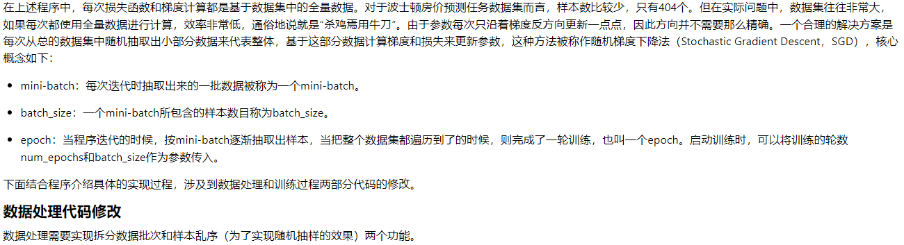
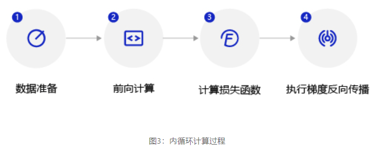

# 作者说明

该笔记更加注重实操时候的记录，所以会舍去一部分内容

每一个小_大章节都会有一个链接连接到该章节最全的代码

# 第一章：零基础入门深度学习

## 1. 前言

## 2. 机器学习和深度学习综述

概括来说，人工智能、机器学习和深度学习覆盖的技术范畴是逐层递减的。人工智能是最宽泛的概念。机器学习是当前比较有效的一种实现人工智能的方式。深度学习是机器学习算法中最热门的一个分支，近些年取得了显著的进展，并替代了大多数传统机器学习算法。


### 2.1 机器学习

机器学习是专门研究计算机怎样模拟或实现人类的学习行为，以获取新的知识或技能，重新组织已有的知识结构，使之不断改善自身的性能。


## 3. 使用python语言和Numpy库来构建神经网络

**[最终代码形态](#3.1)**

### 3.1 线性回归模型

注：该例子以预测波士顿房价为例


### 3.2 线性回归模型的神经网络结构


### 3.3 构建波士顿房价预测任务的神经网络模型

#### 3.3.1 数据处理

**数据处理包含五个部分**：数据导入、数据形状变换、数据集划分、数据归一化处理和封装`load data`函数。数据预处理后，才能被模型调用。

------

- **读入数据**：通过如下代码读入数据，了解下波士顿房价的数据集结构，数据存放在本地目录下housing.data文件中。

- **数据形状变换**：由于读入的原始数据是1维的，所有数据都连在一起。因此需要我们将数据的形状进行变换，形成一个2维的矩阵，每行为一个数据样本（14个值），每个数据样本包含13个**_X_**（影响房价的特征）和一个_**Y**_（该类型房屋的均价）。

- **数据集划分**：将数据集划分成训练集和测试集，其中训练集用于确定模型的参数，测试集用于评判模型的效果。

- **数据归一化处理**：对每个特征进行归一化处理，使得每个特征的取值缩放到0~1之间。这样做有两个好处：一是模型训练更高效；二是特征前的权重大小可以代表该变量对预测结果的贡献度（因为每个特征值本身的范围相同）。

- **封装成load data函数**：将上述几个数据处理操作封装成`load data`函数，以便下一步模型的调用，实现方法如下。

  ```python
  def load_data():
      # 从文件导入数据
      datafile = './work/housing.data'
      data = np.fromfile(datafile, sep=' ')
  
      # 每条数据包括14项，其中前面13项是影响因素，第14项是相应的房屋价格中位数
      feature_names = [ 'CRIM', 'ZN', 'INDUS', 'CHAS', 'NOX', 'RM', 'AGE', \
                        'DIS', 'RAD', 'TAX', 'PTRATIO', 'B', 'LSTAT', 'MEDV' ]
      feature_num = len(feature_names)
  
      # 将原始数据进行Reshape，变成[N, 14]这样的形状
      data = data.reshape([data.shape[0] // feature_num, feature_num])
  
      # 将原数据集拆分成训练集和测试集
      # 这里使用80%的数据做训练，20%的数据做测试
      # 测试集和训练集必须是没有交集的
      ratio = 0.8
      offset = int(data.shape[0] * ratio)
      training_data = data[:offset]
  
      # 计算训练集的最大值，最小值，平均值
      maximums, minimums, avgs = training_data.max(axis=0), training_data.min(axis=0), \
                                   training_data.sum(axis=0) / training_data.shape[0]
  
      # 对数据进行归一化处理
      for i in range(feature_num):
          #print(maximums[i], minimums[i], avgs[i])
          data[:, i] = (data[:, i] - minimums[i]) / (maximums[i] - minimums[i])
  
      # 训练集和测试集的划分比例
      training_data = data[:offset]  
      test_data = data[offset:]
      return training_data, test_data
  
  
  #调用load_data()函数，检验
  # 获取数据
  training_data, test_data = load_data()
  x = training_data[:, :-1]    #横全取  纵除最后一个都取
  y = training_data[:, -1:]    #横全取  纵取最后一个
  # 查看数据
  print(x[0])
  print(y[0])
  ```

  

#### 3.3.2 模型设计

模型设计是深度学习模型关键要素之一，也称为网络结构设计，相当于模型的假设空间，即实现模型“前向计算”（从输入到输出）的过程。


```python
w = [0.1, 0.2, 0.3, 0.4, 0.5, 0.6, 0.7, 0.8, -0.1, -0.2, -0.3, -0.4, 0.0] #定义权重
w = np.array(w).reshape([13, 1])                   #将其改成为13列 1行
```

取出第1条样本数据，观察样本的特征向量与参数向量相乘的结果。

```python
x1=x[0]
t = np.dot(x1, w)     #矩阵的乘法   取第一行的数据，乘以所有的权重，得出结果
print(t)
```

完整的线性回归公式，还需要初始化偏移量_b_，同样随意赋初值-0.2。那么，线性回归模型的完整输出是**_z_ = _t_ + _b_**，这个从特征和参数计算输出值的过程称为“前向计算”。

```python
b = -0.2
z = t + b
print(z)
```

将上述计算预测输出的过程以“类和对象”的方式来描述，类成员变量有参数**_w_**和**_b_**。通过写一个`forward`函数（代表“前向计算”）完成上述从特征和参数到输出预测值的计算过程，代码如下所示。

```python
class Network(object):
    def __init__(self, num_of_weights):
        # 随机产生w的初始值
        # 为了保持程序每次运行结果的一致性，
        # 此处设置固定的随机数种子
        np.random.seed(0)
        self.w = np.random.randn(num_of_weights, 1)  #每个维度的个数，这里有两个维度 生成的是矩阵
        self.b = 0.                                  #指定b为0
        
    def forward(self, x):
        z = np.dot(x, self.w) + self.b               #获取预测值z
        return z
```

基于Network类的定义，模型的计算过程如下所示。

```python
net = Network(13)                                    #设置神经网络有13个特征参数，就会执行上面第一个函数，num_of_weights应该对应的就是13
x1 = x[0]                                            #获取第一个样例
y1 = y[0]                                            #获取第一个样例的真实值
z = net.forward(x1)                                  #执行向前传播函数，计算出z值
print(z)
```


#### 3.3.3 训练配置

模型设计完成后，需要通过训练配置寻找模型的最优值，即通过损失函数来衡量模型的好坏。训练配置也是深度学习模型关键要素之一。


因为计算损失函数时需要把每个样本的损失函数值都考虑到，所以我们需要对单个样本的损失函数进行求和，并除以样本总数_**N**_。


在Network类下面添加损失函数的计算过程如下：

```python
class Network(object):                                       #对类进行一个更新，添加了loss损失值的计算
    def __init__(self, num_of_weights):
        # 随机产生w的初始值
        # 为了保持程序每次运行结果的一致性，此处设置固定的随机数种子
        np.random.seed(0)
        self.w = np.random.randn(num_of_weights, 1)
        self.b = 0.
        
    def forward(self, x):
        z = np.dot(x, self.w) + self.b
        return z
    
    def loss(self, z, y):                                    #这里在Network里计算损失值
        error = z - y                                        #这里参数定义的名字也就有意义了
        cost = error * error
        cost = np.mean(cost)                                 #对所有的值求均值
        return cost

```

使用定义的Network类，可以方便的计算预测值和损失函数。需要注意的是，类中的变量x, w，b, z, error等均是向量。以变量x为例，共有两个维度，一个代表特征数量（值为13），一个代表样本数量，代码如下所示。

```python
net = Network(13)                            #需要注意我们计算的都是向量
# 此处可以一次性计算多个样本的预测值和损失函数
x1 = x[0:3]                                  #取前三个样例的特征值
y1 = y[0:3]                                  #取前三个样例的真实值
z = net.forward(x1)                          #进行向前传播（注意是矩阵计算）
print('predict: ', z)                        #得出预测值
loss = net.loss(z, y1)                       #得出损失值
print('loss:', loss)                         #输出损失值
```


#### 3.3.4 训练过程

上述计算过程描述了如何构建神经网络，通过神经网络完成预测值和损失函数的计算。接下来介绍如何求解参数w和b的数值，这个过程也称为模型训练过程。训练过程是深度学习模型的关键要素之一，其目标是让定义的损失函数Loss尽可能的小，也就是说找到一个参数解w和b，使得损失函数取得极小值。


##### 梯度下降法


 

```python
net = Network(13)
losses = []
#只画出参数w5和w9在区间[-160, 160]的曲线部分，以及包含损失函数的极值
w5 = np.arange(-160.0, 160.0, 1.0)                     #参数1：起点 参数2：终点 参数3：步长
w9 = np.arange(-160.0, 160.0, 1.0)
losses = np.zeros([len(w5), len(w9)])                  #设置矩阵，维度1为w5的长度，维度2位w9的长度

#计算设定区域内每个参数取值所对应的Loss
for i in range(len(w5)):
    for j in range(len(w9)):
        net.w[5] = w5[i]                               #设置对应的值
        net.w[9] = w9[j]
        z = net.forward(x)                             #进行向前传播
        loss = net.loss(z, y)                          #计算损失值
        losses[i, j] = loss                            #获得对应矩阵位置的值

#使用matplotlib将两个变量和对应的Loss作3D图
import matplotlib.pyplot as plt                        #获取类包
from mpl_toolkits.mplot3d import Axes3D
fig = plt.figure()                                     #来一个图容器
ax = Axes3D(fig)                                       #变成3d版

w5, w9 = np.meshgrid(w5, w9)                           #生成网格坐标点矩阵

ax.plot_surface(w5, w9, losses, rstride=1, cstride=1, cmap='rainbow')  #x轴数据，y轴数据，z轴数据，指定行的跨度，指定列的跨度，设置颜色映射
plt.show()                                             #显示
```

输出的图片为下图：


##### 计算梯度


可以通过具体的程序查看每个变量的数据和维度

```python
x1 = x[0]                                      #取第一个样例
y1 = y[0]                                      #取真实值
z1 = net.forward(x1)                           #向前传播，获取预测值
print('x1 {}, shape {}'.format(x1, x1.shape))  #输出特征值
print('y1 {}, shape {}'.format(y1, y1.shape))  #输出真实值
print('z1 {}, shape {}'.format(z1, z1.shape))  #输出预测值
```

按上面的公式，当只有一个样本时，可以计算某个w_j的梯度。比如w_0的梯度

```python
gradient_w0 = (z1 - y1) * x1[0]               #计算梯度
print('gradient_w0 {}'.format(gradient_w0))   #输出梯度值
```

##### 使用Numpy进行梯度计算


输入数据中有多个样本，每个样本都对梯度有贡献。如上代码计算了只有样本1时的梯度值，同样的计算方法也可以计算样本2和样本3对梯度的贡献。

```python
gradient_w = (z1 - y1) * x1                  #直接计算整个矩阵的梯度值
print('gradient_w_by_sample1 {}, gradient.shape {}'.format(gradient_w, gradient_w.shape))  #输出梯度值

x2 = x[1]                                   #获取第二个样本特征值
y2 = y[1]                                   #获取第二个样本的真实值
z2 = net.forward(x2)                        #向前传播
gradient_w = (z2 - y2) * x2                 #计算梯度值
print('gradient_w_by_sample2 {}, gradient.shape {}'.format(gradient_w, gradient_w.shape))  #输出梯度值

#然后把1换成2就能够计算第三个赝本了
```

可能有的读者再次想到可以使用for循环把每个样本对梯度的贡献都计算出来，然后再作平均。但是我们不需要这么做，仍然可以使用Numpy的矩阵操作来简化运算，如3个样本的情况。

下面的x3samples, y3samples, z3samples的第一维大小均为3，表示有3个样本。下面计算这3个样本对梯度的贡献。

```python
# 注意这里是一次取出3个样本的数据，不是取出第3个样本
x3samples = x[0:3]                                 #和上面一样，这里一次性去出3个样本数据，这里都是矩阵运算
y3samples = y[0:3]
z3samples = net.forward(x3samples)

print('x {}, shape {}'.format(x3samples, x3samples.shape))
print('y {}, shape {}'.format(y3samples, y3samples.shape))
print('z {}, shape {}'.format(z3samples, z3samples.shape))

gradient_w = (z3samples - y3samples) * x3samples                               #计算梯度值
print('gradient_w {}, gradient.shape {}'.format(gradient_w, gradient_w.shape))
```

接下来就是扩展到一般


```python
z = net.forward(x)                                              #明白Numpy库的作用，这里是向前传播，计算所有的预测值
gradient_w = (z - y) * x                                        #计算所有的梯度值
print('gradient_w shape {}'.format(gradient_w.shape))           #共计404个样本，每个样本有13个值
print(gradient_w)
```


```python
# axis = 0 表示把每一行做相加然后再除以总的行数
gradient_w = np.mean(gradient_w, axis=0)            #求均值
print('gradient_w ', gradient_w.shape)              #输出，有13个梯度值
print('w ', net.w.shape)                            #输出矩阵w的特征值
print(gradient_w)                                   #输出w的梯度值
print(net.w)                                        #输出特征参数
```


```python
# axis = 0 表示把每一行做相加然后再除以总的行数
gradient_w = np.mean(gradient_w, axis=0)            #求均值
print('gradient_w ', gradient_w.shape)              #输出，有13个梯度值
print('w ', net.w.shape)                            #输出矩阵w的特征值
print(gradient_w)                                   #输出w的梯度值
print(net.w)                                        #输出特征参数

```


```python
gradient_w = gradient_w[:, np.newaxis]        #np.newaxis 插入新维度，让gradient_w重回1维
print('gradient_w shape', gradient_w.shape)   #输出梯度值的维度
```

综上，计算梯度的代码如下所示。

```python
z = net.forward(x)                           #计算预测值
gradient_w = (z - y) * x                     #计算梯度值
gradient_w = np.mean(gradient_w, axis=0)     #计算平均梯度值的影响
gradient_w = gradient_w[:, np.newaxis]       #重新从0维变为1维
gradient_w                                   #输出梯度值
```

将上面计算w和b的梯度的过程，写成Network类的`gradient`函数，实现方法如下所示。

```python
class Network(object):                                     #添加了梯度下降的函数
    def __init__(self, num_of_weights):
        # 随机产生w的初始值
        # 为了保持程序每次运行结果的一致性，此处设置固定的随机数种子
        np.random.seed(0)
        self.w = np.random.randn(num_of_weights, 1)
        self.b = 0.
        
    def forward(self, x):
        z = np.dot(x, self.w) + self.b
        return z
    
    def loss(self, z, y):
        error = z - y
        num_samples = error.shape[0]
        cost = error * error
        cost = np.sum(cost) / num_samples
        return cost
    
    def gradient(self, x, y):                             #封装在这
        z = self.forward(x)                               #计算预测值
        gradient_w = (z-y)*x                              #计算所有梯度下降值
        gradient_w = np.mean(gradient_w, axis=0)          #取平均梯度值
        gradient_w = gradient_w[:, np.newaxis]            #重新从0维升到1维
        gradient_b = (z - y)                              #计算b的梯度值
        gradient_b = np.mean(gradient_b)                  #计算平均梯度值
        
        return gradient_w, gradient_b                     #返回梯度值w，b
    
    
# 调用上面定义的gradient函数，计算梯度
# 初始化网络
net = Network(13)                                        #设置有13个参数
# 设置[w5, w9] = [-100., -100.]
net.w[5] = -100.0                                        #还是使用两个特征参数，作为样例
net.w[9] = -100.0

z = net.forward(x)                                       #进行向前传播
loss = net.loss(z, y)                                    #计算损失值
gradient_w, gradient_b = net.gradient(x, y)              #计算梯度值
gradient_w5 = gradient_w[5][0]                           #赋值特征值
gradient_w9 = gradient_w[9][0]
print('point {}, loss {}'.format([net.w[5][0], net.w[9][0]], loss))      #输出对应的点，和对应的损失值
print('gradient {}'.format([gradient_w5, gradient_w9]))  #输出对应的梯度值
```

##### 确定损失函数更小的点

下面我们开始研究更新梯度的方法。首先沿着梯度的反方向移动一小步，找到下一个点P1，观察损失函数的变化。

```python
# 在[w5, w9]平面上，沿着梯度的反方向移动到下一个点P1
# 定义移动步长 eta
eta = 0.1
# 更新参数w5和w9
net.w[5] = net.w[5] - eta * gradient_w5
net.w[9] = net.w[9] - eta * gradient_w9
# 重新计算z和loss
z = net.forward(x)                                 #这边的式子和上面一样理解
loss = net.loss(z, y)
gradient_w, gradient_b = net.gradient(x, y)
gradient_w5 = gradient_w[5][0]
gradient_w9 = gradient_w[9][0]
print('point {}, loss {}'.format([net.w[5][0], net.w[9][0]], loss))
print('gradient {}'.format([gradient_w5, gradient_w9]))
```


##### 代码封装

将上面的循环计算过程封装在`train`和`update`函数中，实现方法如下所示。

```python
class Network(object):    #新增一个函数
    def __init__(self, num_of_weights):
        # 随机产生w的初始值
        # 为了保持程序每次运行结果的一致性，此处设置固定的随机数种子
        np.random.seed(0)
        self.w = np.random.randn(num_of_weights,1)
        self.w[5] = -100.
        self.w[9] = -100.
        self.b = 0.
        
    def forward(self, x):   #向前传播，计算预测值
        z = np.dot(x, self.w) + self.b
        return z
    
    def loss(self, z, y):   #计算损失值
        error = z - y
        num_samples = error.shape[0]
        cost = error * error
        cost = np.sum(cost) / num_samples
        return cost
    
    def gradient(self, x, y):   #计算梯度值
        z = self.forward(x)
        gradient_w = (z-y)*x
        gradient_w = np.mean(gradient_w, axis=0)  #计算平均梯度值
        gradient_w = gradient_w[:, np.newaxis]    #将0维升成1维
        gradient_b = (z - y)                      #计算梯度值b
        gradient_b = np.mean(gradient_b)          #其平均值
        return gradient_w, gradient_b
    
    def update(self, gradient_w5, gradient_w9, eta=0.01):  #使用梯度下降迭代更新值  eta是学习率
        net.w[5] = net.w[5] - eta * gradient_w5
        net.w[9] = net.w[9] - eta * gradient_w9
        
    def train(self, x, y, iterations=100, eta=0.01):    #分装train函数 iterations是迭代次数
        points = []                                     #定义两个矩阵，一个是记录对应点，一个是记录对应的loss损失值
        losses = []
        for i in range(iterations):                     #迭代一次
            points.append([net.w[5][0], net.w[9][0]])   #我们就举两个特征参数为例子
            z = self.forward(x)                         #向前传播，计算预测值
            L = self.loss(z, y)                         #计算损失值
            gradient_w, gradient_b = self.gradient(x, y)#计算梯度值
            gradient_w5 = gradient_w[5][0]              #进行赋值
            gradient_w9 = gradient_w[9][0]
            self.update(gradient_w5, gradient_w9, eta)  #更新值
            losses.append(L)                            #存储损失值（用于查看是不是慢慢递减）
            if i % 50 == 0:                             #满50就输出一次结果
                print('iter {}, point {}, loss {}'.format(i, [net.w[5][0], net.w[9][0]], L))  #输出对应的特征参数值，和对应的loss值
        return points, losses

# 获取数据
train_data, test_data = load_data()
x = train_data[:, :-1]   #第一维全取，第二维除最后一个都取
y = train_data[:, -1:]   #第一维全取，第二维取最后一个
# 创建网络
net = Network(13)
num_iterations=2000     #设置迭代次数是2000
# 启动训练
points, losses = net.train(x, y, iterations=num_iterations, eta=0.01)

# 画出损失函数的变化趋势
plot_x = np.arange(num_iterations)   #设置x轴是迭代次数
plot_y = np.array(losses)            #设置loss是y轴
plt.plot(plot_x, plot_y)             #将参数传入，绘图
plt.show()                           #将图展示
```

输出的图片如下


##### 训练扩展到全部参数

代码反而更加简洁

```python
class Network(object):                                #这里的代码是是选取所有特征参数
    def __init__(self, num_of_weights):               #初始参数值
        # 随机产生w的初始值
        # 为了保持程序每次运行结果的一致性，此处设置固定的随机数种子
        np.random.seed(0)
        self.w = np.random.randn(num_of_weights, 1)
        self.b = 0.
        
    def forward(self, x):                             #向前传播，计算预测值
        z = np.dot(x, self.w) + self.b
        return z
    
    def loss(self, z, y):                             #计算损失值
        error = z - y
        num_samples = error.shape[0]
        cost = error * error
        cost = np.sum(cost) / num_samples
        return cost
    
    def gradient(self, x, y):                        #计算梯度值
        z = self.forward(x)
        gradient_w = (z-y)*x
        gradient_w = np.mean(gradient_w, axis=0)
        gradient_w = gradient_w[:, np.newaxis]
        gradient_b = (z - y)
        gradient_b = np.mean(gradient_b)        
        return gradient_w, gradient_b
    
    def update(self, gradient_w, gradient_b, eta = 0.01):   #更新梯度值
        self.w = self.w - eta * gradient_w
        self.b = self.b - eta * gradient_b
        
    def train(self, x, y, iterations=100, eta=0.01):       #开始训练
        losses = []                                        #存放损失值
        for i in range(iterations):                        #设置迭代次数
            z = self.forward(x)                            #计算预期值
            L = self.loss(z, y)                            #计算损失值
            gradient_w, gradient_b = self.gradient(x, y)   #计算梯度下降值
            self.update(gradient_w, gradient_b, eta)       #进行更新
            losses.append(L)                               #记录损失
            if (i+1) % 10 == 0:                            #每10次一次输出损失值
                print('iter {}, loss {}'.format(i, L))
        return losses

# 获取数据
train_data, test_data = load_data()
x = train_data[:, :-1]
y = train_data[:, -1:]
# 创建网络
net = Network(13)
num_iterations=1000
# 启动训练
losses = net.train(x,y, iterations=num_iterations, eta=0.01)

# 画出损失函数的变化趋势
plot_x = np.arange(num_iterations)
plot_y = np.array(losses)
plt.plot(plot_x, plot_y)
plt.show()
```

##### 随机梯度下降法

**（Stochastic Gradient Descent）**



```python
# 获取数据
train_data, test_data = load_data()
train_data.shape
```

train_data中一共包含404条数据，如果batch_size=10，即取前0-9号样本作为第一个mini-batch，命名train_data1。

```python
train_data1 = train_data[0:10]
train_data1.shape
```

使用train_data1的数据（0-9号样本）计算梯度并更新网络参数。

```python
net = Network(13)
x = train_data1[:, :-1]
y = train_data1[:, -1:]
loss = net.train(x, y, iterations=1, eta=0.01)
loss
```

下面取10-19号

```python
train_data2 = train_data[10:20]
x = train_data2[:, :-1]
y = train_data2[:, -1:]
loss = net.train(x, y, iterations=1, eta=0.01)
loss
```


```python
batch_size = 10                #设置mini_batch大小
n = len(train_data)            #获取数据的长度
mini_batches = [train_data[k:k+batch_size] for k in range(0, n, batch_size)]  #或许mini_batch range从0到n，步长为10
print('total number of mini_batches is ', len(mini_batches))                  #输出batch共有几个
print('first mini_batch shape ', mini_batches[0].shape)                       #第一个mini_batch的形状
print('last mini_batch shape ', mini_batches[-1].shape)                       #最后一个mini_batch的形状
```


```python
# 新建一个array
a = np.array([1,2,3,4,5,6,7,8,9,10,11,12])
print('before shuffle', a)
np.random.shuffle(a)                 #介绍该函数的作用
print('after shuffle', a)
```

多次运行上面的代码，可以发现每次执行shuffle函数后的数字顺序均不同。 上面举的是一个1维数组乱序的案例，我们再观察下2维数组乱序后的效果。

```python
# 新建一个array
a = np.array([1,2,3,4,5,6,7,8,9,10,11,12])
a = a.reshape([6, 2])
print('before shuffle\n', a)                   #继续说明这个函数的作用
np.random.shuffle(a)
print('after shuffle\n', a)
```

观察运行结果可发现，数组的元素在第0维被随机打乱，但第1维的顺序保持不变。例如数字2仍然紧挨在数字1的后面，数字8仍然紧挨在数字7的后面，而第二维的[3, 4]并不排在[1, 2]的后面。将这部分实现SGD算法的代码集成到Network类中的`train`函数中，最终的完整代码如下。

```python
# 获取数据
train_data, test_data = load_data()

# 打乱样本顺序
np.random.shuffle(train_data)

# 将train_data分成多个mini_batch
batch_size = 10
n = len(train_data)
mini_batches = [train_data[k:k+batch_size] for k in range(0, n, batch_size)]

# 创建网络
net = Network(13)

# 依次使用每个mini_batch的数据
for mini_batch in mini_batches:
    x = mini_batch[:, :-1]
    y = mini_batch[:, -1:]
    loss = net.train(x, y, iterations=1)
```


**<span id="3.1">最终代码形态</span>**

```python
import numpy as np

class Network(object):
    def __init__(self, num_of_weights):             #初始随机化特征参数
        # 随机产生w的初始值
        # 为了保持程序每次运行结果的一致性，此处设置固定的随机数种子
        #np.random.seed(0)
        self.w = np.random.randn(num_of_weights, 1)
        self.b = 0.
        
    def forward(self, x):                           #向前传播
        z = np.dot(x, self.w) + self.b
        return z
    
    def loss(self, z, y):                           #计算损失值
        error = z - y
        num_samples = error.shape[0]
        cost = error * error
        cost = np.sum(cost) / num_samples
        return cost
    
    def gradient(self, x, y):                      #计算梯度值
        z = self.forward(x)
        N = x.shape[0]
        gradient_w = 1. / N * np.sum((z-y) * x, axis=0)
        gradient_w = gradient_w[:, np.newaxis]
        gradient_b = 1. / N * np.sum(z-y)
        return gradient_w, gradient_b
    
    def update(self, gradient_w, gradient_b, eta = 0.01):      #更新梯度值
        self.w = self.w - eta * gradient_w
        self.b = self.b - eta * gradient_b
            
                
    def train(self, training_data, num_epochs, batch_size=10, eta=0.01):       #封装train函数
        n = len(training_data)                                                 #获取train数据
        losses = []                                                            #存放损失值
        for epoch_id in range(num_epochs):                                     #走epochs，每一次epochs为一次完整的走完数据集
            # 在每轮迭代开始之前，将训练数据的顺序随机打乱
            # 然后再按每次取batch_size条数据的方式取出
            np.random.shuffle(training_data)                                   #将数据打乱
            # 将训练数据进行拆分，每个mini_batch包含batch_size条的数据
            mini_batches = [training_data[k:k+batch_size] for k in range(0, n, batch_size)]  #将数据划分mini_batch
            for iter_id, mini_batch in enumerate(mini_batches):                #enumerate 将可遍历的序列加上索引标注
                #print(self.w.shape)
                #print(self.b)
                x = mini_batch[:, :-1]                                         #获取特征值
                y = mini_batch[:, -1:]                                         #获取真实值
                a = self.forward(x)                                            #获取预测值
                loss = self.loss(a, y)                                         #计算损失值
                gradient_w, gradient_b = self.gradient(x, y)                   #计算梯度值
                self.update(gradient_w, gradient_b, eta)                       #更新梯度值
                losses.append(loss)                                            #添加损失值
                print('Epoch {:3d} / iter {:3d}, loss = {:.4f}'.               #输出epoch值 小的编号值，损失值
                                 format(epoch_id, iter_id, loss))
        
        return losses                                                          #返回所有的损失值

# 获取数据
train_data, test_data = load_data()

# 创建网络
net = Network(13)
# 启动训练
losses = net.train(train_data, num_epochs=50, batch_size=100, eta=0.1)

# 画出损失函数的变化趋势
plot_x = np.arange(len(losses))                                              #将迭代次数为x
plot_y = np.array(losses)                                                    #损失值为y轴
plt.plot(plot_x, plot_y)                                                     #进行绘图
plt.show()                                                                   #展示绘图
```

输出图片如下


### 总结

本节我们详细介绍了如何使用Numpy实现梯度下降算法，构建并训练了一个简单的线性模型实现波士顿房价预测，可以总结出，使用神经网络建模房价预测有三个要点：

- 构建网络，初始化参数w和b，定义预测和损失函数的计算方法。
- 随机选择初始点，建立梯度的计算方法和参数更新方式。
- 从总的数据集中抽取部分数据作为一个mini_batch，计算梯度并更新参数，不断迭代直到损失函数几乎不再下降。


## 4. 飞浆开源深度学习平台介绍


## 5. 使用飞浆重写房价预测模型

飞桨设计的初衷不仅要易于学习，还期望使用者能够体会到它的美感和哲学，与人类最自然的认知和使用习惯契合。

**使用飞桨独有类库**

```python
#加载飞桨、Numpy和相关类库
import paddle
from paddle.nn import Linear
import paddle.nn.functional as F
import numpy as np
import os
import random
```


### 5.1 数据处理

数据处理的代码不依赖框架实现，与使用Python构建房价预测任务的代码相同

```python
def load_data():
    # 从文件导入数据
    datafile = './work/housing.data'
    data = np.fromfile(datafile, sep=' ', dtype=np.float32)

    # 每条数据包括14项，其中前面13项是影响因素，第14项是相应的房屋价格中位数
    feature_names = [ 'CRIM', 'ZN', 'INDUS', 'CHAS', 'NOX', 'RM', 'AGE', \
                      'DIS', 'RAD', 'TAX', 'PTRATIO', 'B', 'LSTAT', 'MEDV' ]
    feature_num = len(feature_names)

    # 将原始数据进行Reshape，变成[N, 14]这样的形状
    data = data.reshape([data.shape[0] // feature_num, feature_num])

    # 将原数据集拆分成训练集和测试集
    # 这里使用80%的数据做训练，20%的数据做测试
    # 测试集和训练集必须是没有交集的
    ratio = 0.8
    offset = int(data.shape[0] * ratio)
    training_data = data[:offset]

    # 计算train数据集的最大值，最小值，平均值
    maximums, minimums, avgs = training_data.max(axis=0), training_data.min(axis=0), \
                                 training_data.sum(axis=0) / training_data.shape[0]
    
    # 记录数据的归一化参数，在预测时对数据做归一化
    global max_values
    global min_values
    global avg_values
    max_values = maximums
    min_values = minimums
    avg_values = avgs

    # 对数据进行归一化处理
    for i in range(feature_num): #[:,i]第一维全取，第二维取i  取所有行的第i个数据
        data[:, i] = (data[:, i] - avgs[i]) / (maximums[i] - minimums[i])

    # 训练集和测试集的划分比例
    training_data = data[:offset]
    test_data = data[offset:]
    return training_data, test_data

```

### 5.2 模型设计


```python
class Regressor(paddle.nn.Layer):

    # self代表类的实例自身
    def __init__(self):
        # 初始化父类中的一些参数
        super(Regressor, self).__init__()
        # 定义一层全连接层，输入维度是13，输出维度是1
        self.fc = Linear(in_features=13, out_features=1)
    
    # 网络的前向计算
    def forward(self, inputs):
        x = self.fc(inputs)
        return x
```

### 5.3 训练配置

训练配置过程包含四步


1. 声明定义好的回归模型Regressor实例，并将模型的状态设置为训练。
2. 使用load_data函数加载训练数据和测试数据。
3. 设置优化算法和学习率，优化算法采用随机梯度下降SGD，学习率设置为0.01。

```python
# 声明定义好的线性回归模型
model = Regressor()
# 开启模型训练模式
model.train()
# 加载数据
training_data, test_data = load_data()
# 定义优化算法，使用随机梯度下降SGD
# 学习率设置为0.01
opt = paddle.optimizer.SGD(learning_rate=0.01, parameters=model.parameters())
```

**说明**


### 5.4 训练过程

训练过程采用二层循环嵌套方式


**说明**:

batch的取值会影响模型训练效果。batch过大，会增大内存消耗和计算时间，且训练效果并不会明显提升（因为每次参数只向梯度反方向移动一小步，所以方向没必要特别精确）；batch过小，每个batch的样本数据将没有统计意义，计算的梯度方向可能偏差较大。由于房价预测模型的训练数据集较小，我们将batch为设置10。

内层循环都需要执行如下4个步骤



1. 数据准备：将一个批次的数据先转换成np.array格式，再转换成paddle内置tensor格式。
2. 前向计算：将一个批次的样本数据灌入网络中，计算输出结果。
3. 计算损失函数：以前向计算结果和真实房价作为输入，通过损失函数square_error_cost API计算出损失函数值（Loss）。飞桨所有的API接口都有完整的说明和使用案例，在后续教程中我们会详细介绍API的查阅方法。
4. 反向传播：执行梯度反向传播`backward`函数，即从后到前逐层计算每一层的梯度，并根据设置的优化算法更新参数。

```python
EPOCH_NUM = 10   # 设置外层循环次数
BATCH_SIZE = 10  # 设置batch大小

# 定义外层循环
for epoch_id in range(EPOCH_NUM):
    # 在每轮迭代开始之前，将训练数据的顺序随机的打乱
    np.random.shuffle(training_data)
    # 将训练数据进行拆分，每个batch包含10条数据
    mini_batches = [training_data[k:k+BATCH_SIZE] for k in range(0, len(training_data), BATCH_SIZE)]
    # 定义内层循环
    for iter_id, mini_batch in enumerate(mini_batches):
        x = np.array(mini_batch[:, :-1]) # 获得当前批次训练数据
        y = np.array(mini_batch[:, -1:]) # 获得当前批次训练标签（真实房价）
        # 将numpy数据转为飞桨动态图tensor形式
        house_features = paddle.to_tensor(x)#获取特征值
        prices = paddle.to_tensor(y)#获取价钱
        
        # 前向计算
        predicts = model(house_features)
        
        # 计算损失
        loss = F.square_error_cost(predicts, label=prices) #输入预测值和真实值，然后进行计算
        avg_loss = paddle.mean(loss)#计算平均损失值
        if iter_id%20==0:
            print("epoch: {}, iter: {}, loss is: {}".format(epoch_id, iter_id, avg_loss.numpy()))#输入函数
        
        # 反向传播
        avg_loss.backward()
        # 最小化loss,更新参数
        opt.step()
        # 清除梯度
        opt.clear_grad()
```

### 5.5 保存并测试模型

#### 5.5.1 保存模型

将模型当前的参数数据`model.state_dict()`保存到文件中（通过参数指定保存的文件名 LR_model），以备预测或校验的程序调用，代码如下所示。

```python
# 保存模型参数，文件名为LR_model.pdparams
paddle.save(model.state_dict(), 'LR_model.pdparams')
print("模型保存成功，模型参数保存在LR_model.pdparams中")
```

理论而言，直接使用模型实例即可完成预测，而本教程中预测的方式为什么是先保存模型，再加载模型呢？这是因为在实际应用中，训练模型和使用模型往往是不同的场景。模型训练通常使用大量的线下服务器（不对外向企业的客户/用户提供在线服务），而模型预测则通常使用线上提供预测服务的服务器，或者将已经完成的预测模型嵌入手机或其他终端设备中使用。因此本教程的讲解方式更贴合真实场景的使用方法。

回顾下基于飞桨实现的房价预测模型，实现效果与之前基于Python实现的模型没有区别，但两者的实现成本有天壤之别。飞桨的愿景是用户只需要了解模型的逻辑概念，不需要关心实现细节，就能搭建强大的模型。

#### 5.5.2 测试模型


```python
def load_one_example():
    # 从上边已加载的测试集中，随机选择一条作为测试数据
    idx = np.random.randint(0, test_data.shape[0])  #从0到测试集大小随机选择一个值
    idx = -10
    one_data, label = test_data[idx, :-1], test_data[idx, -1]
    # 修改该条数据shape为[1,13]
    one_data =  one_data.reshape([1,-1]) #-1位自动计算，这里就是1行13列(a*b/1) a b是one_data.shape

    return one_data, label

# 参数为保存模型参数的文件地址
model_dict = paddle.load('LR_model.pdparams') #加载模型
model.load_dict(model_dict) #使用模型
model.eval() #选取预测模型

# 参数为数据集的文件地址
one_data, label = load_one_example() #加载数据
# 将数据转为动态图的variable格式 
one_data = paddle.to_tensor(one_data) #修改成为我们需要的格式
predict = model(one_data) #进行预测

# 对结果做反归一化处理
predict = predict * (max_values[-1] - min_values[-1]) + avg_values[-1]
# 对label数据做反归一化处理
label = label * (max_values[-1] - min_values[-1]) + avg_values[-1]

print("Inference result is {}, the corresponding label is {}".format(predict.numpy(), label)) #推理的结果，对应的标签是

```

### 总结

通过比较“模型预测值”和“真实房价”可见，模型的预测效果与真实房价接近。房价预测仅是一个最简单的模型，使用飞桨编写均可事半功倍。那么对于工业实践中更复杂的模型，使用飞桨节约的成本是不可估量的。同时飞桨针对很多应用场景和机器资源做了性能优化，在功能和性能上远强于自行编写的模型。

## 6. numpy 介绍

### 6.1概述

Numpy（Numerical Python的简称）是高性能科学计算和数据分析的基础包。使用飞桨构建神经网络模型时，通常会使用Numpy实现数据预处理和一些模型指标的计算，飞桨中的Tensor数据可以很方便的和ndarray数组进行相互转换。

**Numpy具有如下功能：**

- ndarray数组：一个具有矢量算术运算和复杂广播能力的多维数组，具有快速且节省空间的特点。
- 对整组数据进行快速运算的标准数学函数（无需编写循环）。
- 线性代数、随机数生成以及傅里叶变换功能。
- 读写磁盘数据、操作内存映射文件。

本质上，Numpy期望用户在执行“向量”操作时，像使用“标量”一样轻松。读者可以先在本机上运行如下代码，感受一下Numpy的便捷。

```python
>>> import numpy as np 
>>> a = np.array([1,2,3,4]) 
>>> b = np.array([10,20,30,40]) 
>>> c = a + b 
>>> print (c)
>>>[11 22 33 44]
```

### 6.2 基础数据类型：ndarray数组

ndarray数组是Numpy的基础数据结构，可以灵活、高效地处理多个元素的操作。本节主要从如下五部分展开介绍：

- 为什么引入ndarray数组
- 如何创建ndarray数组
- ndarray数组的基本运算
- ndarray数组的切片和索引
- ndarray数组的统计运算

#### 6.2.1 为什么引入ndarray数组

Python中的list列表也可以非常灵活的处理多个元素的操作，但效率却非常低。与之比较，ndarray数组具有如下特点：

- ndarray数组中所有元素的数据类型相同、数据地址连续，批量操作数组元素时速度更快。而list列表中元素的数据类型可能不同，需要通过寻址方式找到下一个元素。
- ndarray数组支持广播机制，矩阵运算时不需要写for循环。
- Numpy底层使用C语言编写，内置并行计算功能，运行速度高于Python代码。

下面通过几个实际例子体会一下，在完成同一个任务时，使用ndarray数组和list列表的差异。

##### 案例1：实现a+1的计算

```python
# Python原生的list
# 假设有两个list
a = [1, 2, 3, 4, 5]
b = [2, 3, 4, 5, 6]

# 完成如下计算
# 对a的每个元素 + 1
# a = a + 1 不能这么写，会报错
# a[:] = a[:] + 1 也不能这么写，也会报错
for i in range(5):
    a[i] = a[i] + 1
a
>>>[2, 3, 4, 5, 6]

# 使用ndarray
import numpy as np
a = np.array([1, 2, 3, 4, 5])
a = a + 1
a
>>>array([2, 3, 4, 5, 6])
```

##### 案例2： 实现c=a+b的计算

```python
# 计算 a和b中对应位置元素的和，是否可以这么写？
a = [1, 2, 3, 4, 5]
b = [2, 3, 4, 5, 6]
c = a + b
# 检查输出发现，不是想要的结果
c
>>>[1, 2, 3, 4, 5, 2, 3, 4, 5, 6]

# 使用for循环，完成两个list对应位置元素相加
c = []
for i in range(5):
    c.append(a[i] + b[i])
c
>>>[3, 5, 7, 9, 11]

# 使用numpy中的ndarray完成两个ndarray相加
import numpy as np
a = np.array([1, 2, 3, 4, 5])
b = np.array([2, 3, 4, 5, 6])
c = a + b 
c
>>>array([ 3,  5,  7,  9, 11])
```

通过上面的两个案例可以看出，在不写for循环的情况下，ndarray数组就可以非常方便的完成数学计算。在编写矢量或者矩阵的程序时，可以像编写普通数值一样，使得代码极其简洁。

另外，ndarray数组还提供了广播机制，它会按一定规则自动对数组的维度进行扩展以完成计算。如下面例子所示，1维数组和2维数组进行相加操作，ndarray数组会自动扩展1维数组的维度，然后再对每个位置的元素分别相加。

```python
# 自动广播机制，1维数组和2维数组相加

# 二维数组维度 2x5
# array([[ 1,  2,  3,  4,  5],
#         [ 6,  7,  8,  9, 10]])
d = np.array([[1, 2, 3, 4, 5], [6, 7, 8, 9, 10]])
# c是一维数组，维度5
# array([ 4,  6,  8, 10, 12])
c = np.array([ 4,  6,  8, 10, 12])
e = d + c
e

>>>
array([[ 5,  8, 11, 14, 17],
       [10, 13, 16, 19, 22]])
```

#### 6.2.2 创建ndarray数组

创建ndarray数组最简单的方式就是使用`array`函数，它接受一切序列型的对象（包括其他数组），然后产生一个新的含有传入数据的numpy数组。下面通过实例体会下`array`、`arange`、`zeros`、`ones`四个主要函数的用法。

- `array`：创建嵌套序列（比如由一组等长列表组成的列表），并转换为一个多维数组。

```python
# 导入numpy
import numpy as np

# 从list创建array 
a = [1,2,3,4,5,6]  # 创建简单的列表
b = np.array(a)    # 将列表转换为数组
b
>>>array([1, 2, 3, 4, 5, 6])
```

- `arange`：创建元素从0到10依次递增2的数组。

```python
# 通过np.arange创建
# 通过指定start, stop (不包括stop)，interval来产生一个1维的ndarray
a = np.arange(0, 10, 2)
a
>>>array([0, 2, 4, 6, 8])
```

- `zeros`：创建指定长度或者形状的全0数组。

```python
# 创建全0的ndarray
a = np.zeros([3,3])
a
>>>
array([[0., 0., 0.],
       [0., 0., 0.],
       [0., 0., 0.]])
```

- `ones`：创建指定长度或者形状的全1数组。

```python
# 创建全1的ndarray
a = np.ones([3,3])
a
>>>
array([[1., 1., 1.],
       [1., 1., 1.],
       [1., 1., 1.]])
```

#### 6.2.3 查看ndarray数组的属性

ndarray的属性包括`shape`、`dtype`、`size`和`ndim`等，通过如下代码可以查看ndarray数组的属性。

- `shape`：数组的形状 ndarray.shape，1维数组（N, ），二维数组（M, N），三维数组（M, N, K）。
- `dtype`：数组的数据类型。
- `size`：数组中包含的元素个数 ndarray.size，其大小等于各个维度的长度的乘积。
- `ndim`：数组的维度大小，ndarray.ndim, 其大小等于ndarray.shape所包含元素的个数。

```python
a = np.ones([3, 3])
print('a, dtype: {}, shape: {}, size: {}, ndim: {}'.format(a.dtype, a.shape, a.size, a.ndim))
>>>a, dtype: float64, shape: (3, 3), size: 9, ndim: 2
                
import numpy as np
b = np.random.rand(10, 10)
b.shape #数组的形状
>>>(10, 10)

b.size  #元素个数 10*10
>>>100

b.ndim  #维度的大小
>>>2

b.dtype  #数据的类型
>>>dtype('float64')

```

#### 6.2.4 改变ndarray数组的数据类型和形状

创建ndarray之后，可以对其数据类型或形状进行修改，代码如下所示。

```python
# 转化数据类型
b = a.astype(np.int64)
print('b, dtype: {}, shape: {}'.format(b.dtype, b.shape))

# 改变形状
c = a.reshape([1, 9])
print('c, dtype: {}, shape: {}'.format(c.dtype, c.shape))

>>>
b, dtype: int64, shape: (3, 3)
c, dtype: float64, shape: (1, 9)
```

#### 6.2.5 ndarray数组的基本运算

ndarray数组可以像普通的数值型变量一样进行加减乘除操作，主要包含如下两种运算：

- 标量和ndarray数组之间的运算
- 两个ndarray数组之间的运算

##### 标量和ndarray素组之间的运算

标量和ndarray数组之间的运算主要包括除法、乘法、加法和减法运算，具体代码如下所示。

```python
# 标量除以数组，用标量除以数组的每一个元素
arr = np.array([[1., 2., 3.], [4., 5., 6.]])
1. / arr
>>>
array([[1.        , 0.5       , 0.33333333],
       [0.25      , 0.2       , 0.16666667]])

# 标量乘以数组，用标量乘以数组的每一个元素
arr = np.array([[1., 2., 3.], [4., 5., 6.]])
2.0 * arr
>>>
array([[ 2.,  4.,  6.],
       [ 8., 10., 12.]])

# 标量加上数组，用标量加上数组的每一个元素
arr = np.array([[1., 2., 3.], [4., 5., 6.]])
2.0 + arr
>>>
array([[3., 4., 5.],
       [6., 7., 8.]])

# 标量减去数组，用标量减去数组的每一个元素
arr = np.array([[1., 2., 3.], [4., 5., 6.]])
2.0 - arr
>>>
array([[ 1.,  0., -1.],
       [-2., -3., -4.]])
```

##### 两个ndarray数组之间的运算

两个ndarray数组之间的运算主要包括减法、加法、乘法、除法和开根号运算，具体代码如下所示。

```python
# 数组 减去 数组， 用对应位置的元素相减
arr1 = np.array([[1., 2., 3.], [4., 5., 6.]])
arr2 = np.array([[11., 12., 13.], [21., 22., 23.]])
arr1 - arr2
>>>
array([[-10., -10., -10.],
       [-17., -17., -17.]])
 
# 数组 加上 数组， 用对应位置的元素相加
arr1 = np.array([[1., 2., 3.], [4., 5., 6.]])
arr2 = np.array([[11., 12., 13.], [21., 22., 23.]])
arr1 + arr2
>>>
array([[12., 14., 16.],
       [25., 27., 29.]])

# 数组 乘以 数组，用对应位置的元素相乘
arr1 * arr2
>>>
array([[ 11.,  24.,  39.],
       [ 84., 110., 138.]])

# 数组 除以 数组，用对应位置的元素相除
arr1 / arr2
>>>
array([[0.09090909, 0.16666667, 0.23076923],
       [0.19047619, 0.22727273, 0.26086957]])

# 数组开根号，将每个位置的元素都开根号
arr ** 0.5
>>>
array([[1.        , 1.41421356, 1.73205081],
       [2.        , 2.23606798, 2.44948974]])
```

#### 6.2.6 ndarray数组的索引和切片

在编写模型过程中，通常需要访问或者修改ndarray数组某个位置的元素，则需要使用ndarray数组的索引。有些情况下可能需要访问或者修改一些区域的元素，则需要使用ndarray数组的切片。

ndarray数组的索引和切片的使用方式与Python中的list类似。通过[ -n , n-1 ]的下标进行索引，通过内置的`slice`函数，设置其`start`,`stop`和`step`参数进行切片，从原数组中切割出一个新数组。

ndarray数组的索引是一个内容丰富的主题，因为选取数据子集或单个元素的方式有很多。下面从一维数组和多维数组两个维度介绍索引和切片的方法。

##### 一维ndarray数组的索引和切片

从表面上看，一维数组跟Python列表的功能类似，它们重要区别在于：数组切片产生的新数组，还是指向原来的内存区域，数据不会被复制，视图上的任何修改都会直接反映到源数组上。将一个标量值赋值给一个切片时，该值会自动传播到整个选区。

```python
# 1维数组索引和切片
a = np.arange(30)
a[10]
>>>10

a = np.arange(30)
b = a[4:7]
b
>>>array([4, 5, 6])

#将一个标量值赋值给一个切片时，该值会自动传播到整个选区。
a = np.arange(30)
a[4:7] = 10
a
>>>
array([ 0,  1,  2,  3, 10, 10, 10,  7,  8,  9, 10, 11, 12, 13, 14, 15, 16, 17, 18, 19, 20, 21, 22, 23, 24, 25, 26, 27, 28, 29])

# 数组切片产生的新数组，还是指向原来的内存区域，数据不会被复制。
# 视图上的任何修改都会直接反映到源数组上。
a = np.arange(30)
arr_slice = a[4:7]
arr_slice[0] = 100
a, arr_slice
>>>
(array([  0,   1,   2,   3, 100,   5,   6,   7,   8,   9,  10,  11,  12, 13,  14,  15,  16,  17,  18,  19,  20,  21,  22,  23,  24,  25, 26,  27,  28,  29]),
 array([100,   5,   6]))

# 通过copy给新数组创建不同的内存空间
a = np.arange(30)
arr_slice = a[4:7]
arr_slice = np.copy(arr_slice)
arr_slice[0] = 100
a, arr_slice
>>>
(array([ 0,  1,  2,  3,  4,  5,  6,  7,  8,  9, 10, 11, 12, 13, 14, 15, 16, 17, 18, 19, 20, 21, 22, 23, 24, 25, 26, 27, 28, 29]),
 array([100,   5,   6]))
```

##### 多维ndarray数组的索引和切片

多维ndarray数组的索引和切片具有如下特点：

- 在多维数组中，各索引位置上的元素不再是标量而是多维数组。
- 以逗号隔开的索引列表来选取单个元素。
- 在多维数组中，如果省略了后面的索引，则返回对象会是一个维度低一点的ndarray。

多维ndarray数组的索引代码如下所示。

```python
# 创建一个多维数组
a = np.arange(30)
arr3d = a.reshape(5, 3, 2)
arr3d
>>>
array([[[ 0,  1],
        [ 2,  3],
        [ 4,  5]],

       [[ 6,  7],
        [ 8,  9],
        [10, 11]],

       [[12, 13],
        [14, 15],
        [16, 17]],

       [[18, 19],
        [20, 21],
        [22, 23]],

       [[24, 25],
        [26, 27],
        [28, 29]]])

# 只有一个索引指标时，会在第0维上索引，后面的维度保持不变
arr3d[0]
>>>
array([[0, 1],
       [2, 3],
       [4, 5]])

# 两个索引指标
arr3d[0][1]
>>>
array([2, 3])

# 两个索引指标
arr3d[0, 1]
>>>
array([2, 3])
```

多维ndarray数组的切片代码如下所示。

```python
# 创建一个数组
a = np.arange(24)
a
>>>
array([ 0,  1,  2,  3,  4,  5,  6,  7,  8,  9, 10, 11, 12, 13, 14, 15, 16, 17, 18, 19, 20, 21, 22, 23])

# reshape成一个二维数组
a = a.reshape([6, 4])
a
>>>
array([[ 0,  1,  2,  3],
       [ 4,  5,  6,  7],
       [ 8,  9, 10, 11],
       [12, 13, 14, 15],
       [16, 17, 18, 19],
       [20, 21, 22, 23]])

# 使用for语句生成list
[k for k in range(0, 6, 2)]
>>>[0, 2, 4]

# 结合上面列出的for语句的用法
# 使用for语句对数组进行切片
# 下面的代码会生成多个切片构成的list
# k in range(0, 6, 2) 决定了k的取值可以是0, 2, 4
# 产生的list的包含三个切片
# 第一个元素是a[0 : 0+2]，
# 第二个元素是a[2 : 2+2]，
# 第三个元素是a[4 : 4+2]
slices = [a[k:k+2] for k in range(0, 6, 2)]
slices
>>>
[array([[0, 1, 2, 3],
        [4, 5, 6, 7]]),
 array([[ 8,  9, 10, 11],
        [12, 13, 14, 15]]),
 array([[16, 17, 18, 19],
        [20, 21, 22, 23]])]

slices[0]
>>>
array([[0, 1, 2, 3],
       [4, 5, 6, 7]])
```

#### 6.2.7 ndarray数组的统计方法

可以通过数组上的一组数学函数对整个数组或某个轴向的数据进行统计计算。主要包括如下统计方法：

- `mean`：计算算术平均数，零长度数组的mean为NaN。
- `std`和`var`：计算标准差和方差，自由度可调（默认为n）。
- `sum` ：对数组中全部或某轴向的元素求和，零长度数组的sum为0。
- `max`和`min`：计算最大值和最小值。
- `argmin`和`argmax`：分别为最大和最小元素的索引。
- `cumsum`：计算所有元素的累加。
- `cumprod`：计算所有元素的累积。

**说明**

sum、mean以及标准差std等聚合计算既可以当做数组的实例方法调用，也可以当做Numpy函数使用。

```python
# 计算均值，使用arr.mean() 或 np.mean(arr)，二者是等价的
arr = np.array([[1,2,3], [4,5,6], [7,8,9]])
arr.mean(), np.mean(arr)
>>>(5.0, 5.0)

# 求和
arr.sum(), np.sum(arr)
>>>45, 45)

# 求最大值
arr.max(), np.max(arr)
>>>(9, 9)

# 求最小值
arr.min(), np.min(arr)
>>>(1, 1)

# 指定计算的维度
# 沿着第1维求平均，也就是将[1, 2, 3]取平均等于2，[4, 5, 6]取平均等于5，[7, 8, 9]取平均等于8
arr.mean(axis = 1)
>>>array([2., 5., 8.])

# 沿着第0维求和，也就是将[1, 4, 7]求和等于12，[2, 5, 8]求和等于15，[3, 6, 9]求和等于18
arr.sum(axis=0)
>>>array([12, 15, 18])

# 沿着第0维求最大值，也就是将[1, 4, 7]求最大值等于7，[2, 5, 8]求最大值等于8，[3, 6, 9]求最大值等于9
arr.max(axis=0)
>>>array([7, 8, 9])

# 沿着第1维求最小值，也就是将[1, 2, 3]求最小值等于1，[4, 5, 6]求最小值等于4，[7, 8, 9]求最小值等于7
arr.min(axis=1)
>>>array([1, 4, 7])

# 计算标准差
arr.std()
>>>2.581988897471611

# 计算方差
arr.var()
>>>6.666666666666667

# 找出最大元素的索引
arr.argmax(), arr.argmax(axis=0), arr.argmax(axis=1)
>>>(8, array([2, 2, 2]), array([2, 2, 2]))

# 找出最小元素的索引
arr.argmin(), arr.argmin(axis=0), arr.argmin(axis=1)
>>>(0, array([0, 0, 0]), array([0, 0, 0]))
```

### 6.3 随机数np.random

主要介绍创建ndarray随机数组以及随机打乱顺序、随机选取元素等相关操作的方法。

#### 6.3.1 创建随机ndarray数组

创建随机ndarray数组主要包含设置随机种子、均匀分布和正态分布三部分内容，具体代码如下所示。

- **设置随机数种子**

```python
# 可以多次运行，观察程序输出结果是否一致
# 如果不设置随机数种子，观察多次运行输出结果是否一致
np.random.seed(10)
a = np.random.rand(3, 3)
a
>>>
array([[0.77132064, 0.02075195, 0.63364823],
       [0.74880388, 0.49850701, 0.22479665],
       [0.19806286, 0.76053071, 0.16911084]])
```

- **均匀分布**

```python
# 生成均匀分布随机数，随机数取值范围在[0, 1)之间
a = np.random.rand(3, 3)
a
>>>
array([[0.08833981, 0.68535982, 0.95339335],
       [0.00394827, 0.51219226, 0.81262096],
       [0.61252607, 0.72175532, 0.29187607]])

# 生成均匀分布随机数，指定随机数取值范围和数组形状
a = np.random.uniform(low = -1.0, high = 1.0, size=(2,2))
a
>>>
array([[ 0.83554825,  0.42915157],
       [ 0.08508874, -0.7156599 ]])
```

- **正态分布**

```python
# 生成标准正态分布随机数
a = np.random.randn(3, 3)
a
>>>
array([[ 1.484537  , -1.07980489, -1.97772828],
       [-1.7433723 ,  0.26607016,  2.38496733],
       [ 1.12369125,  1.67262221,  0.09914922]])
       
# 生成正态分布随机数，指定均值loc和方差scale
a = np.random.normal(loc = 1.0, scale = 1.0, size = (3,3))
a
>>>
array([[2.39799638, 0.72875201, 1.61320418],
       [0.73268281, 0.45069099, 1.1327083 ],
       [0.52385799, 2.30847308, 1.19501328]])
```

#### 6.3.2 随机打乱ndarray数组顺序

- 随机打乱1维ndarray数组顺序，发现所有元素位置都被打乱了，代码如下所示。

```python
# 生成一维数组
a = np.arange(0, 30)
print('before random shuffle: ', a)
# 打乱一维数组顺序
np.random.shuffle(a)
print('after random shuffle: ', a)
>>>
before random shuffle:  [ 0  1  2  3  4  5  6  7  8  9 10 11 12 13 14 15 16 17 18 19 20 21 22 23 24 25 26 27 28 29]
after random shuffle:  [14  3 20 21  9 26 25  1 22 23  0 11 17 10 27 16  6 19 13 15  8  2 28 18 29  7  4  5 12 24]
```

- 随机打乱2维ndarray数组顺序，发现只有行的顺序被打乱了，列顺序不变，代码如下所示。

```python
# 生成一维数组
a = np.arange(0, 30)
# 将一维数组转化成2维数组
a = a.reshape(10, 3)
print('before random shuffle: \n{}'.format(a))
# 打乱一维数组顺序
np.random.shuffle(a)
print('after random shuffle: \n{}'.format(a))
>>>
before random shuffle: 
[[ 0  1  2]
 [ 3  4  5]
 [ 6  7  8]
 [ 9 10 11]
 [12 13 14]
 [15 16 17]
 [18 19 20]
 [21 22 23]
 [24 25 26]
 [27 28 29]]
after random shuffle: 
[[ 9 10 11]
 [24 25 26]
 [18 19 20]
 [12 13 14]
 [21 22 23]
 [27 28 29]
 [ 0  1  2]
 [15 16 17]
 [ 6  7  8]
 [ 3  4  5]]
```

#### 6.3.3 随机选取元素

```python
# 随机选取部分元素
a = np.arange(30)
b = np.random.choice(a, size=5)
b
>>>
array([23,  3, 29, 16, 20])
```

### 6.4 线性代数

线性代数（如矩阵乘法、矩阵分解、行列式以及其他方阵数学等）是任何数组库的重要组成部分，Numpy中实现了线性代数中常用的各种操作，并形成了numpy.linalg线性代数相关的模块。本节主要介绍如下函数：

- `diag`：以一维数组的形式返回方阵的对角线（或非对角线）元素，或将一维数组转换为方阵（非对角线元素为0）。
- `dot`：矩阵乘法。
- `trace`：计算对角线元素的和。
- `det`：计算矩阵行列式。
- `eig`：计算方阵的特征值和特征向量。
- `inv`：计算方阵的逆。

```python
# 矩阵相乘
a = np.arange(12)
b = a.reshape([3, 4])
c = a.reshape([4, 3])
# 矩阵b的第二维大小，必须等于矩阵c的第一维大小
d = b.dot(c) # 等价于 np.dot(b, c)
print('a: \n{}'.format(a))
print('b: \n{}'.format(b))
print('c: \n{}'.format(c))
print('d: \n{}'.format(d))
>>>
a: 
[ 0  1  2  3  4  5  6  7  8  9 10 11]
b: 
[[ 0  1  2  3]
 [ 4  5  6  7]
 [ 8  9 10 11]]
c: 
[[ 0  1  2]
 [ 3  4  5]
 [ 6  7  8]
 [ 9 10 11]]
d: 
[[ 42  48  54]
 [114 136 158]
 [186 224 262]]

# numpy.linalg  中有一组标准的矩阵分解运算以及诸如求逆和行列式之类的东西
# np.linalg.diag 以一维数组的形式返回方阵的对角线（或非对角线）元素，
# 或将一维数组转换为方阵（非对角线元素为0）
e = np.diag(d)
f = np.diag(e)
print('d: \n{}'.format(d))
print('e: \n{}'.format(e))
print('f: \n{}'.format(f))
>>>
d: 
[[ 42  48  54]
 [114 136 158]
 [186 224 262]]
e: 
[ 42 136 262]
f: 
[[ 42   0   0]
 [  0 136   0]
 [  0   0 262]]

# trace, 计算对角线元素的和
g = np.trace(d)
g
>>>440

# det，计算行列式
h = np.linalg.det(d)
h
>>>1.3642420526593978e-11

# eig，计算特征值和特征向量
i = np.linalg.eig(d)
i
>>>
(array([4.36702561e+02, 3.29743887e+00, 3.13152204e-14]),
 array([[ 0.17716392,  0.77712552,  0.40824829],
        [ 0.5095763 ,  0.07620532, -0.81649658],
        [ 0.84198868, -0.62471488,  0.40824829]]))

# inv，计算方阵的逆
tmp = np.random.rand(3, 3)
j = np.linalg.inv(tmp)
j
>>>
array([[ -5.81993172,  15.83159278, -11.18756558],
       [  3.67058369,  -6.46065502,   4.50665723],
       [  2.11102657,  -5.91510414,   5.31932688]])
```

### 6.5 Numpy保存和导入文件

#### 6.5.1 文件读写

Numpy可以方便的进行文件读写，如下面这种格式的文本文件：


```python
# 使用np.fromfile从文本文件'housing.data'读入数据
# 这里要设置参数sep = ' '，表示使用空白字符来分隔数据
# 空格或者回车都属于空白字符，读入的数据被转化成1维数组
d = np.fromfile('./work/housing.data', sep = ' ')
d
```

#### 6.5.2 文件保存

Numpy提供了save和load接口，直接将数组保存成文件(保存为.npy格式)，或者从.npy文件中读取数组。

```python
# 产生随机数组a
a = np.random.rand(3,3)
np.save('a.npy', a)

# 从磁盘文件'a.npy'读入数组
b = np.load('a.npy')

# 检查a和b的数值是否一样
check = (a == b).all()
check
>>>True
```

### 6.6 Numpy应用举例

#### 6.6.1 计算激活函数Sigmoid和ReLU

使用ndarray数组可以很方便的构建数学函数，并利用其底层的矢量计算能力快速实现计算。下面以神经网络中比较常用激活函数Sigmoid和ReLU为例，介绍代码实现过程。

- **计算Sigmoid激活函数**


- **计算ReLU激活函数**


使用Numpy计算激活函数Sigmoid和ReLU的值，使用matplotlib画出图形，代码如下所示。

```python
# ReLU和Sigmoid激活函数示意图
import numpy as np
%matplotlib inline
import matplotlib.pyplot as plt
import matplotlib.patches as patches

#设置图片大小
plt.figure(figsize=(8, 3))

# x是1维数组，数组大小是从-10. 到10.的实数，每隔0.1取一个点
x = np.arange(-10, 10, 0.1)
# 计算 Sigmoid函数
s = 1.0 / (1 + np.exp(- x))

# 计算ReLU函数
y = np.clip(x, a_min = 0., a_max = None)

#########################################################
# 以下部分为画图程序

# 设置两个子图窗口，将Sigmoid的函数图像画在左边
f = plt.subplot(121)
# 画出函数曲线
plt.plot(x, s, color='r')
# 添加文字说明
plt.text(-5., 0.9, r'$y=\sigma(x)$', fontsize=13)
# 设置坐标轴格式
currentAxis=plt.gca()
currentAxis.xaxis.set_label_text('x', fontsize=15)
currentAxis.yaxis.set_label_text('y', fontsize=15)

# 将ReLU的函数图像画在右边
f = plt.subplot(122)
# 画出函数曲线
plt.plot(x, y, color='g')
# 添加文字说明
plt.text(-3.0, 9, r'$y=ReLU(x)$', fontsize=13)
# 设置坐标轴格式
currentAxis=plt.gca()
currentAxis.xaxis.set_label_text('x', fontsize=15)
currentAxis.yaxis.set_label_text('y', fontsize=15)

plt.show()
```

下图为代码输出内容


#### 6.6.2 图像翻转和裁剪

图像是由像素点构成的矩阵，其数值可以用ndarray来表示。将上述介绍的操作用在图像数据对应的ndarray上，可以很轻松的实现图片的翻转、裁剪和亮度调整，具体代码和效果如下所示。

```python
# 导入需要的包
import numpy as np
import matplotlib.pyplot as plt
from PIL import Image

# 读入图片
image = Image.open('./work/images/000000001584.jpg')
image = np.array(image)
# 查看数据形状，其形状是[H, W, 3]，
# 其中H代表高度， W是宽度，3代表RGB三个通道
image.shape

# 原始图片
plt.imshow(image)

# 垂直方向翻转
# 这里使用数组切片的方式来完成，
# 相当于将图片最后一行挪到第一行，
# 倒数第二行挪到第二行，..., 
# 第一行挪到倒数第一行
# 对于行指标，使用::-1来表示切片，
# 负数步长表示以最后一个元素为起点，向左走寻找下一个点
# 对于列指标和RGB通道，仅使用:表示该维度不改变
image2 = image[::-1, :, :]
plt.imshow(image2)

# 水平方向翻转
image3 = image[:, ::-1, :]
plt.imshow(image3)

# 保存图片
im3 = Image.fromarray(image3)
im3.save('im3.jpg')

#  高度方向裁剪
H, W = image.shape[0], image.shape[1]
# 注意此处用整除，H_start必须为整数
H1 = H // 2 
H2 = H
image4 = image[H1:H2, :, :]
plt.imshow(image4)

#  宽度方向裁剪
W1 = W//6
W2 = W//3 * 2
image5 = image[:, W1:W2, :]
plt.imshow(image5)

# 两个方向同时裁剪
image5 = image[H1:H2, \
               W1:W2, :]
plt.imshow(image5)

# 调整亮度
image6 = image * 0.5
plt.imshow(image6.astype('uint8'))

# 调整亮度
image7 = image * 2.0
# 由于图片的RGB像素值必须在0-255之间，
# 此处使用np.clip进行数值裁剪
image7 = np.clip(image7, \
        a_min=None, a_max=255.)
plt.imshow(image7.astype('uint8'))

#高度方向每隔一行取像素点
image8 = image[::2, :, :]
plt.imshow(image8)

#宽度方向每隔一列取像素点
image9 = image[:, ::2, :]
plt.imshow(image9)

#间隔行列采样，图像尺寸会减半，清晰度变差
image10 = image[::2, ::2, :]
plt.imshow(image10)
image10.shape
```

### 作业

**1-7使用numpy计算tanh激活函数**

tanh是神经网络中常用的一种激活函数，其定义如下：


请参照讲义中Sigmoid激活函数的计算程序，用numpy实现tanh函数的计算，并画出其函数曲线。

提交方式：请用numpy写出计算程序，并画出tanh函数曲线图，x的取值范围设置为[-10., 10.]。

```python
# tanh激活函数示意图
import numpy as np
%matplotlib inline
import matplotlib.pyplot as plt
import matplotlib.patches as patches

#设置图片大小
plt.figure(figsize=(8, 3))

# x是1维数组，数组大小是从-10. 到10.的实数，每隔0.1取一个点
x = np.arange(-10, 10, 0.1)
# 计算 Sigmoid函数
s = (np.exp(x) - np.exp(-x)) / (np.exp(x) + np.exp(- x))


#########################################################
# 以下部分为画图程序

# 设置两个子图窗口，将Sigmoid的函数图像画在左边
f = plt.subplot(121)
# 画出函数曲线
plt.plot(x, s, color='r')
# 添加文字说明
plt.text(-5., 0.9, r'$y=\tanh(x)$', fontsize=13)
# 设置坐标轴格式
currentAxis=plt.gca()
currentAxis.xaxis.set_label_text('x', fontsize=15)
currentAxis.yaxis.set_label_text('y', fontsize=15)
```

输出内容为


**1-8： 统计随机生成矩阵中有多少个元素大于0**

假设使用np.random.randn生成了随机数构成的矩阵：

```
    p = np.random.randn(10, 10)
```

请写一段程序统计其中有多少个元素大于0？

提示：可以试下使用 q = (p > 0)，观察q是什么的数据类型和元素的取值。

提交方式：提交计算的代码，能够直接运行输出统计出来的结果。

```python
 p = np.random.randn(10, 10)
 sum=np.sum(p>0)
 print(sum)
```


# 第二章：一个案例吃透深度学习

## 1. 使用飞浆完成手写数字识别模型

### 1.1 手写数字识别任务

- 任务输入：一系列手写数字图片，其中每张图片都是28x28的像素矩阵。
- 任务输出：经过了大小归一化和居中处理，输出对应的0~9的数字标签。

### 1.2 构建手写数字识别的神经网络模型

使用飞桨完成手写数字识别模型任务的代码结构如 **图2** 所示，与使用飞桨完成房价预测模型任务的流程一致，下面的章节中我们将详细介绍每个步骤的具体实现方法和优化思路。


## 2. 通过极简方案快速构建手写数字识别模型


### 2.1 前提条件

在数据处理前，首先要加载飞桨平台与“手写数字识别”模型相关的类库，实现方法如下。

```python
#加载飞桨和相关类库
import paddle
from paddle.nn import Linear
import paddle.nn.functional as F
import os
import numpy as np
import matplotlib.pyplot as plt
```

### 2.2 数据处理

飞桨提供了多个封装好的数据集API，涵盖计算机视觉、自然语言处理、推荐系统等多个领域，帮助读者快速完成深度学习任务。如在手写数字识别任务中，通过[paddle.vision.datasets.MNIST](https://www.paddlepaddle.org.cn/documentation/docs/zh/api/paddle/vision/datasets/mnist/MNIST_cn.html)可以直接获取处理好的MNIST训练集、测试集，飞桨API支持如下常见的学术数据集：

mnist  cifar  Conll05  imdb  imikolov  movielens sentiment  uci_housing  wmt14  wmt16

通过paddle.vision.datasets.MNIST API设置数据读取器，代码如下所示。

```python
# 设置数据读取器，API自动读取MNIST数据训练集
train_dataset = paddle.vision.datasets.MNIST(mode='train') #读取train数据集
```

通过如下代码读取任意一个数据内容，观察打印结果。

```python
train_data0 = np.array(train_dataset[0][0])
train_label_0 = np.array(train_dataset[0][1])

# 显示第一batch的第一个图像
import matplotlib.pyplot as plt
plt.figure("Image") # 图像窗口名称
plt.figure(figsize=(2,2))   #图像的大小
plt.imshow(train_data0, cmap=plt.cm.binary) #对图像进行处理 参数1：图谱 参数2：色彩映射函数
plt.axis('on') # 关掉坐标轴为 off
plt.title('image') # 图像题目
plt.show()

print("图像数据形状和对应数据为:", train_data0.shape)
print("图像标签形状和对应数据为:", train_label_0.shape, train_label_0)
print("\n打印第一个batch的第一个图像，对应标签数字为{}".format(train_label_0))
```

输出的结果为


使用matplotlib工具包将其显示出来，如**图2** 所示。可以看到图片显示的数字是5，和对应标签数字一致。


**说明**

飞桨将维度是28×28的手写数字图像转成向量形式存储，因此使用飞桨数据加载器读取到的手写数字图像是长度为784（28×28）的向量。

### 2.3 飞桨API的使用方法


#### 2.3.1 API文档使用方法

飞桨每个API的文档结构一致，包含接口形式、功能说明和计算公式、参数和返回值、代码示例四个部分。 以Relu函数为例，API文档结构如 **图4** 所示。通过飞桨API文档，读者不仅可以详细查看函数功能，还可以通过可运行的代码示例来实践API的使用。


### 2.4 模型设计

在房价预测深度学习任务中，我们使用了单层且没有非线性变换的模型，取得了理想的预测效果。在手写数字识别中，我们依然使用这个模型预测输入的图形数字值。其中，模型的输入为784维（28×28）数据，输出为1维数据，如 **图5** 所示。


输入像素的位置排布信息对理解图像内容非常重要（如将原始尺寸为28×28图像的像素按照7×112的尺寸排布，那么其中的数字将不可识别），因此网络的输入设计为28×28的尺寸，而不是1×784，以便于模型能够正确处理像素之间的空间信息。

**说明**

事实上，采用只有一层的简单网络（对输入求加权和）时并没有处理位置关系信息，因此可以猜测出此模型的预测效果可能有限。在后续优化环节介绍的卷积神经网络则更好的考虑了这种位置关系信息，模型的预测效果也会有显著提升。

下面以类的方式组建手写数字识别的网络，实现方法如下所示。

```python
# 定义mnist数据识别网络结构，同房价预测网络
class MNIST(paddle.nn.Layer):
    def __init__(self):
        super(MNIST, self).__init__()
        
        # 定义一层全连接层，输出维度是1
        self.fc = paddle.nn.Linear(in_features=784, out_features=1)  #输入维度是784 输出维度是1
        
    # 定义网络结构的前向计算过程
    def forward(self, inputs):
        outputs = self.fc(inputs)
        return outputs
```

### 2.5 训练配置

训练配置需要先生成模型实例（设为“训练”状态），再设置优化算法和学习率（使用随机梯度下降SGD，学习率设置为0.001），实现方法如下所示。

```python
# 声明网络结构
model = MNIST()

def train(model):
    # 启动训练模式
    model.train()
    # 加载训练集 batch_size 设为 16
    train_loader = paddle.io.DataLoader(paddle.vision.datasets.MNIST(mode='train'),
                                        batch_size=16, 
                                        shuffle=True)
    # 定义优化器，使用随机梯度下降SGD优化器，学习率设置为0.001
    opt = paddle.optimizer.SGD(learning_rate=0.001, parameters=model.parameters())
```

### 2.6 训练过程

训练过程采用二层循环嵌套方式，训练完成后需要保存模型参数，以便后续使用。

- 内层循环：负责整个数据集的一次遍历，遍历数据集采用分批次（batch）方式。
- 外层循环：定义遍历数据集的次数，本次训练中外层循环10次，通过参数EPOCH_NUM设置。

```python
# 图像归一化函数，将数据范围为[0, 255]的图像归一化到[0, 1]
def norm_img(img):
    # 验证传入数据格式是否正确，img的shape为[batch_size, 28, 28]
    assert len(img.shape) == 3
    batch_size, img_h, img_w = img.shape[0], img.shape[1], img.shape[2]
    # 归一化图像数据
    img = img / 255
    # 将图像形式reshape为[batch_size, 784]
    img = paddle.reshape(img, [batch_size, img_h*img_w])  #同时处理一个batch大小多的图片
    
    return img
```

```python
import paddle
# 确保从paddle.vision.datasets.MNIST中加载的图像数据是np.ndarray类型
paddle.vision.set_image_backend('cv2')

# 声明网络结构
model = MNIST()

def train(model):
    # 启动训练模式
    model.train()
    # 加载训练集 batch_size 设为 16
    train_loader = paddle.io.DataLoader(paddle.vision.datasets.MNIST(mode='train'), 
                                        batch_size=16, 
                                        shuffle=True)
    # 定义优化器，使用随机梯度下降SGD优化器，学习率设置为0.001
    opt = paddle.optimizer.SGD(learning_rate=0.001, parameters=model.parameters())
    EPOCH_NUM = 10
    for epoch in range(EPOCH_NUM):#走epoch  enumerate在字典上是枚举、列举的意思，可同时获得索引和值
        for batch_id, data in enumerate(train_loader()):
            images = norm_img(data[0]).astype('float32') #获取图片
            labels = data[1].astype('float32') #获取标签值
            
            #前向计算的过程
            predicts = model(images)
            
            # 计算损失
            loss = F.square_error_cost(predicts, labels) #输入的值为预测值和真实值
            avg_loss = paddle.mean(loss) #获取平均损失值
            
            #每训练了1000批次的数据，打印下当前Loss的情况
            if batch_id % 1000 == 0:
                print("epoch_id: {}, batch_id: {}, loss is: {}".format(epoch, batch_id, avg_loss.numpy()))
            
            #后向传播，更新参数的过程
            avg_loss.backward() #向后传播
            opt.step()   #进行单次优化，更新所有参数
            opt.clear_grad() #清除上一次记录的梯度 （知乎说）这种模式可以让梯度玩出更多花样，比如说梯度累加（gradient accumulation）
            
train(model)
paddle.save(model.state_dict(), './mnist.pdparams') #保存模型
```


